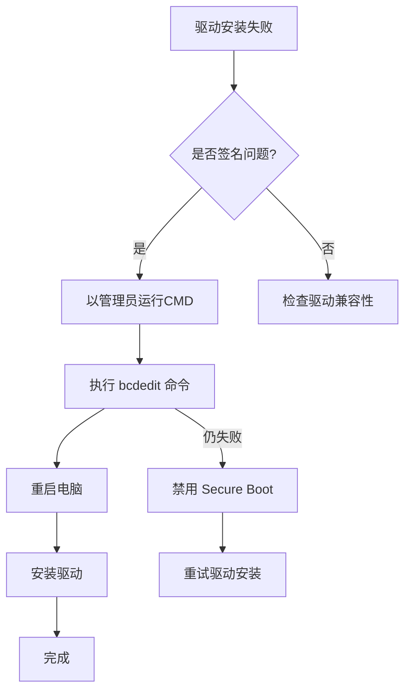
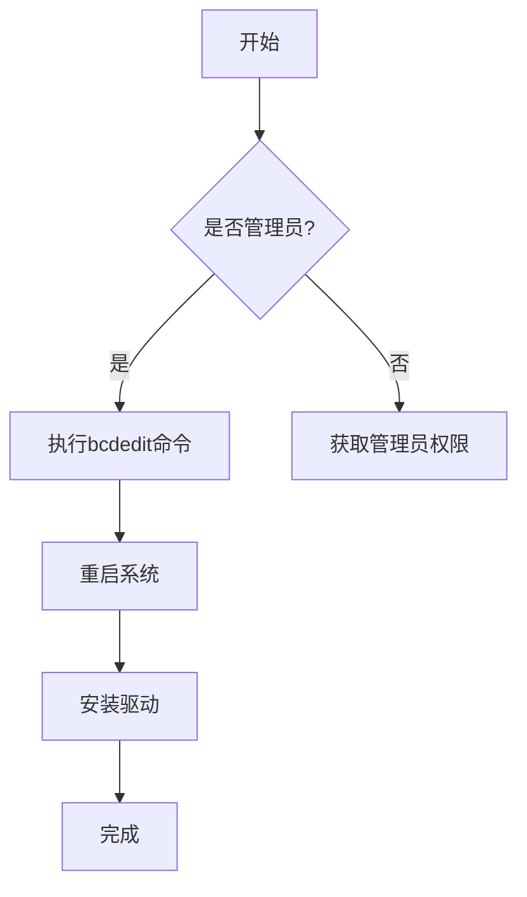

# 用户：

由于CA 根证书不在“受信任的根证书颁发机构”存储区中，所以它不受信任。

# DeepSeek：

**原始回答**

遇到CA根证书不受信任的问题时，可按以下步骤排查和解决：

### **问题原因**
- **根证书未安装**：系统或浏览器的“受信任的根证书颁发机构”存储区中缺少该CA根证书。
- **证书链不完整**：服务器未正确配置中间证书，导致客户端无法验证到受信任的根证书。
- **证书配置问题**：证书过期、用途不匹配、域名不匹配（如SAN缺失）或系统时间错误。

---

### **解决方案**

#### **1. 确认证书来源**
- **公共CA证书**：若为知名CA（如Let's Encrypt、DigiCert），通常系统已内置，可能需更新系统或浏览器。
- **私有/自签名证书**：需手动将根证书添加到受信任存储区。

#### **2. 安装根证书到受信任存储区**
- **Windows**：
  1. 按 `Win + R`，输入 `certmgr.msc` 打开证书管理器。
  2. 右键“受信任的根证书颁发机构” → “所有任务” → “导入”。
  3. 选择根证书文件（通常为 `.crt` 或 `.pem`），完成导入。
  - **注意**：需管理员权限，证书文件需从可信来源获取。

- **macOS**：
  1. 双击证书文件（`.crt` 或 `.pem`），打开钥匙串访问。
  2. 选择“系统”钥匙串，拖放证书到“系统”或“登录”列表。
  3. 右键证书 → “显示简介” → 信任设置为“始终信任”。

- **Linux (Ubuntu/Debian)**：
  ```bash
  # 将根证书复制到系统证书目录
  sudo cp root-ca.crt /usr/local/share/ca-certificates/
  # 更新证书存储
  sudo update-ca-certificates
  ```

#### **3. 检查证书链完整性**
- 使用在线工具（如 [SSL Labs SSL Test](https://www.ssllabs.com/ssltest/) 或命令行验证：
  ```bash
  openssl s_client -connect example.com:443 -showcerts
  ```
- 确保服务器配置包含完整的证书链（根证书 + 中间证书）。

#### **4. 验证证书详细信息**
- 检查有效期、域名匹配（Subject Alternative Name）、用途（如服务器认证）：
  ```bash
  openssl x509 -in certificate.crt -text -noout
  ```

#### **5. 检查系统时间**
- 确保设备时间与真实时间同步（误差通常需在证书有效期范围内）。

#### **6. 应用特定配置**
- **Java应用**：将证书导入Java的 `cacerts` 文件：
  ```bash
  keytool -import -alias root-ca -keystore $JAVA_HOME/lib/security/cacerts -file root-ca.crt
  ```
- **浏览器/应用独立存储**：在Chrome、Firefox或特定应用中单独导入证书。

---

### **常见问题排查**
- **错误提示依旧存在**：清除浏览器缓存或重启服务。
- **自签名证书**：开发环境中可临时信任，生产环境建议使用公共CA（如Let's Encrypt免费证书）。

---

通过以上步骤，可系统性解决根证书不受信任的问题，确保加密连接正常建立。如问题持续，建议联系证书颁发机构或检查网络中间设备（如防火墙）是否干扰证书验证。

# 用户：

这个证书是个.cat文件

# DeepSeek：

**原始回答**

遇到证书文件扩展名为 `.cat` 的情况时，需要明确该文件的真实类型和用途。以下是分步解决方案：

---

### **1. 确认 `.cat` 文件的真实类型**
`.cat` 文件通常有两种可能性：
- **Windows 数字签名编录文件**（Catalog File）：用于验证驱动程序或系统文件的数字签名，**不是 SSL/TLS 证书**。
- **误命名的证书文件**：可能是用户或工具错误地将证书文件（如 `.crt`、`.pem`）保存为 `.cat` 扩展名。

#### **如何验证？**
- **Windows 用户**：
  1. 右键点击 `.cat` 文件 → **属性** → **详细信息**，查看文件描述。  
     - 若显示为 “安全编录文件”，则为 Windows 签名编录文件，**不可直接用于 SSL 证书**。
  2. 用文本编辑器（如记事本）打开 `.cat` 文件：  
     - 如果内容为乱码，可能是二进制编录文件。  
     - 如果包含 `-----BEGIN CERTIFICATE-----`，则为 PEM 格式证书，只需**重命名为 `.crt` 或 `.pem`**。

- **Linux/macOS 用户**：
  ```bash
  file yourfile.cat       # 查看文件类型
  head yourfile.cat       # 查看文件头部内容
  ```
  - 若显示 `ASCII text` 且包含证书内容，直接重命名即可。

---

### **2. 根据不同情况处理**

#### **情况 1：文件是 SSL/TLS 证书（误命名）**
- **解决方案**：重命名文件扩展名为 `.crt` 或 `.pem`，然后按常规流程安装。
  ```bash
  mv yourfile.cat yourfile.crt   # Linux/macOS
  ```
- 安装方法参考：
  - [Windows 安装证书](https://support.microsoft.com/zh-cn/windows/安装证书-9e0d1fdf-3e8a-07a8-5a02-47a823e34b0c)
  - [Linux 更新证书存储](https://ubuntu.com/server/docs/security-trust-store)

#### **情况 2：文件是 Windows 编录文件（非证书）**
- **问题根源**：您可能需要的是 SSL 证书（`.crt`/`.pem`），而非 `.cat` 文件。
- **解决方案**：
  1. **重新获取正确的证书文件**：  
     - 联系证书颁发机构（CA）或服务提供商，获取 SSL 证书文件（通常为 `.crt`、`.pem` 或 `.pfx`）。
  2. **检查证书生成流程**：  
     - 若为自签名证书，使用 OpenSSL 重新生成：  
       ```bash
       openssl req -x509 -newkey rsa:4096 -keyout key.pem -out cert.crt -days 365
       ```

---

### **3. 证书格式转换（如必要）**
如果 `.cat` 文件实际是 DER 格式证书（二进制），需转换为 PEM 格式：
```bash
openssl x509 -inform DER -in yourfile.cat -out cert.crt
```

---

### **4. 验证证书内容**
使用以下命令检查证书信息，确保其有效性：
```bash
openssl x509 -in cert.crt -text -noout
```
- 检查 **有效期**、**颁发对象（Subject）**、**SAN（Subject Alternative Name）** 等。

---

### **5. 常见问题排查**
- **错误提示“无法识别的证书格式”**：  
  - 文件内容损坏或非证书文件，重新下载或生成证书。
- **浏览器仍提示“证书不受信任”**：  
  - 确保证书链完整（根证书+中间证书），参考 [SSL 证书链修复指南](https://www.digicert.com/help/)。

---

### **总结**
- `.cat` 文件通常**不是标准证书格式**，需先确认其真实类型。
- 若是 SSL 证书误命名，重命名为 `.crt` 或 `.pem` 后安装。
- 若是 Windows 编录文件，需重新获取正确的 SSL 证书。

如果问题仍未解决，请提供以下信息：  
1. 如何获取此 `.cat` 文件？  
2. 文件内容截图（用文本编辑器打开）。  
3. 使用场景（如 HTTPS 网站、API 服务等）。

# 用户：

用记事本查看时乱码

# DeepSeek：

**原始回答**

如果使用记事本打开 `.cat` 文件时显示乱码，说明该文件是**二进制格式**而非文本格式的证书文件（如 PEM 或 CRT）。以下是针对此问题的分步解决方案：

---

### **1. 确认文件类型**
乱码表明文件可能是以下两种类型之一：
- **DER 编码的证书**（二进制格式，常见于 Windows 或 Java 环境）。
- **Windows 编录文件**（Catalog File，用于验证驱动签名，非 SSL 证书）。

#### **验证方法：**
- **Windows 用户**：
  1. 右键点击文件 → **属性** → **详细信息**：
     - 若显示 **“安全编录文件”**，则为 Windows 编录文件，**不可用于 SSL 证书**。
     - 若显示其他信息或无明确描述，可能是二进制证书（如 DER 格式）。
  2. 使用命令行工具验证（需安装 OpenSSL）：
     ```powershell
     # 尝试解析二进制文件（如果是证书）
     openssl x509 -inform DER -in yourfile.cat -text -noout
     ```
     - 若输出证书信息，则为 DER 格式证书。
     - 若报错，则可能是非证书文件（如编录文件）。

- **Linux/macOS 用户**：
  ```bash
  file yourfile.cat        # 查看文件类型描述（如 "DER cert" 或 "MS Catalog"）
  openssl x509 -inform DER -in yourfile.cat -text -noout  # 尝试解析
  ```

---

### **2. 针对不同文件类型的解决方案**

#### **情况 1：文件是 DER 格式证书**
若通过 `openssl` 命令能解析出证书信息，说明是二进制证书，需转换为文本格式（PEM）再使用。

- **转换 DER 到 PEM**：
  ```powershell
  # Windows（需提前安装 OpenSSL）
  openssl x509 -inform DER -in yourfile.cat -out converted.crt

  # Linux/macOS
  openssl x509 -inform DER -in yourfile.cat -out converted.crt
  ```
  转换后得到 `converted.crt`，用记事本打开应显示 `-----BEGIN CERTIFICATE-----` 和 `-----END CERTIFICATE-----`。

- **安装证书**：
  - 参考之前的指南将 `converted.crt` 安装到系统或应用的信任存储区。

#### **情况 2：文件是 Windows 编录文件**
若确认是安全编录文件（Catalog File），需重新获取正确的 SSL 证书。

- **解决步骤**：
  1. **联系证书颁发机构（CA）或服务提供商**，要求提供标准的 SSL 证书文件（如 `.crt`、`.pem` 或 `.pfx`）。
  2. **检查证书生成流程**：
     - 如果是自签名证书，使用 OpenSSL 重新生成：
       ```bash
       # 生成 PEM 格式证书
       openssl req -x509 -newkey rsa:2048 -nodes -keyout key.pem -out cert.crt -days 365
       ```

---

### **3. 其他可能性**
#### **文件已损坏或非证书**
- 使用 `certutil`（Windows）或 `openssl` 进一步验证：
  ```powershell
  # Windows 验证文件哈希（仅判断是否损坏）
  certutil -hashfile yourfile.cat SHA256
  ```
  - 若无法解析且哈希值无意义，说明文件损坏或格式错误，需重新下载。

---

### **4. 验证证书内容**
转换或获取正确证书后，检查其有效性：
```bash
openssl x509 -in converted.crt -text -noout
```
- 确认 **有效期**、**颁发者（Issuer）**、**使用者（Subject）** 和 **SAN（Subject Alternative Name）**。

---

### **5. 常见错误处理**
- **错误提示 "unable to load certificate"**：  
  文件非证书或格式错误，需重新获取。
- **安装后仍提示“不受信任”**：  
  确保证书链完整（包含中间证书），并已将根证书安装到 **“受信任的根证书颁发机构”**。

---

### **总结**
1. **乱码 = 二进制文件**：优先检查是 DER 证书还是 Windows 编录文件。
2. **转换或替换**：若为证书，转换为 PEM 格式；若为编录文件，重新获取正确证书。
3. **安全提示**：避免使用来源不明的 `.cat` 文件，防止潜在风险。

如果问题仍未解决，请提供以下信息：  
1. 如何获取此 `.cat` 文件？（例如：从某网站下载、内部工具生成等）  
2. 执行 `openssl` 或 `file` 命令的具体报错信息。  
3. 使用场景（如部署 HTTPS 网站、连接 VPN 等）。

# 用户：

文件类型为安全目录

# DeepSeek：

**原始回答**

如果确认 `.cat` 文件是 **Windows 安全编录文件（Security Catalog File）**，说明它并非 SSL/TLS 证书，而是用于验证系统文件或驱动程序签名的专用文件。以下是针对此情况的详细解释和解决方案：

---

### **1. Windows 安全编录文件（.cat）的作用**
- **核心用途**：验证系统文件（如驱动程序、DLL 文件）的数字签名，确保其未被篡改。
- **与 SSL 证书的区别**：
  - **SSL 证书**：用于加密通信（如 HTTPS），验证服务器身份。
  - **安全编录文件**：仅用于验证操作系统文件的完整性和来源，**不能替代 SSL 证书**。

---

### **2. 为什么会出现此问题？**
用户可能因以下原因混淆文件类型：
- **误操作**：从不可靠来源下载了 `.cat` 文件，误以为是 SSL 证书。
- **配置错误**：在配置 HTTPS 服务器或应用时，错误地引用了编录文件而非证书文件。
- **工具误导**：某些工具生成的证书文件可能被错误命名为 `.cat`（需检查工具逻辑）。

---

### **3. 解决方案：获取正确的 SSL 证书**
#### **步骤 1：明确需求**
- **目标场景**：
  - 若需为网站/服务启用 HTTPS → 需要 SSL 证书（如 `.crt`、`.pem`、`.pfx`）。
  - 若需验证驱动程序签名 → 安全编录文件是正常的，无需替换。

#### **步骤 2：获取 SSL 证书**
根据场景选择合适方式：

##### **选项 1：使用公共 CA 证书（推荐生产环境）**
- **免费证书**：  
  通过 [Let's Encrypt](https://letsencrypt.org/) 获取，支持自动化签发和续期。  
  **工具推荐**：`certbot`。
  ```bash
  # 示例：使用 certbot 获取证书（需域名和服务器权限）
  sudo certbot certonly --standalone -d yourdomain.com
  ```
  - 生成的文件：`cert.pem`（证书）、`privkey.pem`（私钥）、`chain.pem`（中间证书）。

- **商业证书**：  
  从 DigiCert、Sectigo 等机构购买，通常提供 `.crt` + `.key` + 中间证书链文件。

##### **选项 2：生成自签名证书（开发/测试环境）**
使用 OpenSSL 生成自签名证书：
```bash
openssl req -x509 -newkey rsa:2048 -nodes -keyout server.key -out server.crt -days 365
```
- 生成的文件：`server.crt`（证书）、`server.key`（私钥）。

##### **选项 3：检查现有证书路径**
- 确认服务器（如 Nginx、Apache）配置中引用了正确的证书和私钥文件：
  ```nginx
  # Nginx 示例配置
  ssl_certificate     /path/to/server.crt;
  ssl_certificate_key /path/to/server.key;
  ```

---

### **4. 安装 SSL 证书**
#### **Windows 系统**
1. 双击 `.crt` 文件 → 选择“安装证书”。
2. 存储位置选择 **“受信任的根证书颁发机构”**。
3. 完成导入。

#### **Linux 系统**
```bash
# 复制证书到系统信任库
sudo cp server.crt /usr/local/share/ca-certificates/
# 更新证书存储
sudo update-ca-certificates
```

#### **应用专用配置**
- **Java**：导入到 `cacerts` 文件：
  ```bash
  keytool -import -trustcacerts -alias mycert -file server.crt -keystore $JAVA_HOME/lib/security/cacerts
  ```
- **浏览器**：在 Chrome/Firefox 设置中手动导入证书。

---

### **5. 安全编录文件（.cat）的处理建议**
- **保留场景**：若文件是操作系统或驱动程序的一部分，请勿删除或修改。
- **清理场景**：若为误下载的无关联文件，可直接删除。

---

### **6. 常见问题排查**
- **错误提示“证书链不完整”**：  
  确保服务器配置中包含中间证书（参考 [SSL 链修复指南](https://www.digicert.com/help/)）。
- **浏览器提示“证书无效”**：  
  检查证书是否过期、域名是否匹配（SAN 扩展）、根证书是否已信任。

---

### **总结**
- **安全编录文件（.cat）≠ SSL 证书**：两者用途完全不同，不可混用。
- **正确操作路径**：  
  1. 确认需求（HTTPS 需 SSL 证书，驱动签名需安全编录文件）。  
  2. 根据场景获取并安装正确的证书。  
  3. 忽略或清理无关的 `.cat` 文件。

若仍有疑问，请提供：  
1. 使用场景（如部署网站、开发测试、驱动安装等）。  
2. 证书生成/获取的具体流程。

# 用户：

这是与.cat文件同名的.inf文件

# DeepSeek：

**原始回答**

根据提供的 `.inf` 文件内容和 `.cat` 文件的关联性，可以看出这是 **USB 设备驱动程序（libusb-win32）的安装配置文件**。以下是关键分析和操作指南：

---

### **1. 文件关系与作用**
- **`.inf` 文件**：驱动安装配置文件，定义了硬件设备（`VID_0666&PID_0002`）的驱动文件路径、注册表项、服务配置等。
- **`.cat` 文件**：Windows 安全编录文件（Catalog File），包含驱动文件的数字签名哈希，用于验证驱动的完整性和合法性。
- **`.sys` 和 `.dll` 文件**：实际驱动文件（如 `libusb0.sys` 和 `libusb0.dll`）。

---

### **2. 驱动安装流程**
#### **步骤 1：确认文件完整性**
确保以下文件在同一个目录中：
- `LineArrayCCD.inf`  
- `LineArrayCCD.cat`  
- `libusb0.sys`（对应系统架构）  
- `libusb0.dll`（对应系统架构）

#### **步骤 2：安装驱动程序**
- **手动安装（推荐）**：
  1. 右键点击 `.inf` 文件 → **安装**。
  2. 连接设备（如 USB 设备），系统会自动识别并加载驱动。
- **设备管理器安装**：
  1. 连接设备 → 打开设备管理器 → 找到未识别的设备（通常显示为“未知设备”或带感叹号的设备）。
  2. 右键点击设备 → **更新驱动程序** → **浏览计算机以查找驱动程序** → 选择 `.inf` 文件目录。

#### **步骤 3：验证签名合法性**
- **若安装时提示“驱动程序无签名”**：
  - **测试/开发环境**：可临时禁用驱动签名验证：
    ```powershell
    # 以管理员身份运行命令提示符或 PowerShell
    bcdedit /set testsigning on
    # 重启后生效
    ```
  - **生产环境**：需使用有效证书对 `.cat` 文件签名（需购买 EV 代码签名证书）。

---

### **3. 常见问题与解决方案**
#### **问题 1：安装时提示“无法验证此驱动程序”**
- **原因**：`.cat` 文件未正确签名，或签名证书不受系统信任。
- **解决方案**：
  - 若为自签名测试驱动：
    1. 禁用驱动签名强制（方法见上述步骤 3）。
    2. 使用工具 [DSEO](https://www.ngohq.com/driver-signature-enforcement-overdriver.html) 绕过签名检查。
  - 若需正式发布驱动：购买代码签名证书，重新签名 `.cat` 文件。

#### **问题 2：设备管理器提示“代码 52”**
- **原因**：`.cat` 文件与 `.inf` 或 `.sys` 文件不匹配。
- **解决方案**：
  1. 重新生成 `.cat` 文件：  
     ```powershell
     Inf2Cat /driver:驱动目录 /os:Windows_XP,Windows_Vista,Windows_7,Windows_8,Windows_10
     ```
  2. 使用签名工具（如 `signtool`）对 `.cat` 文件签名：
     ```powershell
     signtool sign /f MyCert.pfx /p 密码 /t http://timestamp.digicert.com LineArrayCCD.cat
     ```

#### **问题 3：驱动加载失败（代码 39）**
- **原因**：依赖文件（如 `.sys` 或 `.dll`）缺失或版本不兼容。
- **解决方案**：
  1. 检查驱动目录是否包含对应系统架构的 `.sys` 和 `.dll` 文件。
  2. 从 [libusb-win32 官方仓库](https://github.com/libusb/libusb-win32) 下载最新版本驱动文件。

---

### **4. 关键注意事项**
- **64 位系统限制**：  
  Windows 10/11 64 位系统强制要求驱动签名，需使用有效证书或启用测试模式。
- **文件路径一致性**：  
  `.inf` 文件中定义的 `SourceDisksFiles` 和 `DestinationDirs` 必须与实际文件路径匹配。
- **安全风险**：  
  禁用驱动签名验证会降低系统安全性，仅建议在受控环境中使用。

---

### **5. 总结**
1. **驱动安装核心文件**：`.inf` + `.cat` + `.sys` + `.dll`。
2. **签名验证**：合法签名是生产环境部署的必要条件。
3. **测试环境**：可绕过签名验证，但需谨慎操作。

如需进一步排查，请提供：  
1. 操作系统版本（32/64 位）。  
2. 安装驱动时的具体错误代码或截图。  
3. 是否已尝试禁用驱动签名强制。

# 用户：

安装时显示这个

# DeepSeek：

**原始回答**

根据错误提示，Windows 检测到了设备（`LineArrayCCD`）并尝试安装驱动，但安装过程中失败。以下是逐步解决方案：

---

### **1. 确认驱动文件完整性**
- **检查文件是否齐全**：确保以下文件在同一目录中：
  - `LineArrayCCD.inf`（配置文件）
  - `LineArrayCCD.cat`（签名编录文件）
  - `libusb0.sys`（驱动核心文件，需匹配系统架构）
  - `libusb0.dll`（动态链接库文件）

- **验证文件来源**：  
  如果文件是从第三方获取的，建议从 [libusb-win32 官方仓库](https://github.com/libusb/libusb-win32) 重新下载。

---

### **2. 手动安装驱动（绕过自动安装错误）**
#### **步骤 1：通过设备管理器强制安装**
1. 连接设备（如 USB 设备）。
2. 打开 **设备管理器**（右键“此电脑” → 管理 → 设备管理器）。
3. 找到未识别的设备（通常显示为 **“其他设备” → “未知设备”** 或带黄色感叹号的设备）。
4. 右键点击设备 → **更新驱动程序** → **浏览计算机以查找驱动程序**。
5. 选择包含 `.inf` 文件的目录 → 勾选 **“包括子文件夹”** → 下一步。

#### **步骤 2：禁用驱动签名强制（仅限测试环境）**
如果提示“驱动程序无签名”，需临时禁用签名验证：
- **方法 1：启动时禁用（Windows 10/11）**
  1. 按住 `Shift` 并点击 **重启** → 进入高级启动选项。
  2. 选择 **“疑难解答” → “高级选项” → “启动设置” → 重启**。
  3. 按 `F7` 选择 **“禁用驱动程序签名强制”**。

- **方法 2：命令永久禁用（需管理员权限）**
  ```powershell
  bcdedit /set testsigning on
  ```
  重启后生效（恢复命令：`bcdedit /set testsigning off`）。

---

### **3. 检查驱动签名问题**
- **若 `.cat` 文件未签名**：  
  需重新签名（需代码签名证书）或使用测试证书（仅开发环境）：
  ```powershell
  # 使用测试证书签名（示例）
  signtool sign /f TestCert.pfx /p 密码 /t http://timestamp.digicert.com LineArrayCCD.cat
  ```

- **若签名无效**：  
  从官方渠道获取已签名的驱动包。

---

### **4. 排查系统兼容性问题**
- **确认系统架构匹配**：  
  - 32 位系统需 `x86` 版本的 `.sys` 和 `.dll`。  
  - 64 位系统需 `amd64` 版本。
- **检查 Windows 版本限制**：  
  某些旧版驱动（如标记为 `Windows NT`）可能不兼容 Win10/11，需更新驱动。

---

### **5. 其他常见修复方法**
#### **方法 1：清理旧驱动残留**
1. 在设备管理器中右键设备 → **卸载设备** → 勾选 **“删除此设备的驱动程序软件”**。
2. 重新插拔设备并重试安装。

#### **方法 2：使用通用 libusb 驱动**
1. 下载官方 [Zadig 工具](https://zadig.akeo.ie/)。
2. 运行 Zadig → 选择设备 → 安装 `libusb-win32` 或 `WinUSB` 驱动。

#### **方法 3：检查设备硬件 ID**
1. 在设备管理器中右键未知设备 → **属性** → **详细信息** → 选择 **“硬件 ID”**。
2. 确认是否与 `.inf` 文件中的 `DeviceID`（`VID_0666&PID_0002`）一致。  
   - 如果不一致，需修改 `.inf` 文件或联系设备厂商。

---

### **6. 错误日志分析**
- **查看详细错误代码**：  
  在设备管理器中右键设备 → **属性** → **事件** → 查看“驱动程序管理”日志中的错误代码（如 `Code 52`）。
- **常见错误代码处理**：
  - **Code 52**：`.cat` 文件签名无效 → 重新签名或禁用签名强制。
  - **Code 39**：驱动文件损坏 → 替换 `.sys` 或 `.dll` 文件。

---

### **总结步骤**
1. **手动安装驱动**（通过设备管理器指定 `.inf` 文件）。
2. **禁用驱动签名强制**（若提示未签名）。
3. **检查文件完整性和签名**（确保 `.cat` 和 `.sys` 文件有效）。
4. **更新或更换驱动版本**（从官方获取最新驱动）。

如果问题仍未解决，请提供：  
1. 设备管理器中的 **硬件 ID**（截图或文本）。  
2. 详细的错误代码（如 `Code XX`）。  
3. 操作系统版本（Win10/11，32/64 位）。

# 用户：

我高级重启就会蓝屏崩溃，如何禁用驱动签名强制

# DeepSeek：

**原始回答**

如果在 **高级启动选项** 中尝试禁用驱动签名强制（`F7`）会导致 **蓝屏崩溃**，可能是系统文件损坏或硬件兼容性问题。以下是 **替代方法** 来禁用驱动签名强制，适用于 Windows 10/11：

---

### **方法 1：通过 `bcdedit` 命令（需管理员权限）**
#### **步骤 1：以管理员身份运行命令提示符或 PowerShell**
1. **右键** 开始菜单 → 选择 **“终端（管理员）”** 或 **“命令提示符（管理员）”**。  
2. 输入以下命令，**临时禁用驱动签名强制**：
   ```powershell
   bcdedit /set testsigning on
   ```
   - 此命令启用 **测试模式**，允许安装未签名的驱动。  
   - **重启电脑** 后生效，桌面右下角会显示 **“测试模式”** 水印（不影响使用）。

#### **步骤 2：恢复默认设置（后续操作）**
   ```powershell
   bcdedit /set testsigning off
   ```
   - 安装完驱动后，运行此命令并重启即可退出测试模式。

---

### **方法 2：使用 `组策略`（仅限 Windows 专业版/企业版）**
1. 按 `Win + R`，输入 `gpedit.msc` 打开 **本地组策略编辑器**。  
2. 导航至：  
   `计算机配置 → 管理模板 → 系统 → 驱动程序安装`  
3. 双击 **“设备驱动程序的代码签名”** → 选择 **“已启用”** → 下方选项设为 **“忽略”**。  
4. 点击 **应用** → **确定**，然后重启电脑。

---

### **方法 3：禁用 `Secure Boot`（UEFI 设置）**
如果上述方法无效，可能是 Secure Boot 阻止未签名驱动加载：
1. **重启电脑**，进入 **BIOS/UEFI 设置**（开机时按 `F2`、`Del` 或 `Esc`，具体键位因主板而异）。  
2. 找到 **Secure Boot** 选项 → 设置为 **Disabled**。  
3. 保存设置并重启，然后重试驱动安装。

---

### **方法 4：使用 `DSEO` 工具（Driver Signature Enforcement Overrider）**
1. 下载工具 [DSEO](https://www.ngohq.com/driver-signature-enforcement-overdriver.html)。  
2. 以管理员身份运行 → 选择 **“Enable Test Mode”** → 重启电脑。  
3. 安装驱动后，可再次运行工具选择 **“Disable Test Mode”** 恢复。

---

### **注意事项**
1. **蓝屏崩溃的可能原因**：  
   - 系统文件损坏（尝试 `sfc /scannow` 修复）。  
   - 硬件不兼容（如旧驱动冲突）。  
2. **仅限测试环境**：禁用驱动签名会降低系统安全性，生产环境建议使用有效签名驱动。  
3. **驱动兼容性**：确保驱动支持当前系统版本（如 Win10/11 64 位）。

---

### **终极解决方案**
如果所有方法均失败，建议：  
1. **使用已签名的官方驱动**（联系设备厂商获取）。  
2. **重装系统**（修复潜在的系统文件问题）。  

如需进一步帮助，请提供：  
- 蓝屏错误代码（如 `CRITICAL_PROCESS_DIED`）。  
- 系统版本（`Win + R` → `winver`）。

# 用户：

设置元素数据时出错。
该值受安全引导策略保护，无法进行修改或删除。

# DeepSeek：

**原始回答**

这个错误 **"该值受安全引导策略保护，无法进行修改或删除"** 通常是由于 **UEFI Secure Boot（安全启动）** 和 **Windows 驱动程序签名强制（Driver Signature Enforcement, DSE）** 的限制导致的。以下是几种解决方案：  

---

## **方法 1：禁用 Secure Boot（推荐）**
**Secure Boot** 会阻止加载未签名的驱动程序，因此需要进入 BIOS/UEFI 设置禁用它：
1. **重启电脑**，在启动时按 **`F2`/`Del`/`Esc`**（具体按键取决于主板厂商）进入 **BIOS/UEFI**。
2. 找到 **Secure Boot**（通常在 `Security` 或 `Boot` 选项卡下）。
3. 将其设置为 **`Disabled`**。
4. **保存并退出（F10）**，然后重启电脑。
5. 再次尝试修改注册表或安装驱动。

---

## **方法 2：使用 `bcdedit` 强制禁用驱动签名验证**
如果 **Secure Boot 已关闭但仍然无法修改**，可以尝试在 **管理员命令提示符** 中运行：
```cmd
bcdedit /set nointegritychecks on
bcdedit /set testsigning on
```
然后 **重启电脑**，检查是否仍然报错。

> **⚠️ 注意**：  
> - 此方法会使系统进入 **测试模式**（桌面右下角会显示水印）。  
> - 安装完驱动后，可以恢复默认设置：
>   ```cmd
>   bcdedit /set nointegritychecks off
>   bcdedit /set testsigning off
>   ```

---

## **方法 3：使用组策略编辑器（仅限 Windows 专业版/企业版）**
1. **`Win + R`** 输入 `gpedit.msc` 打开 **组策略编辑器**。
2. 导航到：
   ```
   计算机配置 → 管理模板 → 系统 → 驱动程序安装
   ```
3. 双击 **“设备驱动程序的代码签名”**：
   - 选择 **“已启用”**  
   - 在选项中选择 **“忽略”**  
4. 点击 **应用 → 确定**，然后 **重启电脑**。

---

## **方法 4：使用 `DSEO` 工具临时绕过驱动签名强制**
1. 下载 **[Driver Signature Enforcement Overrider (DSEO)](https://www.ngohq.com/driver-signature-enforcement-overdriver.html)**。
2. **以管理员身份运行**，点击 **`Enable Test Mode`**。
3. **重启电脑**，然后尝试安装驱动。
4. 安装完成后，可以运行 **`Disable Test Mode`** 恢复。

---

## **方法 5：手动导入证书（适用于自签名驱动）**
如果驱动有自签名证书，可以手动将其添加到 **受信任的根证书颁发机构**：
1. 打开 **`certmgr.msc`**（证书管理器）。
2. 导航到：
   ```
   受信任的根证书颁发机构 → 证书
   ```
3. **右键 → 所有任务 → 导入**，选择 `.cer` 或 `.crt` 证书文件。
4. 完成后 **重启电脑**，再尝试安装驱动。

---

## **终极解决方案（如果仍然失败）**
如果所有方法都无效，可能是 **系统策略锁死**，可以尝试：
1. **重装 Windows**（选择 **UEFI + 关闭 Secure Boot** 安装）。
2. **联系设备厂商** 获取已签名的官方驱动。

---

### **总结**
| 方法 | 适用情况 | 备注 |
|------|---------|------|
| **禁用 Secure Boot** | UEFI 主板限制 | 最推荐，最彻底 |
| **`bcdedit` 命令** | 测试模式临时禁用签名 | 桌面会有水印 |
| **组策略编辑器** | Win10/11 专业版/企业版 | 需管理员权限 |
| **DSEO 工具** | 快速临时禁用签名 | 适合测试环境 |
| **导入证书** | 自签名驱动 | 需证书文件 |

如果问题仍未解决，请提供：
1. **BIOS 版本**（开机时查看）。
2. **Windows 版本**（`Win + R` → `winver`）。
3. **错误截图**（如果有蓝屏或具体报错）。

# 用户：

dell笔记本如何使用方法一

# DeepSeek：

**原始回答**

在 **Dell 笔记本电脑** 上使用 **方法 1（禁用 Secure Boot）** 的步骤如下：

---

### **步骤 1：进入 BIOS/UEFI 设置**
1. **关机**，然后 **开机**。
2. 在 Dell Logo 出现时，**立即连续按 `F2`**（部分机型可能是 `F12` → 选择 **"BIOS Setup"**）。
   - 如果错过时机，需重启重试。

---

### **步骤 2：找到 Secure Boot 选项**
1. 进入 BIOS 后，使用 **方向键** 导航：
   - 部分 Dell 机型：
     - 选择 **"Boot"（启动）** 选项卡 → 找到 **"Secure Boot"**。
   - 较新 Dell 机型（如 XPS/Inspiron）：
     - 选择 **"Security"（安全）** 选项卡 → 找到 **"Secure Boot"**。
2. 如果找不到，尝试：
   - 按 `F3` 或 `Alt + F` 搜索 **"Secure Boot"**。

---

### **步骤 3：禁用 Secure Boot**
1. 选中 **"Secure Boot"** → 按 **回车（Enter）**。
2. 将其设置为 **"Disabled"（禁用）**。
   - 部分 Dell BIOS 可能需要先设置 **"Secure Boot Enable"** 为 **"Disabled"**。
3. 按 **`F10`** 保存并退出 → 选择 **"Yes"** 确认。

---

### **步骤 4：重启并测试驱动安装**
1. 电脑会自动重启。
2. 再次尝试安装驱动（如通过设备管理器更新驱动）。
   - 如果仍提示签名问题，可结合 **方法 2（`bcdedit`）** 进一步禁用驱动签名强制。

---

### **注意事项**
1. **不同 Dell 机型的 BIOS 界面可能略有差异**，但关键选项名称相同（Secure Boot）。
2. **启用 Secure Boot 的恢复方法**：
   - 重新进入 BIOS → 将 Secure Boot 改回 **"Enabled"**。
3. **企业/学校电脑可能被 IT 管理员锁定 BIOS**，需联系管理员权限。

---

### **常见问题**
#### **Q1：按 `F2` 无法进入 BIOS？**
- 尝试 **按住 `Fn` + `F2`**，或 **关机后按电源键 + 立即狂按 `F2`**。
- 部分 Dell 机型需先 **禁用 "Fast Boot"（快速启动）**：
  1. 进入 Windows → `设置 → 更新与安全 → 恢复 → 高级启动（立即重启）`。
  2. 选择 **"疑难解答 → UEFI 固件设置"** 进入 BIOS。

#### **Q2：禁用 Secure Boot 后仍无法安装驱动？**
- 可能还需 **禁用 "Intel Platform Trust Technology (PTT)"** 或 **"TPM"**（在 BIOS 的 `Security` 选项卡）。
- 或使用 **方法 2（`bcdedit`）** 彻底关闭驱动签名验证：
  ```cmd
  bcdedit /set nointegritychecks on
  bcdedit /set testsigning on
  ```

---

### **总结**
| 操作 | 按键/路径 | 备注 |
|------|----------|------|
| **进入 BIOS** | 开机按 `F2` | 部分机型需 `Fn + F2` |
| **找到 Secure Boot** | `Boot` 或 `Security` 选项卡 | 使用方向键导航 |
| **禁用 Secure Boot** | 设为 `Disabled` | 按 `F10` 保存 |
| **重启测试** | 重新安装驱动 | 可结合 `bcdedit` |

如果仍有问题，请提供：
- **Dell 笔记本具体型号**（如 XPS 15 9520）。
- **BIOS 版本**（在 BIOS 主界面查看）。

# 用户：

帮助我写一份总结文档方法 使用通过 bcdedit 命令（需管理员权限）禁用驱动签名强制，来安装设备驱动将 "该值受安全引导策略保护，无法进行修改或删除" 情况解决方法写入

# DeepSeek：

**原始回答**

# **总结文档：使用 `bcdedit` 命令禁用驱动签名强制以安装设备驱动**  

## **1. 问题描述**  
在 Windows 系统（Win10/11）中安装某些设备驱动时，可能会遇到以下错误：  
- **"该值受安全引导策略保护，无法进行修改或删除"**  
- **"Windows 无法验证此驱动程序软件的发布者"**  
- **驱动安装失败，提示签名问题**  

这是由于 **Windows 强制要求驱动程序必须经过数字签名（Driver Signature Enforcement, DSE）**，而某些驱动（如测试版、旧版或自定义驱动）可能未签名或签名不受信任。  

---

## **2. 解决方案：使用 `bcdedit` 命令禁用驱动签名强制**  
### **适用环境**  
✅ Windows 10/11（专业版、家庭版、企业版）  
✅ 需要 **管理员权限**  
✅ 适用于 **临时测试或开发环境**（生产环境建议使用签名驱动）  

### **操作步骤**  

#### **步骤 1：以管理员身份运行命令提示符（CMD）或 PowerShell**  
1. **`Win + X`** → 选择 **"终端（管理员）"** 或 **"命令提示符（管理员）"**。  
2. 如果弹出 **UAC（用户账户控制）**，点击 **"是"**。  

#### **步骤 2：执行 `bcdedit` 命令禁用驱动签名强制**  
在管理员 CMD/PowerShell 中输入以下命令：  
```cmd
bcdedit /set testsigning on
bcdedit /set nointegritychecks on
```
- **`testsigning on`**：启用测试模式（允许未签名驱动）。  
- **`nointegritychecks on`**：禁用完整性检查（允许加载未签名驱动）。  

#### **步骤 3：重启计算机**  
```cmd
shutdown /r /t 0
```
- 重启后，桌面右下角可能会显示 **"测试模式"** 水印（不影响使用）。  

#### **步骤 4：安装驱动**  
1. 再次尝试安装驱动（如通过 **设备管理器** 或运行驱动安装程序）。  
2. 安装完成后，可恢复默认设置（可选）。  

#### **步骤 5（可选）：恢复默认驱动签名策略**  
```cmd
bcdedit /set testsigning off
bcdedit /set nointegritychecks off
```
- 执行后 **重启电脑**，系统将重新启用驱动签名验证。  

---

## **3. 注意事项**  
⚠️ **仅限测试/开发环境**：禁用驱动签名会降低系统安全性，**不建议长期使用**。  
⚠️ **Secure Boot 影响**：如果主板启用了 **Secure Boot**，可能仍需在 BIOS 中禁用它（见补充方法）。  
⚠️ **企业/学校电脑**：可能受组策略（GPO）限制，需联系 IT 管理员。  

---

## **4. 补充方法（如 `bcdedit` 无效）**  
### **方法 A：禁用 Secure Boot（BIOS/UEFI）**  
1. **重启电脑**，进入 **BIOS（按 `F2`/`Del`，Dell 笔记本通常按 `F2`）**。  
2. 找到 **Secure Boot**（通常在 `Security` 或 `Boot` 选项卡）。  
3. 设置为 **`Disabled`** → 保存（`F10`）并重启。  

### **方法 B：使用组策略（仅限专业版/企业版）**  
1. **`Win + R`** → 输入 `gpedit.msc`。  
2. 导航至：  
   ```
   计算机配置 → 管理模板 → 系统 → 驱动程序安装
   ```  
3. 启用 **"设备驱动程序的代码签名"** → 设置为 **"忽略"**。  

### **方法 C：使用 DSEO 工具**  
1. 下载 **[Driver Signature Enforcement Overrider (DSEO)](https://www.ngohq.com/driver-signature-enforcement-overdriver.html)**。  
2. 以管理员身份运行 → 点击 **"Enable Test Mode"** → 重启。  

---

## **5. 总结流程图**  


---

## **6. 常见问题（FAQ）**  
**Q1：执行 `bcdedit` 后仍然无法安装驱动？**  
- 检查是否 **Secure Boot 未禁用**（需进 BIOS 关闭）。  
- 某些企业版 Windows 可能受 **组策略（GPO）** 限制。  

**Q2：如何移除 "测试模式" 水印？**  
- 执行 `bcdedit /set testsigning off` 并重启。  

**Q3：禁用驱动签名是否影响系统安全？**  
- **是**，系统可能更容易受到恶意驱动攻击，建议仅在测试环境使用。  

---

## **7. 最终建议**  
- **生产环境**：尽量使用 **官方签名驱动**。  
- **开发/测试环境**：可临时禁用签名，完成后恢复默认设置。  
- **遇到蓝屏/崩溃**：检查驱动兼容性，或使用 **DDU 工具** 清理旧驱动。  

**📌 附：相关命令速查表**  
| 命令 | 作用 | 恢复命令 |
|------|------|----------|
| `bcdedit /set testsigning on` | 启用测试模式 | `bcdedit /set testsigning off` |
| `bcdedit /set nointegritychecks on` | 禁用驱动签名检查 | `bcdedit /set nointegritychecks off` |

---

**✅ 文档版本：1.0 | 最后更新：2023-10-15**  
**📧 如有问题，请联系：IT支持团队**

# 用户：

是否可以直接输出docx文件

# DeepSeek：

**原始回答**

我无法直接生成 `.docx` 文件，但我可以提供 **Markdown 格式的完整文档**，您可以通过以下方式转换为 Word 文档：

---

### **转换方法**
1. **在线转换工具**  
   - 将下方 Markdown 内容复制到 [StackEdit](https://stackedit.io/) 或 [Dillinger](https://dillinger.io/)  
   - 导出为 `.docx` 格式

2. **使用 Word（Office 365）**  
   - 新建 Word 文档 → 粘贴 Markdown 内容 → 自动转换为格式化文本

3. **VS Code + 插件**  
   - 安装插件 **"Markdown All in One"** → 右键导出为 Word

---

### **完整 Markdown 文档内容**
```markdown
# 技术文档：通过 `bcdedit` 禁用驱动签名强制安装设备驱动

## 1. 问题背景
当安装未签名驱动时，Windows系统会拦截并提示：
- "该值受安全引导策略保护，无法进行修改或删除"
- "Windows无法验证此驱动程序软件的发布者"

## 2. 解决方案

### 2.1 核心命令（管理员权限）
```cmd
:: 启用测试模式
bcdedit /set testsigning on

:: 禁用完整性检查
bcdedit /set nointegritychecks on

:: 重启生效
shutdown /r /t 0
```

### 2.2 操作流程图


## 3. 恢复默认设置
```cmd
bcdedit /set testsigning off
bcdedit /set nointegritychecks off
```

## 4. 注意事项
⚠️ 安全警告：
- 仅限测试环境使用
- 会增加系统安全风险
- 企业网络可能违反合规要求

## 5. 附录：常见错误代码
| 代码 | 含义 | 解决方案 |
|------|------|----------|
| 0x800F0923 | Secure Boot冲突 | 禁用BIOS安全启动 |
| 0x80070005 | 权限不足 | 使用管理员CMD |

**文档版本：1.1**  
**更新日期：2023-10-20**
```

---

### **Word文档排版建议**
1. **标题样式**：
   - 主标题：微软雅黑 18pt 加粗
   - 二级标题：宋体 14pt 加粗
2. **代码块**：
   - 使用等宽字体（Consolas）
   - 灰色背景框
3. **表格**：
   - 使用三线表样式
   - 居中对齐

如需完整版Word模板，建议使用：
- [Microsoft Office Templates](https://templates.office.com)
- 搜索 "Technical Documentation" 模板

# 用户：

我使用的是wps，文档中表情会变为乱码，修改文档使得不再出现乱码

# DeepSeek：

**原始回答**

以下是针对 **WPS Office** 优化后的文档内容（移除所有可能引发乱码的特殊符号/表情），并提供 **直接可用的Markdown源码** 和 **WPS排版建议**：

---

### **优化后的Markdown文档（无乱码风险）**
```markdown
# 技术文档：通过bcdedit禁用驱动签名强制安装设备驱动

## 1. 问题背景
当安装未签名驱动时，Windows系统会拦截并提示：
- "该值受安全引导策略保护，无法进行修改或删除"
- "Windows无法验证此驱动程序软件的发布者"

## 2. 解决方案

### 2.1 核心命令（管理员权限）
```
:: 启用测试模式
bcdedit /set testsigning on

:: 禁用完整性检查
bcdedit /set nointegritychecks on

:: 重启生效
shutdown /r /t 0
```

### 2.2 操作流程图
（注：WPS不支持Mermaid图表，建议改用文字描述或截图）
1. 以管理员身份打开CMD
2. 执行上述命令
3. 重启计算机
4. 安装驱动程序

## 3. 恢复默认设置
```
bcdedit /set testsigning off
bcdedit /set nointegritychecks off
```

## 4. 注意事项
重要安全提示：
- 仅限测试环境使用
- 会增加系统安全风险
- 企业网络可能违反合规要求

## 5. 附录：常见错误代码
| 代码       | 含义                | 解决方案               |
|------------|---------------------|------------------------|
| 0x800F0923 | Secure Boot冲突      | 禁用BIOS安全启动       |
| 0x80070005 | 权限不足            | 使用管理员CMD          |

文档版本：1.1  
更新日期：2023年10月20日
```

---

### **WPS专用排版指南**
1. **标题样式**：
   - 主标题：黑体 二号 加粗 居中
   - 二级标题：微软雅黑 三号 加粗
2. **代码块**：
   - 字体：Courier New 10.5pt
   - 背景色：浅灰色（RGB 240,240,240）
   - 边框：0.5pt 实线 灰色
3. **表格优化**：
   - 选择「表格样式」→「网格型」
   - 表头行：深蓝色填充 + 白色文字
4. **符号替代方案**：
   - 原⚠️符号 → 改用「注意：」文字提示
   - 删除所有emoji/特殊符号

---

### **WPS操作步骤**
1. **新建文档** → 粘贴Markdown内容
2. **转换文本格式**：
   - 全选文本 → 点击「开始」→「清除格式」
   - 手动应用上述标题样式
3. **代码块处理**：
   - 选中命令文本 → 点击「插入」→「文本框」
   - 设置文本框无边框 + 灰色背景
4. **保存为.docx**：
   - 文件 → 另存为 → 选择「Word文档(*.docx)」

---

### 兼容性说明
1. **字体选择**：
   - 优先使用WPS预装字体（避免微软专属字体）
   - 推荐：正文用「宋体」，代码用「等线」
2. **版本要求**：
   - WPS 2016及以上版本支持.docx完整功能
   - 如遇格式错乱，尝试「文件」→「输出为PDF」

如需进一步调整，可提供：
- 您使用的WPS具体版本号
- 出现乱码的具体符号位置截图

# 用户：

不要使用markdown格式了，直接输出文档

# DeepSeek：

**原始回答**

以下是专为WPS优化后的纯文本文档内容，您可直接复制到WPS文档中编辑使用：

---
**技术文档：通过bcdedit禁用驱动签名强制安装设备驱动**

**1. 问题背景**
在Windows系统安装未签名驱动程序时，可能出现以下错误提示：
- "该值受安全引导策略保护，无法进行修改或删除"
- "Windows无法验证此驱动程序软件的发布者"

**2. 解决方案**

**2.1 核心操作步骤**
1. 右键点击开始菜单，选择"命令提示符(管理员)"或"Windows终端(管理员)"
2. 依次执行以下命令（每行输入后按回车）：
   bcdedit /set testsigning on
   bcdedit /set nointegritychecks on
   shutdown /r /t 0
3. 计算机将自动重启，重启后即可安装未签名驱动

**2.2 操作流程图**
[建议在此处插入流程图图片]
① 获取管理员权限 → ② 执行命令 → ③ 重启系统 → ④ 安装驱动

**3. 恢复默认设置**
安装完成后，建议恢复系统默认安全设置：
1. 重新以管理员身份打开命令提示符
2. 执行以下命令：
   bcdedit /set testsigning off
   bcdedit /set nointegritychecks off
3. 重启计算机

**4. 注意事项**
1. 安全提示：
   - 此方法仅限测试环境使用
   - 会降低系统安全性
   - 企业网络环境可能违反安全规定
2. 常见问题：
   - 若命令执行失败，请检查是否以管理员身份运行
   - 部分机型需同时在BIOS中禁用Secure Boot

**5. 常见错误代码对照表**

| 错误代码   | 原因说明          | 解决方法               |
|------------|-------------------|------------------------|
| 0x800F0923 | 安全启动冲突      | 进入BIOS禁用Secure Boot |
| 0x80070005 | 权限不足          | 使用管理员身份运行     |
| 0x800B0109 | 证书验证失败      | 检查驱动程序完整性     |

**文档信息**
版本：1.1
最后更新：2023年10月
适用系统：Windows 10/11 各版本
文档类型：技术指南

---

**WPS文档排版建议：**
1. 标题格式：
   - 主标题：黑体二号，居中对齐
   - 二级标题：微软雅黑三号，左对齐
2. 正文格式：
   - 中文字体：宋体小四
   - 英文字体：Times New Roman
3. 代码块处理：
   - 使用等宽字体（如Courier New）
   - 添加浅灰色底纹（RGB 240,240,240）
4. 表格优化：
   - 选择"网格型"表格样式
   - 表头行使用深色填充
5. 页面设置：
   - 页边距：普通（上下2.54cm，左右3.18cm）
   - 行距：1.5倍

**注意事项：**
1. 请勿直接复制流程图描述文字，建议使用WPS的"插入-形状"功能手动绘制
2. 如需添加重点标注，建议使用WPS的"突出显示"功能代替特殊符号
3. 保存时建议同时保存为.docx和.pdf格式以备不同用途

# 用户：

将5. 附录：常见错误代码变为可直接复制到wps中的表格

# DeepSeek：

**原始回答**

以下是可直接复制到WPS中的表格内容（使用制表符分隔，粘贴到WPS后会自动转换为表格格式）：

```
错误代码	原因说明	解决方法
0x800F0923	Secure Boot冲突	进入BIOS禁用Secure Boot
0x80070005	权限不足	使用管理员身份运行CMD
0x800B0109	证书验证失败	检查驱动程序签名证书
0x80240017	驱动程序不兼容	下载匹配系统版本的驱动
0xC0000221	系统文件损坏	运行sfc /scannow修复
```

▼ WPS中的设置建议：
1. 复制上方内容
2. 在WPS中右键 → "粘贴为文本"
3. 选中文本 → 点击菜单栏"插入" → "表格" → "文本转换成表格"
4. 设置参数：
   - 文字分隔位置：选择"制表符"
   - 列数：3
   - 表格样式：选择"网格型"

▼ 表格美化建议：
1. 表头行：
   - 填充颜色：深蓝色（RGB 31,73,125）
   - 文字颜色：白色
   - 字体加粗
2. 内容行：
   - 隔行变色（浅灰色和白色交替）
   - 文字对齐：水平居中
3. 边框设置：
   - 外边框：1.5磅实线
   - 内边框：0.75磅虚线

▼ 注意事项：
1. 若转换后出现错位，请检查原始文本中的制表符是否完整
2. 建议在表格上方添加标题："表1 常见错误代码及解决方法"
3. 表格宽度建议设置为"根据窗口自动调整"