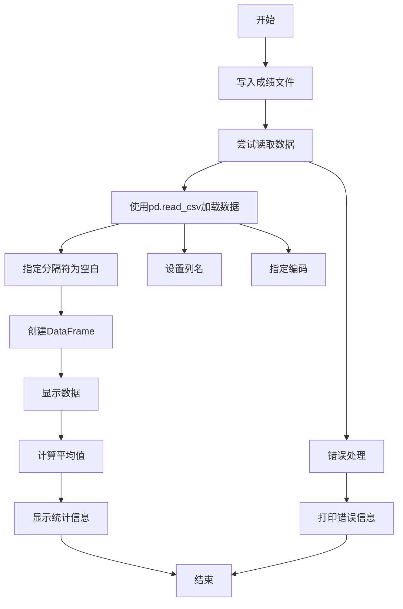

# 用户：

pycharm光标改变快捷键

# DeepSeek：

**原始回答**

在 PyCharm 中，与**光标模式切换**（插入模式 ↔ 覆盖模式）相关的默认快捷键如下：

### 1. 切换插入/覆盖模式 (Insert/Overwrite)
- **默认快捷键**：  
  - **Windows/Linux**：`Insert` 键  
  - **macOS**：`fn` + `Enter`（或外接键盘的 `Insert` 键）  

  按下后，光标会从竖线 `|`（插入模式）变为方块 `█`（覆盖模式），输入时会替换已有文本。

---

### 2. 自定义快捷键（如需修改）
若需修改此快捷键：
1. **打开设置**：  
   - **Windows/Linux**：`File` → `Settings`  
   - **macOS**：`PyCharm` → `Preferences`  
2. **导航到快捷键设置**：  
   `Keymap` → 搜索 `Toggle Overwrite Mode`  
3. **绑定新快捷键**：  
   右键点击操作 → `Add Keyboard Shortcut` → 输入自定义组合键（如 `Ctrl` + `Shift` + `O`） → 保存  

---

### 其他常用光标操作快捷键
| 功能                     | Windows/Linux          | macOS                  |
|--------------------------|------------------------|------------------------|
| **多光标操作**           | `Alt` + 鼠标点击       | `Option` + 鼠标点击    |
| **纵向选择区块**         | `Alt` + `Shift` + 拖动 | `Option` + `Shift` + 拖动 |
| **移动光标到行首/行尾**  | `Home` / `End`         | `Cmd` + `←` / `→`      |
| **移动光标到单词首/尾**  | `Ctrl` + `←` / `→`     | `Option` + `←` / `→`   |

> 💡 **提示**：覆盖模式在修改代码时需谨慎使用，避免误覆盖重要内容。建议保持默认插入模式（竖线光标）。

# 用户：

为什么代码没有办法正确计算斐波那契数列import array
def get_num():
    try:
        num_getted=int(input("请输入，n个斐波那契数列的n=：").strip())
        if num_getted :
            return num_getted
        print("输入无效！n必须大于等于0!")
    except ValueError:
        print("输入无效！请输入有效数字！")
def fib(n):
    fib_list = [1]
    try:
        if n == 2:
            fib_list.append(1)
            return fib_list
        elif n > 2:
            fib_list.append(1)
            for i in range(1,n):
                fib_list_value=fib_list[i-3]+fib_list[i-2]
                fib_list.append(fib_list_value)
            return fib_list
        elif n == 1:
            return fib_list
    except ValueError:
        print("计算失败！")
user_num = get_num()
user_fib_array = fib(user_num)
print(f"计算完成！前{user_num}个斐波那契数列为{user_fib_array}")

# DeepSeek：

**原始回答**

您的代码中存在几个问题，导致斐波那契数列计算不正确。以下是主要问题和修复方案：

### 主要问题分析：
1. **索引错误**：
   - 在循环中使用了 `fib_list[i-3] + fib_list[i-2]`，这会导致索引越界
   - 正确的计算应该是当前最后两个元素相加：`fib_list[-1] + fib_list[-2]`

2. **初始值处理**：
   - 斐波那契数列通常定义为：F(0)=0, F(1)=1 或 F(1)=1, F(2)=1
   - 您的代码从[1]开始，但未包含0，且对n=1的处理不符合常规

3. **输入验证**：
   - 当输入0时，`get_num()` 函数会拒绝（因为 `if num_getted` 将0视为False）
   - 未处理负数输入

### 修复后的代码：
```python
def get_num():
    while True:
        try:
            num = int(input("请输入要生成的斐波那契数列项数 n = ").strip())
            if num >= 0:
                return num
            print("输入无效！n 必须大于等于 0!")
        except ValueError:
            print("输入无效！请输入有效整数！")

def fib(n):
    if n == 0:
        return []
    fib_list = [0]  # 第0项
    
    if n >= 2:
        fib_list.append(1)  # 第1项
        for i in range(2, n):
            # 使用最后两个元素计算新项
            next_val = fib_list[-1] + fib_list[-2]
            fib_list.append(next_val)
    elif n == 1:
        return [0]  # 只返回第0项
    
    return fib_list

user_num = get_num()
user_fib_array = fib(user_num)
print(f"前{user_num}项斐波那契数列为: {user_fib_array}")
```

### 主要修改说明：
1. **索引修复**：
   ```python
   # 错误代码
   fib_list_value = fib_list[i-3] + fib_list[i-2]
   
   # 修复代码
   next_val = fib_list[-1] + fib_list[-2]  # 使用负索引获取最后两个元素
   ```

2. **正确的数列初始化**：
   - `n=0` → 返回空列表 `[]`
   - `n=1` → 返回 `[0]`
   - `n>=2` → 初始化 `[0, 1]` 然后计算后续项

3. **输入验证增强**：
   - 允许输入0（返回空列表）
   - 明确拒绝负数输入
   - 使用循环确保必须输入有效值

4. **移除了不必要的组件**：
   - 删除 `array` 导入（未使用）
   - 删除冗余的异常捕获

### 测试用例：
| 输入 | 输出 |
|------|------|
| 0    | [] |
| 1    | [0] |
| 2    | [0, 1] |
| 5    | [0, 1, 1, 2, 3] |
| 8    | [0, 1, 1, 2, 3, 5, 8, 13] |

> 如果希望数列从1开始（不含0），只需将初始值改为：
> ```python
> if n >= 1:
>     fib_list = [1]  # 第1项
> if n >= 2:
>     fib_list.append(1)  # 第2项
> ```

# 用户：

为什么会索引越界

# DeepSeek：

**原始回答**

索引越界错误在您的原始代码中发生在斐波那契计算部分，具体原因如下：

### 问题根源分析

1. **错误的索引计算**：
   ```python
   fib_list_value = fib_list[i-3] + fib_list[i-2]
   ```
   当 `i=1` 时：
   - `i-3 = 1-3 = -2`
   - `i-2 = 1-2 = -1`
   这会尝试访问列表末尾的元素（负索引在Python中是有效的）

   但当 `i=2` 时：
   - `i-3 = 2-3 = -1`
   - `i-2 = 2-2 = 0`
   这会访问索引0和最后一个元素

   当 `i=3` 时：
   - `i-3 = 0`
   - `i-2 = 1`
   这会访问索引0和1

2. **真正的问题在于循环范围和初始条件**：
   - 您初始化了 `fib_list = [1]`
   - 当 `n>2` 时，您又添加了一个元素：`fib_list.append(1)` → 现在列表有2个元素
   - 然后循环从 `i=1` 到 `i=n-1`（因为 `range(1, n)`）

   当 `n=3` 时：
   - 初始列表: `[1, 1]`
   - 循环 `i=1` 和 `i=2`
   - 当 `i=2` 时：`fib_list_value = fib_list[2-3] + fib_list[2-2] = fib_list[-1] + fib_list[0] = 1 + 1 = 2`

   当 `n=4` 时：
   - 初始列表: `[1, 1]`
   - 循环 `i=1, 2, 3`
   - 当 `i=3` 时：`fib_list_value = fib_list[3-3] + fib_list[3-2] = fib_list[0] + fib_list[1] = 1 + 1 = 2`
   - 但此时列表应该有3个元素：`[1, 1, 2]`，所以访问索引0和1是有效的

3. **为什么没有实际抛出索引错误？**
   - 负索引在Python中是有效的（-1表示最后一个元素）
   - 您的计算逻辑错误但不是索引越界错误
   - 实际问题是计算结果不正确，而不是索引错误

### 真正的计算错误

问题在于您的计算公式：
```python
fib_list_value = fib_list[i-3] + fib_list[i-2]
```

斐波那契数列的正确计算应该是：
```
当前值 = 前一个值 + 前前一个值
```

但在您的代码中：
- 当 `i=1`：计算 `fib_list[-2] + fib_list[-1]` → 第一个和最后一个元素
- 当 `i=2`：计算 `fib_list[-1] + fib_list[0]` → 最后一个和第一个元素
- 当 `i=3`：计算 `fib_list[0] + fib_list[1]` → 第一个和第二个元素

**这没有遵循斐波那契数列的递推关系**，因为您没有始终使用最近的两个元素。

### 正确的方法

应该始终使用列表的最后两个元素：
```python
next_value = fib_list[-1] + fib_list[-2]  # 最后两个元素相加
```

同时需要调整循环：
- 初始列表有2个元素 `[0, 1]` 或 `[1, 1]`
- 对于第3项到第n项，需要添加 `n-2` 个新元素
- 因此循环应该是 `for i in range(2, n):`

### 示例演示（n=5）

正确过程：
```
初始: [0, 1]
i=2: 0+1=1 → [0, 1, 1]
i=3: 1+1=2 → [0, 1, 1, 2]
i=4: 1+2=3 → [0, 1, 1, 2, 3]
```

您的代码过程（n=5）：
```
初始: [1, 1]
i=1: fib_list[-2]+fib_list[-1] = 1+1=2 → [1, 1, 2]
i=2: fib_list[-1]+fib_list[0] = 2+1=3 → [1, 1, 2, 3]
i=3: fib_list[0]+fib_list[1] = 1+1=2 → [1, 1, 2, 3, 2] ❌
i=4: fib_list[1]+fib_list[2] = 1+2=3 → [1, 1, 2, 3, 2, 3] ❌
```

这就是为什么您的代码会产生不正确的结果，但不是通过索引错误表现出来的 - 计算逻辑本身是错误的。

# 用户：

为什么数组会多出一个元素

# DeepSeek：

**原始回答**

您的原始代码中数组多出一个元素的原因在于**循环范围和初始条件不匹配**。让我们详细分析一下：

### 问题根源

在您的代码中：
```python
if n > 2:
    fib_list.append(1)  # 此时列表已有2个元素 [1, 1]
    for i in range(1, n):  # 循环次数 = n-1
        # 添加新元素
```

这里的关键问题是：
1. **初始元素数量**：当 n>2 时，您已经添加了2个元素（初始的1和追加的1）
2. **循环次数**：`range(1, n)` 会产生 (n-1) 次迭代
3. **总元素数量**：2(初始) + (n-1)(循环添加) = n+1

因此，最终数组会有 n+1 个元素，而不是 n 个。

### 示例演示（n=3）

1. 初始状态：`fib_list = [1]`
2. 进入 n>2 分支：`fib_list.append(1)` → `[1, 1]`
3. 循环开始：`range(1, 3)` 即 i=1 和 i=2
   - i=1: 添加新元素 → `[1, 1, 新元素]`
   - i=2: 添加新元素 → `[1, 1, 新元素, 新元素]`
4. 最终结果：4个元素（但您只需要3个）

### 正确的方法

要解决这个问题，需要调整循环范围：
```python
if n > 2:
    fib_list.append(1)  # 现在有2个元素
    for i in range(2, n):  # 从2开始，到n-1结束
        next_val = fib_list[-1] + fib_list[-2]
        fib_list.append(next_val)
```

这样：
- 初始元素：2个
- 循环次数：n-2 次（从2到n-1）
- 总元素数：2 + (n-2) = n

### 完整的修复方案

```python
def fib(n):
    if n == 0:
        return []
    fib_list = [1]  # 第一项
    
    if n == 1:
        return fib_list
    
    fib_list.append(1)  # 第二项
    
    # 从第三项开始计算
    for i in range(2, n):
        next_val = fib_list[-1] + fib_list[-2]
        fib_list.append(next_val)
    
    return fib_list
```

### 测试不同输入值

| n | 初始元素 | 循环次数 | 总元素 | 结果 |
|---|---------|---------|-------|------|
| 0 | 0 | 0 | 0 | [] |
| 1 | 1 | 0 | 1 | [1] |
| 2 | 2 | 0 | 2 | [1, 1] |
| 3 | 2 | 1 | 3 | [1, 1, 2] |
| 5 | 2 | 3 | 5 | [1, 1, 2, 3, 5] |

### 为什么使用负索引更好

在修复代码中，我们使用了：
```python
next_val = fib_list[-1] + fib_list[-2]
```

这样无论列表多长，我们总是获取最后两个元素：
- `-1` 表示最后一个元素
- `-2` 表示倒数第二个元素

这种方法比使用绝对索引更安全，因为它：
1. 不会受列表长度影响
2. 不需要计算复杂的偏移量
3. 避免索引越界错误

# 用户：

简单讲述一下map与fiber函数

# DeepSeek：

**原始回答**

### Map 函数（映射函数）

`map()` 是 Python 的一个内置高阶函数，用于将一个函数应用到可迭代对象（如列表、元组等）的每个元素上，并返回一个迭代器结果。

**核心特点：**
- **函数式编程工具**：对集合中的每个元素应用相同的操作
- **惰性求值**：返回迭代器而不是立即计算所有结果
- **不修改原数据**：创建新结果而不改变原始输入

**基本语法：**
```python
map(function, iterable)
```

**示例：**
```python
# 将列表中的每个数字平方
numbers = [1, 2, 3, 4]
squared = map(lambda x: x**2, numbers)
print(list(squared))  # 输出: [1, 4, 9, 16]

# 将字符串列表转为大写
words = ["hello", "world"]
upper_words = map(str.upper, words)
print(list(upper_words))  # 输出: ['HELLO', 'WORLD']
```

**使用场景：**
- 数据转换（类型转换、格式调整）
- 批量处理数据集
- 与 lambda 函数结合进行简单操作
- 替代 for 循环（更简洁的函数式风格）

### Fiber 函数（斐波那契函数）

斐波那契函数通常指生成斐波那契数列的函数，该数列定义为：
```
F(0) = 0
F(1) = 1
F(n) = F(n-1) + F(n-2) (n ≥ 2)
```

**核心特点：**
- **递归关系**：每个数是前两个数的和
- **指数增长**：数值快速增长（约每5项翻倍）
- **多种实现方式**：递归、迭代、动态规划等

**常见实现方式：**

1. **递归实现（简单但低效）**
```python
def fib_recursive(n):
    if n <= 1:
        return n
    return fib_recursive(n-1) + fib_recursive(n-2)
```

2. **迭代实现（高效推荐）**
```python
def fib_iterative(n):
    a, b = 0, 1
    result = []
    for _ in range(n):
        result.append(a)
        a, b = b, a + b
    return result
```

3. **动态规划实现（带缓存）**
```python
def fib_dp(n, memo={}):
    if n <= 1:
        return n
    if n not in memo:
        memo[n] = fib_dp(n-1, memo) + fib_dp(n-2, memo)
    return memo[n]
```

**数学特性：**
- 黄金分割比：相邻两项比值趋近于 (1+√5)/2 ≈ 1.618
- 自然界常见：植物叶序、贝壳螺旋、星系形状等
- 计算机应用：算法分析、密码学、金融模型

**使用场景：**
- 算法教学（递归/迭代对比）
- 性能测试（递归深度优化）
- 数学建模（增长模型）
- 图形生成（黄金比例设计）

### 关键区别总结
| 特性 | `map()` 函数 | 斐波那契函数 |
|------|-------------|-------------|
| **类型** | Python内置高阶函数 | 自定义数学函数 |
| **目的** | 数据转换/批量处理 | 生成特定数列 |
| **输入** | 函数+可迭代对象 | 整数n（项数） |
| **输出** | 转换后的迭代器 | 数列（列表或单个值） |
| **复杂度** | O(n) 线性 | 递归O(2ⁿ)，迭代O(n) |
| **函数式** | 是（纯函数） | 可以是（无副作用） |
| **应用领域** | 通用数据处理 | 数学/算法领域 |

# 用户：

帮助我学习python中类与面向对象部分

# DeepSeek：

**原始回答**

# Python 类与面向对象编程详解

面向对象编程(OOP)是一种强大的编程范式，Python 提供了全面的 OOP 支持。让我们系统地学习 Python 中类与面向对象的核心概念。

## 一、类的基本概念

### 1. 类与对象的关系
- **类(Class)**：对象的蓝图或模板，定义对象的属性和行为
- **对象(Object)**：类的具体实例，具有自己的状态和行为

```python
# 定义类
class Dog:
    # 类属性（所有实例共享）
    species = "Canis familiaris"
    
    # 初始化方法（构造函数）
    def __init__(self, name, age):
        # 实例属性（每个对象独立）
        self.name = name
        self.age = age
    
    # 实例方法
    def bark(self):
        return f"{self.name} says Woof!"
    
    # 另一个实例方法
    def get_info(self):
        return f"{self.name} is {self.age} years old"

# 创建对象（实例化）
my_dog = Dog("Buddy", 5)
your_dog = Dog("Max", 3)

# 使用对象
print(my_dog.bark())  # Buddy says Woof!
print(your_dog.get_info())  # Max is 3 years old
print(f"Species: {Dog.species}")  # 访问类属性
```

### 2. 核心概念解析
- **`__init__`方法**：构造函数，在创建对象时自动调用
- **`self`参数**：指向当前对象实例的引用
- **类属性**：所有实例共享的属性
- **实例属性**：每个对象独有的属性
- **实例方法**：操作对象状态的方法

## 二、面向对象三大特性

### 1. 封装(Encapsulation)
将数据和方法包装在类中，隐藏内部实现细节

```python
class BankAccount:
    def __init__(self, owner, balance=0):
        self.owner = owner
        self.__balance = balance  # 私有属性（双下划线开头）
    
    # 公开方法访问私有属性
    def deposit(self, amount):
        if amount > 0:
            self.__balance += amount
            return f"Deposited ${amount}. New balance: ${self.__balance}"
        return "Invalid deposit amount"
    
    def withdraw(self, amount):
        if 0 < amount <= self.__balance:
            self.__balance -= amount
            return f"Withdrew ${amount}. New balance: ${self.__balance}"
        return "Insufficient funds or invalid amount"
    
    def get_balance(self):
        return f"Balance: ${self.__balance}"

# 使用封装
account = BankAccount("Alice", 1000)
print(account.deposit(500))  # Deposited $500. New balance: $1500
print(account.withdraw(200))  # Withdrew $200. New balance: $1300
# print(account.__balance)  # 错误！不能直接访问私有属性
```

### 2. 继承(Inheritance)
子类继承父类的属性和方法，实现代码复用

```python
# 父类
class Animal:
    def __init__(self, name):
        self.name = name
    
    def speak(self):
        raise NotImplementedError("Subclass must implement this method")

# 子类继承
class Dog(Animal):
    def speak(self):
        return f"{self.name} says Woof!"

class Cat(Animal):
    def speak(self):
        return f"{self.name} says Meow!"
    
    # 子类特有方法
    def purr(self):
        return f"{self.name} is purring"

# 使用继承
animals = [Dog("Buddy"), Cat("Whiskers")]
for animal in animals:
    print(animal.speak())

print(animals[1].purr())  # 调用子类特有方法
```

### 3. 多态(Polymorphism)
不同对象对同一消息做出不同响应

```python
# 利用继承实现多态
def animal_sound(animal):
    print(animal.speak())

animal_sound(Dog("Rex"))  # Rex says Woof!
animal_sound(Cat("Mittens"))  # Mittens says Meow!

# 鸭子类型（非继承实现多态）
class Duck:
    def speak(self):
        return "Quack!"

class Car:
    def speak(self):
        return "Vroom Vroom!"

# 不同类有相同方法
objects = [Duck(), Car()]
for obj in objects:
    print(obj.speak())
```

## 三、高级特性

### 1. 类方法与静态方法
```python
class MyClass:
    class_attribute = "Class Value"
    
    def __init__(self, value):
        self.instance_attribute = value
    
    # 实例方法：操作实例属性
    def instance_method(self):
        return f"Instance: {self.instance_attribute}"
    
    # 类方法：操作类属性，使用@classmethod装饰器
    @classmethod
    def class_method(cls):
        return f"Class: {cls.class_attribute}"
    
    # 静态方法：与类相关但不需要访问类或实例
    @staticmethod
    def static_method():
        return "This is a static method"

# 使用
obj = MyClass("Instance Value")
print(obj.instance_method())  # 实例方法
print(MyClass.class_method())  # 类方法
print(MyClass.static_method())  # 静态方法
```

### 2. 属性装饰器
控制属性的访问和修改

```python
class Circle:
    def __init__(self, radius):
        self._radius = radius
    
    @property
    def radius(self):
        """获取半径值"""
        return self._radius
    
    @radius.setter
    def radius(self, value):
        """设置半径值，并进行验证"""
        if value > 0:
            self._radius = value
        else:
            raise ValueError("Radius must be positive")
    
    @property
    def area(self):
        """计算面积（只读属性）"""
        return 3.14159 * self._radius ** 2

# 使用属性
c = Circle(5)
print(c.radius)  # 5
print(c.area)    # 78.53975

c.radius = 10
print(c.area)    # 314.159

# c.area = 100  # 错误！只读属性
```

### 3. 特殊方法（魔术方法）
自定义类的行为

```python
class Vector:
    def __init__(self, x, y):
        self.x = x
        self.y = y
    
    # 字符串表示（用于print）
    def __str__(self):
        return f"Vector({self.x}, {self.y})"
    
    # 加法操作符重载
    def __add__(self, other):
        return Vector(self.x + other.x, self.y + other.y)
    
    # 相等比较
    def __eq__(self, other):
        return self.x == other.x and self.y == other.y
    
    # 长度（向量模）
    def __len__(self):
        return int((self.x**2 + self.y**2)**0.5)
    
    # 调用对象（使对象可调用）
    def __call__(self, scalar):
        return Vector(self.x * scalar, self.y * scalar)

# 使用特殊方法
v1 = Vector(2, 4)
v2 = Vector(3, 1)

print(v1)           # Vector(2, 4)
print(v1 + v2)      # Vector(5, 5)
print(v1 == v2)     # False
print(len(v1))      # 4 (约等于√20=4.47的整数部分)

v3 = v1(3)          # 调用对象
print(v3)           # Vector(6, 12)
```

## 四、面向对象设计原则

### 1. SOLID 原则
1. **单一职责原则(SRP)**：一个类只负责一件事
2. **开闭原则(OCP)**：对扩展开放，对修改关闭
3. **里氏替换原则(LSP)**：子类应能替换父类而不影响程序
4. **接口隔离原则(ISP)**：客户端不应依赖不需要的接口
5. **依赖倒置原则(DIP)**：依赖抽象而非具体实现

### 2. 组合优于继承
```python
class Engine:
    def start(self):
        return "Engine started"
    
    def stop(self):
        return "Engine stopped"

class Radio:
    def turn_on(self):
        return "Radio on"
    
    def turn_off(self):
        return "Radio off"

class Car:
    def __init__(self):
        self.engine = Engine()  # 组合
        self.radio = Radio()    # 组合
    
    def drive(self):
        return f"{self.engine.start()} and driving"
    
    def park(self):
        return f"{self.engine.stop()} and {self.radio.turn_on()}"

# 使用组合
my_car = Car()
print(my_car.drive())  # Engine started and driving
print(my_car.park())   # Engine stopped and Radio on
```

## 五、实际应用案例

### 1. 简单的电商系统
```python
class Product:
    def __init__(self, id, name, price):
        self.id = id
        self.name = name
        self.price = price
    
    def __str__(self):
        return f"{self.name} - ${self.price:.2f}"

class CartItem:
    def __init__(self, product, quantity=1):
        self.product = product
        self.quantity = quantity
    
    def total_price(self):
        return self.product.price * self.quantity
    
    def __str__(self):
        return f"{self.quantity} x {self.product.name} - ${self.total_price():.2f}"

class ShoppingCart:
    def __init__(self):
        self.items = []
    
    def add_item(self, product, quantity=1):
        # 检查是否已存在
        for item in self.items:
            if item.product.id == product.id:
                item.quantity += quantity
                return
        # 新商品
        self.items.append(CartItem(product, quantity))
    
    def remove_item(self, product_id):
        self.items = [item for item in self.items if item.product.id != product_id]
    
    def total(self):
        return sum(item.total_price() for item in self.items)
    
    def __str__(self):
        if not self.items:
            return "Your cart is empty"
        
        cart_contents = "\n".join(str(item) for item in self.items)
        return f"{cart_contents}\nTotal: ${self.total():.2f}"

# 使用电商系统
# 创建产品
p1 = Product(1, "Laptop", 1200.00)
p2 = Product(2, "Mouse", 25.99)
p3 = Product(3, "Keyboard", 45.50)

# 创建购物车
cart = ShoppingCart()
cart.add_item(p1)
cart.add_item(p2)
cart.add_item(p3, 2)  # 购买两个键盘
cart.add_item(p2)     # 再添加一个鼠标

print("Cart contents:")
print(cart)

# 移除鼠标
cart.remove_item(2)
print("\nAfter removing mouse:")
print(cart)
```

### 2. 游戏角色系统
```python
class Character:
    def __init__(self, name, health=100):
        self.name = name
        self.health = health
        self.is_alive = True
    
    def take_damage(self, damage):
        if not self.is_alive:
            return f"{self.name} is already defeated!"
        
        self.health -= damage
        if self.health <= 0:
            self.health = 0
            self.is_alive = False
            return f"{self.name} has been defeated!"
        return f"{self.name} takes {damage} damage. Health: {self.health}"
    
    def heal(self, amount):
        if not self.is_alive:
            return f"Cannot heal a defeated character!"
        
        self.health += amount
        return f"{self.name} heals {amount} points. Health: {self.health}"
    
    def __str__(self):
        status = "Alive" if self.is_alive else "Defeated"
        return f"{self.name} - Health: {self.health} - Status: {status}"

class Warrior(Character):
    def __init__(self, name):
        super().__init__(name, health=120)
        self.rage = 0
    
    def attack(self, target):
        damage = 15
        self.rage += 10
        result = target.take_damage(damage)
        return f"{self.name} attacks! {result}"
    
    def special_attack(self, target):
        if self.rage < 30:
            return "Not enough rage!"
        
        self.rage -= 30
        damage = 40
        result = target.take_damage(damage)
        return f"{self.name} uses special attack! {result}"

class Mage(Character):
    def __init__(self, name):
        super().__init__(name, health=80)
        self.mana = 100
    
    def cast_fireball(self, target):
        if self.mana < 20:
            return "Not enough mana!"
        
        self.mana -= 20
        damage = 30
        result = target.take_damage(damage)
        return f"{self.name} casts fireball! {result}"
    
    def heal_self(self):
        if self.mana < 15:
            return "Not enough mana!"
        
        self.mana -= 15
        heal_amount = 25
        result = self.heal(heal_amount)
        return f"{self.name} heals themselves! {result}"

# 使用游戏角色
warrior = Warrior("Conan")
mage = Mage("Gandalf")

print(warrior)
print(mage)

# 战斗
print("\nBattle begins!")
print(warrior.attack(mage))
print(mage.cast_fireball(warrior))
print(warrior.attack(mage))
print(mage.cast_fireball(warrior))
print(warrior.special_attack(mage))

print("\nAfter battle:")
print(warrior)
print(mage)

# 治疗
print("\nHealing:")
print(mage.heal_self())
print(mage)
```

## 六、最佳实践

1. **命名规范**：
   - 类名：`CamelCase`（大驼峰式）
   - 方法名：`snake_case`（蛇形命名法）
   - 私有成员：`_single_leading_underscore`（约定私有）
   - 强私有成员：`__double_leading_underscore`（名称修饰）

2. **文档字符串**：
   ```python
   class MyClass:
       """类文档字符串，描述类的用途"""
       
       def my_method(self, param):
           """方法文档字符串
           
           Args:
               param: 参数描述
               
           Returns:
               返回值描述
           """
   ```

3. **使用类型提示**：
   ```python
   class Point:
       def __init__(self, x: float, y: float) -> None:
           self.x = x
           self.y = y
       
       def distance_to_origin(self) -> float:
           return (self.x**2 + self.y**2)**0.5
   ```

4. **适当使用抽象基类**：
   ```python
   from abc import ABC, abstractmethod
   
   class Shape(ABC):
       @abstractmethod
       def area(self) -> float:
           pass
       
       @abstractmethod
       def perimeter(self) -> float:
           pass
   
   class Circle(Shape):
       def __init__(self, radius: float):
           self.radius = radius
       
       def area(self) -> float:
           return 3.14159 * self.radius ** 2
       
       def perimeter(self) -> float:
           return 2 * 3.14159 * self.radius
   ```

## 七、常见面试题

1. **类方法和静态方法的区别是什么？**
   - 类方法：接收`cls`参数，可以访问和修改类状态
   - 静态方法：不接收特殊参数，与类相关但不访问类或实例状态

2. **Python 中如何实现私有属性？**
   - 单下划线`_attr`：约定私有，但外部仍可访问
   - 双下划线`__attr`：名称修饰（Name Mangling），实际变为`_ClassName__attr`
   - 最佳实践：使用单下划线约定私有，通过属性装饰器控制访问

3. **什么是鸭子类型？**
   - "当看到一只鸟走起来像鸭子、游泳像鸭子、叫起来像鸭子，那么这只鸟就可以被称为鸭子"
   - 在 Python 中：关注对象的行为（方法），而不是对象的类型
   - 优点：提高代码灵活性，减少对继承的依赖

4. **MRO（方法解析顺序）是什么？**
   - 在多继承中确定方法搜索顺序的算法
   - Python 使用 C3 线性化算法
   - 查看 MRO：`ClassName.mro()`

面向对象编程是 Python 的核心编程范式，掌握这些概念后，你可以：
1. 创建更模块化、可重用的代码
2. 设计更复杂的系统架构
3. 编写更易维护和扩展的应用程序
4. 理解和使用 Python 标准库和第三方库

练习建议：从简单类开始，逐步实现更复杂的类关系，尝试重构现有代码为面向对象风格。

# 用户：

详细讲解类属性部分

# DeepSeek：

**原始回答**

# Python 类属性详解

类属性是面向对象编程中一个核心概念，理解它对掌握 Python 的类机制至关重要。我将从多个维度详细讲解类属性的特性和用法。

## 一、类属性的本质与特点

### 1. 定义与基本特性
类属性是**直接绑定到类本身**的属性，而不是类的实例。它们在所有实例之间共享，具有以下特点：
- 定义在类内部但方法外部
- 属于类而非特定实例
- 所有实例共享同一个类属性
- 可通过类名或实例访问

```python
class Circle:
    # 类属性
    PI = 3.14159  # 圆周率
    count = 0     # 创建的圆实例计数器
    
    def __init__(self, radius):
        # 实例属性
        self.radius = radius
        Circle.count += 1  # 访问并修改类属性
```

### 2. 类属性 vs 实例属性
| 特性 | 类属性 | 实例属性 |
|------|--------|----------|
| **存储位置** | 类命名空间 | 实例命名空间 |
| **生命周期** | 类存在期间 | 实例存在期间 |
| **共享性** | 所有实例共享 | 实例私有 |
| **定义位置** | 类顶层 | `__init__` 或方法内 |
| **访问方式** | `类名.属性` 或 `实例.属性` | `实例.属性` |
| **修改影响** | 影响所有实例 | 仅影响当前实例 |

## 二、类属性的访问与修改

### 1. 访问类属性
```python
# 通过类名访问
print(Circle.PI)  # 输出: 3.14159

# 创建实例
c1 = Circle(5)
c2 = Circle(10)

# 通过实例访问
print(c1.PI)     # 输出: 3.14159
print(c2.PI)     # 输出: 3.14159

# 访问计数器
print(Circle.count)  # 输出: 2 (两个实例)
```

### 2. 修改类属性
```python
# 通过类名修改 - 影响所有实例
Circle.PI = 3.14
print(c1.PI)  # 输出: 3.14
print(c2.PI)  # 输出: 3.14

# 通过实例"修改" - 实际创建新实例属性
c1.PI = 3.1416
print(c1.PI)      # 输出: 3.1416 (实例属性)
print(c2.PI)      # 输出: 3.14 (类属性)
print(Circle.PI)  # 输出: 3.14 (类属性未变)
```

### 3. 类属性与继承
```python
class Shape:
    total_shapes = 0
    
    def __init__(self):
        Shape.total_shapes += 1

class Circle(Shape):
    pass

class Square(Shape):
    pass

# 创建不同子类实例
c = Circle()
s = Square()

print(Shape.total_shapes)  # 输出: 2
print(Circle.total_shapes) # 输出: 2 (继承自父类)
```

## 三、类属性的高级用法

### 1. 类属性作为默认值
```python
class User:
    # 类属性作为默认配置
    DEFAULT_ROLE = "guest"
    MAX_LOGIN_ATTEMPTS = 3
    
    def __init__(self, username, role=None):
        self.username = username
        self.role = role or User.DEFAULT_ROLE
        self.login_attempts = 0
    
    def login(self):
        if self.login_attempts < User.MAX_LOGIN_ATTEMPTS:
            self.login_attempts += 1
            return True
        return False
```

### 2. 类属性与描述符
```python
class PositiveNumber:
    """描述符类"""
    def __set_name__(self, owner, name):
        self.name = name
    
    def __get__(self, instance, owner):
        return instance.__dict__.get(self.name, 0)
    
    def __set__(self, instance, value):
        if value <= 0:
            raise ValueError("必须为正数")
        instance.__dict__[self.name] = value

class BankAccount:
    # 类属性使用描述符
    balance = PositiveNumber()
    
    def __init__(self, initial_balance):
        self.balance = initial_balance  # 使用描述符验证

# 使用
acc = BankAccount(100)
print(acc.balance)  # 100
# acc.balance = -50  # 引发 ValueError
```

### 3. 类属性与元类
```python
class Meta(type):
    """元类控制类属性创建"""
    def __new__(cls, name, bases, attrs):
        # 自动添加注册表属性
        if "registry" not in attrs:
            attrs["registry"] = {}
        return super().__new__(cls, name, bases, attrs)

class Animal(metaclass=Meta):
    pass

class Dog(Animal):
    pass

class Cat(Animal):
    pass

# 所有子类共享同一个注册表
print(Animal.registry)  # {}
Dog.registry["golden"] = "Retriever"
print(Cat.registry)     # {'golden': 'Retriever'} (共享)
```

## 四、类属性的设计模式应用

### 1. 单例模式 (Singleton)
```python
class Singleton:
    _instance = None  # 类属性存储唯一实例
    
    def __new__(cls):
        if cls._instance is None:
            cls._instance = super().__new__(cls)
        return cls._instance

# 测试
s1 = Singleton()
s2 = Singleton()
print(s1 is s2)  # True (同一个实例)
```

### 2. 享元模式 (Flyweight)
```python
class Character:
    """字符享元工厂"""
    _char_cache = {}  # 类属性缓存共享对象
    
    def __new__(cls, char):
        # 如果字符已存在，返回缓存对象
        if char in cls._char_cache:
            return cls._char_cache[char]
        
        # 否则创建新对象并缓存
        instance = super().__new__(cls)
        instance.char = char
        cls._char_cache[char] = instance
        return instance

# 使用
char_a = Character('a')
char_b = Character('b')
char_a2 = Character('a')
print(char_a is char_a2)  # True (相同字符共享实例)
```

### 3. 配置管理器
```python
class Config:
    """集中式配置管理"""
    _settings = {
        'debug': False,
        'log_level': 'INFO',
        'max_connections': 10
    }
    
    @classmethod
    def get(cls, key):
        return cls._settings.get(key)
    
    @classmethod
    def set(cls, key, value):
        if key in cls._settings:
            cls._settings[key] = value
        else:
            raise KeyError(f"无效配置项: {key}")

# 全局访问配置
Config.set('log_level', 'DEBUG')
print(Config.get('log_level'))  # DEBUG
```

## 五、类属性的陷阱与最佳实践

### 1. 常见陷阱
**陷阱1：意外修改可变类属性**
```python
class Team:
    members = []  # 可变类属性
    
    def add_member(self, name):
        self.members.append(name)

t1 = Team()
t1.add_member("Alice")

t2 = Team()
t2.add_member("Bob")

print(t1.members)  # ['Alice', 'Bob'] (所有实例共享)
```

**解决方案：在实例化时初始化**
```python
class Team:
    def __init__(self):
        self.members = []  # 实例属性
```

**陷阱2：类属性被实例属性遮蔽**
```python
class Settings:
    DEFAULT_TIMEOUT = 10

s = Settings()
s.DEFAULT_TIMEOUT = 30  # 创建实例属性，遮蔽类属性

print(s.DEFAULT_TIMEOUT)    # 30 (实例属性)
print(Settings.DEFAULT_TIMEOUT)  # 10 (类属性未变)
```

### 2. 最佳实践
1. **使用大写命名常量类属性**
   ```python
   class Physics:
       SPEED_OF_LIGHT = 299792458  # m/s
       GRAVITATIONAL_CONSTANT = 6.67430e-11  # m³/kg/s²
   ```

2. **只读类属性使用属性装饰器**
   ```python
   class Circle:
       _PI = 3.14159  # "私有"类属性
       
       @property
       def PI(cls):
           return cls._PI
   ```

3. **线程安全的类属性修改**
   ```python
   import threading
   
   class Counter:
       _count = 0
       _lock = threading.Lock()  # 类级锁
       
       @classmethod
       def increment(cls):
           with cls._lock:
               cls._count += 1
   ```

4. **文档化类属性**
   ```python
   class Database:
       """数据库连接管理器"""
       
       MAX_CONNECTIONS = 10
       """允许的最大并发连接数"""
       
       TIMEOUT = 30
       """连接超时时间(秒)"""
   ```

## 六、类属性在标准库中的应用

### 1. datetime 模块
```python
from datetime import datetime

# 类属性作为常量
print(datetime.min)  # 0001-01-01 00:00:00
print(datetime.max)  # 9999-12-31 23:59:59.999999
print(datetime.resolution)  # 0:00:00.000001
```

### 2. enum 模块
```python
from enum import Enum, auto

class Color(Enum):
    RED = auto()
    GREEN = auto()
    BLUE = auto()
    
    # 类属性
    RGB_VALUES = {
        RED: (255, 0, 0),
        GREEN: (0, 255, 0),
        BLUE: (0, 0, 255)
    }

# 访问类属性
print(Color.RGB_VALUES[Color.RED])  # (255, 0, 0)
```

### 3. dataclasses 模块
```python
from dataclasses import dataclass, field

@dataclass
class InventoryItem:
    # 类属性
    category: str = field(default="general", init=False)
    
    # 实例属性
    name: str
    unit_price: float
    quantity: int = 0

# 使用
item = InventoryItem("Widget", 10.99)
print(item.category)  # "general" (类属性)
```

## 七、类属性的高级技巧

### 1. 动态添加类属性
```python
class DynamicClass:
    pass

# 动态添加类属性
DynamicClass.new_attr = 42
print(DynamicClass.new_attr)  # 42

# 通过函数添加
def add_class_attr(cls, name, value):
    setattr(cls, name, value)

add_class_attr(DynamicClass, "dynamic_value", 100)
print(DynamicClass.dynamic_value)  # 100
```

### 2. 类属性与元编程
```python
class Meta(type):
    def __init__(cls, name, bases, attrs):
        # 自动注册所有子类
        if not hasattr(cls, 'registry'):
            cls.registry = {}
        else:
            cls.registry[name.lower()] = cls
        super().__init__(name, bases, attrs)

class Base(metaclass=Meta):
    pass

class ModelA(Base):
    pass

class ModelB(Base):
    pass

print(Base.registry)  
# {'modela': <class '__main__.ModelA'>, 'modelb': <class '__main__.ModelB'>}
```

### 3. 类属性描述符协议
```python
class ClassProperty:
    """类属性描述符"""
    def __init__(self, fget=None):
        self.fget = fget
    
    def __get__(self, instance, owner=None):
        return self.fget(owner) if owner else self.fget()

class Configuration:
    _settings = {}
    
    @ClassProperty
    def settings(cls):
        return cls._settings
    
    @classmethod
    def set_setting(cls, key, value):
        cls._settings[key] = value

# 使用
Configuration.set_setting("timeout", 30)
print(Configuration.settings)  # {'timeout': 30}
```

## 总结

类属性是 Python 面向对象编程中强大而灵活的特性：
1. **共享性**：在所有实例间共享数据
2. **持久性**：生命周期与类相同
3. **多功能性**：可用于常量、计数器、配置、缓存等
4. **继承性**：子类继承父类的类属性
5. **可扩展性**：支持动态添加和修改

正确使用类属性可以：
- 减少内存占用（共享数据）
- 提供全局访问点
- 实现设计模式（单例、享元等）
- 创建更清晰、更高效的代码结构

关键注意事项：
- 避免意外修改可变类属性
- 理解类属性与实例属性的遮蔽机制
- 在多线程环境中使用锁保护可变类属性
- 优先使用实例属性存储实例特定状态

掌握类属性的各种特性和用法，能够帮助你设计出更优雅、更高效的 Python 类和面向对象系统。

# 用户：

再讲解一下继承

# DeepSeek：

**原始回答**

# Python 继承机制详解

继承是面向对象编程的核心概念之一，它允许我们创建新类（子类）来继承已有类（父类）的属性和方法，从而实现代码复用和层次化设计。下面我将从多个角度详细讲解 Python 中的继承机制。

## 一、继承的基本概念与语法

### 1. 基本语法
```python
class ParentClass:
    """父类/基类"""
    def parent_method(self):
        print("父类方法")

class ChildClass(ParentClass):
    """子类/派生类"""
    def child_method(self):
        print("子类方法")

# 创建子类实例
child = ChildClass()
child.parent_method()  # 继承自父类
child.child_method()   # 子类自有方法
```

### 2. 继承的类型
- **单继承**：一个子类只继承一个父类
- **多重继承**：一个子类继承多个父类
- **多级继承**：子类继承父类，父类又继承另一个类

```python
# 单继承
class Animal:
    pass

class Dog(Animal):
    pass

# 多重继承
class Flyable:
    def fly(self):
        print("能飞")

class Swimmable:
    def swim(self):
        print("能游泳")

class Duck(Animal, Flyable, Swimmable):
    pass

# 多级继承
class Mammal(Animal):
    pass

class Cat(Mammal):
    pass
```

## 二、继承的核心机制

### 1. 方法继承与重写
```python
class Vehicle:
    def start(self):
        print("交通工具启动")
    
    def stop(self):
        print("交通工具停止")

class Car(Vehicle):
    # 重写父类方法
    def start(self):
        print("汽车引擎启动")
    
    # 扩展父类方法
    def stop(self):
        super().stop()  # 调用父类方法
        print("手刹拉起")

car = Car()
car.start()  # 输出: 汽车引擎启动
car.stop()   # 输出: 交通工具停止\n手刹拉起
```

### 2. 属性继承
```python
class Person:
    def __init__(self, name, age):
        self.name = name
        self.age = age

class Employee(Person):
    def __init__(self, name, age, employee_id):
        super().__init__(name, age)  # 调用父类初始化方法
        self.employee_id = employee_id
    
    def display(self):
        print(f"{self.name}, {self.age}岁, 工号:{self.employee_id}")

emp = Employee("张三", 30, "E1001")
emp.display()  # 输出: 张三, 30岁, 工号:E1001
```

## 三、方法解析顺序（MRO）

### 1. MRO 概念
当多重继承时，Python 使用 C3 线性化算法确定方法调用顺序

### 2. 查看 MRO
```python
class A:
    pass

class B(A):
    pass

class C(A):
    pass

class D(B, C):
    pass

print(D.mro())
# 输出: [<class '__main__.D'>, <class '__main__.B'>, <class '__main__.C'>, <class '__main__.A'>, <class 'object'>]
```

### 3. 钻石继承问题
```python
class Top:
    def method(self):
        print("Top方法")

class Left(Top):
    def method(self):
        print("Left方法")

class Right(Top):
    def method(self):
        print("Right方法")

class Bottom(Left, Right):
    pass

bottom = Bottom()
bottom.method()  # 输出: Left方法 (按MRO顺序)
```

## 四、特殊方法与继承

### 1. `isinstance()` 和 `issubclass()`
```python
print(isinstance(bottom, Left))   # True
print(isinstance(bottom, Top))    # True
print(issubclass(Bottom, Right))  # True
```

### 2. `__init_subclass__` 方法
```python
class Base:
    def __init_subclass__(cls, **kwargs):
        print(f"创建子类: {cls.__name__}")
        cls.registry = []

class Child(Base):
    pass  # 输出: 创建子类: Child
```

### 3. `__subclasses__()` 方法
```python
print(Base.__subclasses__())  # [<class '__main__.Child'>]
```

## 五、抽象基类与接口

### 1. 使用 abc 模块
```python
from abc import ABC, abstractmethod

class Shape(ABC):
    @abstractmethod
    def area(self):
        pass
    
    @abstractmethod
    def perimeter(self):
        pass

class Circle(Shape):
    def __init__(self, radius):
        self.radius = radius
    
    def area(self):
        return 3.14 * self.radius ** 2
    
    def perimeter(self):
        return 2 * 3.14 * self.radius

# 抽象类不能实例化
# shape = Shape()  # TypeError
circle = Circle(5)
print(circle.area())  # 78.5
```

### 2. 接口实现
```python
class JSONSerializable:
    def to_json(self):
        import json
        return json.dumps(self.__dict__)

class Person:
    def __init__(self, name, age):
        self.name = name
        self.age = age

class Employee(Person, JSONSerializable):
    pass

emp = Employee("李四", 28)
print(emp.to_json())  # {"name": "李四", "age": 28}
```

## 六、高级继承技巧

### 1. Mixin 模式
```python
class LoggingMixin:
    def log(self, message):
        print(f"[LOG] {self.__class__.__name__}: {message}")

class DatabaseMixin:
    def save(self):
        print(f"{self} 保存到数据库")

class User(LoggingMixin, DatabaseMixin):
    def __init__(self, username):
        self.username = username
    
    def __str__(self):
        return f"用户:{self.username}"

user = User("admin")
user.log("创建用户")  # [LOG] User: 创建用户
user.save()         # 用户:admin 保存到数据库
```

### 2. 动态继承
```python
def create_dynamic_class(base_classes):
    class DynamicClass(*base_classes):
        def info(self):
            print(f"动态类继承自: {base_classes}")
    return DynamicClass

Dynamic = create_dynamic_class((LoggingMixin, DatabaseMixin))
obj = Dynamic()
obj.log("测试")  # [LOG] Dynamic: 测试
obj.info()     # 动态类继承自: (<class '__main__.LoggingMixin'>, <class '__main__.DatabaseMixin'>)
```

### 3. 重写特殊方法
```python
class CustomList(list):
    def __getitem__(self, index):
        value = super().__getitem__(index)
        return f"值: {value}"

my_list = CustomList([1, 2, 3])
print(my_list[1])  # 值: 2
```

## 七、继承的最佳实践

### 1. 遵循里氏替换原则（LSP）
子类应该能够替换父类而不影响程序正确性

```python
class Bird:
    def fly(self):
        print("飞行")

class Sparrow(Bird):
    pass  # 麻雀可以飞行

class Ostrich(Bird):
    def fly(self):
        raise Exception("鸵鸟不能飞")  # 违反LSP原则

# 正确做法
class FlightlessBird(Bird):
    def fly(self):
        print("不能飞行")

class Ostrich(FlightlessBird):
    pass
```

### 2. 组合优于继承
```python
class Engine:
    def start(self):
        print("引擎启动")

class Car:
    def __init__(self):
        self.engine = Engine()
    
    def start(self):
        self.engine.start()

car = Car()
car.start()  # 引擎启动
```

### 3. 避免过深的继承链
建议继承深度不超过3层

### 4. 使用设计模式
```python
# 模板方法模式
class ReportTemplate:
    def generate(self):
        self.header()
        self.content()
        self.footer()
    
    def header(self):
        print("=== 报告头部 ===")
    
    @abstractmethod
    def content(self):
        pass
    
    def footer(self):
        print("=== 报告尾部 ===")

class SalesReport(ReportTemplate):
    def content(self):
        print("销售数据: ...")

report = SalesReport()
report.generate()
```

## 八、继承常见问题与解决方案

### 1. 父类初始化问题
```python
class Base:
    def __init__(self, value):
        self.value = value

class Child(Base):
    def __init__(self, value, extra):
        # 忘记调用 super().__init__()
        self.extra = extra

# 修复方案
class FixedChild(Base):
    def __init__(self, value, extra):
        super().__init__(value)
        self.extra = extra
```

### 2. 多重继承冲突
```python
class A:
    def method(self):
        print("A方法")

class B:
    def method(self):
        print("B方法")

class C(A, B):
    pass  # 默认使用A的方法

# 显式解决冲突
class D(B, A):
    def method(self):
        # 明确调用特定父类方法
        A.method(self)
```

### 3. 私有成员继承
```python
class Parent:
    def __init__(self):
        self.__private = "私有"  # 名称修饰为 _Parent__private
    
    def show_private(self):
        print(self.__private)

class Child(Parent):
    def try_show(self):
        # print(self.__private)  # 错误
        print(self._Parent__private)  # 可以访问但不推荐

child = Child()
child.show_private()  # 通过父类方法访问
```

## 九、继承在实际项目中的应用

### 1. Django 模型继承
```python
from django.db import models

class TimestampModel(models.Model):
    created_at = models.DateTimeField(auto_now_add=True)
    updated_at = models.DateTimeField(auto_now=True)
    
    class Meta:
        abstract = True  # 抽象基类

class User(TimestampModel):
    name = models.CharField(max_length=100)
    email = models.EmailField()

class Post(TimestampModel):
    title = models.CharField(max_length=200)
    content = models.TextField()
```

### 2. GUI 框架中的控件继承
```python
import tkinter as tk

class ValidatedEntry(tk.Entry):
    def __init__(self, master=None, **kwargs):
        super().__init__(master, **kwargs)
        self.config(validate="key", validatecommand=(self.register(self.validate), "%P"))
    
    def validate(self, new_value):
        # 自定义验证逻辑
        return new_value.isdigit()  # 只允许数字输入

root = tk.Tk()
entry = ValidatedEntry(root)
entry.pack()
root.mainloop()
```

### 3. 自定义异常体系
```python
class AppError(Exception):
    """应用基础异常"""
    
class DatabaseError(AppError):
    """数据库相关异常"""
    
class ConnectionError(DatabaseError):
    """连接异常"""
    
class QueryError(DatabaseError):
    """查询异常"""

# 使用
try:
    # 数据库操作
    raise ConnectionError("连接超时")
except ConnectionError as e:
    print(f"连接错误: {e}")
except DatabaseError as e:
    print(f"数据库错误: {e}")
except AppError as e:
    print(f"应用错误: {e}")
```

## 十、继承与元类

```python
class Meta(type):
    def __new__(cls, name, bases, attrs):
        # 自动添加类属性
        attrs['created_by'] = "MetaClass"
        return super().__new__(cls, name, bases, attrs)

class Base(metaclass=Meta):
    pass

class Child(Base):
    pass

print(Child.created_by)  # "MetaClass"
```

## 总结

继承是 Python 面向对象编程的强大工具：
1. **代码复用**：减少重复代码，提高开发效率
2. **层次结构**：创建清晰的类层次关系
3. **多态支持**：实现接口统一但行为不同的对象
4. **扩展灵活**：通过重写和扩展实现新功能

使用继承时需注意：
- 优先考虑组合而非深层次继承
- 遵循里氏替换原则
- 理解 MRO 机制，避免多重继承冲突
- 合理使用抽象基类定义接口
- 避免过度设计，保持继承结构简洁

掌握继承机制能让你设计出更优雅、可维护性更强的面向对象程序，构建复杂的系统架构。

# 用户：

如何调用class

# DeepSeek：

**原始回答**

# Python 中如何调用类：全面指南

在 Python 中调用类是面向对象编程的核心操作，下面我将详细解释多种调用类的方式及其应用场景。

## 一、基本调用：创建实例

### 1. 最简单的实例化
```python
class Car:
    def __init__(self, brand):
        self.brand = brand

# 调用类创建实例
my_car = Car("Toyota")
print(my_car.brand)  # 输出: Toyota
```

### 2. 带参数初始化
```python
class Rectangle:
    def __init__(self, width, height):
        self.width = width
        self.height = height
    
    def area(self):
        return self.width * self.height

# 创建实例并调用方法
rect = Rectangle(5, 3)
print(rect.area())  # 输出: 15
```

## 二、类方法调用

### 1. 类方法（@classmethod）
```python
class Date:
    def __init__(self, day, month, year):
        self.day = day
        self.month = month
        self.year = year
    
    @classmethod
    def from_string(cls, date_str):
        """从字符串 'dd-mm-yyyy' 创建实例"""
        day, month, year = map(int, date_str.split('-'))
        return cls(day, month, year)  # 调用类创建新实例

# 直接通过类调用类方法
new_year = Date.from_string("01-01-2023")
print(new_year.day, new_year.month, new_year.year)  # 输出: 1 1 2023
```

### 2. 替代构造函数
```python
class Person:
    def __init__(self, name, age):
        self.name = name
        self.age = age
    
    @classmethod
    def from_birth_year(cls, name, birth_year):
        """通过出生年份创建实例"""
        current_year = 2023
        age = current_year - birth_year
        return cls(name, age)

# 调用类方法创建实例
john = Person.from_birth_year("John", 1990)
print(f"{john.name} is {john.age} years old")  # John is 33 years old
```

## 三、静态方法调用

### 1. 静态方法（@staticmethod）
```python
class MathUtils:
    @staticmethod
    def add(a, b):
        return a + b
    
    @staticmethod
    def multiply(a, b):
        return a * b

# 直接通过类调用静态方法
result = MathUtils.add(5, 3)
print(result)  # 输出: 8

# 也可以通过实例调用
utils = MathUtils()
print(utils.multiply(4, 6))  # 输出: 24
```

### 2. 实用工具类
```python
class StringUtils:
    @staticmethod
    def reverse(text):
        return text[::-1]
    
    @staticmethod
    def capitalize(text):
        return text.capitalize()

# 无需创建实例即可使用
print(StringUtils.reverse("hello"))  # olleh
print(StringUtils.capitalize("python"))  # Python
```

## 四、特殊方法调用

### 1. 运算符重载
```python
class Vector:
    def __init__(self, x, y):
        self.x = x
        self.y = y
    
    def __add__(self, other):
        """重载 + 运算符"""
        return Vector(self.x + other.x, self.y + other.y)
    
    def __str__(self):
        return f"({self.x}, {self.y})"

# 创建实例并使用运算符
v1 = Vector(2, 3)
v2 = Vector(4, 5)
v3 = v1 + v2  # 调用 __add__ 方法
print(v3)  # 输出: (6, 8)
```

### 2. 可调用对象（__call__）
```python
class Multiplier:
    def __init__(self, factor):
        self.factor = factor
    
    def __call__(self, x):
        """使实例可像函数一样调用"""
        return x * self.factor

# 创建实例并像函数一样调用
double = Multiplier(2)
print(double(5))  # 输出: 10
print(double(10))  # 输出: 20

triple = Multiplier(3)
print(triple(7))  # 输出: 21
```

## 五、继承与多态调用

### 1. 调用父类方法
```python
class Animal:
    def speak(self):
        return "动物声音"

class Dog(Animal):
    def speak(self):
        # 调用父类方法
        parent_sound = super().speak()
        return f"{parent_sound} -> 汪汪!"

# 创建子类实例并调用方法
dog = Dog()
print(dog.speak())  # 输出: 动物声音 -> 汪汪!
```

### 2. 多态调用
```python
class Cat(Animal):
    def speak(self):
        return "喵喵!"

def animal_sound(animal):
    """接受任何Animal子类实例"""
    print(animal.speak())

# 多态调用
animal_sound(Dog())  # 动物声音 -> 汪汪!
animal_sound(Cat())  # 喵喵!
```

## 六、元类调用

### 1. 使用元类控制类创建
```python
class Meta(type):
    def __new__(cls, name, bases, attrs):
        """在类创建时添加前缀"""
        prefixed_attrs = {}
        for key, value in attrs.items():
            prefixed_attrs["meta_" + key] = value
        return super().__new__(cls, name, bases, prefixed_attrs)

class MyClass(metaclass=Meta):
    value = 42

# 调用元类创建的类
print(MyClass.meta_value)  # 输出: 42
```

## 七、工厂模式调用

### 1. 类作为工厂
```python
class ShapeFactory:
    @staticmethod
    def create_shape(shape_type):
        """工厂方法创建不同形状"""
        if shape_type == "circle":
            return Circle()
        elif shape_type == "square":
            return Square()
        else:
            raise ValueError("未知形状类型")

class Circle:
    def draw(self):
        print("绘制圆形")

class Square:
    def draw(self):
        print("绘制正方形")

# 使用工厂创建对象
circle = ShapeFactory.create_shape("circle")
circle.draw()  # 绘制圆形

square = ShapeFactory.create_shape("square")
square.draw()  # 绘制正方形
```

## 八、单例模式调用

### 1. 确保只有一个实例
```python
class Singleton:
    _instance = None
    
    def __new__(cls):
        if cls._instance is None:
            cls._instance = super().__new__(cls)
        return cls._instance

# 多次调用返回同一个实例
s1 = Singleton()
s2 = Singleton()
print(s1 is s2)  # 输出: True
```

## 九、类装饰器调用

### 1. 使用类作为装饰器
```python
class Timer:
    def __init__(self, func):
        self.func = func
    
    def __call__(self, *args, **kwargs):
        import time
        start = time.time()
        result = self.func(*args, **kwargs)
        end = time.time()
        print(f"{self.func.__name__} 执行时间: {end - start:.4f}秒")
        return result

@Timer
def long_running_function():
    import time
    time.sleep(2)

# 调用被装饰的函数
long_running_function()  # 输出: long_running_function 执行时间: 2.0002秒
```

## 十、上下文管理器调用

### 1. 使用 __enter__ 和 __exit__
```python
class FileHandler:
    def __init__(self, filename, mode):
        self.filename = filename
        self.mode = mode
    
    def __enter__(self):
        self.file = open(self.filename, self.mode)
        return self.file
    
    def __exit__(self, exc_type, exc_val, exc_tb):
        self.file.close()

# 使用上下文管理器调用
with FileHandler("example.txt", "w") as f:
    f.write("Hello, Context Manager!")

# 文件会自动关闭
```

## 最佳实践总结

1. **明确目的选择调用方式**：
   - 创建对象：使用 `ClassName()` 实例化
   - 实用功能：使用 `@staticmethod` 或 `@classmethod`
   - 定制行为：重载特殊方法如 `__call__`, `__add__` 等

2. **继承调用原则**：
   - 使用 `super()` 调用父类方法
   - 遵循里氏替换原则（LSP）

3. **设计模式应用**：
   - 工厂模式创建对象
   - 单例模式控制实例数量
   - 装饰器模式增强功能

4. **资源管理**：
   - 使用上下文管理器（`with` 语句）自动管理资源

5. **元编程**：
   - 使用元类定制类创建过程
   - 动态创建和修改类

通过灵活运用这些调用方式，你可以：
- 创建清晰、可维护的代码结构
- 实现复杂的对象创建逻辑
- 构建可扩展的应用程序架构
- 提高代码复用性和可读性

掌握 Python 中类的各种调用方法是成为高级 Python 开发者的关键技能，能够帮助你设计出更优雅、高效的面向对象程序。

# 用户：

如何将list["旺财"，3]导入class animals:
    def __init__(self,name,age):
        self.name = name
        self.age = age
    def speak(self):
        print("我是",self.name,"今年",self.age,"岁")
class dog(animals):
    def speak(self):
        print("汪汪！我是",self.name,"今年",self.age,"岁")代码中的class中的name与age

# DeepSeek：

**原始回答**

# 将列表数据导入类实例的方法

您的问题是如何将列表 `["旺财", 3]` 导入到类 `dog` 中，以设置 `name` 和 `age` 属性。以下是几种实现方法：

## 方法1：直接使用列表元素创建实例

```python
# 定义动物基类
class animals:
    def __init__(self, name, age):
        self.name = name
        self.age = age
    
    def speak(self):
        print("我是", self.name, "今年", self.age, "岁")

# 定义狗类继承自动物
class dog(animals):
    def speak(self):
        print("汪汪！我是", self.name, "今年", self.age, "岁")

# 要导入的数据列表
data = ["旺财", 3]

# 使用列表元素创建实例
my_dog = dog(data[0], data[1])  # 使用索引访问列表元素

# 验证结果
my_dog.speak()  # 输出: 汪汪！我是 旺财 今年 3 岁
```

## 方法2：使用解包操作符(*)

```python
# 使用相同的类定义...

# 要导入的数据列表
data = ["旺财", 3]

# 使用解包操作符创建实例
my_dog = dog(*data)  # *操作符将列表元素解包为参数

# 验证结果
my_dog.speak()  # 输出: 汪汪！我是 旺财 今年 3 岁
```

## 方法3：处理多个动物的列表

如果需要处理包含多个动物的列表：

```python
# 定义相同的类...

# 包含多个动物数据的列表
animals_data = [
    ["旺财", 3],
    ["小黑", 2],
    ["小白", 4]
]

# 创建动物实例的列表
dogs = []
for data in animals_data:
    dogs.append(dog(*data))

# 验证所有动物
for dog in dogs:
    dog.speak()
    
# 输出:
# 汪汪！我是 旺财 今年 3 岁
# 汪汪！我是 小黑 今年 2 岁
# 汪汪！我是 小白 今年 4 岁
```

## 方法4：使用字典映射

如果数据来源更复杂，可以使用字典：

```python
# 定义相同的类...

# 动物数据字典
animals_dict = {
    "name": "旺财",
    "age": 3
}

# 使用字典创建实例
my_dog = dog(**animals_dict)  # **操作符将字典解包为关键字参数

# 验证结果
my_dog.speak()  # 输出: 汪汪！我是 旺财 今年 3 岁
```

## 方法5：从文件或外部源导入

如果数据来自外部文件：

```python
import json

# 定义相同的类...

# 假设有一个包含动物数据的JSON文件（animals.json）
# 内容: [["旺财", 3], ["小黑", 2], ["小白", 4]]

# 从JSON文件加载数据
with open('animals.json', 'r', encoding='utf-8') as f:
    animals_data = json.load(f)

# 创建动物实例
dogs = [dog(*data) for data in animals_data]

# 验证所有动物
for dog in dogs:
    dog.speak()
```

## 方法6：在类中添加from_list方法

更面向对象的解决方案：

```python
class animals:
    def __init__(self, name, age):
        self.name = name
        self.age = age
    
    def speak(self):
        print("我是", self.name, "今年", self.age, "岁")
    
    @classmethod
    def from_list(cls, data):
        """从列表创建实例"""
        return cls(data[0], data[1])

class dog(animals):
    def speak(self):
        print("汪汪！我是", self.name, "今年", self.age, "岁")
    
    @classmethod
    def from_list(cls, data):
        """从列表创建实例（可添加额外处理）"""
        return super().from_list(data)

# 使用from_list方法创建实例
data = ["旺财", 3]
my_dog = dog.from_list(data)

# 验证结果
my_dog.speak()  # 输出: 汪汪！我是 旺财 今年 3 岁
```

## 总结

以上方法都可以实现将列表 `["旺财", 3]` 导入到类中设置 `name` 和 `age` 属性：

1. **直接使用索引**：最基础的方法，`dog(data[0], data[1])`
2. **解包操作符(*)**：更简洁的写法，`dog(*data)`
3. **字典解包(**)**：适合处理字典形式的数据，`dog(**data_dict)`
4. **类方法工厂**：最面向对象的解决方案，添加 `from_list` 类方法

根据您的具体场景选择最适合的方法：
- 简单场景：使用方法1或2
- 数据来自外部文件：使用方法5
- 需要更健壮的类设计：使用方法6
- 处理多个动物：使用方法3或5

所有方法最终都会正确设置 `name = "旺财"` 和 `age = 3` 这两个属性，并可以通过 `speak()` 方法验证结果。

# 用户：

该代码中，书籍的status这么写是否合适？不要直接告诉我该如何修改代码，给出间接提示class Book:
    def __init__(self, title, author,statue):
        self.title = title
        self.author = author
        self.statue = statue
    def book_statue(self):
        try:
            self.statue=str(input("该书是否被借出？请用Y/N输入"))
            if self.statue == "Y":
                self.statue= True
                return self.statue
            elif self.statue == "N":
                self.statue = False
                return self.statue
            else:
                print("输入失败！请选择Y/N之一输入！")
        except ValueError:
            print("输入失败！请不要输入空白，选择Y/N其中之一输入！")
    def borrow(self):
        if self.statue == True:
            return "借书失败！该书籍已被借出!"
        elif self.statue == False:
            self.statue = True
            return "借书成功！"

# DeepSeek：

**原始回答**

# 关于书籍状态设计的间接提示

在您当前的代码中，书籍状态的设计有几个值得思考的方面。以下是一些间接提示，帮助您思考如何改进状态管理：

1. **状态初始化**：
   - 考虑在创建书籍对象时，状态应该是什么？是直接由用户输入决定，还是应该有默认值？
   - 新书创建时，通常应该处于什么状态？借出还是未借出？

2. **状态管理职责**：
   - 状态变更逻辑（借出/归还）应该放在哪里？在Book类内部管理，还是由外部输入决定？
   - 状态变更方法是否应该依赖用户输入？这样是否符合面向对象封装原则？

3. **状态表示方式**：
   - 使用布尔值(True/False)表示状态是否合适？还是有更好的表示方式？
   - 状态值应该直接存储为布尔值，还是存储为更易读的字符串？

4. **状态变更方法**：
   - borrow()方法是否应该接受参数？还是应该直接改变内部状态？
   - 状态变更是否需要验证？例如，借出已借出的书籍是否应该允许？

5. **用户交互**：
   - 用户输入状态是否应该作为Book类的一部分？还是属于更高层的交互逻辑？
   - 状态输入是否应该在对象创建时完成？还是在状态变更时完成？

6. **错误处理**：
   - 状态变更时可能有哪些错误情况？如何优雅地处理这些情况？
   - 状态值不合法时，应该如何处理？是抛出异常还是返回错误信息？

7. **一致性**：
   - 所有状态变更方法（借出、归还）是否采用一致的处理逻辑？
   - 状态表示在整个系统中是否保持一致？

8. **可扩展性**：
   - 如果未来需要添加更多状态（如"预约中"、"维修中"），当前设计是否容易扩展？
   - 状态表示方式是否足够灵活以适应未来需求？

9. **职责分离**：
   - Book类的主要职责是什么？状态管理是否属于其核心职责？
   - 用户输入处理是否应该与核心业务逻辑分离？

10. **使用场景**：
    - 在图书管理系统中，状态变更通常由什么触发？管理员操作还是用户操作？
    - 状态信息通常如何被使用？仅显示还是参与业务逻辑？

思考这些问题后，您可以考虑以下改进方向：
- 状态初始化使用默认值（如新书默认为"未借出"）
- 状态变更方法直接修改内部状态，不依赖外部输入
- 使用更明确的枚举值表示状态，而不是布尔值
- 将用户输入处理移到更高层的管理类中

这些提示旨在引导您思考更健壮、更面向对象的状态管理设计，而不直接给出具体代码修改方案。

# 用户：

继续根据刚刚的评价方式审视代码class Book:
    def __init__(self, title, author,statue):
        self.title = title
        self.author = author
        self.statue = False

    def borrow(self):
        if self.statue == True:
            return "借书失败！该书籍已被借出!"
        elif self.statue == False:
            self.statue = True
            return "借书成功！"

    def return_book(self):
        if self.statue == False:
            return "还书失败！该书籍已被归还！"
        elif self.statue == True:
            self.statue = False
            return "还书成功！"

# DeepSeek：

**原始回答**

# 对改进后Book类的审视与思考

根据您提供的改进代码，我继续从专业角度审视Book类的设计。以下是关键观察点：

## 状态管理方面
1. **初始化问题**：
   - 构造函数接收`statue`参数，但立即将其覆盖为`False`
   - 这会使传入的`statue`值被忽略，可能导致数据不一致
   - 考虑：是否应该尊重传入的状态值？还是所有新书默认未借出？

2. **状态表示**：
   - 使用布尔值`True/False`表示状态是合理的
   - 但变量名`statue`可能是拼写错误（应为`status`）
   - 考虑：使用更明确的变量名如`is_borrowed`可提高可读性

## 方法设计方面
3. **borrow()方法**：
   - 当书已借出时返回错误信息是合适的
   - 但返回字符串消息可能不是最佳实践（混合了业务逻辑和UI表示）
   - 考虑：返回操作结果(True/False)或抛出异常，由调用方处理消息

4. **return_book()方法**：
   - 还书时检查书是否已被归还的逻辑合理
   - 但方法名`return_book`中的`return`是Python关键字，虽语法允许但可能引起混淆
   - 考虑：重命名为`return_`或`check_in`更安全

## 一致性方面
5. **错误处理**：
   - borrow和return_book的错误处理方式一致，这点很好
   - 但错误消息都是中文，如果系统需要国际化可能是个问题
   - 考虑：使用错误代码或分离消息内容

6. **状态变更**：
   - 状态变更逻辑清晰：借书设为True，还书设为False
   - 但缺少状态变更的日志记录能力
   - 考虑：添加状态变更时间戳记录

## 扩展性方面
7. **未来需求**：
   - 当前设计只支持"借出/未借出"二值状态
   - 如果需要支持"预约中"、"维修中"等状态则需重构
   - 考虑：使用枚举(Enum)代替布尔值

8. **外部集成**：
   - 类中没有提供获取当前状态的方法
   - 外部调用者无法查询书籍状态
   - 考虑：添加`get_status()`方法

## 面向对象原则
9. **封装性**：
   - 状态变量直接暴露，没有访问控制
   - 外部代码可以直接修改`statue`属性
   - 考虑：使用属性装饰器或私有变量

10. **单一职责**：
    - Book类同时管理状态和处理UI消息
    - 这违反了单一职责原则
    - 考虑：将消息生成分离到单独的表示层

## 实践建议思考方向
- 构造函数如何处理初始状态？
- 状态变更是否应该返回操作结果而非消息？
- 如何防止外部直接修改状态？
- 是否需要添加状态查询方法？
- 错误处理如何更规范化？
- 如何为未来状态扩展做准备？
- 方法命名如何更准确避免混淆？
- 是否应该记录状态变更历史？

这些思考点旨在帮助您进一步优化设计，而不直接提供修改方案。每个点都涉及到设计权衡，需要根据具体需求决定最佳实现。

# 用户：

对于初始化问题，给出更加详细的提示

# DeepSeek：

**原始回答**

# 关于Book类初始化问题的详细提示

针对Book类的初始化问题，以下是更深入的思考方向和提示：

## 核心问题分析
在您的初始化方法中存在一个关键矛盾：
```python
def __init__(self, title, author, statue):  # 接收statue参数
    self.title = title
    self.author = author
    self.statue = False  # 但立即覆盖为False
```

这导致：
1. 传入的`statue`参数被完全忽略
2. 所有新书对象的状态都被强制设为False
3. 无法创建初始状态为"已借出"的书籍

## 设计思考方向

### 1. 初始状态的来源
- **新书入库**：图书馆新购入的书默认应是"未借出"状态
- **数据恢复**：从数据库加载已有书籍时，需要还原其实际状态
- **系统迁移**：导入历史借阅数据时，书籍可能有各种状态

思考：Book类是否应该区分"新创建的书"和"从持久化存储加载的书"？

### 2. 参数处理策略
考虑以下处理方式：
```python
# 方案A：忽略传入值，强制默认
def __init__(self, title, author, statue):
    self.statue = False  # 当前做法

# 方案B：尊重传入值
def __init__(self, title, author, statue):
    self.statue = statue  # 直接使用传入值

# 方案C：智能默认值
def __init__(self, title, author, statue=None):
    self.statue = statue if statue is not None else False
```

每种方案的优缺点：
- A：简单但不灵活，无法表示已借出的新书
- B：灵活但有风险，传入值可能无效
- C：平衡灵活性与安全性

### 3. 状态验证
如果选择尊重传入值，需要考虑：
- 如何验证传入的状态值是否合法？
- 如何处理非法状态值？
```python
def __init__(self, title, author, statue):
    if statue not in (True, False):
        raise ValueError("无效状态值，必须为True或False")
    self.statue = statue
```

### 4. 默认值设计
思考默认状态应该是：
- 始终未借出（False）？
- 可配置的类级别默认值？
```python
class Book:
    DEFAULT_STATUS = False  # 类属性定义默认值
    
    def __init__(self, title, author, statue=None):
        self.statue = statue if statue is not None else self.DEFAULT_STATUS
```

### 5. 与业务逻辑的整合
考虑初始化如何与借阅方法配合：
- 如果初始状态为"已借出"，borrow()方法应该如何处理？
- 是否需要在创建时记录借出时间等额外信息？

### 6. 可扩展性准备
如果未来需要更多状态：
```python
class BookStatus(Enum):
    AVAILABLE = "可借阅"
    BORROWED = "已借出"
    RESERVED = "已预约"
    UNDER_REPAIR = "维修中"

def __init__(self, title, author, status=BookStatus.AVAILABLE):
    self.status = status
```

### 7. 与Library类的协作
思考Library类如何初始化Book对象：
```python
class Library:
    def add_book(self, title, author, status=None):
        # 应该传入status吗？
        new_book = Book(title, author, status)
        self.books.append(new_book)
```

## 最佳实践提示

1. **明确状态来源**：
   - 区分"新书创建"和"现有书籍加载"两种场景
   - 新书默认未借出，现有书籍保留实际状态

2. **参数设计原则**：
   ```python
   # 推荐签名
   def __init__(self, title, author, is_borrowed=False):
       """初始化书籍
       
       :param title: 书名
       :param author: 作者
       :param is_borrowed: 是否已借出，默认为False
       """
   ```

3. **防御性编程**：
   ```python
   def __init__(self, title, author, is_borrowed=False):
       if not isinstance(is_borrowed, bool):
           raise TypeError("is_borrowed必须是布尔值")
       self.is_borrowed = is_borrowed
   ```

4. **保持一致性**：
   - 在类文档中明确状态定义
   - 所有方法使用相同的状态表示方式

5. **考虑不可变性**：
   - 书名和作者创建后不应更改
   - 可设为只读属性：
   ```python
   def __init__(self, title, author):
       self._title = title
       self._author = author
   
   @property
   def title(self):
       return self._title
   ```

这些提示旨在引导您思考如何设计既灵活又健壮的初始化逻辑，确保Book类能适应各种使用场景。本回答由 AI 生成，内容仅供参考，请仔细甄别。

# 用户：

同样以提示的间接方式，给出提示，class library该这么写

# DeepSeek：

**原始回答**

# 关于Library类设计的间接提示

在设计Library类时，以下是值得思考的关键点，这些提示将帮助您创建更健壮和可扩展的实现：

## 核心职责思考
1. **图书管理边界**：
   - Library类应该直接管理Book对象，还是管理图书ID/引用？
   - 当添加图书时，是存储整个Book对象还是只存储必要信息？
   - 考虑：图书馆应该"拥有"图书还是"引用"图书？

2. **状态一致性**：
   - 如果直接存储Book对象，当图书状态变更时，Library如何感知？
   - 如果存储图书信息副本，如何保持与Book对象状态同步？
   - 思考：单一数据源原则如何应用？

## 数据结构选择
3. **存储方式优化**：
   - 使用列表( list )是否是最佳选择？
   - 当需要按书名/作者查找时，列表的效率如何？
   - 考虑：字典( dict )或多索引结构是否更适合？

4. **可借阅图书查询**：
   - show_available()方法如何高效获取未借出图书？
   - 每次调用都遍历所有图书是否合理？
   - 思考：是否应维护单独的可用图书集合？

## 方法设计考量
5. **添加图书逻辑**：
   - 是否允许添加重复图书（同名同作者）？
   - 添加时是否需要检查数据有效性？
   - 考虑：是否应有最大馆藏数量限制？

6. **借阅/归还集成**：
   - borrow()和return_book()方法应该属于Book类还是Library类？
   - Library是否应提供借阅接口？
   - 思考：如何避免图书状态被外部直接修改？

## 异常处理
7. **错误场景处理**：
   - 尝试借阅不存在的图书时如何处理？
   - 归还已归还的图书时如何反馈？
   - 考虑：使用异常还是返回错误代码？

## 用户交互
8. **显示方法设计**：
   - show_available()应该返回数据还是直接打印？
   - 是否需要多种格式显示（简单列表/详细视图）？
   - 思考：如何避免将UI逻辑混入数据层？

## 扩展性准备
9. **未来功能预留**：
   - 如何支持按作者/类别筛选图书？
   - 如何添加图书检索功能？
   - 考虑：使用组合模式支持更复杂的查询

10. **数据持久化**：
    - 是否需要考虑图书数据的保存与加载？
    - 如何设计类以方便未来添加数据库支持？

## 性能考量
11. **大型图书馆优化**：
    - 当有数百万册图书时，当前设计是否可行？
    - 如何优化可用图书查询效率？
    - 思考：惰性计算 vs 缓存策略

## 面向对象原则
12. **单一职责**：
    - Library类是否承担了过多职责？
    - 图书存储、借阅管理、显示逻辑是否可以分离？
    
13. **迪米特法则**：
    - Library类应该直接访问Book的内部状态吗？
    - 如何通过接口减少类间耦合？

## 测试友好性
14. **可测试设计**：
    - 如何独立测试Library而不依赖Book实现？
    - 如何模拟图书状态进行单元测试？
    - 考虑：依赖注入的应用场景

## 实践提示方向
- 思考Library与Book的最佳关系模式
- 评估不同数据结构的性能特点
- 设计明确的借阅管理接口
- 规划错误处理策略
- 预留扩展点应对未来需求
- 保持UI与业务逻辑分离
- 考虑大规模数据的处理方案
- 确保设计易于单元测试

这些提示旨在引导您思考Library类的职责边界、数据管理方式和接口设计，帮助您创建出更符合面向对象原则和实际需求的实现。

# 用户：

帮助我学习如何使用python进行文件的创建，修改与csv模块

# DeepSeek：

**原始回答**

# Python 文件操作与CSV模块详解

下面我将系统讲解如何使用Python进行文件创建、修改以及CSV文件的处理，包含大量实用示例。

## 一、基本文件操作

### 1. 文件创建与写入
```python
# 创建新文件并写入内容
with open('new_file.txt', 'w', encoding='utf-8') as f:
    f.write("第一行内容\n")
    f.write("第二行内容\n")
    f.writelines(["第三行内容\n", "第四行内容\n"])

print("文件创建完成")
```

### 2. 文件读取
```python
# 读取整个文件
with open('new_file.txt', 'r', encoding='utf-8') as f:
    content = f.read()
    print("文件内容:\n", content)

# 逐行读取
with open('new_file.txt', 'r', encoding='utf-8') as f:
    print("逐行读取:")
    for i, line in enumerate(f, 1):
        print(f"第{i}行: {line.strip()}")
```

### 3. 文件修改与追加
```python
# 追加内容到文件末尾
with open('new_file.txt', 'a', encoding='utf-8') as f:
    f.write("追加的内容\n")

# 修改特定行（需要读取整个文件）
with open('new_file.txt', 'r', encoding='utf-8') as f:
    lines = f.readlines()

# 修改第三行
lines[2] = "修改后的第三行内容\n"

# 写回文件
with open('new_file.txt', 'w', encoding='utf-8') as f:
    f.writelines(lines)
```

### 4. 文件操作模式总结
| 模式 | 描述 | 文件存在 | 文件不存在 |
|------|------|----------|------------|
| `r` | 只读 | 打开 | 报错 |
| `w` | 写入 | 清空后打开 | 创建 |
| `a` | 追加 | 打开，指针在末尾 | 创建 |
| `r+` | 读写 | 打开 | 报错 |
| `w+` | 读写 | 清空后打开 | 创建 |
| `a+` | 读写 | 打开，指针在末尾 | 创建 |
| `x` | 创建 | 报错 | 创建 |

### 5. 文件路径处理
```python
import os

# 创建目录
os.makedirs('data/files', exist_ok=True)

# 路径组合
file_path = os.path.join('data', 'files', 'example.txt')

# 检查文件是否存在
if not os.path.exists(file_path):
    with open(file_path, 'w') as f:
        f.write("新创建的文件")

# 获取文件信息
print("文件大小:", os.path.getsize(file_path), "字节")
print("最后修改时间:", os.path.getmtime(file_path))
```

## 二、CSV文件处理

### 1. 基本CSV写入
```python
import csv

# 准备数据
data = [
    ['姓名', '年龄', '城市'],
    ['张三', 25, '北京'],
    ['李四', 30, '上海'],
    ['王五', 28, '广州']
]

# 写入CSV文件
with open('people.csv', 'w', newline='', encoding='utf-8') as f:
    writer = csv.writer(f)
    writer.writerows(data)

print("CSV文件创建完成")
```

### 2. 基本CSV读取
```python
# 读取CSV文件
with open('people.csv', 'r', encoding='utf-8') as f:
    reader = csv.reader(f)
    print("CSV内容:")
    for row in reader:
        print(row)
```

### 3. 字典形式读写CSV
```python
# 字典写入
data_dict = [
    {'name': '张三', 'age': 25, 'city': '北京'},
    {'name': '李四', 'age': 30, 'city': '上海'},
    {'name': '王五', 'age': 28, 'city': '广州'}
]

with open('people_dict.csv', 'w', newline='', encoding='utf-8') as f:
    fieldnames = ['name', 'age', 'city']
    writer = csv.DictWriter(f, fieldnames=fieldnames)
    writer.writeheader()
    writer.writerows(data_dict)

# 字典读取
with open('people_dict.csv', 'r', encoding='utf-8') as f:
    reader = csv.DictReader(f)
    print("\n字典形式读取:")
    for row in reader:
        print(f"{row['name']} | {row['age']}岁 | {row['city']}")
```

### 4. CSV高级选项
```python
# 自定义分隔符和引号
with open('custom.csv', 'w', newline='', encoding='utf-8') as f:
    writer = csv.writer(f, delimiter=';', quotechar='"', quoting=csv.QUOTE_MINIMAL)
    writer.writerow(['产品', '价格', '描述'])
    writer.writerow(['手机', 2999, '高端智能手机'])
    writer.writerow(['笔记本', 5999, '轻薄办公本'])

# 读取自定义格式
with open('custom.csv', 'r', encoding='utf-8') as f:
    reader = csv.reader(f, delimiter=';')
    print("\n自定义格式CSV:")
    for row in reader:
        print(row)
```

### 5. CSV数据处理与转换
```python
# 读取并处理CSV数据
with open('people_dict.csv', 'r', encoding='utf-8') as f:
    reader = csv.DictReader(f)
    
    # 筛选年龄大于28的记录
    filtered_data = [row for row in reader if int(row['age']) > 28]
    
    # 添加新列
    for row in filtered_data:
        row['category'] = '资深用户'

# 写入新文件
with open('senior_users.csv', 'w', newline='', encoding='utf-8') as f:
    fieldnames = ['name', 'age', 'city', 'category']
    writer = csv.DictWriter(f, fieldnames=fieldnames)
    writer.writeheader()
    writer.writerows(filtered_data)
```

## 三、综合应用：图书管理系统文件版

```python
import csv
import os

class Book:
    def __init__(self, title, author, is_borrowed=False):
        self.title = title
        self.author = author
        self.is_borrowed = is_borrowed
    
    def __str__(self):
        status = "已借出" if self.is_borrowed else "可借阅"
        return f"《{self.title}》- {self.author} ({status})"

class Library:
    CSV_FILE = "library.csv"
    
    def __init__(self):
        self.books = []
        self.load_from_csv()
    
    def load_from_csv(self):
        """从CSV文件加载图书数据"""
        if os.path.exists(self.CSV_FILE):
            with open(self.CSV_FILE, 'r', encoding='utf-8') as f:
                reader = csv.DictReader(f)
                for row in reader:
                    is_borrowed = row['is_borrowed'].lower() == 'true'
                    self.books.append(Book(row['title'], row['author'], is_borrowed))
    
    def save_to_csv(self):
        """保存图书数据到CSV"""
        with open(self.CSV_FILE, 'w', newline='', encoding='utf-8') as f:
            fieldnames = ['title', 'author', 'is_borrowed']
            writer = csv.DictWriter(f, fieldnames=fieldnames)
            writer.writeheader()
            
            for book in self.books:
                writer.writerow({
                    'title': book.title,
                    'author': book.author,
                    'is_borrowed': str(book.is_borrowed)
                })
    
    def add_book(self, title, author):
        """添加新书"""
        self.books.append(Book(title, author))
        self.save_to_csv()
        print(f"已添加书籍: 《{title}》")
    
    def borrow_book(self, title):
        """借阅图书"""
        for book in self.books:
            if book.title == title:
                if book.is_borrowed:
                    print(f"《{title}》已被借出")
                    return False
                else:
                    book.is_borrowed = True
                    self.save_to_csv()
                    print(f"成功借阅《{title}》")
                    return True
        print(f"未找到书籍: 《{title}》")
        return False
    
    def return_book(self, title):
        """归还图书"""
        for book in self.books:
            if book.title == title:
                if not book.is_borrowed:
                    print(f"《{title}》未被借出")
                    return False
                else:
                    book.is_borrowed = False
                    self.save_to_csv()
                    print(f"成功归还《{title}》")
                    return True
        print(f"未找到书籍: 《{title}》")
        return False
    
    def list_books(self):
        """列出所有图书"""
        print("\n图书馆藏书:")
        for book in self.books:
            print(book)
        print(f"共 {len(self.books)} 本书")

# 使用示例
def main():
    library = Library()
    
    # 添加新书
    library.add_book("Python编程：从入门到实践", "Eric Matthes")
    library.add_book("深入理解计算机系统", "Randal E.Bryant")
    
    # 借阅图书
    library.borrow_book("Python编程：从入门到实践")
    
    # 尝试借阅已借出的书
    library.borrow_book("Python编程：从入门到实践")
    
    # 归还图书
    library.return_book("Python编程：从入门到实践")
    
    # 列出所有图书
    library.list_books()

if __name__ == "__main__":
    main()
```

## 四、最佳实践与注意事项

### 1. 文件操作最佳实践
- **始终使用`with`语句**：自动处理文件关闭，避免资源泄漏
- **明确指定编码**：推荐使用`utf-8`，避免中文乱码问题
- **处理文件路径安全**：使用`os.path.join`构建跨平台路径
- **检查文件是否存在**：操作前使用`os.path.exists`检查
- **处理大文件**：使用迭代器逐行处理，避免内存溢出

### 2. CSV处理注意事项
- **处理`newline=''`参数**：避免写入CSV时出现空行（Windows系统）
- **处理特殊字符**：使用合适的引号规则防止数据错误
- **数据类型转换**：CSV中所有数据都是字符串，需要手动转换
- **处理大CSV文件**：使用迭代器逐行处理，避免内存问题
- **错误处理**：捕获并处理`csv.Error`异常

### 3. 高级技巧
**增量更新CSV文件**
```python
import tempfile

def update_csv_row(filename, row_id, updates):
    """更新CSV文件中的特定行"""
    temp_file = tempfile.NamedTemporaryFile(mode='w', delete=False, newline='')
    
    with open(filename, 'r') as csvfile, temp_file:
        reader = csv.DictReader(csvfile)
        writer = csv.DictWriter(temp_file, fieldnames=reader.fieldnames)
        writer.writeheader()
        
        for row in reader:
            if row['id'] == str(row_id):
                row.update(updates)
            writer.writerow(row)
    
    # 替换原文件
    os.replace(temp_file.name, filename)
```

**使用Pandas处理复杂CSV**
```python
import pandas as pd

# 读取CSV
df = pd.read_csv('data.csv')

# 数据处理
df['new_column'] = df['existing_column'] * 2
filtered_df = df[df['age'] > 30]

# 保存到新文件
filtered_df.to_csv('processed_data.csv', index=False)
```

**CSV与JSON转换**
```python
import json
import csv

# CSV转JSON
def csv_to_json(csv_file, json_file):
    data = []
    with open(csv_file, 'r', encoding='utf-8') as f:
        reader = csv.DictReader(f)
        for row in reader:
            data.append(row)
    
    with open(json_file, 'w', encoding='utf-8') as f:
        json.dump(data, f, ensure_ascii=False, indent=2)

# JSON转CSV
def json_to_csv(json_file, csv_file):
    with open(json_file, 'r', encoding='utf-8') as f:
        data = json.load(f)
    
    if data:
        with open(csv_file, 'w', newline='', encoding='utf-8') as f:
            writer = csv.DictWriter(f, fieldnames=data[0].keys())
            writer.writeheader()
            writer.writerows(data)
```

## 五、学习资源推荐
1. 官方文档：
   - [Python文件I/O](https://docs.python.org/3/tutorial/inputoutput.html#reading-and-writing-files)
   - [csv模块文档](https://docs.python.org/3/library/csv.html)
2. 实用教程：
   - [Real Python文件操作指南](https://realpython.com/read-write-files-python/)
   - [Python CSV处理教程](https://realpython.com/python-csv/)
3. 进阶学习：
   - [Pandas数据处理](https://pandas.pydata.org/docs/)
   - [使用Dask处理大型CSV](https://docs.dask.org/en/latest/dataframe.html)

通过掌握这些文件操作和CSV处理技能，您将能够：
- 有效管理各种文本数据
- 实现数据的持久化存储
- 与其他系统进行数据交换
- 构建数据处理流程
- 开发数据驱动的应用程序

实践建议：尝试创建一个个人通讯录管理系统，将联系人信息存储在CSV文件中，并实现添加、查找、更新和删除功能。

# 用户：

为什么代码输出时\n也会显示with open("成绩.txt","w",encoding="utf-8") as f:
    f.write("小明 90\n")
    f.write("小芳 91\n")
    f.write("小李 96\n")
with open("成绩.txt","r",encoding="utf-8") as f:
    content = f.readlines()
    print(content)

# DeepSeek：

**原始回答**

# 为什么输出时显示`\n`字符的原因分析

在您提供的代码中，`\n`字符在输出时被原样显示出来，而不是转换为换行符。这是因为您使用了`readlines()`方法读取文件并直接打印了返回的列表对象。让我们详细分析原因：

## 问题代码分析
```python
with open("成绩.txt","r",encoding="utf-8") as f:
    content = f.readlines()  # 这里读取所有行到一个列表
    print(content)  # 直接打印列表对象
```

## 原因解释

### 1. `readlines()`方法的行为
- `readlines()`方法返回一个**字符串列表**
- 每个列表元素对应文件中的一行文本
- 每行文本**保留行尾的换行符**`\n`

### 2. 列表打印的特性
- 当直接打印列表对象时，Python会显示列表的**字符串表示形式**
- 在字符串表示中，特殊字符（如`\n`）会显示为转义序列，而不是实际效果

### 3. 实际效果演示
```python
# 假设文件内容为三行：
# "小明 90\n"
# "小芳 91\n"
# "小李 96\n"

# readlines()返回的列表：
content = ['小明 90\n', '小芳 91\n', '小李 96\n']

# 打印列表时显示：
print(content) 
# 输出: ['小明 90\n', '小芳 91\n', '小李 96\n']
```

## 解决方案：正确显示内容

### 方法1：逐行打印（推荐）
```python
with open("成绩.txt","r",encoding="utf-8") as f:
    for line in f:  # 直接迭代文件对象
        print(line, end='')  # 每行已有换行符，所以end=''
```

### 方法2：处理列表后打印
```python
with open("成绩.txt","r",encoding="utf-8") as f:
    content = f.readlines()
    # 方法2.1: 连接所有行并打印
    print(''.join(content))
    
    # 方法2.2: 逐行打印（去除多余空白）
    for line in content:
        print(line.rstrip())  # 去除行尾空白
```

### 方法3：使用read()方法
```python
with open("成绩.txt","r",encoding="utf-8") as f:
    content = f.read()  # 读取整个内容为单个字符串
    print(content)  # 直接打印字符串
```

## 不同方法的输出对比

| 方法 | 代码 | 输出效果 |
|------|------|---------|
| 原代码 | `print(f.readlines())` | `['小明 90\n', '小芳 91\n', '小李 96\n']` |
| 方法1 | `for line in f: print(line, end='')` | 小明 90<br>小芳 91<br>小李 96 |
| 方法2.1 | `print(''.join(f.readlines()))` | 小明 90<br>小芳 91<br>小李 96 |
| 方法2.2 | `for line in f.readlines(): print(line.rstrip())` | 小明 90<br>小芳 91<br>小李 96 |
| 方法3 | `print(f.read())` | 小明 90<br>小芳 91<br>小李 96 |

## 关键概念解释

1. **文件对象迭代**：
   - 文件对象本身是可迭代的
   - 每次迭代返回一行内容（包括换行符）
   - 这是处理文本文件最内存高效的方式

2. **换行符处理**：
   - 在Windows系统中换行符是`\r\n`
   - 在Unix/Linux系统中换行符是`\n`
   - Python的`open()`函数会自动处理这些差异

3. **字符串表示**：
   - 当打印列表时，Python调用`__repr__()`方法
   - 字符串在`__repr__()`中会显示转义序列
   - 直接打印字符串时调用`__str__()`方法，会解释转义序列

## 最佳实践建议

1. **处理大文件**：
   ```python
   # 使用迭代器逐行处理，避免内存问题
   with open("large_file.txt", "r", encoding="utf-8") as f:
       for line in f:
           process_line(line.rstrip())
   ```

2. **统一换行处理**：
   ```python
   # 使用rstrip()去除行尾空白和换行符
   with open("data.txt", "r", encoding="utf-8") as f:
       clean_lines = [line.rstrip() for line in f]
   ```

3. **上下文管理器**：
   - 始终使用`with`语句打开文件（如您所做）
   - 确保文件正确关闭，即使发生异常

4. **指定编码**：
   - 始终明确指定文件编码（如`encoding="utf-8"`）
   - 避免因系统默认编码不同导致的乱码问题

通过理解文件读取的不同方法和字符串表示的特性，您可以更灵活地处理文件内容，并根据需要选择最合适的输出方式。

# 用户：

修改代码，import pandas as pd
from numpy.ma.extras import average

with open("成绩.txt","w",encoding="utf-8") as f:
    f.write("小明 90\n")
    f.write("小芳 91\n")
    f.write("小李 96\n")
with open("成绩.txt","r",encoding="utf-8") as f:
    content = f.read()
    print(content)
    average_list=content.isdigit()
    add_num=0
for i in range(len(average_list)):
    add_num += average_list[i]
    average_num=add_num/len(average_list)
print(average_num)

# DeepSeek：

**原始回答**

# 修改后的成绩计算代码

您的代码有几个问题需要修正：
1. `content.isdigit()` 错误使用 - 它检查整个字符串是否都是数字，但您的文件包含姓名和分数
2. 没有正确提取分数值
3. 计算平均值的逻辑位置不正确

以下是修改后的完整代码：

```python
import pandas as pd
import numpy as np  # 使用numpy而不是numpy.ma.extras

# 写入成绩文件
with open("成绩.txt", "w", encoding="utf-8") as f:
    f.write("小明 90\n")
    f.write("小芳 91\n")
    f.write("小李 96\n")

# 读取文件并计算平均值
with open("成绩.txt", "r", encoding="utf-8") as f:
    content = f.read()
    print("文件内容:\n" + content)
    
    # 分割每行并提取分数
    scores = []
    for line in content.splitlines():
        if line.strip():  # 跳过空行
            parts = line.split()
            if len(parts) >= 2:  # 确保每行至少有两个部分
                try:
                    score = float(parts[1])  # 尝试将第二个部分转换为数字
                    scores.append(score)
                except ValueError:
                    print(f"无法解析分数: {line}")
    
    # 计算平均值
    if scores:
        average_num = np.mean(scores)  # 使用numpy计算平均值
        print(f"\n平均成绩: {average_num:.2f}")
    else:
        print("没有有效的成绩数据")
```

## 使用Pandas的优化版本

既然您导入了Pandas，这里有一个更简洁的版本：

```python
import pandas as pd

# 写入成绩文件
with open("成绩.txt", "w", encoding="utf-8") as f:
    f.write("小明 90\n")
    f.write("小芳 91\n")
    f.write("小李 96\n")

# 使用Pandas读取和处理数据
try:
    # 读取数据到DataFrame
    df = pd.read_csv("成绩.txt", 
                    sep=r'\s+',  # 使用空白字符分割
                    header=None, 
                    names=['姓名', '成绩'],
                    encoding='utf-8')
    
    print("文件内容:")
    print(df)
    
    # 计算平均值
    if not df.empty:
        average_num = df['成绩'].mean()
        print(f"\n平均成绩: {average_num:.2f}")
    
    # 可选：添加统计信息
    print("\n成绩统计:")
    print(df['成绩'].describe())

except Exception as e:
    print(f"处理文件时出错: {e}")
```

## 关键修改说明：

1. **正确提取分数**：
   - 使用 `split()` 分割每行
   - 提取第二部分并转换为数字
   - 添加错误处理避免无效数据

2. **计算平均值**：
   - 使用 `np.mean()` 或 Pandas 的 `mean()` 方法
   - 添加了格式化输出 `:.2f` 保留两位小数

3. **错误处理**：
   - 添加 `try-except` 处理可能的转换错误
   - 检查数据是否为空

4. **使用Pandas的优势**：
   - 自动处理数据分割和类型转换
   - 提供丰富的统计功能（如 `describe()`）
   - 更容易扩展功能（如添加更多统计指标）

## 不使用额外库的版本

如果您不想使用Pandas或NumPy，可以使用纯Python：

```python
with open("成绩.txt", "w", encoding="utf-8") as f:
    f.write("小明 90\n")
    f.write("小芳 91\n")
    f.write("小李 96\n")

with open("成绩.txt", "r", encoding="utf-8") as f:
    content = f.read()
    print("文件内容:\n" + content)
    
    scores = []
    for line in content.splitlines():
        parts = line.split()
        if len(parts) >= 2:
            try:
                scores.append(float(parts[1]))
            except ValueError:
                continue  # 跳过无法解析的行
    
    if scores:
        average_num = sum(scores) / len(scores)
        print(f"\n平均成绩: {average_num:.2f}")
        print(f"最高分: {max(scores)}")
        print(f"最低分: {min(scores)}")
    else:
        print("没有有效的成绩数据")
```

这些修改后的代码都能正确处理您的成绩文件，正确计算平均值，并提供更好的错误处理和输出格式。

# 用户：

将pandas优化版本一步一步的讲解

# DeepSeek：

**原始回答**

# Pandas 优化版本分步详解

下面我将一步步详细解释使用 Pandas 处理成绩文件的优化版本代码，帮助您理解每个部分的作用和原理。

## 完整代码回顾

```python
import pandas as pd

# 1. 写入成绩文件
with open("成绩.txt", "w", encoding="utf-8") as f:
    f.write("小明 90\n")
    f.write("小芳 91\n")
    f.write("小李 96\n")

# 2. 使用Pandas读取和处理数据
try:
    # 3. 读取数据到DataFrame
    df = pd.read_csv("成绩.txt", 
                    sep=r'\s+',  # 使用空白字符分割
                    header=None, 
                    names=['姓名', '成绩'],
                    encoding='utf-8')
    
    # 4. 打印文件内容
    print("文件内容:")
    print(df)
    
    # 5. 计算平均值
    if not df.empty:
        average_num = df['成绩'].mean()
        print(f"\n平均成绩: {average_num:.2f}")
    
    # 6. 添加统计信息（可选）
    print("\n成绩统计:")
    print(df['成绩'].describe())

except Exception as e:
    # 7. 错误处理
    print(f"处理文件时出错: {e}")
```

## 分步详细解释

### 步骤1: 写入成绩文件
```python
with open("成绩.txt", "w", encoding="utf-8") as f:
    f.write("小明 90\n")
    f.write("小芳 91\n")
    f.write("小李 96\n")
```
- **作用**：创建并写入成绩文件
- **关键点**：
  - `"w"` 模式表示写入文件，如果文件存在则覆盖
  - `encoding="utf-8"` 确保正确处理中文字符
  - 使用 `with` 语句自动管理文件资源（打开和关闭）
  - 每行格式为 `姓名 成绩`，用空格分隔

### 步骤2: 使用 Pandas 读取和处理数据
```python
try:
    # 所有数据处理代码...
except Exception as e:
    print(f"处理文件时出错: {e}")
```
- **作用**：添加错误处理机制
- **关键点**：
  - `try-except` 块捕获可能发生的任何异常
  - 如果发生错误（如文件不存在、格式问题等），打印错误信息而不是崩溃

### 步骤3: 读取数据到 DataFrame
```python
df = pd.read_csv("成绩.txt", 
                sep=r'\s+',  # 使用空白字符分割
                header=None, 
                names=['姓名', '成绩'],
                encoding='utf-8')
```
- **作用**：将文本文件加载到 Pandas DataFrame
- **参数详解**：
  - `"成绩.txt"`：要读取的文件名
  - `sep=r'\s+'`：
    - `sep` 指定分隔符
    - `r'\s+'` 是正则表达式，表示"一个或多个空白字符"
    - 这可以处理空格、制表符等空白字符
  - `header=None`：
    - 指定文件没有标题行（第一行就是数据）
    - 如果不设置，Pandas 会默认第一行为列名
  - `names=['姓名', '成绩']`：
    - 为 DataFrame 指定列名
    - 创建两列：'姓名' 和 '成绩'
  - `encoding='utf-8'`：确保正确处理中文字符

### 步骤4: 打印文件内容
```python
print("文件内容:")
print(df)
```
- **作用**：显示读取到的数据
- **输出示例**：
  ```
  文件内容:
     姓名  成绩
  0  小明   90
  1  小芳   91
  2  小李   96
  ```
- **关键点**：
  - Pandas 自动添加了索引列（0,1,2）
  - 数据被正确解析为两列

### 步骤5: 计算平均值
```python
if not df.empty:
    average_num = df['成绩'].mean()
    print(f"\n平均成绩: {average_num:.2f}")
```
- **作用**：计算成绩列的平均值
- **关键点**：
  - `df.empty` 检查 DataFrame 是否为空
  - `df['成绩']` 选择"成绩"列（Series 对象）
  - `.mean()` 计算该列的平均值
  - `f"\n平均成绩: {average_num:.2f}"` 格式化输出，保留两位小数
  - 输出示例：`平均成绩: 92.33`

### 步骤6: 添加统计信息（可选）
```python
print("\n成绩统计:")
print(df['成绩'].describe())
```
- **作用**：提供更详细的统计信息
- **输出示例**：
  ```
  成绩统计:
  count     3.000000  # 数据点数
  mean     92.333333  # 平均值
  std       3.214550  # 标准差
  min      90.000000  # 最小值
  25%      90.500000  # 25%分位数
  50%      91.000000  # 中位数
  75%      93.500000  # 75%分位数
  max      96.000000  # 最大值
  dtype: float64
  ```
- **关键点**：
  - `describe()` 方法提供全面的统计摘要
  - 对于数值列，默认显示：计数、均值、标准差、最小值、四分位数、最大值

### 步骤7: 错误处理
```python
except Exception as e:
    print(f"处理文件时出错: {e}")
```
- **作用**：捕获并处理可能发生的错误
- **可能错误**：
  - 文件不存在（FileNotFoundError）
  - 文件格式问题（ParserError）
  - 编码问题（UnicodeDecodeError）
  - 其他意外错误

## Pandas 处理流程示意图



## Pandas 优势总结

1. **简洁高效**：
   - 一行代码完成文件读取和解析
   - 自动处理数据类型转换（成绩列自动转为数值型）

2. **灵活的数据处理**：
   - 支持多种分隔符（空格、制表符、逗号等）
   - 轻松处理缺失值和异常数据

3. **强大的分析功能**：
   - 内置统计函数（mean, min, max, std等）
   - 提供全面的数据摘要（describe）

4. **易扩展性**：
   - 添加更多分析只需简单扩展：
   ```python
   # 计算总分
   total_score = df['成绩'].sum()
   
   # 查找最高分
   max_score = df['成绩'].max()
   max_student = df[df['成绩'] == max_score]['姓名'].values[0]
   
   # 添加评级
   df['评级'] = pd.cut(df['成绩'], 
                     bins=[0, 90, 95, 100],
                     labels=['良好', '优秀', '卓越'])
   ```

5. **可视化能力**：
   - 轻松集成数据可视化：
   ```python
   import matplotlib.pyplot as plt
   
   df.plot(kind='bar', x='姓名', y='成绩', title='学生成绩')
   plt.show()
   ```

## 学习建议

1. **实践扩展**：
   - 尝试添加更多学生数据
   - 添加新列（如班级、科目）
   - 计算不同统计指标（中位数、方差）

2. **探索其他功能**：
   ```python
   # 排序
   df.sort_values('成绩', ascending=False)
   
   # 筛选
   df[df['成绩'] > 90]
   
   # 分组统计
   df.groupby('班级')['成绩'].mean()
   ```

3. **处理真实数据**：
   - 尝试从Excel文件读取数据（`pd.read_excel`）
   - 处理包含标题的文件
   - 处理缺失值和异常值

通过这个分步解释，您应该能更好地理解如何使用Pandas高效处理文本数据，并进行数据分析。Pandas的核心优势在于它提供了一套简洁而强大的工具，可以轻松处理各种数据操作任务。

# 用户：

with open("成绩.txt","w",encoding="utf-8") as f:
    f.write(f"平均分为：{average_num:.2f}")
with open("成绩.txt","r",encoding="utf-8") as f:
    print(f.read())会把原来的txt内容覆盖，该怎么办

# DeepSeek：

**原始回答**

# 解决文件覆盖问题的完整方案

当您使用 `"w"` 模式打开文件时，它会**覆盖**文件原有内容。要保留原有内容并添加新内容，您需要：

## 解决方案：使用追加模式或分别处理

### 方法1：使用追加模式（推荐）
```python
# 首先写入成绩数据（使用写入模式）
with open("成绩.txt", "w", encoding="utf-8") as f:
    f.write("小明 90\n")
    f.write("小芳 91\n")
    f.write("小李 96\n")

# 计算平均分（使用之前的代码）
# ... 您的计算平均分代码 ...

# 然后使用追加模式添加平均分
with open("成绩.txt", "a", encoding="utf-8") as f:  # 注意模式改为 "a" (append)
    f.write(f"\n平均分为：{average_num:.2f}")  # 添加换行符\n

# 读取并打印完整文件
with open("成绩.txt", "r", encoding="utf-8") as f:
    print("文件完整内容:")
    print(f.read())
```

### 方法2：先读取原有内容，再写入新内容
```python
# 首先写入成绩数据
with open("成绩.txt", "w", encoding="utf-8") as f:
    f.write("小明 90\n")
    f.write("小芳 91\n")
    f.write("小李 96\n")

# 计算平均分
# ... 您的计算平均分代码 ...

# 读取原有内容
with open("成绩.txt", "r", encoding="utf-8") as f:
    original_content = f.read()

# 写入原有内容 + 平均分
with open("成绩.txt", "w", encoding="utf-8") as f:
    f.write(original_content)  # 写入原有内容
    f.write(f"\n平均分为：{average_num:.2f}")  # 添加新内容

# 读取并打印完整文件
with open("成绩.txt", "r", encoding="utf-8") as f:
    print("文件完整内容:")
    print(f.read())
```

## 文件模式详解

| 模式 | 描述 | 文件指针位置 | 是否覆盖 |
|------|------|--------------|----------|
| `"w"` | 写入 | 文件开头 | 覆盖原有内容 |
| `"a"` | 追加 | 文件末尾 | 保留原有内容，添加新内容 |
| `"r+"` | 读写 | 文件开头 | 保留原有内容，可覆盖部分内容 |
| `"w+"` | 读写 | 文件开头 | 覆盖原有内容 |
| `"a+"` | 读写 | 文件末尾 | 保留原有内容，添加新内容 |

## 完整集成方案（使用Pandas）

```python
import pandas as pd

# 写入初始成绩
with open("成绩.txt", "w", encoding="utf-8") as f:
    f.write("小明 90\n")
    f.write("小芳 91\n")
    f.write("小李 96\n")

try:
    # 使用Pandas读取和处理数据
    df = pd.read_csv("成绩.txt", 
                    sep=r'\s+', 
                    header=None, 
                    names=['姓名', '成绩'],
                    encoding='utf-8')
    
    # 计算平均值
    if not df.empty:
        average_num = df['成绩'].mean()
        print(f"计算出的平均成绩: {average_num:.2f}")
        
        # 追加平均分到文件
        with open("成绩.txt", "a", encoding="utf-8") as f:
            f.write(f"\n平均分为：{average_num:.2f}")
        
        # 读取并显示完整文件
        with open("成绩.txt", "r", encoding="utf-8") as f:
            print("\n文件完整内容:")
            print(f.read())
    
    # 添加更多统计信息（可选）
    with open("成绩.txt", "a", encoding="utf-8") as f:
        f.write(f"\n最高分：{df['成绩'].max()}")
        f.write(f"\n最低分：{df['成绩'].min()}")
        f.write(f"\n学生人数：{len(df)}")

except Exception as e:
    print(f"处理文件时出错: {e}")
```

## 最终文件内容示例

```
小明 90
小芳 91
小李 96
平均分为：92.33
最高分：96
最低分：90
学生人数：3
```

## 高级技巧：格式化输出

如果您希望更美观地格式化输出，可以使用以下方法：

```python
# 创建格式化的统计摘要
summary = f"""
===== 成绩统计 =====
平均分: {average_num:.2f}
最高分: {df['成绩'].max()}
最低分: {df['成绩'].min()}
学生人数: {len(df)}
===================
"""

# 追加到文件
with open("成绩.txt", "a", encoding="utf-8") as f:
    f.write(summary)

# 读取并打印
with open("成绩.txt", "r", encoding="utf-8") as f:
    print(f.read())
```

## 最终文件内容（格式化版）

```
小明 90
小芳 91
小李 96

===== 成绩统计 =====
平均分: 92.33
最高分: 96
最低分: 90
学生人数: 3
===================
```

## 关键点总结

1. **使用追加模式**：`"a"` 模式是保留原有内容并添加新内容的最简单方法
2. **添加换行符**：使用 `\n` 确保新内容从新行开始
3. **分离数据与统计**：保持原始数据不变，添加统计信息作为额外内容
4. **格式化输出**：使用多行字符串创建更易读的输出
5. **错误处理**：始终包含错误处理以应对文件操作问题

这些方法确保您可以在保留原始成绩数据的同时，添加计算出的平均分和其他统计信息，而不覆盖原有内容。

# 用户：

students.sort(key=lambda x:x[1])帮助我解析这句话

# DeepSeek：

**原始回答**

# Python排序解析：`students.sort(key=lambda x: x[1])`

这行代码是Python中对列表进行排序的常见方式，让我为您详细解析它的每个部分：

## 完整解析

```python
students.sort(key=lambda x: x[1])
```

### 1. `students` - 要排序的列表
- 这是一个包含元素的列表
- 每个元素应该是**可索引的**（如元组、列表、字典等）
- 示例：`students = [('Alice', 90), ('Bob', 85), ('Charlie', 92)]`

### 2. `.sort()` - 列表排序方法
- 这是列表的内置方法
- 它会**原地修改**原列表（不创建新列表）
- 与`sorted()`函数的区别：
  - `sorted()`返回新列表，原列表不变
  - `.sort()`直接修改原列表，返回`None`

### 3. `key=` - 排序关键参数
- 指定一个函数，用于从每个元素中提取比较键
- 排序基于这些键的值进行，而不是直接比较元素本身
- 这是高效排序复杂结构的关键

### 4. `lambda x: x[1]` - Lambda函数
- **Lambda表达式**：创建小型匿名函数
- **结构**：`lambda 参数: 表达式`
- **本例解析**：
  - `x`：表示列表中的每个元素
  - `x[1]`：获取元素的索引1位置的值
  - 整体：对于每个元素，返回其第二个值作为排序依据

## 实际工作流程

假设有以下数据：
```python
students = [
    ('Alice', 90),
    ('Bob', 85),
    ('Charlie', 92)
]
```

1. 当调用`sort()`方法时，Python会遍历`students`列表
2. 对每个元素应用lambda函数：
   - `('Alice', 90)` → 提取`90`
   - `('Bob', 85)` → 提取`85`
   - `('Charlie', 92)` → 提取`92`
3. 根据提取的值排序：85, 90, 92
4. 最终排序结果：
   ```python
   [('Bob', 85), ('Alice', 90), ('Charlie', 92)]
   ```

## 可视化表示

```
原始列表:      应用key函数:      排序后:
[Alice, 90]   → 90            [Bob, 85]
[Bob, 85]     → 85     →      [Alice, 90]
[Charlie, 92] → 92            [Charlie, 92]
```

## 等价写法（不使用lambda）

```python
# 定义提取函数
def get_grade(student):
    return student[1]

# 使用函数排序
students.sort(key=get_grade)
```

## 应用场景扩展

### 1. 按不同字段排序
```python
# 按姓名排序（索引0）
students.sort(key=lambda x: x[0])

# 按分数降序排序
students.sort(key=lambda x: x[1], reverse=True)
```

### 2. 处理字典列表
```python
students = [
    {'name': 'Alice', 'grade': 90},
    {'name': 'Bob', 'grade': 85},
    {'name': 'Charlie', 'grade': 92}
]

# 按成绩排序
students.sort(key=lambda x: x['grade'])
```

### 3. 复杂排序规则
```python
# 先按年级排序，再按姓名排序
students.sort(key=lambda x: (x[1], x[0]))

# 按分数绝对值排序
students.sort(key=lambda x: abs(x[1]))
```

### 4. 对象属性排序
```python
class Student:
    def __init__(self, name, grade):
        self.name = name
        self.grade = grade

students = [Student('Alice', 90), Student('Bob', 85)]

# 按成绩属性排序
students.sort(key=lambda x: x.grade)
```

## 常见错误与注意事项

1. **索引越界**：
   ```python
   # 如果元素长度小于2，会引发IndexError
   students.sort(key=lambda x: x[1])
   ```

2. **类型不一致**：
   ```python
   # 如果提取的值类型不同（如数字和字符串），排序会出错
   mixed_data = [('A', '90'), ('B', 85)]
   mixed_data.sort(key=lambda x: x[1])  # TypeError
   ```

3. **不可变对象**：
   - 当元素是元组等不可变对象时，排序会正常工作
   - 当元素是自定义对象时，确保属性可访问

4. **性能考虑**：
   - 对于大型数据集，key函数应尽量简单高效
   - 复杂计算可考虑预先计算并存储结果

## 替代方案：使用operator模块

对于常见操作，可以使用operator模块更高效：

```python
import operator

# 等价于lambda x: x[1]
students.sort(key=operator.itemgetter(1))

# 对于对象属性
students.sort(key=operator.attrgetter('grade'))
```

## 总结

`students.sort(key=lambda x: x[1])` 这行代码：
1. 对`students`列表进行**原地排序**
2. 使用**第二个元素**作为排序依据
3. 适用于包含元组、列表等结构的排序
4. 是Python中处理复杂数据结构排序的常用模式

理解这个模式可以帮助您处理各种数据排序需求，从简单的成绩排序到复杂的数据分析任务。

# 用户：

>>> symlsit=list(map(str.upper,symlist))
>>> symlist
['HPQ', 'aa', 'AAPL', 'AIG', 'MSFT', 'YHOO', 'GOOG', 'RHT']为什么输出结果没变成大写

# DeepSeek：

**原始回答**

# 为什么输出结果没有变成大写：详细解析

您的代码中有一个非常常见的拼写错误问题，导致结果没有按预期变化。让我们逐步分析：

## 问题代码分析

```python
>>> symlsit=list(map(str.upper,symlist))  # 注意变量名：symlsit
>>> symlist  # 这里打印的是原始变量 symlist
['HPQ', 'aa', 'AAPL', 'AIG', 'MSFT', 'YHOO', 'GOOG', 'RHT']
```

## 问题原因

1. **变量名拼写错误**：
   - 您创建了一个新变量 `symlsit`（注意拼写：`symlsit`）
   - 但打印的是原始变量 `symlist`（注意拼写：`symlist`）

2. **map()函数行为**：
   - `map(str.upper, symlist)` 会创建一个迭代器，将`symlist`中的每个元素转换为大写
   - `list()`将这个迭代器转换为列表
   - 但**原始列表不会被修改**，而是创建一个新列表

## 可视化解释

```
原始变量: symlist = ['HPQ', 'aa', ...]
          │
          ├── 创建新变量: symlsit (注意拼写)
          │   map() 返回新列表: ['HPQ', 'AA', 'AAPL', ...]
          │
          └── 您打印的是原始变量: symlist (未被修改)
```

## 正确做法

### 方法1：正确赋值给同一变量
```python
# 正确拼写变量名
symlist = list(map(str.upper, symlist))

# 现在打印会显示大写
print(symlist)  # ['HPQ', 'AA', 'AAPL', 'AIG', 'MSFT', 'YHOO', 'GOOG', 'RHT']
```

### 方法2：使用列表推导式（更Pythonic）
```python
symlist = [x.upper() for x in symlist]
print(symlist)
```

### 方法3：原地修改（如果不需要保留原列表）
```python
for i in range(len(symlist)):
    symlist[i] = symlist[i].upper()
    
print(symlist)
```

## 为什么原始列表未被修改？

理解这一点很重要：
- Python中的字符串是**不可变对象**
- `str.upper()` 方法返回新字符串，而不是修改原字符串
- `map()` 函数创建新迭代器，不修改原始列表

```python
# 示例演示
item = 'aa'
print(id(item))  # 原始内存地址: 1402456789456

new_item = item.upper()
print(id(new_item))  # 新内存地址: 1402456789424 (不同地址)
```

## 常见错误模式

1. **拼写错误**：
   ```python
   # 错误
   new_list = ... 
   print(list)  # 忘记使用新变量
   ```

2. **误以为map会修改原列表**：
   ```python
   map(str.upper, symlist)  # 没有赋值，结果丢失
   print(symlist)  # 原列表不变
   ```

3. **忘记转换为列表**：
   ```python
   upper_iter = map(str.upper, symlist)
   print(upper_iter)  # 显示的是map对象，不是列表
   ```

## 正确输出示例

```python
# 正确代码
symlist = ['HPQ', 'aa', 'AAPL', 'AIG', 'MSFT', 'YHOO', 'GOOG', 'RHT']
symlist = list(map(str.upper, symlist))

print(symlist)
# 输出: ['HPQ', 'AA', 'AAPL', 'AIG', 'MSFT', 'YHOO', 'GOOG', 'RHT']
```

## 其他有用技巧

1. **检查变量是否存在**：
   ```python
   print('symlist' in locals())  # True
   print('symlsit' in locals())  # False (除非你定义了它)
   ```

2. **使用IDE的拼写检查**：
   - 现代IDE（如PyCharm、VSCode）会标记未使用的变量

3. **变量命名建议**：
   - 使用有意义的名称（如`symbol_list`而不是`symlist`）
   - 避免容易混淆的拼写

4. **一步完成创建和打印**：
   ```python
   print(list(map(str.upper, symlist)))
   ```

## 总结

您的代码没有按预期工作的原因是：
1. 创建了新变量 `symlsit`（拼写错误）
2. 打印了原始变量 `symlist`
3. 原始列表没有被修改，因为`map()`返回新对象

解决方法：
- 确保变量名一致
- 将结果赋值回原变量
- 或者使用列表推导式直接修改

记住：在Python中，字符串操作总是返回新对象，不会修改原对象，因此需要显式地重新赋值。