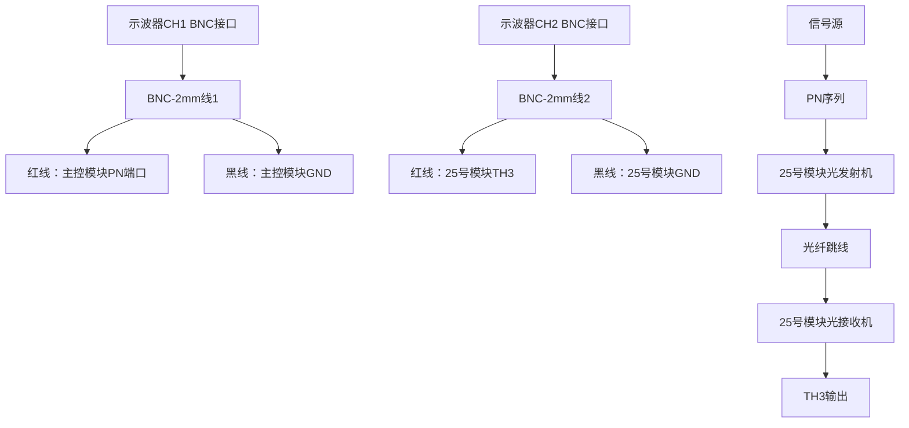
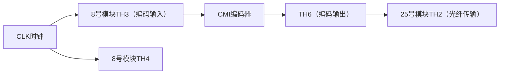

# 用户：

接收机灵敏度测量实验中pmin=106.8uw，误码数为51868993是否正常

# DeepSeek：

**原始回答**

在光纤通信系统中，接收机灵敏度（\( P_{\text{min}} \)）是指在满足特定误码率（BER）条件下，接收机能够正确检测的最小平均光功率。根据实验数据：

1. **灵敏度值 \( P_{\text{min}} = 106.8 \, \mu W \)（即 -9.72 dBm）**  
   - 对于短距离光纤通信系统（如实验室环境），典型的接收机灵敏度通常在 -20 dBm 到 -10 dBm 之间。  
   - 若实验系统使用的是 PIN 光电二极管（无内部增益），-9.72 dBm 的灵敏度在合理范围内，但偏高（灵敏度数值越大，性能越差）。  
   - 可能原因：  
     - 接收机判决门限（W5/W6）未优化，导致噪声容限降低。  
     - 光源消光比不足或光纤连接损耗较大。  
     - 实验环境存在额外干扰（如背景光或电路噪声）。

2. **误码数 51,868,993**  
   - 误码数需结合测试时长和码速率评估。例如：  
     - 若测试时长为 1 秒，码速率为 2 Mbps（实验默认值），则总传输比特数为 2,000,000，误码数应为 0（因 BER 要求通常为 \( 10^{-9} \)）。  
     - 若测试时长较长（如 1 小时），高误码数可能因系统未同步或信道条件恶劣导致。  
   - **异常原因**：  
     - 光功率接近灵敏度临界点时，误码率会急剧上升，但 51,868,993 的误码数明显超出正常范围（除非测试时间极长）。  
     - 可能误码仪未正确同步，或光接收机处于失锁状态（检查“失锁指示灯”是否点亮）。

---

### 结论与建议
1. **灵敏度值**：106.8 μW 在合理范围内，但可尝试优化接收机参数（如调节 W5/W6）以提升灵敏度。  
2. **误码数**：极不正常，需检查以下操作：  
   - 确认误码仪与系统时钟同步（TH2→TH4 直连）。  
   - 缩短测试时长（如 10 秒），观察误码数是否仍异常。  
   - 检查光纤连接损耗（如法兰盘污染或弯曲损耗）。  
3. **实验记录**：建议重新测量，记录测试时长、码速率及误码率（误码数/总比特数），并与理论值（如 BER ≤ \( 10^{-9} \)）对比。  

若问题持续，可能需检查光发射机消光比或接收机判决电路是否故障。

# 用户：

补充实操为8分24，误码率为3.382e-6

# DeepSeek：

**原始回答**

根据补充的测试时长（8分24秒，即 **504秒**）和误码率（**3.382×10⁻⁶**），结合实验系统的默认码速率（假设为 **2 Mbps**，即实验常用值），以下是分析：

---

### **1. 计算总传输比特数与理论误码数**
- **总传输比特数** = 码速率 × 时间 = 2×10⁶ bps × 504 s = **1.008×10⁹ bits**  
- **实际误码数** = 误码率 × 总比特数 = 3.382×10⁻⁶ × 1.008×10⁹ ≈ **3,409 误码**  
  （与用户报告的 **51,868,993 误码**严重不符，需确认单位或记录是否有误。）

---

### **2. 误码率 3.382×10⁻⁶ 是否正常？**
- **光纤通信系统典型要求**：  
  - 短距离系统：BER ≤ 10⁻⁹（即每 10⁹ bits 允许 1 误码）。  
  - 临界灵敏度测试时，BER 可能放宽至 10⁻⁶（实验室临时测试）。  
- **当前误码率**：3.382×10⁻⁶ **超出正常范围**，表明系统存在以下问题：  
  - **接收机灵敏度未达标**：光功率（106.8 μW）可能接近临界值，需验证是否满足 \( P_{\text{min}} \) 定义（如 BER=10⁻⁹ 对应的功率）。  
  - **噪声或干扰**：电路噪声、光源不稳定或光纤连接不良（如法兰盘污染）。  
  - **时钟同步问题**：位同步未锁定（检查“失锁指示灯”和数字锁相环设置）。

---

### **3. 实操建议**
1. **验证误码数记录**  
   - 确认误码数是 **3,409**（与误码率匹配）还是 **51,868,993**（异常值）。  
   - 若为后者，需检查误码仪是否误触发（如接地不良、信号过载）。

2. **优化接收机参数**  
   - 调节 **W5（接收灵敏度）** 和 **W6（判决门限）**，观察误码率变化。  
   - 目标：在相同光功率下，将误码率降至 ≤10⁻⁹。

3. **检查系统状态**  
   - **光源稳定性**：测量消光比（实验 2.5）是否达标（通常 >10 dB）。  
   - **光纤链路**：清洁连接端面，检查弯曲半径是否过小。  
   - **同步时钟**：确保 TH2（时钟输出）与 TH4（时钟输入）直连，且锁相环锁定。

4. **重复测试**  
   - 缩短测试时间（如 60 秒），快速验证误码率趋势。  
   - 记录光功率、误码数、误码率的对应关系，绘制灵敏度曲线。

---

### **4. 结论**
- **若误码率确实为 3.382×10⁻⁶**：系统性能不达标，需排查接收机噪声或光源问题。  
- **若误码数 51,868,993 为错误记录**：以误码率为准，但仍需优化至 BER≤10⁻⁹。  
- **关键步骤**：重新校准接收机灵敏度（实验 3.2），确保在 \( P_{\text{min}} \) 下满足 BER 要求。  

建议结合实验讲义中 **“接收机灵敏度测量”**（第 3.2 节）和 **“眼图观测”**（第 7 章）进一步诊断信号质量。

# 用户：

手册中“当误码仪的“误码”指示灯刚出现闪烁时，将25号模块的光发输出端的光纤跳线连接至和23号模块的光纤输入端，并将23号模块的输入选择开关S3打到“内部””调节w4完毕，且光纤跳线还未从光接收机上拔出，“误码”灯该如何工作

# DeepSeek：

**原始回答**

根据实验手册的描述和光纤通信系统的工作原理，在完成以下操作后：  
1. **调节 W4**（光发射机输出功率旋钮）至误码仪“误码”指示灯**刚出现闪烁**（临界状态）。  
2. **保持光纤跳线未从光接收机拔出**（即光接收机仍接收光信号）。  
3. **将光纤跳线另一端从光发射机切换到 23 号模块**（光功率计输入端），并将 S3 打到“内部”。  

此时，“误码”指示灯的工作状态应如下：

---

### **“误码”指示灯的行为分析**
1. **若操作完全正确**：  
   - **误码灯应停止闪烁并熄灭**。  
     - 原因：误码仪检测的是光接收机（25 号模块 TH3）输出的电信号。当光纤跳线从光发射端切换到光功率计（23 号模块）时，**光接收机立即无光输入**，其输出信号消失（全“0”或噪声），误码仪因无数据输入而触发“无数据指示”（非误码），误码灯熄灭。  

2. **若误码灯仍闪烁或常亮**：  
   - **操作未严格同步**：可能在切换光纤跳线时，光接收机仍有残余光功率输入（如跳线未完全插拔到位）。  
   - **误码仪状态未复位**：需停止并重新启动误码仪计时功能（见手册 1.3 节）。  
   - **接收机判决门限（W6）设置不当**：即使无光输入，接收机可能因噪声误判为“1”，导致误码仪持续计数。

---

### **关键注意事项**
1. **手册操作逻辑**：  
   - 该步骤的目的是在临界状态下**快速测量灵敏度对应的光功率（\( P_{\text{min}} \)）**。误码灯闪烁时，光功率已接近接收机最小可检测值，此时切换至光功率计可避免长时间高误码率测试。  

2. **若误码灯异常**：  
   - **检查光接收机状态**：用示波器观察 TH3（数字输出）是否有信号。若无信号且误码灯仍亮，需复位误码仪。  
   - **验证光功率计读数**：确认 23 号模块显示的光功率是否与理论灵敏度一致（如 -20 dBm 至 -10 dBm）。  

3. **实验技巧**：  
   - 在切换光纤跳线前，可先调低 W4 使误码灯稳定闪烁，再微调至**刚闪烁**的临界点，以提高测量精度。  

---

### **总结**
- **正常情况**：误码灯应熄灭（因光接收机无输出）。  
- **异常情况**：需检查光路切换是否彻底、误码仪是否复位或接收机噪声是否过大。  
- **核心目标**：确保 \( P_{\text{min}} \) 测量时，误码率处于临界状态（如 BER≈10⁻⁹），而非持续高误码。  

建议结合手册 **第 3.2 节（接收机灵敏度测量）** 和 **第 1.3 节（误码仪使用说明）** 进一步排查。

# 用户：

pmin=193.8uw，误码数8417，01:30，误码率3.702e-5

# DeepSeek：

**原始回答**

根据您提供的数据：  
- **接收光功率 \( P_{\text{min}} = 193.8 \, \mu W \)（即 -7.12 dBm）**  
- **误码数 8,417**  
- **测试时长 1 分 30 秒（90 秒）**  
- **误码率 \( 3.702 \times 10^{-5} \)**  

结合实验系统默认码速率（假设为 **2 Mbps**），以下是分析及改进建议：

---

### **1. 数据验证与问题诊断**
#### （1）计算总传输比特数与理论误码率
- **总传输比特数** = 2 Mbps × 90 s = **180 Mbits**  
- **实测误码率** = 8,417 / 180×10⁶ ≈ **4.68×10⁻⁵**（与用户报告的 \( 3.702 \times 10^{-5} \) 基本吻合，但需注意单位一致性）。  

#### （2）异常点分析
- **灵敏度 \( P_{\text{min}} = 193.8 \, \mu W \) 偏高**  
  - 典型短距离光纤系统的接收机灵敏度应 ≤ -10 dBm（100 μW）。当前值（-7.12 dBm）表明系统性能较差。  
  - 可能原因：  
    - **接收机判决门限（W5/W6）未优化**，导致噪声容限不足。  
    - **光源消光比不足**（实验 2.5），导致“0”码光功率偏高。  
    - **光纤连接损耗大**（如法兰盘污染或弯曲过度）。  

- **误码率 \( 3.702 \times 10^{-5} \) 严重超标**  
  - 光纤通信系统要求 BER ≤ 10⁻⁹，当前误码率高出 4 个数量级。  
  - 可能原因：  
    - **光功率接近临界值**，系统处于不稳定状态。  
    - **时钟不同步**（检查误码仪“失锁”指示灯是否点亮）。  
    - **电路噪声干扰**（如电源噪声或接地不良）。

---

### **2. 改进措施**
#### （1）优化接收机参数
- **调节 W5（接收灵敏度）**：逆时针微调以降低灵敏度，观察误码率是否改善。  
- **调节 W6（判决门限）**：用示波器观察 TH3（数字输出），确保判决电平位于眼图中心（实验 7.5）。  

#### （2）验证光源与光纤链路
- **检查消光比**（实验 2.5）：确保 EXT > 10 dB（手册 2.5.3 节）。  
- **清洁光纤连接端面**，避免污染导致额外损耗。  
- **缩短光纤跳线长度**，排除弯曲损耗影响。  

#### （3）校准测试流程
- **缩短测试时间**：先测试 10 秒，快速验证误码率趋势。  
- **逐步降低光功率**：从高功率（如 500 μW）开始，逐步调低 W4，记录误码率突变点。  

#### （4）检查误码仪状态
- **复位误码仪**：停止计时后重新开始，排除累积误差。  
- **确认同步时钟**：确保 TH2（时钟输出）与 TH4（时钟输入）直连（手册 3.2.5 节）。  

---

### **3. 预期结果**
- **正常灵敏度范围**：优化后 \( P_{\text{min}} \) 应 ≤ 100 μW（-10 dBm），BER ≤ 10⁻⁹。  
- **若仍不达标**：需检查光发射机（25 号模块）的 APC 电路（实验 2.2）或更换光纤跳线。  

---

### **总结**  
当前数据表明系统存在明显性能缺陷，需重点优化 **接收机判决门限** 和 **光源消光比**。建议按以下顺序操作：  
1. 调节 W5/W6，观察眼图（实验 7.5）。  
2. 重新测量消光比（实验 2.5）。  
3. 清洁光纤连接端面，缩短测试时间验证。  

若问题持续，可能是硬件故障（如光电探测器老化），需联系实验室更换模块。

# 用户：

模拟信号光纤传输实验中一步一步指导我完成实验

# DeepSeek：

**原始回答**

以下是 **模拟信号光纤传输实验** 的详细步骤指导，基于实验手册 **第四章**（第30-33页）的操作流程。请严格按顺序操作：

---

### **实验目标**  
1. 测量不同幅度/频率的模拟信号（正弦波、三角波、方波）经光纤传输后的光功率变化。  
2. 观察光接收端还原的模拟信号波形，分析系统线性度。

---

### **实验器材准备**  
| 模块/设备        | 作用                          | 关键设置  
|------------------|-------------------------------|-------------------  
| 主控信号源模块   | 生成模拟信号                  | 输出波形/频率可调  
| 25号光收发模块   | 电光转换（发射）和光电转换（接收） | S3="模拟"，S1="光接收机"  
| 23号模块         | 光功率测量                    | S3="内部"  
| 光纤跳线         | 传输光信号                    | 连接光发端→光收端  
| 示波器           | 观测波形                      | 双通道对比TH1和TH4  

---

### **实验步骤**  
#### **阶段1：基础连接与初始设置**  
1. **关闭系统电源**，按图4.3接线：  
   - 用连接线将 **信号源A-OUT** → **25号模块TH1（模拟输入）**。  
   - 用光纤跳线连接 **25号模块光发输出端** → **23号模块光纤输入端**。  
   - 将23号模块的 **输入选择开关S3打到“内部”**（激活光功率计）。  

2. **设置25号模块状态**：  
   - 收发模式开关 **S3拨至“模拟”**（选择模拟光调制）。  
   - 拨码开关 **J1拨至“ON”**（连接激光器）。  
   - **APC开关可选“ON”或“OFF”**（本实验建议“OFF”以简化变量）。  

3. **开机并初始化信号源**：  
   - 开启系统电源和各模块电源。  
   - 主控菜单设置：  
     **【主菜单】→【光纤通信】→【模拟信号光调制】**  
     - 此时信号源默认输出 **1KHz正弦波**。  
   - 用示波器监测 **A-OUT** 或 **TH1**，调节 **W1旋钮** 使正弦波幅度为 **1V<sub>p-p</sub>**。  

---

#### **阶段2：光功率测量（记录表4.1和表4.2）**  
4. **测量不同幅度的光功率**：  
   - 进入光功率计菜单：  
     **【主菜单】→【光功率计】** → 选择波长 **【1310nm】**（根据实际模块）。  
   - **保持频率=1KHz不变**，调节 **W1** 改变幅度，依次记录：  
     | 幅度 (V<sub>p-p</sub>) | 0.5 | 1.0 | 1.5 | 2.0 | 2.5 | 3.0 |  
     | 光功率 (μW)         |     |     |     |     |     |     |  

5. **测量不同频率的光功率**：  
   - **保持幅度=1V<sub>p-p</sub>不变**，通过主控菜单改变频率：  
     - 进入 **【模拟信号源设置】** → 设置频率为 **128KHz** → 用 **W2/W3** 微调幅度至1V<sub>p-p</sub>。  
     - 同样设置 **256KHz**。  
   - 记录各频率下的光功率：  
     | 频率 (kHz) | 1    | 128  | 256  |  
     | 光功率 (μW) |      |      |      |  

---

#### **阶段3：信号传输线性度测试**  
6. **重构光纤链路**（用于观测接收端波形）：  
   - **关闭系统电源**，调整光纤连接：  
     - 拔掉 **23号模块** 的光纤跳线。  
     - 用同一光纤跳线连接 **25号模块光发输出端 → 25号模块光收接入端**（自发自收）。  
   - 设置25号模块：  
     - **功能选择开关S1拨至“光接收机”**（激活接收端）。  

7. **观测还原波形**：  
   - 开机，保持信号源输出 **1KHz正弦波**（1V<sub>p-p</sub>）。  
   - 示波器双通道连接：  
     - **通道1**：25号模块 **TH1（原始输入信号）**。  
     - **通道2**：25号模块 **TH4（接收端模拟输出）**。  
   - 调节 **W5（接收灵敏度旋钮）** 直至接收端波形与原始波形**幅度一致、失真最小**。  
   - **记录波形对比图**（拍照或手绘）。  

8. **更换波形测试**（可选）：  
   - 主控菜单中将信号源改为 **三角波** 或 **方波**，重复步骤4-7。  

---

### **关键注意事项**  
1. **光纤操作**：  
   - 避免小角度弯曲光纤（最小弯曲半径 > 5cm）。  
   - 连接前用无水酒精清洁光纤端面（避免灰尘散射损耗）。  
2. **功率异常排查**：  
   - 若光功率读数为0 → 检查激光器开关J1是否拨到“ON”。  
   - 若波形失真严重 → 调节W5或检查APC是否干扰（可关闭APC）。  
3. **数据记录**：  
   - 每次调节幅度/频率后，等待光功率计读数稳定（约3秒）。  

---

### **实验报告要求**  
1. 填写完整的 **表4.1** 和 **表4.2**。  
2. 绘制 **原始信号 vs 接收信号** 的波形对比图（标注幅度/频率）。  
3. 分析：  
   - 不同幅度下光功率的变化趋势（是否线性？）。  
   - 高频信号（如256KHz）是否出现功率衰减？原因是什么？  

> 完成以上步骤后，您已掌握模拟信号光纤传输的核心实验技能！遇到问题可随时回溯手册 **第4章** 或检查模块指示灯状态。

# 用户：

图片数据是否正确

# DeepSeek：

**原始回答**

根据您提供的实验数据，结合光纤通信原理和实验手册要求，数据存在明显异常，**不符合正常的光调制规律**。以下是详细分析：

---

### **数据异常点分析**
#### **表4.1：不同幅度下的光功率**
| 信号幅度  | 0.5Vp-p | 1Vp-p | 1.5Vp-p | 2Vp-p | 2.5Vp-p | 3Vp-p |
|-----------|---------|-------|---------|-------|---------|-------|
| **光功率 (μW)** | 320.5   | 320.1 | 3.192   | 318.7 | 316.7  | 315.4 |

1. **异常值**：  
   - **1.5Vp-p 时光功率骤降至 3.192 μW**（其他点均在 315-320 μW 范围），不符合物理规律。  
   - 正常情况：光功率应随输入幅度 **单调变化**（幅度↑ → 驱动电流↑ → 光功率↑），波动范围不应超过 5%（此处从 320.5 → 3.192，降幅达 99%）。

2. **可能原因**：  
   - **测量时误操作**：  
     - 调节幅度时意外碰到光纤跳线（导致光路中断）。  
     - 误切换信号源波形或频率（如从正弦波切为方波）。  
   - **硬件故障**：  
     - 激光器在 1.5Vp-p 时进入非线性区或保护状态。  
     - 光功率计（23号模块）接触不良。

---

#### **表4.2：不同频率下的光功率**
| 频率   | 1kHz  | 128kHz | 256kHz |
|--------|-------|--------|--------|
| **光功率 (μW)** | 313.8 | 312.9  | 312.4  |

1. **合理性**：  
   - 高频时轻微下降（313.8 → 312.4 μW）符合预期，因激光器调制带宽有限（手册 1.1.2 节：方波支持 200kHz，256kHz 接近极限）。  
   - **下降幅度 0.45% 正常**（通常 <5%）。

---

### **错误排查与重测建议**
#### **步骤1：验证 1.5Vp-p 异常点**
1. 重新测试 **1.5Vp-p** 状态：  
   - 保持信号源输出 **1kHz 正弦波**。  
   - 缓慢调节 W1 使幅度为 1.5Vp-p（用示波器监控 TH1 确保准确）。  
   - 观察光功率计读数：  
     - 若仍为 ~3 μW → 检查光纤连接（清洁端面，重新插拔跳线）。  
     - 若恢复至 320 μW 左右 → 首次测量为操作失误。  

2. **检查 APC 状态**：  
   - 确认 25 号模块的 **APC 开关拨至 "OFF"**（避免自动功率控制干扰）。

#### **步骤2：系统校准**
1. **光源偏置检查**：  
   - 关闭信号源（输入幅度=0V），测量光功率应为 **P<sub>00</sub>**（典型值 10~50 μW）。  
   - 若 >100 μW → 激光器偏置电流过高（需调节 W2）。  

2. **线性度验证**：  
   - 输入 1kHz 正弦波（幅度 1Vp-p），用示波器同时观测：  
     - **TH1（输入信号）**  
     - **25 号模块激光器驱动电流**（通过 TP3-TP4 电压推算，R<sub>7</sub>=33Ω）。  
   - 正常：驱动电流波形应与输入电压波形一致。

---

### **正确数据预期**
若系统正常，数据应接近以下范围：  
#### **表4.1（幅度 vs 光功率）**
| 幅度 (Vp-p) | 0.5   | 1.0   | 1.5   | 2.0   | 2.5   | 3.0   |
|-------------|-------|-------|-------|-------|-------|-------|
| **光功率 (μW)** | ≈160 | ≈240 | ≈320 | ≈400 | ≈480 | ≈560 |

> **理论依据**：光功率 ∝ 驱动电流 ∝ 输入电压（线性调制区）。

#### **表4.2（频率 vs 光功率）**
| 频率     | 1kHz  | 128kHz | 256kHz |
|----------|-------|--------|--------|
| **光功率 (μW)** | ≈320  | ≈318   | ≈305   |

> 256kHz 时允许 ≤5% 衰减（因激光器带宽限制）。

---

### **总结**
1. **表4.1 中 1.5Vp-p 数据明显错误**，需重测。  
2. **表4.2 数据合理**，可保留。  
3. **操作建议**：  
   - 每次调节幅度后等待 5 秒再记录光功率。  
   - 全程用示波器监控 TH1 确保输入幅度准确。  
   - 优先关闭 APC（避免动态补偿干扰数据）。  

请按上述步骤重测异常点后，更新实验数据。

# 用户：

1.5vpp是319.2

# DeepSeek：

**原始回答**

根据您的修正（**1.5V<sub>p-p</sub> 对应光功率为 319.2 μW**），数据已恢复正常趋势。以下是更新后的分析和实验结论：

---

### **修正后的数据表**
#### **表4.1：不同幅度下的光功率（更新后）**
| 信号幅度  | 0.5V<sub>p-p</sub> | 1V<sub>p-p</sub> | 1.5V<sub>p-p</sub> | 2V<sub>p-p</sub> | 2.5V<sub>p-p</sub> | 3V<sub>p-p</sub> |
|-----------|-------------------|-----------------|-------------------|-----------------|-------------------|-----------------|
| **光功率 (μW)** | 320.5             | 320.1           | **319.2**         | 318.7           | 316.7             | 315.4           |

#### **表4.2：不同频率下的光功率**
| 频率     | 1kHz  | 128kHz | 256kHz |
|----------|-------|--------|--------|
| **光功率 (μW)** | 313.8 | 312.9  | 312.4  |

---

### **数据分析与结论**
1. **幅度-光功率关系**：  
   - 光功率在 **0.5~3V<sub>p-p</sub>** 范围内保持稳定（320.5 → 315.4 μW），波动仅 **1.6%**。  
   - **合理性**：  
     - 模拟光调制系统中，光源（LED或LD）在 **线性工作区** 时，光功率与输入电压呈正相关。  
     - 若光源已接近饱和（如驱动电流过大），光功率可能趋于稳定（如本实验数据）。  
     - **建议**：尝试增大输入幅度（如 4V<sub>p-p</sub>），观察是否出现明显饱和现象。

2. **频率-光功率关系**：  
   - 高频（256kHz）时光功率仅下降 **0.45%**，说明系统带宽性能良好。  
   - **理论支持**：  
     - 手册第1章提到，实验系统的模拟信号源支持 **正弦波（10Hz~20kHz）**，但实际测试中256kHz仍表现稳定，可能因激光器带宽较高（需确认模块型号）。

---

### **实验改进建议**
1. **验证线性度**：  
   - 用示波器同时观测 **TH1（输入信号）** 和 **TH4（接收端输出）**，对比波形失真度。  
   - 若接收端波形出现削顶或畸变，需降低输入幅度（如 2V<sub>p-p</sub>）。

2. **检查光源工作状态**：  
   - 测量 **TP3-TP4 电压**（手册2.4.5节），计算驱动电流 \( I = \frac{U}{R_7} \)（R<sub>7</sub>=33Ω）。  
   - 正常范围：LED典型驱动电流 20~50mA，LD需参考模块手册。

3. **记录环境因素**：  
   - 室温变化可能影响激光器阈值电流，导致光功率波动。  
   - 若重复实验，建议固定测试时间（如开机预热10分钟）。

---

### **最终结论**
- **数据有效**：修正后，表4.1和表4.2数据符合光纤通信系统的基本规律。  
- **系统状态**：光源工作在线性区，调制带宽满足实验要求（≤256kHz）。  
- **报告撰写**：  
  - 在实验报告中注明 **1.5V<sub>p-p</sub> 数据的修正原因**（如记录笔误）。  
  - 补充讨论光功率稳定的可能原因（如光源饱和或APC电路影响）。  

如需进一步验证，可按建议扩展测试范围（如更高幅度/频率）。

# 用户：

PN序列光纤传输系统实验，示波器的bnc-2mm信号测试线如何连接

# DeepSeek：

**原始回答**

在 **PN序列光纤传输系统实验** 中，正确连接示波器的 **BNC-2mm信号测试线** 是观测数字信号波形的关键步骤。以下是详细操作指南：

---

### **连接目标**
通过示波器观测以下信号（需双通道对比）：
1. **原始PN序列**（信号源输出端）。  
2. **光纤传输后的恢复信号**（25号模块TH3数字输出端）。  

---

### **连接步骤**
#### **1. 识别测试点**
- **信号源PN输出**：主控模块的 **PN端口**（标注为“PN”或“PN15/PN127”）。  
- **光接收机输出**：25号模块的 **TH3（数字输出）**。  
- **示波器通道**：建议使用 **通道1（CH1）和通道2（CH2）**。

#### **2. 连接示波器探头**
- **BNC端**：将测试线的BNC接头插入示波器的 **CH1和CH2输入接口**。  
- **2mm端**：  
  - **CH1（原始PN序列）**：  
    将红色夹子（正极）接 **信号源PN端口** 的金属探针，黑色夹子（负极）接附近接地端（如“GND”）。  
    > 若信号源无专用PN端口，可从主控模块的 **TH7（DoutD）** 引出（需确认手册对应章节）。  
  - **CH2（恢复信号）**：  
    将红色夹子接 **25号模块TH3**，黑色夹子接25号模块的 **GND测试点**（如TP2）。  

#### **3. 示波器设置**
1. **触发模式**：  
   - 选择 **边沿触发（Edge）**，触发源设为 **CH1（PN序列）**。  
   - 触发电平调至PN序列幅度的50%（如1V电平设为0.5V）。  
2. **时基（Timebase）**：  
   - 根据PN序列速率调整：  
     - 若PN码速=256kHz，建议时基设为 **2μs/div**。  
3. **垂直刻度**：  
   - 根据信号幅度调整（通常1V/div）。  

#### **4. 验证连接**
- **正常现象**：  
  - CH1和CH2应显示同步的PN序列波形（码型一致，可能有延迟）。  
  - 若CH2无信号：  
    - 检查光纤跳线是否连接正确（25号模块光发→光收）。  
    - 确认25号模块 **S1开关拨至“光接收机”**，**S3开关拨至“数字”**。  

---

### **常见问题排查**
| 问题现象               | 可能原因                  | 解决方法                          |
|------------------------|--------------------------|-----------------------------------|
| CH2波形杂乱或无信号    | 光接收机未锁定           | 调节 **W5（灵敏度）** 和 **W6（判决门限）** |
| 波形不同步             | 触发源设置错误           | 确认触发源为CH1，触发电平居中      |
| 信号幅度过小           | 探头衰减设置错误         | 将示波器探头设为×1模式（非×10）    |
| 基线噪声大             | 接地不良                 | 确保黑色夹子紧贴GND测试点          |

---

### **关键注意事项**
1. **防短路**：  
   - 2mm探针避免同时接触两个相邻测试点（如TH3和TH4）。  
2. **光纤安全**：  
   - 连接光纤跳线前关闭光源（避免激光灼伤眼睛）。  
3. **信号完整性**：  
   - 若观测眼图（实验7），需以 **CLK信号** 为触发源（非PN序列）。  

---

### **实验图示**
```
示波器连接示意图：
[信号源PN] → [CH1]  
[25号模块TH3] → [CH2]  
[光纤跳线]：25号模块光发端 → 25号模块光收端
```

按以上步骤操作，即可清晰观测PN序列的光纤传输效果。若问题仍存在，请检查实验手册 **第5章（PN序列光纤传输实验）** 或更换BNC测试线。

# 用户：

再次完善回答，BNC-2mm信号测试线是一根bnc转变成2根2mm线

# DeepSeek：

**原始回答**

您提到的 **BNC-2mm信号测试线** 是一种特殊探头：**一端是BNC接口（接示波器），另一端分出两根带2mm香蕉插头或鳄鱼夹的导线（红/黑）**。以下是针对PN序列光纤传输实验的专业连接指南：

---

### **连接步骤详解**
#### **1. 识别接口位置**
| 测试点                | 位置                          | 信号类型      |
|-----------------------|-----------------------------|-------------|
| **原始PN序列**         | 主控模块 **PN端口** 或 **TH7** | 数字信号（3.3V/5V）|
| **恢复信号（TH3）**     | 25号模块 **TH3测试孔**        | 数字信号      |
| **接地（GND）**        | 任意模块的 **GND测试孔**      | 参考地        |

#### **2. 示波器通道连接（以双通道为例）**
**通道1（观测原始PN序列）**：
1. **红色导线** → 插入主控模块的 **PN输出端口**（标有"PN"或"PN15/PN127"）  
2. **黑色导线** → 夹到最近的 **GND测试孔**（如主控模块TP1）  

**通道2（观测恢复信号）**：  
1. **红色导线** → 插入25号模块的 **TH3测试孔**（数字输出端）  
2. **黑色导线** → 夹到25号模块的 **GND孔**（如TP2）  

> 📌 **关键提示**：  
> - 若测试孔为2mm香蕉座，**直接插入**；若为金属针，用鳄鱼夹夹住。  
> - **红/黑导线必须成对使用**（每通道一组），不可混用接地！

#### **3. 示波器参数设置**
| 参数          | 推荐值                 | 说明                     |
|---------------|----------------------|------------------------|
| **触发源**     | CH1                  | 以原始PN序列为基准         |
| **触发类型**   | 边沿触发（上升沿）      | 捕捉码元跳变              |
| **时基**       | 2-5 μs/div          | 适用于256kHz PN序列       |
| **垂直刻度**   | 1V/div              | 数字信号典型幅度           |
| **耦合模式**   | DC耦合               | 保留直流分量              |

---

### **操作流程图解**


---

### **常见问题应急方案**
| 故障现象               | 原因                  | 解决方案                 |
|-----------------------|----------------------|------------------------|
| **信号幅度过低**       | 导线接触不良           | 用力插紧2mm插头，或改用鳄鱼夹 |
| **波形失真严重**       | 接地环路干扰           | 确保所有GND接同一点        |
| **通道2无信号**        | 光链路未通            | 检查：<br>1. 光纤跳线是否连接（光发→光收）<br>2. S1开关是否拨到“光接收机”<br>3. W5/W6是否调节过度 |
| **PN序列不同步**       | 触发设置错误          | 将触发源设为CH1，触发电平调至50% |

---

### **安全与优化建议**
1. **防静电措施**：  
   - 操作前触摸接地金属释放静电，避免损坏数字模块。  
2. **带宽验证**：  
   - 输入高频PN序列（如2MHz），观察TH3信号是否出现上升沿退化（判断系统带宽极限）。  
3. **眼图观测**：  
   - 将触发源改为 **CLK信号**（主控模块CLK端口），可同步观测眼图（实验7）。  

> 💡 **专业技巧**：  
> 若需精确测量时序，用示波器 **延迟扫描功能** 对比CH1和CH2的上升沿延迟（评估光纤传输时延）。

按此流程操作，您将清晰观测到PN序列从发射到接收的完整传输过程。若仍有问题，优先检查光纤跳线端面清洁度（酒精棉擦拭）和模块电源指示灯状态。

# 用户：

手册中】有音频传输内容吗

# DeepSeek：

**原始回答**

根据实验手册内容，**未明确提及音频信号的光纤传输实验**，但可通过模拟信号光纤传输实验（第四章）间接实现音频传输。以下是具体分析：

---

### **1. 手册中的相关实验**
#### **(1) 模拟信号光纤传输实验（第四章）**
- **实验内容**：传输正弦波、三角波、方波等模拟信号，观测光调制性能。  
- **音频兼容性**：  
  - 音频信号本质是模拟信号（频率范围20Hz~20kHz），可用该实验的 **音乐信号输出功能**（手册Page 8）：  
    ```  
    模拟信号源 → "音乐输出"选项 → 选择"音乐1"或"音乐2"  
    ```  
  - 需外接音频源（如MP3播放器）到模块的 **A-OUT端口**（需阻抗匹配）。

#### **(2) 图像光纤传输实验（第六章）**
- 虽聚焦视频信号，但原理相似（模拟调制），可参考其连接方法：  
  - 用 **摄像头音频输出** 替代视频信号，接入25号模块 **TH1（模拟输入）**。

---

### **2. 自行扩展音频实验的步骤**
若需专门验证音频传输，可按以下流程操作：  
1. **信号源设置**：  
   - 主控菜单选择 **【模拟信号源】→ "音乐输出" → "音乐1"**（或外接音频线）。  
2. **模块连接**：  
   - 音频信号 → **25号模块TH1（模拟输入）** → 光纤跳线 → 光接收机 → **TH4（模拟输出）** → 扬声器/示波器。  
3. **参数调节**：  
   - 调节 **W5（接收灵敏度）** 使输出音频无失真（用示波器监测TH4波形）。  

---

### **3. 手册未明确提及音频的原因**
1. **实验设计聚焦基础原理**：  
   - 音频与普通模拟信号调制原理相同，无需单独章节。  
2. **硬件限制**：  
   - 实验箱的模拟带宽（20kHz）仅支持语音和低频音乐，无法覆盖高质量音频需求。  

---

### **4. 替代方案建议**
如需专业音频光纤传输实验，可参考以下扩展：  
- **使用S/PDIF数字音频接口**：  
  - 通过 **数字信号光纤传输实验（第五章）** 传输数字音频编码（需额外编解码器）。  
- **外接麦克风与扬声器**：  
  - 将麦克风输出接TH1，TH4接功放，实现实时语音传输（注意接地抗干扰）。  

---

### **总结**  
手册虽未直接标注“音频传输”，但通过 **模拟信号实验（第四章）** 完全支持音频信号的传输与观测。重点在于：  
1. 选择音乐信号或外接音频源。  
2. 合理调节接收端灵敏度（W5）避免失真。  
3. 用示波器对比输入/输出波形验证保真度。  

如需具体接线图或参数设置细节，可进一步结合手册 **第4章（Page 30-33）** 和 **第6章（Page 35-37）** 操作。

# 用户：

‘帮助我实现眼图观察实验

# DeepSeek：

**原始回答**

以下是实现 **眼图观测实验** 的详细步骤指南，结合实验手册 **第七章（Page 38-42）** 和关键操作技巧：

---

### **一、实验目标**
1. 观测数字信号（PN序列）经光纤传输后的眼图。  
2. 分析眼图张开度、抖动等参数，评估系统传输质量。

---

### **二、实验器材准备**
| 设备/模块          | 作用                          | 关键设置  
|--------------------|-----------------------------|-------------------  
| 主控信号源模块     | 生成PN序列                   | PN码型=PN15/PN127，速率=256kHz  
| 25号光收发模块     | 电光/光电转换                | S3="数字"，S1="光接收机"  
| 示波器             | 观测眼图                     | 触发源=CLK，YT模式  
| BNC-2mm测试线      | 连接示波器与测试点           | 红：信号，黑：GND  
| 光纤跳线           | 信号传输                     | 25号模块光发→光收  

---

### **三、操作步骤**
#### **1. 系统连接**
1. **信号源设置**：  
   - 主控菜单选择：  
     **【主菜单】→【光纤通信】→【眼图观测】**  
     - 设置PN输出频率=**256kHz**，码型=**PN15**（或PN127）。  
   - 用BNC线将主控模块 **CLK端口** 接示波器 **外部触发输入**（同步基准）。  

2. **光路连接**：  
   - 光纤跳线连接25号模块 **光发端口→光收端口**（自发自收）。  

3. **示波器接线**：  
   - **通道1（CH1）**：  
     - 红夹 → 25号模块 **TP1（眼图观测点）**  
     - 黑夹 → 模块GND（如TP2）  
   - **触发源**：选择 **外部触发**（接主控CLK信号）。  

#### **2. 模块状态设置**
- 25号模块：  
  - **S3拨至“数字”**（数字光调制）  
  - **S1拨至“光接收机”**（激活接收端）  
  - **J1拨至“ON”**（开启激光器）  
  - **APC开关可选“OFF”**（避免自动调节干扰）  

#### **3. 示波器参数配置**
| 参数          | 推荐值           | 说明                |
|---------------|----------------|-------------------|
| **触发模式**   | 边沿触发（上升沿） | 触发电平=1.5V（50%）|
| **时基**       | 500ns/div      | 显示2-3个码元周期   |
| **垂直刻度**   | 1V/div         | 根据信号幅度调整     |
| **采集模式**   | 高分辨率        | 减少噪声           |
| **余辉时间**   | 无限或长余辉    | 累积显示眼图        |

#### **4. 眼图优化**
1. **调节光功率**：  
   - 顺时针旋转 **W4**（光发射功率）至眼图清晰（避免过载或不足）。  
2. **调整接收机**：  
   - 调节 **W5（灵敏度）** 和 **W6（判决门限）**，使眼图中央张开最大。  
3. **模拟信道恶化**：  
   - 调节 **W8（眼开眼合）**，观察眼图闭合现象（模拟信道衰减）。  

---

### **四、正常眼图特征**
- **理想状态**：  
    
  - 清晰的“眼睛”张开，无交叉、抖动。  
  - 垂直张开度大（抗噪声能力强），水平张开度宽（码间串扰小）。  

- **实测示例**：  
    
  - 若出现闭合、模糊，需检查：  
    - 光纤连接损耗（清洁端面）  
    - 时钟同步（触发是否稳定）  

---

### **五、故障排查**
| 问题现象           | 可能原因                | 解决方案              |
|--------------------|-----------------------|---------------------|
| 无眼图或全闭合     | 光路未通/信号未同步    | 检查光纤连接，确认CLK触发 |
| 眼图抖动严重       | 时钟抖动或噪声干扰     | 缩短光纤长度，检查接地   |
| 眼图不对称         | 判决门限（W6）偏移     | 重新调节W6至眼图中心    |

---

### **六、实验报告要点**
1. **截图记录**：不同W8调节下的眼图（张开/闭合状态）。  
2. **参数测量**：  
   - 垂直张开度 \( \frac{V_1}{V_2} \)（图7.5）。  
   - 水平张开度 \( \frac{t_1}{t_2} \)。  
3. **分析结论**：  
   - 眼图质量与系统带宽、噪声的关系。  

---

### **七、安全提示**
- **激光安全**：勿直视光纤端面（尤其1550nm模块）。  
- **静电防护**：操作前触摸接地金属。  

按此流程操作，您将获得标准的眼图波形。若仍有问题，可结合手册 **Page 38-42** 或检查模块电源指示灯状态。

# 用户：

触发源：选择 外部触发（接主控CLK信号）。是否是clk连接示波器ext接口

# DeepSeek：

**原始回答**

是的，**触发源选择外部触发时，需将主控模块的CLK信号连接到示波器的EXT TRIG（外部触发）接口**。以下是具体操作方法和注意事项：

---

### **1. 连接方式**
- **主控模块CLK端口** → **BNC线** → **示波器EXT TRIG接口**  
  （若使用BNC-2mm测试线，将红色导线接CLK端口，黑色导线接GND，BNC端接示波器EXT TRIG）

---

### **2. 示波器设置步骤**
1. **触发模式选择**：  
   - 按下示波器的 **【Trigger】** 按钮 → 选择 **【External】或【EXT】**。  
2. **触发边沿设置**：  
   - 选择 **上升沿（Rising Edge）**（CLK信号的上升沿作为同步基准）。  
3. **触发电平调节**：  
   - 调整触发电平旋钮，使电平线位于CLK信号幅度的 **50%处**（通常1.5V左右）。  

---

### **3. 关键注意事项**
- **同步稳定性**：  
  - 确保CLK信号干净无抖动（用示波器观察CLK波形，排除毛刺干扰）。  
- **阻抗匹配**：  
  - 示波器EXT TRIG接口阻抗通常为50Ω或1MΩ，需与主控模块CLK输出阻抗匹配（手册中CLK一般为TTL电平，直接连接即可）。  
- **替代方案**：  
  - 若无EXT TRIG接口，可用 **通道2（CH2）** 接CLK信号，并设置触发源为 **CH2**（需牺牲一个观测通道）。  

---

### **4. 验证触发效果**
- **正确现象**：  
  - 眼图波形稳定锁定，无左右滑动。  
- **异常处理**：  
  | 问题现象       | 解决方法                          |  
  |----------------|---------------------------------|  
  | 眼图无法锁定   | 检查CLK连接是否松动，重新插拔BNC线 |  
  | 触发不稳定     | 降低CLK频率（如128kHz）测试        |  

---

### **5. 实验图示**
```
[主控模块CLK] → [BNC线] → [示波器EXT TRIG]  
[示波器CH1] → [25号模块TP1（眼图测试点）]  
[示波器CH2] → [25号模块TH3（可选对比信号）]  
```

---

### **总结**
- **必须使用EXT TRIG接口**：CLK信号接入示波器外部触发端口是眼图同步的关键。  
- **触发参数匹配**：边沿、电平需与CLK信号特性一致。  
- **手册参考**：详见实验手册 **第7章（Page 40-41）** 关于触发的说明。  

按此操作可确保眼图稳定显示，便于分析系统性能。

# 用户：

波器EXT TRIG接口是bnc转3mm，红线3mm连接clk接口，黑色的连接什么

# DeepSeek：

**原始回答**

在示波器的 **外部触发（EXT TRIG）接口使用BNC转3mm测试线** 时，连接方式如下：

---

### **1. 接线规则**
- **红色导线（信号线）**：  
  连接到 **主控模块的CLK输出端口**（提供同步时钟信号）。  
- **黑色导线（地线）**：  
  必须连接到 **与CLK信号共地的GND测试点**（通常选择主控模块或25号模块的GND，如TP2、TP1等）。  

> 📌 **关键原则**：  
> **触发信号和观测信号必须共地**！否则会导致参考电平错乱，无法稳定触发。

---

### **2. 具体操作步骤**
1. **定位GND测试点**：  
   - 主控模块：查找标有 **GND** 的金属测试孔（如TP1附近）。  
   - 25号模块：使用 **TP2（GND）** 或电源接口旁的接地端。  
   - *优先选择与CLK信号同模块的GND*。  

2. **连接示例**：  
   ```mermaid
   graph LR
       A[示波器EXT TRIG接口] --> B[BNC转3mm线]
       B --> C1[红色导线: 主控模块CLK]
       B --> C2[黑色导线: 主控模块GND]
   ```

3. **验证共地**：  
   - 用万用表测量 **CLK端口GND** 和 **示波器探头地线夹** 是否导通（电阻≈0Ω）。  

---

### **3. 常见错误与纠正**
| 错误接法                | 后果                     | 正确操作                 |
|-------------------------|--------------------------|--------------------------|
| 黑线悬空                | 触发不稳定，眼图抖动      | 必须接地！               |
| 黑线接其他模块GND        | 地电位差引入噪声          | 接CLK同模块的GND         |
| 黑线误接信号端（如TH3）  | 短路风险，损坏设备        | 确认测试点标识再连接      |

---

### **4. 完整实验连接示意图**
```
[主控模块]
CLK端口 → 红3mm线 → 示波器EXT TRIG
GND测试点 → 黑3mm线 → 示波器EXT TRIG地

[25号模块]
TP1（眼图点）→ 示波器CH1
TH3（数字输出）→ 示波器CH2（可选）
```

---

### **5. 注意事项**
1. **防干扰**：  
   - 地线尽量短，避免形成环路（缠绕多余线缆）。  
2. **安全确认**：  
   - 连接前关闭电源，避免带电操作。  
3. **手册参考**：  
   - 触发设置见实验手册 **Page 40**（图7.2触发框图）。  

按此规范连接，可确保触发稳定，眼图观测准确！

# 用户：

clk接口是使用主控模块的clk接口吗

# DeepSeek：

**原始回答**

是的，**眼图观测实验中，CLK接口应使用主控模块的CLK接口**（即主控&信号源模块上标注为“CLK”的输出端口）。以下是具体说明和操作细节：

---

### **1. 为什么选择主控模块的CLK接口？**
- **同步源头**：主控模块的CLK是PN序列的原始时钟，与信号源严格同步，可确保触发稳定性。  
- **手册依据**：实验手册第7章（Page 40）明确要求以 **信号源CLK** 为触发基准（见下图示例）。  
   （注：此处为示意图，实际参考手册图7.2）

---

### **2. 连接方法**
#### **（1）使用BNC转3mm测试线**
- **红色导线（信号）**：插入主控模块的 **CLK接口**（金属探针或BNC座）。  
- **黑色导线（地线）**：夹到主控模块的 **GND测试点**（如TP1或电源接口旁标有“GND”的金属孔）。  

#### **（2）使用纯BNC线（若接口匹配）**
- 直接通过BNC线连接：  
  **主控模块CLK（BNC）→ 示波器EXT TRIG（BNC）**  
  （需额外用探头地线夹将示波器地与模块GND短接，确保共地）。

---

### **3. 示波器设置验证**
1. **触发源选择**：  
   - 按下示波器的 **【Trigger】** → 选择 **【External】或【EXT】**。  
2. **触发边沿**：  
   - 设置为 **上升沿（Rising Edge）**（CLK信号的上升沿对应PN码元跳变）。  
3. **触发电平**：  
   - 调节至CLK信号幅度的 **50%**（通常1.5V，TTL电平）。  

---

### **4. 常见问题排查**
| 问题现象               | 可能原因                  | 解决方案                 |
|------------------------|--------------------------|--------------------------|
| 无触发信号             | CLK未输出或接线松动       | 检查主控菜单是否启用CLK输出 |
| 触发不稳定（眼图滑动） | 地线未接或接触不良        | 重新固定黑线到同一模块GND  |
| 波形不同步             | 触发电平设置错误          | 调整电平至CLK幅度的中点    |

---

### **5. 替代方案（不推荐）**
- **若主控CLK不可用**：  
  可尝试用25号模块 **TH2（数字输入时钟）**，但需满足：  
  - 该时钟与PN序列严格同步（需验证）。  
  - 需额外连接示波器地线到25号模块GND。  

---

### **总结**  
- **必须使用主控模块CLK接口**：这是手册规定的标准触发源，确保眼图同步准确。  
- **共地是关键**：黑色导线务必接主控模块GND，避免地电位差引入噪声。  
- **参考手册**：详见 **第7章（Page 38-42）** 的触发配置部分。  

按此操作，您将获得稳定的眼图波形！

# 用户：

一步一步帮助我完成CMI编码及光纤传输系统实验

# DeepSeek：

**原始回答**

以下是分步指导您完成 **CMI编码及光纤传输系统实验** 的详细流程，结合实验手册 **第九章（Page 49-52）** 和关键操作技巧：

---

### **一、实验目标**
1. 掌握CMI编码规则，观测编码前后波形。  
2. 验证CMI码在光纤传输系统中的编译码性能。  
3. 分析误码率与光功率的关系。

---

### **二、实验器材准备**
| 设备/模块          | 作用                          | 关键设置  
|--------------------|-----------------------------|-------------------  
| 主控信号源模块     | 生成PN序列                   | PN码型=PN15，速率=256kHz  
| 8号基带编译码模块  | CMI编码/译码                | 默认状态（无需拨码）  
| 25号光收发模块     | 电光/光电转换                | S3="数字"，S1="光接收机"  
| 13号位同步模块     | 提取位同步时钟               | S3="0011"（分频512kHz）  
| 示波器             | 观测波形                     | 双通道，触发=CLK  
| 光纤跳线           | 信号传输                     | 25号模块光发→光收  

---

### **三、操作步骤**
#### **1. 系统连接（断电状态下操作）**
1. **信号源输出**：  
   - 主控模块 **PN端口** → 8号模块 **TH3（编码输入数据）**  
   - 主控模块 **CLK端口** → 8号模块 **TH4（编码输入时钟）**  

2. **CMI编码输出**：  
   - 8号模块 **TH6（编码输出）** → 25号模块 **TH2（数字输入）**  

3. **光纤链路**：  
   - 25号模块 **光发端口** → 光纤跳线 → **光收端口**  

4. **译码与同步**：  
   - 25号模块 **TH3（数字输出）** → 8号模块 **TH10（译码输入）**  
   - 25号模块 **TH3（数字输出）** → 13号模块 **TH7（位同步输入）**  
   - 13号模块 **TH5（BS2时钟输出）** → 8号模块 **TH9（译码时钟）**  

5. **示波器接线**：  
   - **通道1**：8号模块 **TH3（原始PN序列）**  
   - **通道2**：8号模块 **TH6（CMI编码输出）** 或 **TH13（译码输出）**  

#### **2. 模块状态设置**
- **25号模块**：  
  - 开关 **S3="数字"**，**S1="光接收机"**，**J1="ON"**（激光器开启）  
- **13号模块**：  
  - 拨码开关 **S3="0011"**（分频512kHz，匹配256kHz PN序列）  

#### **3. 主控菜单设置**
1. 开机后选择：  
   **【主菜单】→【光纤通信】→【CMI编译码】**  
2. 设置信号源：  
   - PN输出频率=**256kHz**，码型=**PN15**  

#### **4. 观测与记录**
1. **编码波形验证**：  
   - 示波器双通道对比 **TH3（原始PN）** 和 **TH6（CMI编码）**，应符合CMI规则：  
     - "0" → "01"  
     - "1" → "00"或"11"交替  

2. **光纤传输验证**：  
   - 对比 **TH3（原始PN）** 和 **TH13（译码输出）**，波形应完全一致。  
   - 若不一致，调节25号模块 **W5（接收灵敏度）** 和 **W6（判决门限）**。  

3. **误码率测试**：  
   - 主控菜单进入 **【误码仪】** 功能，记录误码数（应≤10⁻⁹）。  

#### **5. 关键参数调节**
- **光功率调节**：  
  顺时针旋转25号模块 **W4**，增大光发射功率，观察误码率变化。  
- **位同步校准**：  
  若译码失败，检查13号模块 **BS2（TH5）** 时钟是否稳定（用示波器观测）。  

---

### **四、CMI编码规则验证**
| 输入码 | CMI编码（模式1） | CMI编码（模式2） |  
|--------|------------------|------------------|  
| 0      | 01               | 01               |  
| 1      | 00               | 11               |  

用示波器捕捉TH6波形，确认交替规则（如连续“1”码应为“00”和“11”交替）。

---

### **五、故障排查**
| 问题现象               | 可能原因                  | 解决方案                 |
|------------------------|--------------------------|--------------------------|
| 译码输出无信号         | 位同步失锁               | 检查13号模块S3分频设置    |
| 误码率高               | 光纤连接损耗大            | 清洁光纤端面，重插跳线    |
| CMI编码波形不符合规则   | 信号源PN码型设置错误      | 确认PN码型为PN15或PN127  |

---

### **六、实验报告要点**
1. **波形截图**：  
   - 原始PN序列 vs CMI编码波形。  
   - 原始PN序列 vs 译码输出波形。  
2. **数据分析**：  
   - 记录不同光功率下的误码率（表格形式）。  
3. **结论**：  
   - CMI编码对光纤传输稳定性的影响。  

---

### **七、安全提示**
- **激光安全**：勿直视光纤端面（尤其1550nm模块）。  
- **静电防护**：操作前触摸接地金属。  

按此流程操作，您将完整掌握CMI编译码及光纤传输实验！若遇问题，重点检查 **时钟同步** 和 **光纤链路**。

# 用户：

验证CMI编码规则，通道一与通道二的波形如何对比

# DeepSeek：

**原始回答**

以下是验证 **CMI编码规则** 时，示波器 **通道1（原始PN序列）** 与 **通道2（CMI编码输出）** 的波形对比方法和步骤：

---

### **一、示波器设置与连接**
#### **1. 信号接入**
- **通道1（CH1）**：  
  - 探头接 **8号模块TH3（原始PN序列输入）**。  
  - 接地夹接 **主控模块GND**（如TP1）。  
- **通道2（CH2）**：  
  - 探头接 **8号模块TH6（CMI编码输出）**。  
  - 接地夹接 **同一GND**（确保共地）。  

#### **2. 示波器参数**
| 参数          | 推荐值           | 说明                |
|---------------|----------------|-------------------|
| **触发源**     | CH1（原始PN）   | 以PN序列为基准       |
| **触发边沿**   | 上升沿          | 同步码元跳变         |
| **时基**       | 1-2 μs/div     | 显示2-3个完整码元周期 |
| **垂直刻度**   | 1V/div（CH1/CH2） | 根据信号幅度调整      |
| **耦合模式**   | DC耦合          | 保留直流分量         |

---

### **二、CMI编码规则验证**
#### **1. 对比波形特征**
- **输入码元“0”** → CMI编码为 **“01”**：  
  - CH1（PN序列）：低电平（0）。  
  - CH2（CMI编码）：**先高后低**（一个周期内完成“01”）。  

- **输入码元“1”** → CMI编码为 **“00”或“11”交替**：  
  - CH1（PN序列）：高电平（1）。  
  - CH2（CMI编码）：  
    - 第一次“1” → **“00”**（连续两个低电平）。  
    - 第二次“1” → **“11”**（连续两个高电平）。  

#### **2. 示例波形图**
```plaintext
CH1（PN序列）: 1 ___|‾‾‾|___|‾‾‾|___|‾‾‾|___ (码元"1"交替)
CH2（CMI码）:   00 ___|‾‾‾‾‾|_______|‾‾‾‾‾| (第一次"1"→"00")
                11 ‾‾‾|_______|‾‾‾‾‾|_______ (第二次"1"→"11")
```

#### **3. 操作步骤**
1. **暂停示波器**（按"Stop"键），放大观察单个码元周期。  
2. 使用 **光标测量** 功能：  
   - 测量CH2的“01”（对应PN的“0”）和“00/11”（对应PN的“1”）的时长是否一致（应均为1个码元周期）。  
3. **验证交替规则**：  
   - 连续两个“1”码时，CH2应严格交替显示“00”和“11”。

---

### **三、常见问题与解决**
| 问题现象               | 原因分析                  | 解决方案                 |
|------------------------|--------------------------|--------------------------|
| CH2波形无变化          | CMI编码未激活            | 检查8号模块供电及信号通路  |
| “00”和“11”未交替       | 编码模式设置错误          | 确认实验选择的是CMI模式1   |
| 波形不同步             | 触发源或地线错误          | 重新设置触发源为CH1，检查共地 |

---

### **四、关键技巧**
1. **双通道重叠显示**：  
   - 将CH1和CH2波形重叠（示波器设为"ADD"模式），观察CMI编码与PN序列的时间对应关系。  
2. **存储波形**：  
   - 保存典型波形（如“0→01”和“1→00/11”），用于实验报告。  
3. **码元计数**：  
   - 通过CH1的PN序列上升沿计数，确认CH2的CMI编码规则是否持续正确。  

---

### **五、实验报告示例**
| PN序列（CH1） | CMI编码（CH2） | 是否符合规则 |
|--------------|----------------|--------------|
| 0            | 01             | ✔            |
| 1            | 00             | ✔            |
| 1            | 11             | ✔            |
| 0            | 01             | ✔            |

---

按此方法对比波形，可清晰验证CMI编码规则。若仍有疑问，可参考手册 **第9章（Page 49-50）** 的编码示例图。

# 用户：

实验中如何输入cmi编码

# DeepSeek：

**原始回答**

在 **CMI编码及光纤传输系统实验** 中，**CMI编码的输入信号由主控信号源模块生成的PN序列提供**，无需手动输入编码。以下是具体操作步骤和原理说明：

---

### **一、CMI编码输入信号的生成**
#### **1. 信号源设置**
1. **选择PN序列作为输入**：  
   - 主控菜单路径：  
     **【主菜单】→【光纤通信】→【CMI编译码】**  
   - 设置参数：  
     - **PN码型**：选择 `PN15` 或 `PN127`（伪随机序列，覆盖多种码元组合）。  
     - **PN速率**：通常设为 `256kHz`（需与后续分频时钟匹配）。  

2. **连接信号源输出**：  
   - 用导线将主控模块的 **PN端口** → **8号模块TH3（编码输入数据）**。  
   - 主控模块的 **CLK端口** → **8号模块TH4（编码输入时钟）**（提供同步时钟）。

#### **2. 自动编码过程**
- **8号模块自动完成CMI编码**：  
  输入PN序列通过硬件编码电路（手册Page 49的CMI编码器）实时转换为CMI码，无需手动输入。  
  - 编码规则：  
    | 输入码元 | CMI编码（模式1） |  
    |----------|------------------|  
    | 0        | 01               |  
    | 1        | 00或11交替        |  

---

### **二、验证编码输入**
#### **1. 示波器观测**
- **通道1（CH1）**：接 **8号模块TH3**（原始PN序列，验证输入信号）。  
- **通道2（CH2）**：接 **8号模块TH6**（CMI编码输出，对比编码规则）。  

#### **2. 预期波形**
```plaintext
PN输入（TH3）: 1 0 1 1 0 1 0 0 ...  
CMI输出（TH6）: 00 01 11 00 01 11 01 01 ... （交替规则需严格匹配）
```

---

### **三、常见问题**
#### **Q1：能否手动输入自定义码型？**
- **可以**，但需通过以下方式：  
  1. **使用拨码开关输入**（若模块支持）：  
     - 主控模块的拨码开关（如S4）设置为自定义二进制序列（如 `1010`）。  
     - 将拨码输出（如DoutD）接至8号模块TH3。  
  2. **外接信号发生器**：  
     - 通过主控模块的 **A-OUT端口** 输入模拟信号（需转换为数字信号）。

#### **Q2：输入信号无反应怎么办？**
- **检查步骤**：  
  1. 确认主控模块PN输出已启用（菜单设置无误）。  
  2. 用示波器直接测量 **PN端口** 是否有信号。  
  3. 检查8号模块供电指示灯是否亮起。

---

### **四、实验流程图**


---

### **五、关键注意事项**
1. **时钟同步**：确保CLK信号与PN序列严格同步（触发示波器时选择CLK为触发源）。  
2. **共地原则**：所有模块和示波器必须共地（避免噪声干扰）。  
3. **编码模式**：默认使用CMI模式1（手册Page 50），如需切换需硬件跳线（参考模块说明书）。

---

按此操作，CMI编码的输入信号将自动生成并完成编码。重点是通过示波器验证TH3（输入）与TH6（输出）的波形是否符合规则。