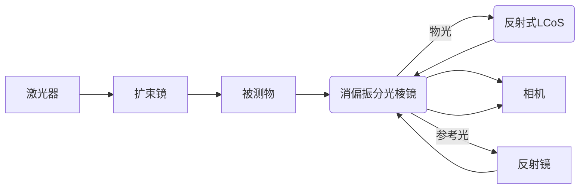
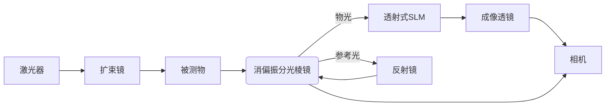

# 用户：

数字剪切散斑干涉物体离面位移测量实验，帮助我光路设计与软件部的测量并分析被测物体相位变化量的开发

# DeepSeek：

**原始回答**

数字剪切散斑干涉（Digital Shearography）是一种用于测量物体离面位移和变形的光学非接触式测量技术。以下是针对光路设计、软件测量及相位变化分析的开发指导，分步骤说明：

---

### **一、光路设计**
#### 1. **核心组件**
- **激光光源**：单模连续波激光器（如He-Ne激光或532nm固体激光），确保相干性。
- **分束器（Beam Splitter）**：将激光分为参考光和物光。
- **剪切装置**：关键部件，常用方法：
  - **楔形棱镜（Wedge Prism）**：在物光路中引入固定剪切量。
  - **迈克尔逊干涉仪结构**：通过倾斜反射镜实现可调剪切。
- **成像系统**：CCD/CMOS相机（高分辨率，如5MP以上），搭配远心镜头减少畸变。
- **压电陶瓷（PZT）**：用于相位调制（可选，需相位步进算法时使用）。

#### 2. **光路布局（示例）**
```
激光 → 分束器 → 物光（经物体反射） → 剪切元件 → 与参考光干涉 → 相机
                    参考光（固定路径） → 相机
```
- **剪切方向**：通常选择x或y方向，需与物体变形方向匹配。
- **稳定性**：使用防振平台，光路元件需牢固固定。

#### 3. **校准步骤**
- 调整剪切量（通常为1~10像素），确保两幅剪切图像有足够重叠。
- 消除环境振动（如封闭罩、隔振垫）。

---

### **二、软件测量开发**
#### 1. **图像采集与预处理**
- **采集**：通过相机SDK（如Halcon、OpenCV或厂商API）获取干涉图序列。
- **滤波**：中值滤波或高斯滤波降低散斑噪声。
- **ROI选择**：手动/自动划定感兴趣区域。

#### 2. **相位提取算法**
- **相位步进法（Phase Shifting）**：
  - 需PZT调制，采集4幅相位差π/2的干涉图。
  - 相位计算：  
    \[
    \phi = \arctan\left(\frac{I_4 - I_2}{I_1 - I_3}\right)
    \]
- **傅里叶变换法（单幅图处理）**：
  - 对干涉图进行FFT，滤波后提取相位信息。

#### 3. **相位解包裹（Unwrapping）**
- **算法选择**：
  - 质量导向法（Quality-guided）或最小二乘法（适用于噪声较大场景）。
  - 开源库：`numpy`、`scikit-image`或专用工具（如`UNWRAP`）。

#### 4. **位移计算**
- 剪切散斑的相位变化Δφ与离面位移梯度∂w/∂x的关系：  
  \[
  \Delta \phi = \frac{4\pi}{\lambda} \cdot \frac{\partial w}{\partial x} \cdot \Delta x
  \]
  - λ：激光波长，Δx：剪切量。
- 积分处理：通过数值积分（如梯形法）从梯度场还原位移场w(x,y)。

---

### **三、相位变化分析**
#### 1. **数据可视化**
- 2D/3D相位图：使用`Matplotlib`或`ParaView`绘制位移场。
- 动画：展示动态变形过程（如时间序列分析）。

#### 2. **误差校正**
- **环境噪声**：减去未加载时的背景相位。
- **温度/空气扰动**：在恒温实验室或使用短曝光时间。

#### 3. **定量分析**
- 提取关键点位移曲线（如中心点w(t)随时间变化）。
- 与理论模型（如有限元仿真）对比，计算均方根误差（RMSE）。

---

### **四、开发工具推荐**
1. **硬件控制**：
   - 相机/PZT控制：LabVIEW、Python（PyVISA库）。
2. **算法开发**：
   - Python（OpenCV、SciPy）或MATLAB（Image Processing Toolbox）。
3. **用户界面**：
   - PyQt或LabVIEW构建交互式操作界面。

---

### **五、验证与优化**
1. **静态测试**：测量已知位移（如压电平台驱动）验证精度。
2. **动态测试**：施加周期性载荷，检查系统响应频率。
3. **参数优化**：
   - 剪切量：过大导致分辨率下降，过小降低灵敏度。
   - 激光功率：平衡信噪比与散斑噪声。

---

### **常见问题解决**
- **条纹对比度低**：检查激光相干长度、物体表面散射特性（可喷涂哑光白漆）。
- **相位跳变**：优化解包裹算法或增加相位步进次数。
- **实时性不足**：改用GPU加速（CUDA）或降低图像分辨率。

通过以上步骤，可系统化完成从光路搭建到相位分析的完整开发流程。如需具体代码片段或某环节的深入讨论，可进一步说明需求。

# 用户：

需要加入相移装置，那是什么

# DeepSeek：

**原始回答**

在数字剪切散斑干涉（Digital Shearography）中，**相移装置（Phase Shifting Device）** 是用于主动调制参考光或物光相位的关键部件，通过引入已知的相位步进来提取包裹相位（相位解调）。以下是相移装置的详细说明及在实验中的具体实现方法：

---

### **一、相移装置的作用**
1. **核心功能**：  
   - 在干涉光路中引入可控的相位变化（如0, π/2, π, 3π/2），生成多幅相位步进干涉图。  
   - 通过算法从这些干涉图中解算物体的绝对相位分布，消除背景噪声并提高测量精度。

2. **解决的问题**：  
   - 传统单幅干涉图中，相位信息被包裹在余弦函数中（-π到π），无法直接获取连续相位。  
   - 相移技术通过多幅图分离相位，避免解包裹算法的初始误差。

---

### **二、相移装置的常见实现方式**
#### 1. **压电陶瓷（PZT）驱动器**
- **原理**：  
  PZT在电压驱动下产生微米级位移，推动反射镜或光栅改变光程，从而引入相位差。  
  - 相位变化量Δφ与PZT位移Δd的关系：  
    \[
    \Delta \phi = \frac{4\pi}{\lambda} \Delta d
    \]  
    （λ为激光波长，Δd = 电压灵敏度 × 驱动电压）

- **典型参数**：  
  - 位移分辨率：纳米级（如1nm/V）。  
  - 相位步进：常用4步法（每步π/2，对应λ/8的光程变化）。

- **安装位置**：  
  - 参考光路中（如迈克尔逊干涉仪的参考镜）。  
  - 或物光路中（需确保不影响剪切量）。

#### 2. **空间光调制器（SLM）**
- **原理**：  
  通过液晶阵列动态调制波前相位，无需机械移动，适合高频相移。  
- **优点**：无惯性，可编程控制。  
- **缺点**：成本高，需校准相位响应曲线。

#### 3. **旋转波片/偏振相移**
- **原理**：  
  在偏振干涉仪中，通过旋转1/4波片改变偏振态，实现相移。  
- **适用场景**：偏振敏感的光路设计。

---

### **三、相移技术与剪切散斑的结合方法**
#### 1. **光路设计示例**
- 在剪切散斑干涉仪的参考光路中加入PZT（如图）：  
  ```
  激光 → 分束器 → 物光（经物体反射 + 剪切元件） → 干涉  
                ↘ 参考光（经PZT反射镜） → 干涉 → 相机
  ```
- **关键点**：  
  - PZT需与剪切方向正交，避免干扰剪切量。  
  - 参考光与物光的光强比例需接近1:1（可用衰减片调节）。

#### 2. **相位步进算法（以4步法为例）**
1. **采集4幅干涉图**（相位依次步进π/2）：  
   \[
   I_1 = I_0 + I_{\text{mod}} \cos(\phi), \quad I_2 = I_0 + I_{\text{mod}} \cos(\phi + \pi/2), \quad \dots
   \]  
2. **计算包裹相位**：  
   \[
   \phi = \arctan\left(\frac{I_4 - I_2}{I_1 - I_3}\right)
   \]  
3. **解包裹**：通过空间或时间相位解包裹算法获得连续相位。

#### 3. **软件控制流程**
- **硬件同步**：通过DAQ卡或PZT控制器输出电压信号，触发相机采集。  
- **代码片段（Python示例）**：  
  ```python
  import numpy as np
  import matplotlib.pyplot as plt

  # 模拟4步相移干涉图（假设物体相位为高斯分布）
  x, y = np.meshgrid(np.linspace(-1, 1, 512), np.linspace(-1, 1, 512)
  phi_true = 2 * np.exp(-(x**2 + y**2) / 0.5)  # 真实相位
  I0, Imod = 100, 80  # 背景光和调制光强

  I1 = I0 + Imod * np.cos(phi_true)
  I2 = I0 + Imod * np.cos(phi_true + np.pi/2)
  I3 = I0 + Imod * np.cos(phi_true + np.pi)
  I4 = I0 + Imod * np.cos(phi_true + 3*np.pi/2)

  # 计算包裹相位
  phi_wrapped = np.arctan2(I4 - I2, I1 - I3)
  plt.imshow(phi_wrapped, cmap='jet')
  plt.title("Wrapped Phase")
  ```

---

### **四、校准与误差补偿**
1. **PZT线性校准**：  
   - 用干涉仪测量PZT位移与电压的关系，确保相位步进精确。  
   - 非线性误差可通过查找表（LUT）校正。

2. **环境振动抑制**：  
   - 在相移间隔内（如100ms），确保振动引起的相位漂移小于π/10。

3. **光强波动补偿**：  
   - 归一化处理：每幅图除以背景光强（可通过无干涉场时采集标定）。

---

### **五、注意事项**
- **相位步进次数**：4步法平衡速度与精度，更高步数（如5步、7步）可抑制谐波误差。  
- **实时性要求**：若需动态测量，选择高速PZT（如100Hz以上）和相机。  
- **剪切方向一致性**：相移方向需与剪切方向分离，避免耦合误差。

---

通过加入相移装置，系统可实现亚微米级位移测量精度（理论可达λ/100）。实际开发中需结合硬件响应速度和软件算法优化。如果需要具体硬件选型建议或控制代码扩展，可进一步说明需求！

# DeepSeek：

**原始回答**

共焦球面扫频干涉仪（Confocal Spherical Swept-Source Interferometer）和压电陶瓷（PZT）驱动器在功能和应用场景上有本质区别，**不能直接替代PZT作为相位调制装置**，但可以通过间接方式辅助PZT的校准或高精度位移测量。以下是详细分析：

---

### **一、两者核心功能对比**
| **特性**               | **压电陶瓷（PZT）驱动器**               | **共焦球面扫频干涉仪**                     |
|------------------------|---------------------------------------|-------------------------------------------|
| **主要用途**           | 主动引入微小位移（相位调制）            | 高精度绝对距离/形貌测量                   |
| **工作原理**           | 电压驱动陶瓷形变，推动反射镜位移        | 利用扫频光源干涉和共焦聚焦实现轴向分辨    |
| **位移范围**           | 纳米~微米级（如0~10μm）               | 毫米~厘米级（依赖扫频范围）               |
| **动态响应**           | 高频（kHz级）                         | 相对低频（受扫频速度限制，通常Hz~kHz）    |
| **相位调制能力**       | 直接生成精确相位步进（如λ/8步长）      | 无法直接调制相位，但可测量位移反馈        |

---

### **二、为何不能直接替代PZT？**
1. **功能不匹配**  
   - PZT的核心需求是**主动、快速、可控地引入已知相位差**（如π/2步进），而共焦干涉仪是**被动测量工具**，无法主动调制光程。  
   - 扫频干涉仪的位移测量需要时间扫描（扫频周期），无法实现PZT的实时相位步进（μs~ms级响应）。

2. **精度与范围限制**  
   - PZT的位移分辨率可达亚纳米级（如0.1nm），适合λ/100级别的相位调制；而共焦干涉仪的位移测量精度虽高（纳米级），但**动态控制精度**受扫频非线性影响。

3. **系统复杂性**  
   - 将共焦干涉仪集成到剪切散斑光路中会大幅增加复杂度，且难以保证与干涉仪的相位同步性。

---

### **三、可能的协同应用场景**
虽然不能替代PZT，但共焦球面扫频干涉仪可在以下方面辅助PZT系统：
#### 1. **PZT位移的校准与反馈控制**
   - **方法**：用共焦干涉仪实时测量PZT反射镜的位移，校准其电压-位移曲线（补偿非线性、迟滞效应）。  
   - **优势**：提升PZT的相位步进精度，尤其在λ/10以上高精度需求时。  
   - **实现示例**：  
     ```mermaid
     graph LR
     A[PZT驱动电压] --> B(PZT反射镜)
     B --> C[共焦干涉仪测量位移]
     C --> D[反馈调整电压]
     ```

#### 2. **振动补偿**
   - 在长时相移实验中，共焦干涉仪可监测环境振动导致的光程漂移，通过PZT反向补偿。

#### 3. **多尺度测量**
   - 共焦干涉仪测量大范围形貌（如物体初始形状），PZT负责局部微位移相位调制。

---

### **四、替代PZT的方案建议**
若需避免使用PZT，可考虑以下相位调制方案：
1. **空间光调制器（SLM）**  
   - 通过液晶阵列直接调制波前相位，无机械运动，但成本较高。
2. **声光调制器（AOM）**  
   - 改变光频引入相位差，适合高频应用。
3. **旋转波片法**  
   - 在偏振干涉仪中通过旋转波片实现相移，仅适用于特定光路。

---

### **五、总结**
- **不能直接替代**：共焦球面扫频干涉仪不具备PZT的主动相位调制能力。  
- **可辅助PZT**：作为高精度位移传感器校准PZT或补偿环境扰动。  
- **替代选择**：若需非机械相移，优先考虑SLM或AOM。

如需进一步讨论具体光路集成或控制策略，可提供更多实验细节！

# 用户：

透射式空间光调制器可以使用吗

# DeepSeek：

**原始回答**

在数字剪切散斑干涉（Digital Shearography）系统中，**透射式空间光调制器（Transmissive Spatial Light Modulator, SLM）**可以用于相位调制或剪切量调节，但其适用性需结合具体光路设计和需求评估。以下是关键分析：

---

### **一、透射式SLM的可行性**
1. **功能适配性**  
   - **相位调制**：透射式SLM可通过加载相位图动态调制光波前，替代传统PZT实现相移（如四步相移法）。  
   - **剪切量调节**：通过编程控制SLM显示的衍射光栅或波前偏转图案，可灵活调整剪切量和方向，无需机械移动反射镜。  

2. **优势**  
   - **无机械运动**：避免PZT的迟滞、非线性问题，适合高频动态测量。  
   - **多任务集成**：可同时实现相移、剪切量调整甚至空间载波生成。  
   - **高分辨率**：现代SLM的像素尺寸（如10μm）支持精细波前控制。  

3. **挑战**  
   - **光能利用率**：透射式SLM存在透射损耗（通常50%~80%），需高功率激光补偿。  
   - **偏振敏感性**：部分SLM对入射光偏振态有要求，需匹配偏振光路。  
   - **校准复杂度**：SLM的相位响应需精确校准（如基于干涉仪标定）。  

---

### **二、光路集成方案**
1. **替代PZT的相移光路**  
   - 将透射式SLM置于参考光路中，加载相位步进图案（如0, π/2, π, 3π/2），生成多幅干涉图。  
   - **示例**：  
     ```mermaid
     graph LR
     激光 --> 分束器 --> 物光 --> 剪切元件 --> 相机
     分束器 --> 参考光 --> SLM --> 相机
     ```

2. **剪切量动态调节**  
   - 在物光路中插入SLM，通过衍射光栅实现非机械剪切（如倾斜波前法）。  
   - **注意**：需确保SLM的衍射效率与系统信噪比匹配。

---

### **三、与反射式SLM的对比**
| **特性**               | **透射式SLM**                  | **反射式SLM**                  |
|------------------------|-------------------------------|-------------------------------|
| **光路复杂度**         | 需直射光路，可能增加透镜组     | 更易集成到反射光路中          |
| **偏振兼容性**         | 依赖偏振设计（如LCoS型）       | 通常兼容任意偏振              |
| **响应速度**           | 较慢（毫秒级）                | 更快（微秒级，如DMD）         |
| **成本**               | 较低（如LCD型）               | 较高（如LCoS型）              |

---

### **四、应用建议**
1. **优先场景**  
   - **静态或低频测量**：如复合材料缺陷检测，SLM的毫秒级响应足够。  
   - **多参数调控**：需同时调节剪切量、相移或载波频率时。  

2. **替代方案**  
   - 若需高速动态测量（如振动分析），反射式SLM或PZT更合适。  

3. **校准步骤**  
   - 使用干涉仪标定SLM的相位-电压曲线，确保相移精度。  
   - 通过标定衍射效率优化光强分配。

---

### **五、总结**
透射式SLM在剪切散斑干涉中**可以使用**，尤其适合需要灵活相位调制和非机械剪切调节的场景，但需权衡光能损耗和响应速度。若系统对光通量要求高或需高频动态测量，建议结合反射式SLM或PZT方案。

# 用户：

反射式SLM与透射式SLM有什么区别

# DeepSeek：

**原始回答**

在光学系统中，**反射式空间光调制器（Reflective SLM）**和**透射式空间光调制器（Transmissive SLM）**的核心功能均为动态调控光波前（相位、振幅或偏振），但两者在结构、性能和应用场景上存在显著差异。以下是详细对比：

---

### **一、工作原理与结构差异**
| **特性**               | **反射式SLM**                  | **透射式SLM**                  |
|------------------------|-------------------------------|-------------------------------|
| **光路类型**           | 光波经调制后反射回原光路       | 光波直接透过调制器传播         |
| **核心材料**           | 液晶硅（LCoS）、数字微镜（DMD）| 液晶面板（LCD）、铁电液晶      |
| **调制方式**           | 反射面微结构改变相位/振幅      | 透射介质折射率变化调控光波     |
| **典型结构**          | 硅基液晶层+反射电极            | 透明电极+液晶层+玻璃基板       |

---

### **二、性能对比**
#### 1. **光学效率**
- **反射式SLM**：  
  - 光能利用率高（>90%，如LCoS），因光路无透射损耗。  
  - DMD通过微镜翻转反射光，效率约60%~80%。  
- **透射式SLM**：  
  - 存在基板吸收和界面反射损耗，效率通常50%~80%。  
  - 需更高功率光源补偿能量损失。

#### 2. **偏振特性**
- **反射式SLM**：  
  - LCoS对偏振敏感，需匹配线性偏振光（如S偏振）；DMD与偏振无关。  
- **透射式SLM**：  
  - 依赖液晶取向，需特定偏振光（如LCD需线性偏振入射）。  

#### 3. **响应速度**
- **反射式SLM**：  
  - LCoS：毫秒级（~5ms）；DMD：微秒级（<20μs），适合高速调制。  
- **透射式SLM**：  
  - 通常较慢（10~100ms），铁电液晶（FLC）可达千赫兹级。  

#### 4. **分辨率与填充因子**
- **反射式SLM**：  
  - 高填充因子（>90%，LCoS像素间隙小），适合精密波前控制。  
- **透射式SLM**：  
  - 填充因子较低（~70%），像素间隙导致衍射噪声。  

#### 5. **热管理**
- **反射式SLM**：  
  - 热量通过基板传导，散热较好（尤其DMD）。  
- **透射式SLM**：  
  - 激光吸收可能导致局部升温，影响液晶稳定性。  

---

### **三、光路集成差异**
| **场景**               | **反射式SLM**                  | **透射式SLM**                  |
|------------------------|-------------------------------|-------------------------------|
| **光路复杂度**         | 易集成到反射光路，节省空间     | 需直射光路，可能增加透镜组     |
| **角度敏感性**         | 入射角影响小                   | 大角度入射易引入像差           |
| **多平面调控**         | 适合共轭波前调制（如全息术）   | 适合单一平面调制               |

---

### **四、典型应用场景**
#### **反射式SLM首选情况**  
1. **高功率激光系统**（如激光加工、自适应光学）：  
   - 低损耗、高热稳定性（如LCoS耐受>1W/cm²）。  
2. **高速动态调制**（如光镊、通信）：  
   - DMD的微秒级响应支持实时控制。  
3. **紧凑型光路**：  
   - 反射设计减少光学元件数量。  

#### **透射式SLM适用场景**  
1. **低成本系统**（如教学实验）：  
   - LCD型SLM价格低廉。  
2. **透射式显示**（如全息投影）：  
   - 直接透射光路简化成像设计。  
3. **偏振敏感度低的任务**：  
   - 配合偏振片使用时可忽略偏振影响。  

---

### **五、选型建议**
1. **优先选择反射式SLM若需**：  
   - 高光能利用率、高速响应、复杂波前调制。  
2. **考虑透射式SLM若**：  
   - 预算有限、光路允许透射损耗、静态或低频应用。  

---

### **六、代表型号示例**
- **反射式**：  
  - *Hamamatsu X13138*（LCoS，相位调制，1920×1200像素）。  
  - *TI DLP9500*（DMD，二值振幅调制，微秒级响应）。  
- **透射式**：  
  - *Holoeye LC2012*（LCD，相位/振幅调制，1024×768像素）。  

---

### **总结**  
反射式SLM在效率、速度和稳定性上普遍优于透射式，但透射式SLM在成本和简单应用中仍有优势。选择时需综合评估**光功率、速度需求、偏振兼容性**及**系统预算**。

# 用户：

一个SLM参数如下透射式，0.63″屏幕，HDMI接口，1024×768，1Pi@532nm，400-700nm。其成本与售价大概是多少

# DeepSeek：

**原始回答**

根据提供的SLM参数（透射式、0.63英寸屏幕、HDMI接口、1024×768分辨率、1π@532nm相位调制、400-700nm工作波段），结合搜索结果中的市场数据，其成本与售价估算如下：

### **1. 成本分析**
透射式SLM的成本主要受以下因素影响：
- **核心材料**：液晶面板（LCD）或铁电液晶（FLC），透射式结构通常比反射式（如LCoS）成本低。
- **分辨率**：1024×768属于中等分辨率，成本低于4K级SLM。
- **光学性能**：1π@532nm相位调制能力属于基础水平，若支持更高调制深度（如2π）则成本上升。
- **接口与控制器**：HDMI接口较为常见，若需高速DVI或定制触发信号，成本可能增加。

**估算成本范围**：  
- **低端型号**（如普通LCD型）：约 **$2,000 - $5,000**（人民币1.5万-3.5万）  
- **中端型号**（如高透过率、定制化）：约 **$5,000 - $10,000**（人民币3.5万-7万）  

### **2. 市场售价**
透射式SLM的售价通常为成本的 **1.5~3倍**，取决于品牌、附加功能（如同步触发、高损伤阈值）及市场定位：
- **经济型**（如国产LCD-SLM）： **$3,000 - $8,000**（人民币2万-5.5万）  
  - 例：中科微星TSLM系列（基础透射式，功能简化）。
- **中高端**（如Meadowlark Optics透射式SLM）： **$8,000 - $20,000**（人民币5.5万-14万）  
  - 特点：>90%透过率、500W/cm²损伤阈值、支持实时相位校正。

### **3. 影响价格的关键因素**
- **品牌溢价**：欧美品牌（如Meadowlark、Holoeye）比国产（如中科微星）贵30%~50%。
- **定制需求**：若需六角形像素阵列或特殊波长优化（如450-1800nm），价格可能上浮20%~40%。
- **批量采购**：单台采购价较高，批量（10台以上）可享10%~20%折扣。

### **4. 对比反射式SLM**
同参数反射式SLM（如LCoS）售价通常高50%~100%，因其光效更高、响应更快，适用于高功率激光系统。

### **总结**
该透射式SLM的 **预估售价区间** 为 **$3,000 - $20,000**（人民币2万-14万），具体需根据品牌、性能定制及采购量协商。如需精确报价，建议直接联系供应商（如中科微星、Meadowlark Optics）并提供详细需求。

# DeepSeek：

**原始回答**

透射式空间光调制器（Transmissive Spatial Light Modulator, SLM）是一种通过电信号控制光学特性（如相位、振幅或偏振）来动态调制透射光波的器件。其核心原理基于**电光效应**或**液晶取向调控**，以下是详细解析：

---

### **一、基本工作原理**
1. **核心结构**  
   - **透明电极层**：通常为ITO（氧化铟锡）导电薄膜，施加控制电压。  
   - **液晶层**：向列相或铁电液晶（LC/FLC），分子取向随电场变化。  
   - **玻璃基板**：封装液晶，维持均匀盒厚（几微米）。  
   - **偏振片**（可选）：配合液晶调制偏振态（振幅型SLM需偏振片）。

2. **调制机制**  
   - **相位调制**：  
     - 液晶分子取向改变→折射率变化（Δn）→光程差（Δφ = 2πΔn·d/λ）。  
     - 例如：1π调制@532nm需Δn·d ≈ 266nm（d为液晶层厚度）。  
   - **振幅调制**：  
     - 通过偏振片将相位调制转换为光强变化（如马赫-曾德尔干涉结构）。

3. **控制方式**  
   - 每个像素独立寻址（矩阵驱动），通过HDMI/DVI输入图像信号，电压值对应特定相位延迟。

---

### **二、关键光学过程**
1. **光波传输路径**  
   ```
   入射光 → 偏振片（可选）→ 透明电极 → 液晶层（相位调制）→ 出射光
   ```  
   - **透射率**：受ITO吸收（~10%）、液晶散射（~5%）和界面反射（~4%）影响，总效率约50-80%。

2. **相位-电压曲线**  
   - 典型响应曲线（以向列相液晶为例）：  
     \[
     \Delta \phi(V) = \frac{2\pi}{\lambda} \cdot d \cdot \left[ n_e(V) - n_o \right]
     \]  
     - \(n_e(V)\)：异常折射率（随电压变化），\(n_o\)：寻常折射率。  
   - 需校准电压-相位关系以实现精确控制。

---

### **三、与反射式SLM的区别**
| **特性**         | **透射式SLM**                  | **反射式SLM（如LCoS）**        |
|------------------|--------------------------------|-------------------------------|
| **光路设计**     | 需直射光路，光能损耗较高       | 反射光路紧凑，光效>90%        |
| **响应速度**     | 较慢（毫秒级）                | 更快（微秒级，如DMD）         |
| **偏振依赖**     | 需匹配入射偏振                | LCoS需S偏振，DMD与偏振无关    |
| **热管理**       | 激光吸收易导致温升             | 热量通过基板传导，散热更优    |

---

### **四、典型应用场景**
1. **全息投影**  
   - 直接透射式光路生成动态全息图（如Holoeye LCD-SLM）。  
2. **光束整形**  
   - 将高斯光束转换为平顶光束或涡旋光束。  
3. **光学镊子**  
   - 通过相位调制生成多焦点光阱（需高精度相位控制）。  

---

### **五、优缺点总结**
- **优点**：  
  - 成本低（LCD技术成熟），易于集成到透射光路。  
  - 支持高分辨率（如4K像素级）。  
- **缺点**：  
  - 光能利用率低，不适合高功率激光（>100mW需谨慎）。  
  - 响应速度受限，动态应用需优化算法。  

---

### **六、技术前沿**
- **铁电液晶（FLC）SLM**：响应速度提升至千赫兹级，但调制深度降低。  
- **超表面SLM**：纳米结构阵列实现超薄透射调制，尚处实验室阶段。  

透射式SLM的原理本质是通过电场调控液晶分子的光学各向异性，进而动态塑造光波前。选型时需权衡**效率、速度、成本**与**应用需求**。

# 用户：

数字剪切散斑实验中要加偏振片吗

# DeepSeek：

**原始回答**

在数字剪切散斑干涉（Digital Shearography）实验中，**是否加入偏振片取决于光路设计和测量需求**。以下是具体分析：

---

### **一、需要偏振片的情况**
1. **使用偏振敏感元件时**  
   - 若光路中包含 **透射式SLM**、**液晶剪切元件** 或 **偏振分束器**，需匹配入射光的偏振方向（如线性偏振）。  
   - *示例*：透射式SLM通常要求线性偏振光入射（如LCD型SLM需S偏振）。

2. **抑制杂散光干扰**  
   - 偏振片可过滤非相干反射光（如物体表面镜面反射），提升干涉条纹对比度。  
   - *方法*：在激光器后加偏振片，调整偏振方向与主光路一致。

3. **相位步进调制**  
   - 若通过 **旋转偏振片** 实现相移（如偏振相移法），需在参考光或物光路中加入偏振片组。  
   - *替代方案*：此方法可避免使用PZT，但需精确控制偏振角。

---

### **二、无需偏振片的情况**
1. **传统剪切散斑光路（无偏振敏感元件）**  
   - 若使用 **楔形棱镜** 或 **迈克尔逊干涉仪结构** 引入剪切，且光源为自然偏振（如普通激光器），可不加偏振片。  
   - *注意*：散斑噪声可能略高，但系统更简单。

2. **反射式SLM（如LCoS）或DMD调制**  
   - 反射式SLM中的LCoS需匹配偏振，但DMD与偏振无关。若光路无其他偏振敏感部件，可省略偏振片。

---

### **三、实验建议**
1. **基础光路（无SLM）**  
   - **无需偏振片**，优先优化剪切量和光强平衡。  
   - 若信噪比低，可尝试加入偏振片（如偏振方向与物体表面散射特性匹配）。

2. **高级光路（含SLM/偏振相移）**  
   - **必须加偏振片**，并校准偏振方向与SLM或相移器匹配。  
   - *示例配置*：  
     ```
     激光 → 偏振片（固定偏振）→ 分束器 → 物光/参考光 → SLM（透射式）→ 相机
     ```

3. **动态测量**  
   - 若需高频相移，反射式SLM（如LCoS）或PZT比偏振旋转法更可靠。

---

### **四、注意事项**
- **偏振片角度误差**：旋转偏振片引入的相移需精确校准（误差<π/10）。  
- **光能损耗**：每片偏振片损失约50%光强，需提高激光功率补偿。  
- **剪切方向一致性**：偏振调制方向需与剪切方向正交，避免耦合误差。

---

### **总结**
- **不加偏振片**：适用于简单剪切散斑系统，追求光通量和简洁性。  
- **加偏振片**：需配合SLM、偏振相移或杂散光抑制时必要，但需权衡光能损失。  

根据实验目标选择，若需进一步优化偏振方案，可提供具体光路细节。

# 用户：

在这个实验手册中的实验2加入SLM。帮助我选型并且确定是否要在slm中加入偏振片

# DeepSeek：

**原始回答**

根据实验手册中**数字剪切散斑干涉（实验二）**的光路设计和测量需求，结合SLM的功能特点，以下是SLM选型及偏振片配置的具体建议：

---

### **一、SLM选型建议**
#### **1. 核心需求分析**
- **功能需求**：  
  - 实现**相位调制**（替代PZT相移）或**动态剪切量调节**（替代迈克尔逊反射镜倾斜）。  
  - 支持实时控制（响应速度≥30Hz，匹配相机帧率）。  
- **光路兼容性**：  
  - 实验光路为透射式（激光→扩束镜→被测物→剪切装置→相机），需避免复杂光路改动。  
- **波长匹配**：  
  - 氦氖激光波长（633nm），SLM需支持400-700nm波段（覆盖532nm备用选项）。  

#### **2. 推荐SLM型号**
| **类型**       | **推荐型号**                | **关键参数**                                                                 | **适用场景**                     |
|----------------|----------------------------|-----------------------------------------------------------------------------|----------------------------------|
| **反射式LCoS** | Hamamatsu X13138           | 1920×1200像素，相位调制0-2π@633nm，响应速度5ms，反射效率>90%               | 高精度相移，兼容偏振光路         |
| **透射式LCD**  | Holoeye LC2012             | 1024×768像素，相位调制1π@532nm，响应速度10ms，透射率~50%                   | 低成本静态测量，需补偿光能损耗   |
| **高速DMD**    | TI DLP9500                 | 微秒级响应，二值振幅调制，适合动态剪切量调节                                | 高频振动测量，但需额外相位解调   |

**首选方案**：  
- **反射式LCoS（如X13138）**：  
  - 高光效、快响应，可直接集成到现有迈克尔逊光路的参考臂中（替换反射镜）。  
  - 需配合偏振片（如宽带消偏振分光棱镜已内置偏振控制）。  

---

### **二、偏振片配置决策**
#### **1. 必须加入偏振片的情况**
- **使用LCoS型SLM**：  
  - LCoS对入射光偏振敏感（需S偏振光），需在SLM前加**线偏振片**，且与分光棱镜偏振方向匹配。  
- **抑制杂散光**：  
  - 若被测物表面有强镜面反射，可在相机前加偏振片（与入射偏振正交），提升条纹对比度。  

#### **2. 无需偏振片的情况**
- **使用DMD型SLM**：  
  - DMD与偏振无关，但仅支持振幅调制，需配合相位恢复算法。  
- **透射式LCD未调偏振**：  
  - 若LCD未校准偏振响应，可能引入额外噪声，此时需移除偏振片简化光路。  

#### **3. 偏振片选型参数**
- **类型**：宽带线偏振片（如Thorlabs LPVIS100-MP2，400-700nm）。  
- **安装位置**：  
  - *SLM前*：确保入射偏振与SLM匹配（角度需校准）。  
  - *相机前*：与物光偏振正交，抑制背景光（可选）。  

---

### **三、光路改造与集成方案**
#### **1. 替代迈克尔逊反射镜方案**

- **SLM作用**：动态调节参考光相位（相移法）或横向剪切量（通过倾斜波前）。  
- **偏振片**：置于SLM前，匹配LCoS的S偏振需求。

#### **2. 软件控制需求**
- **相位步进**：通过SLM加载0/π/2/3π/2相位图，实现四步相移。  
- **剪切量调节**：加载倾斜相位光栅，控制错位量（需校准像素-角度关系）。  

---

### **四、成本与实施考量**
| **方案**          | **成本**       | **复杂度** | **精度**       | **推荐指数** |
|-------------------|----------------|------------|----------------|--------------|
| 反射式LCoS+偏振片 | 高（$10k-$20k）| 中         | 高（λ/100）    | ★★★★★        |
| 透射式LCD         | 低（$3k-$8k）  | 低         | 中（λ/50）     | ★★★☆☆        |
| DMD               | 中（$5k-$15k） | 高         | 低（需算法补偿）| ★★☆☆☆        |

---

### **五、实验步骤修改建议**
在**实验2.5步骤**中新增以下操作：  
1. **SLM安装**：将LCoS-SLM替换原迈克尔逊反射镜1，并调整角度使反射光与物光重合。  
2. **偏振片校准**：旋转SLM前偏振片，最大化相机信号强度。  
3. **相位调制验证**：通过软件加载四步相移图案，检查条纹对比度变化。  

---

### **总结**
- **最优选型**：反射式LCoS（如Hamamatsu X13138）配合线偏振片，兼顾精度与光路兼容性。  
- **偏振片必加**：仅在使用LCoS或需抑制杂散光时，其他情况可省略。  
- **验证重点**：校准SLM相位响应曲线，确保相移步长精度（如π/2步进误差<5%）。  

如需进一步讨论硬件接口或软件控制细节，可提供具体实验环境参数（如激光功率、相机型号等）。

# 用户：

可以使用一个SLM参数如下透射式，0.63″屏幕，HDMI接口，1024×768，1Pi@532nm，400-700nm。吗？修改一下方案

# DeepSeek：

**原始回答**

根据提供的透射式SLM参数（0.63英寸屏幕、HDMI接口、1024×768分辨率、1π@532nm相位调制、400-700nm波段），以下是针对**数字剪切散斑实验（实验二）**的优化方案及具体修改建议：

---

### **一、SLM的可行性评估**
#### **1. 参数匹配性**
- **优点**：  
  - **波长兼容**：支持633nm氦氖激光（覆盖532nm备用波长）。  
  - **相位调制**：1π@532nm（约等效于0.6π@633nm），可满足基础相移需求（需校准）。  
  - **分辨率**：1024×768像素，适合中等精度剪切散斑测量。  
- **局限**：  
  - **调制深度不足**：1π@532nm在633nm下调制能力降低，需验证是否满足相位步进要求（如四步法需π/2步进）。  
  - **透射率低**：约50%~80%光能损耗，需提高激光功率补偿。  
  - **响应速度**：毫秒级（10ms），仅适合静态或低频动态测量。

#### **2. 与实验需求的匹配**
- **适用场景**：  
  - 静态离面位移测量、低频振动分析（如复合材料缺陷检测）。  
- **不适用场景**：  
  - 高频动态测量（如振动模态分析需kHz级响应）。  

---

### **二、光路改造方案**
#### **1. 替代迈克尔逊反射镜（透射式集成）**

- **SLM功能**：  
  - **相位调制**：加载四步相移图案（0, π/2, π, 3π/2），替代PZT实现相移。  
  - **剪切量调节**：通过倾斜相位光栅生成横向错位（需校准像素-剪切量关系）。  
- **偏振片配置**：  
  - **必须加入**：透射式SLM（如LCD型）需线性偏振光入射，在SLM前加偏振片（与激光偏振方向匹配）。  
  - **可选**：相机前加偏振片（与物光正交）抑制杂散光。

#### **2. 关键调整步骤**
1. **校准SLM相位响应**：  
   - 用干涉仪标定电压-相位曲线，确保1π@532nm对应的实际调制深度（633nm下可能需调整驱动电压）。  
2. **光强平衡**：  
   - 因SLM透射率低，需衰减参考光（使用实验原有的可调衰减器），使物光/参考光强度比≈1:1。  
3. **剪切量标定**：  
   - 加载倾斜相位光栅（如线性倾斜波前），通过相机观察剪切像，调整倾斜量至3-5mm（如实验步骤2.5要求）。  

---

### **三、软件控制优化**
1. **相位步进算法**：  
   - 修改实验软件，通过HDMI输入四步相移图案（需SLM支持实时刷新）：  
     ```python
     # 示例：生成四步相移图案（0, π/2, π, 3π/2）
     phase_steps = [0, np.pi/2, np.pi, 3*np.pi/2]
     for step in phase_steps:
         slm.load_phase_map(step * np.ones((768, 1024)))  # 全屏均匀相位
         camera.capture_image()  # 采集干涉图
     ```
2. **剪切量控制**：  
   - 加载倾斜相位光栅（如公式 `φ(x,y) = 2πfx·x`，`fx`为空间频率），通过调整`fx`控制剪切量。  

---

### **四、性能优化与误差补偿**
1. **调制深度不足的补救**：  
   - **多次曝光平均**：对同一相移步进多次采集，提升信噪比。  
   - **算法补偿**：通过标定数据反演实际相位-电压关系，软件校正非线性。  
2. **光能损耗补偿**：  
   - 提高激光功率（注意安全限值），或延长相机曝光时间（可能降低动态性能）。  

---

### **五、实验步骤修改建议**
在**实验2.5步骤**中新增以下操作：  
1. **安装SLM**：  
   - 将透射式SLM置于物光路中（图2-3替换反射镜1位置），调整角度使光路对准。  
2. **偏振片安装**：  
   - SLM前加线偏振片（如Thorlabs LPVIS100-MP2），旋转至最大透过率。  
3. **相位校准**：  
   - 通过软件加载0/π相位图，观察相机干涉条纹对比度变化，验证调制有效性。  

---

### **六、成本与备选方案**
| **方案**                | **成本**       | **优缺点**                                                                 |  
|-------------------------|----------------|----------------------------------------------------------------------------|  
| **当前透射式SLM**       | 低（$3k-$8k）  | 成本低，但需补偿光能损耗和调制深度；适合教学/静态实验。                     |  
| **升级反射式LCoS**      | 高（$10k-$20k）| 高光效、快响应，但需改造光路；适合科研/动态测量。                           |  

---

### **七、总结**
- **可行但需优化**：当前透射式SLM可用于实验，但需通过校准和软件补偿解决调制深度与光能损耗问题。  
- **必加偏振片**：因SLM偏振敏感，需在入射光路中加入偏振片。  
- **推荐配置**：  
  - **静态测量**：当前SLM+偏振片+四步相移算法。  
  - **动态测量**：建议升级反射式LCoS或保留原迈克尔逊结构。  

若需进一步协助校准或代码实现，可提供具体SLM型号和软件接口文档。