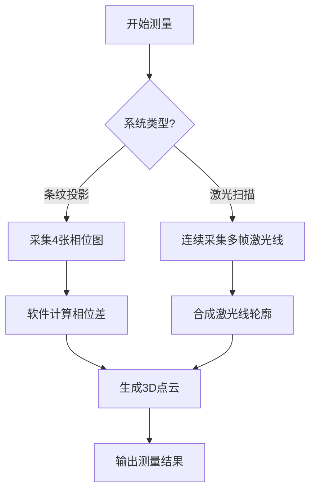
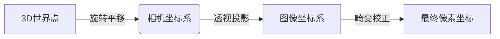

# 用户：

在使用棋盘格标定板进行相机内外参标定时，采集的图片明明拍摄全了棋盘格，但是软件还是显示未检测到完整棋盘格

# DeepSeek：

**原始回答**

在使用棋盘格标定板进行相机标定时，若软件无法检测到完整的棋盘格（即使图片中看似完整），可能是以下原因导致的。以下是逐步排查和解决方案：

---

### **1. 棋盘格边缘未被完整包含**
- **问题**：软件通常要求棋盘格的最外层的黑色边框必须完全在图像内（即所有内角点周围需留白）。
- **解决**：
  - 确保标定板的**最外层黑色边框完整出现在图像中**，且四边留有少量空白（约2-3个方格宽度）。
  - 避免棋盘格紧贴图像边缘，尤其是角落。

---

### **2. 图像模糊或失真**
- **问题**：运动模糊、对焦不准或镜头畸变导致角点检测失败。
- **解决**：
  - 使用三脚架固定相机，避免手抖。
  - 确保棋盘格平面与相机传感器平行（减少透视畸变）。
  - 关闭自动对焦，手动对焦使棋盘格清晰。
  - 若镜头畸变严重（如鱼眼镜头），先用低畸变模式标定，或换用更专业的标定工具（如OpenCV的`fisheye`模块）。

---

### **3. 光照或反光干扰**
- **问题**：强光、阴影或反光导致棋盘格对比度不足。
- **解决**：
  - 使用均匀的漫射光源（如阴天或柔光箱）。
  - 调整相机曝光，确保黑白方格对比鲜明（可通过直方图检查）。
  - 避免高光反射：更换哑光材质的标定板或调整拍摄角度。

---

### **4. 棋盘格参数设置错误**
- **问题**：软件中输入的棋盘格行列数与实际不符。
- **解决**：
  - 确认棋盘格的**内角点数量**（例如8x6的棋盘格有7x5个内角点）。
  - 在标定软件（如OpenCV的`findChessboardCorners`）中正确填写`patternSize`参数。

---

### **5. 标定板图案问题**
- **问题**：打印的棋盘格不均匀、变形或比例错误。
- **解决**：
  - 使用高精度打印（如激光打印+哑光覆膜）。
  - 检查棋盘格方块的**长宽是否严格相等**（用尺子测量）。
  - 标定板必须平整（可粘贴在硬质平板上）。

---

### **6. 软件或算法限制**
- **问题**：标定软件默认参数可能不适合你的图像。
- **解决**：
  - **OpenCV用户**：尝试调整角点检测参数：
    ```python
    criteria = (cv2.TERM_CRITERIA_EPS + cv2.TERM_CRITERIA_MAX_ITER, 30, 0.001)
    ret, corners = cv2.findChessboardCornersSB(gray, (7,5), None)  # 更稳健的算法
    # 或使用亚像素优化
    if ret:
        corners = cv2.cornerSubPix(gray, corners, (11,11), (-1,-1), criteria)
    ```
  - 换用其他标定工具（如MATLAB Camera Calibrator、Kalibr等）。

---

### **7. 其他常见问题**
- **彩色图像未转灰度**：确保输入的是单通道灰度图像。
- **棋盘格太小**：角点区域在图像中至少占据50x50像素。
- **重复图案干扰**：背景中不能有其他类似棋盘格的纹理。

---

### **调试建议**
1. **可视化角点**：在检测后绘制角点，确认是否全部正确识别。
   ```python
   cv2.drawChessboardCorners(img, (7,5), corners, ret)
   cv2.imshow('Corners', img)
   cv2.waitKey(0)
   ```
2. **尝试单张测试**：手动验证某张图像是否能被检测，再批量处理。

---

通过以上步骤逐一排查，通常能解决大多数棋盘格检测问题。如果仍失败，建议提供一张示例图像和使用的标定工具，以便进一步分析。

# 用户：

使用的是已经封装的exe软件，如何调整

# DeepSeek：

**原始回答**

如果你使用的是**封装好的标定软件（EXE）**，无法直接修改代码或算法参数，可以尝试以下方法调整，以提高棋盘格检测的成功率：

---

## **1. 确保棋盘格完全可见且符合要求**
- ✅ **完整边框**：软件通常要求棋盘格的**最外层黑色边框**必须完整出现在图像中（不能有裁剪）。
- ✅ **边缘留白**：棋盘格四周需要留出一定的空白区域（至少2-3个方格宽度），不能紧贴图像边缘。
- ✅ **方格大小均匀**：打印的棋盘格必须保证每个格子是严格的正方形，无变形或拉伸。

---

## **2. 优化拍摄条件**
### **(1) 光照调整**
- 🌞 **避免强光/阴影**：使用均匀的漫射光（如阴天或柔光箱），避免反光或高对比度阴影。
- ⚠️ **不要过曝/欠曝**：棋盘格的黑白对比度要清晰，但不要出现纯白或纯黑（丢失细节）。

### **(2) 对焦与清晰度**
- 🔍 **手动对焦**：关闭自动对焦，确保棋盘格清晰（模糊图像会导致检测失败）。
- 📏 **分辨率足够**：棋盘格的每个角点区域至少占 **20x20 像素**（如果太小，软件可能无法识别）。

### **(3) 拍摄角度**
- 📐 **尽量正对棋盘格**：相机与标定板平面尽量平行，减少透视畸变（倾斜太大会影响检测）。
- 🚫 **避免严重畸变**：广角镜头可能导致边缘方格变形，可尝试离远一点拍摄。

---

## **3. 检查棋盘格参数设置**
- 🔢 **正确输入内角点数量**：
  - 例如，一个 **8x6 的棋盘格**（8列×6行）实际有 **7x5=35 个内角点**（交界处的点）。
  - 如果软件要求输入 `Pattern Size`，通常是输入 **（列-1, 行-1）**，即 `(7,5)`。
- 🖨️ **打印精度检查**：
  - 用尺子测量棋盘格的格子是否真的是正方形（长=宽）。
  - 如果打印质量差（如喷墨打印有晕染），建议换用激光打印 + 哑光覆膜。

---

## **4. 尝试不同的标定软件**
如果当前软件始终无法检测，可以换用其他标定工具：
1. **OpenCV Camera Calibration（Python/C++）**（需编程基础）
2. **MATLAB Camera Calibrator App**（图形化界面，适合非编程用户）
3. **ROS Camera Calibration**（适用于机器人视觉）
4. **Metashape/Agisoft**（三维重建软件内置标定工具）

---

## **5. 手动验证单张图片**
如果软件支持**单张图片测试**，可以：
1. 选择一张最清晰的棋盘格图片，单独测试是否能检测。
2. 如果失败，调整拍摄条件（光照、角度、对焦）后重新拍摄。
3. 如果成功，但其他图片失败，可能是某些图片质量不一致，需筛选或重新采集。

---

## **6. 联系软件开发者**
如果所有方法都无效，可能是软件本身的限制或 Bug，建议：
- 📧 **查看软件手册**：是否有特殊要求（如必须使用特定尺寸的棋盘格）。
- 🐞 **反馈问题**：提供失败的图片和日志，询问开发者如何调整。

---

### **总结 Checklist**
| 问题 | 解决方法 |
|------|----------|
| 棋盘格边缘被裁剪 | 确保完整边框+留白 |
| 光照不均/反光 | 使用柔光，调整曝光 |
| 图像模糊 | 手动对焦，使用三脚架 |
| 输入参数错误 | 确认内角点数量（列-1, 行-1） |
| 打印质量差 | 换高精度打印，检查方格是否正方形 |
| 软件限制 | 换用其他标定工具或联系开发者 |

尝试这些方法后，应该能提高棋盘格检测的成功率。如果仍有问题，可以提供一张失败的示例图片，我可以帮你分析具体原因！ 🛠️

# 用户：

是个12*9的棋盘格，继续修改

# DeepSeek：

**原始回答**

如果你的棋盘格是 **12列×9行**（即 **12×9 个方格**），那么它的 **内角点数量** 应该是 **11×8**（因为角点是方格之间的交点）。  

如果软件仍然无法检测，可能是以下原因，请逐步排查：

---

## **1. 确认棋盘格参数输入正确**
- **软件要求输入的是内角点数量，而非方格数量！**
  - 你的棋盘格：**12×9 个方格** → **内角点 = (12-1, 9-1) = 11×8**  
  - 在软件中应输入 **`11`（列）和 `8`（行）**，而不是 `12` 和 `9`。
- **常见错误**：
  - 输入 `12×9`（错误，这是方格数）  
  - 输入 `11×8`（正确，这是内角点数）  

✅ **解决方法**：检查软件参数设置，确保输入的是 **11×8**（内角点）。

---

## **2. 检查棋盘格是否完整出现在图像中**
- **软件要求**：
  - 最外层的**黑色边框必须完整可见**（不能被裁剪）。
  - 棋盘格四周**必须留白**（至少 2-3 个方格宽度），不能紧贴图像边缘。
- **示例**：
  - ❌ **错误**：棋盘格边缘被裁切，或角点太靠近图像边界。  
  - ✅ **正确**：完整显示 12×9 方格，并留有空白边缘。

---

## **3. 优化拍摄质量（提高检测成功率）**
### **(1) 对焦清晰**
- 🔍 **使用手动对焦**，确保棋盘格清晰（自动对焦可能导致模糊）。
- 📏 **每个方格至少 20×20 像素**（如果太小，软件可能无法检测）。

### **(2) 光照均匀**
- 🌞 **避免强光/阴影**：使用柔光（如阴天或 LED 面板光）。
- ⚠️ **不要过曝/欠曝**：黑白格子的对比度要明显，但不能丢失细节。

### **(3) 拍摄角度**
- 📐 **尽量正对棋盘格**（减少透视畸变）：
  - ❌ 错误：倾斜角度太大（导致方格变形）。  
  - ✅ 正确：相机与棋盘格平面平行（可让棋盘格占满画面 70%~80%）。

---

## **4. 检查棋盘格打印质量**
- 🖨️ **方格必须是严格的正方形**（用尺子测量长宽是否相等）。
- 🚫 **避免打印模糊/反光**：
  - 使用 **激光打印 + 哑光覆膜**（喷墨打印可能晕染）。
  - 如果棋盘格有褶皱或弯曲，换用硬质平板（如亚克力板）。

---

## **5. 尝试不同的标定软件**
如果当前软件始终无法识别，可以换用：
1. **OpenCV + Python**（需编程）：
   ```python
   import cv2
   gray = cv2.cvtColor(img, cv2.COLOR_BGR2GRAY)
   ret, corners = cv2.findChessboardCorners(gray, (11,8), None)  # 11×8 内角点
   ```
2. **MATLAB Camera Calibrator App**（图形界面，适合非编程用户）。
3. **ROS Camera Calibration**（适用于机器人/自动驾驶）。

---

## **6. 手动验证是否检测到角点**
如果软件支持**可视化角点**，检查：
- 是否所有内角点都被正确标记？
- 是否有误检或漏检？

**示例（OpenCV 可视化）：**
```python
cv2.drawChessboardCorners(img, (11,8), corners, ret)
cv2.imshow("Corners", img)
cv2.waitKey(0)
```
如果角点检测错误，可能是 **光照/对焦/棋盘格质量问题**。

---

## **7. 联系软件开发者**
如果所有方法都无效：
- 📧 **查看软件手册**：是否有特殊要求（如必须使用特定尺寸的棋盘格）。
- 🐞 **反馈问题**：提供失败的图片 + 日志，询问开发者如何调整。

---

### **最终 Checklist**
| 问题 | 解决方法 |
|------|----------|
| 输入参数错误 | 确保输入 **11×8（内角点）**，而非 12×9（方格） |
| 棋盘格边缘被裁切 | 完整显示 12×9 方格 + 留白 |
| 图像模糊 | 手动对焦，提高分辨率 |
| 光照不均 | 使用柔光，调整曝光 |
| 棋盘格变形 | 检查打印质量，确保方格是正方形 |
| 软件限制 | 换用 OpenCV/MATLAB 或联系开发者 |

请尝试这些方法，如果仍有问题，可以上传一张失败的示例图片，我可以帮你具体分析！ 🚀

# 用户：

根据这个doc，用易懂且详尽的方法告诉我如何进行相位标定’

# DeepSeek：

**原始回答**

以下是基于实验讲义内容的**相位标定操作指南**，以清晰步骤和关键注意事项呈现，确保顺利完成标定：

---

### **相位标定流程详解**
#### **1. 准备工作**
- **设备连接**  
  - 将电控平移台通过串口线连接电脑，USB线连接控制器，打开电源开关。  
  - 在电脑设备管理器中确认串口号（如COM8），后续软件中需选择对应串口。  

- **光路调整**  
  - 确保光栅条纹清晰投射到白屏上，条纹亮度适中（避免过曝或过暗）。  
  - 调整镜头焦距，使条纹在白屏上均匀分布且无微观结构成像（否则影响相位计算）。  

#### **2. 标定步骤**
##### **（1）采集光栅条纹图像**
1. **初始位置设置**  
   - 手动平移台千分丝杆调至整数刻度（如6.000mm），记录初始位置。  
   - 在软件中选择“从摄像机”采集模式。  

2. **四步相移法采集**  
   - **移动规则**：每采集1张图后，转动千分丝杆 **12.5刻度（0.125mm）**，共移动4次完成1个周期（0.5mm）。  
     - *示例*：初始6.000mm → 6.125mm（图1）→ 6.250mm（图2）→ 6.375mm（图3）→ 6.500mm（图4）。  
   - **关键点**：  
     - 每次移动后需返回初始位置（如6.000mm），避免光栅超出光路范围。  
     - 确保条纹移动方向与光路设计一致（本实验要求条纹在相机视野中**向右移动**）。  

3. **重复采集**  
   - 点击电控平移台“前进”按钮，移动1mm后重复上述步骤，共采集**40张图片**（对应10mm标定深度）。  
   - *注意*：若某张图采集错误，需删除后重命名后续图片序号（如第10张错误，将11.jpg改为10.jpg，依此类推）。  

##### **（2）执行相位标定**
1. **数据输入**  
   - 在软件中点击“相位标定”按钮，系统自动计算相位-高度映射关系。  
   - 标定完成后会弹出成功对话框，生成参数文件（如`phase_params.yml`）。  

2. **返回基准面**  
   - 点击“返回基准面”按钮，将平移台复位至初始位置，确保后续测量基准一致。  

---

### **关键注意事项**
1. **环境与操作**  
   - **暗环境操作**：避免环境光干扰条纹对比度。  
   - **条纹质量**：条纹需清晰、连续，亮度均匀（可通过调整相机曝光或镜头光圈优化）。  

2. **标定验证**  
   - **误差检查**：标定后生成的参数文件中，相位误差应小于1像素（约5.2μm）。  
   - **基准面确认**：标定前后平移台位置必须一致，否则需重新标定。  

3. **故障处理**  
   - **标定失败**：若提示图片不足，需清除旧图重新采集（确保图片数量≥40张且覆盖完整周期）。  
   - **条纹异常**：调整光栅与透镜距离，避免条纹过密或变形。  

---

### **相位标定原理简析**
- **四步相移法**：通过移动光栅1/4周期（0.125mm）采集4幅图，利用相位差解算高度信息。  
- **标定目的**：建立相位变化量（Δφ）与实际高度（h）的映射关系（公式：`h = L·Δφ / (Δφ + 2πd/P0)`）。  

---

### **后续测量建议**
- **物体放置**：测量物体高度需在标定深度范围内（如10mm），且表面避免强反光或突变特征。  
- **数据保存**：标定参数文件（如`.yml`）需妥善保存，供后续测量直接调用。  

通过以上步骤，可高效完成相位标定，为三维形貌测量提供准确的高度基准。若仍有问题，可检查光路稳定性或联系技术支持（如北京杏林睿光科技有限公司）。

# DeepSeek：

**原始回答**

在相位标定过程中，**6.000mm（初始位置）也需要采集图像**，但需要明确以下几点以避免混淆：

---

### **关键解答**
1. **初始位置（6.000mm）必须采集第一张图**  
   - 四步相移法要求从初始位置开始，依次移动光栅1/4周期（0.125mm）并采集4张图，**共1个完整周期（0.5mm）**。  
   - **正确顺序示例**：  
     - **6.000mm**（初始位置，图1）→ **6.125mm**（图2）→ **6.250mm**（图3）→ **6.375mm**（图4）。  
     - 完成4张后，返回初始位置（6.000mm），再整体移动1mm（如7.000mm）重复下一组4步相移。  

2. **为什么需要初始位置图像？**  
   - 初始位置的图像是相位计算的基准参考点，缺失会导致相位差无法正确解算。  
   - 软件通过对比初始位置与后续移动位置的条纹形变，计算相位变化量（Δφ）。  

---

### **操作注意事项**
- **千分丝杆读数**：  
  - 每次移动后需记录刻度（如6.000mm → 6.125mm），确保位移精确为0.125mm。  
  - 移动方向必须一致（如顺时针旋转丝杆），避免回程误差。  

- **图像命名与顺序**：  
  - 按采集顺序命名图片（如`frame_1.jpg`对应6.000mm，`frame_2.jpg`对应6.125mm等）。  
  - 若漏拍初始位置，需删除整组数据重新采集。  

---

### **常见问题处理**
- **误操作补救**：  
  - 如果忘记采集6.000mm的图像，需清除当前数据组，从初始位置重新开始。  
  - 若已采集部分数据，可手动补拍初始位置图并调整文件名顺序（不推荐，可能引入误差）。  

- **验证标定有效性**：  
  - 标定完成后，检查生成的相位参数文件（如`phase_params.yml`）中的误差值（应<1像素）。  
  - 用已知高度的物体（如标定块）测试测量结果是否准确。  

---

### **总结**
- **必须采集初始位置（6.000mm）图像**，否则相位标定会失败。  
- 严格遵循“初始位置→移动3次→返回初始位置”的循环，确保每组4张图覆盖完整周期。  

按此流程操作可保证标定精度。若仍有疑问，建议参考实验讲义中的图示（如千分丝杆读数示例）或联系技术支持。

# 用户：

电动位移台应该向前还是向后移动

# DeepSeek：

**原始回答**

在相位标定过程中，**电动位移台的移动方向（前进/后退）需严格遵循以下规则**，否则会导致标定失败或测量误差：

---

### **1. 移动方向的定义**
- **前进（正向移动）**：  
  - 根据实验讲义，**“前进”方向定义为电动平移台的台面朝向相机和镜头（电机方向）移动**（即光栅远离光源方向）。  
  - **物理表现**：观察相机画面，条纹应**向右移动**（若条纹向左移动则方向错误）。  

- **后退（反向移动）**：  
  - 台面远离相机和镜头方向移动（光栅靠近光源方向）。  

---

### **2. 相位标定中的移动方向要求**
#### **（1）标定光栅条纹时**
- **必须保证条纹在相机视野中向右移动**：  
  - 每次采集图像时，需通过手动平移台（千分丝杆）或电动平移台控制光栅**向右移动**（对应“前进”方向）。  
  - **原因**：软件算法默认条纹向右移动计算相位差，方向错误会导致相位解算反号。  

#### **（2）电动平移台的标定步骤**
1. **初始位置设定**：  
   - 标定前，电动平移台需处于**基准面位置**（点击“返回基准面”按钮确认）。  
   - 此位置应与相机标定的基准平面对齐（即白屏初始位置）。  

2. **标定时的移动逻辑**：  
   - 每完成一组4步相移（手动移动光栅0.5mm周期后），**电动平移台需“前进”1mm**，扩大标定深度范围。  
   - **示例流程**：  
     - 手动移动光栅：6.000mm → 6.125mm → 6.250mm → 6.375mm（4步相移）。  
     - 电动平移台“前进”1mm（从基准面移动到7.000mm）。  
     - 重复手动移动光栅：7.000mm → 7.125mm → ...  

---

### **3. 方向错误的后果**
- **条纹向左移动**：软件无法正确解算相位，标定结果无效。  
- **电动平移台反向移动**：导致标定深度范围错乱，后续测量物体时高度数据错误。  

---

### **4. 操作验证方法**
1. **目视检查条纹移动方向**：  
   - 在软件实时画面中，轻微移动光栅，确认条纹向右移动（如图）。  
     

2. **电动平移台方向测试**：  
   - 点击“前进”按钮，观察平移台实际移动方向是否朝向相机。  
   - 若方向相反，需检查电机接线或软件设置（如串口参数）。  

---

### **5. 关键注意事项**
- **标定全程固定方向**：一旦开始标定，不可中途改变移动方向。  
- **电动平移台复位**：标定完成后必须点击“返回基准面”，否则后续测量基准错误。  
- **手动与电动移动配合**：  
  - 手动千分丝杆控制光栅微调（0.125mm步长）。  
  - 电动平移台控制大范围位移（1mm步长）。  

---

### **总结**
- **标定时光栅条纹必须向右移动** → 对应电动平移台“前进”方向（台面朝向相机）。  
- 方向错误需立即停止并重新初始化系统。严格按此流程可确保标定精度。

# 用户：

应该要拍摄多少张采集图片

# DeepSeek：

**原始回答**

在相位标定过程中，**需要采集的图片总数**取决于标定深度范围和相移步数。以下是具体说明：

---

### **1. 核心规则**
- **每组相移周期需4张图**（四步相移法要求）。  
- **每完成1组（4张）后，电动平移台移动1mm**，进入下一组采集。  
- **总图片数 = 组数 × 4**，组数由标定深度决定（实验建议至少10组，即40张图）。  

---

### **2. 具体操作步骤**
#### **（1）单组采集（4张图）**
1. **初始位置**（如6.000mm）：采集第1张图。  
2. **移动光栅0.125mm**（千分丝杆转12.5刻度）：  
   - 6.000mm → 6.125mm（第2张图）。  
   - 6.125mm → 6.250mm（第3张图）。  
   - 6.250mm → 6.375mm（第4张图）。  
3. **返回初始位置**（6.000mm），准备下一组。  

#### **（2）电动平移台移动**
- 每完成1组（4张图），点击“前进”按钮，**电动平移台移动1mm**（如6.000mm → 7.000mm）。  
- 在新位置重复上述4步相移采集。  

#### **（3）总图片数量**
- **推荐标定深度10mm**：需移动电动平移台10次（10组），总图片数 = 10组 × 4张 = **40张**。  
- **更高精度需求**：可增加组数（如60张对应15mm深度）。  

---

### **3. 关键注意事项**
- **必须完整覆盖标定深度**：例如测量5mm高的物体，标定深度需≥5mm（至少20张图）。  
- **图像命名顺序**：按采集顺序命名（如`frame_1.jpg`~`frame_40.jpg`），避免错乱。  
- **错误处理**：  
  - 若某张图拍摄失败，需删除整组（4张）重新采集。  
  - 中途不可调整镜头焦距或光源亮度。  

---

### **4. 实验标准参考**
- 根据讲义案例：  
  - **40张图**：标定10mm深度（基础要求）。  
  - **60张图**：更精确标定（如实验最终采用）。  

---

### **总结**
- **最少40张**（10组×4张），对应10mm标定深度。  
- **优先遵循软件提示**：若标定失败，可能需增加组数（如60张）。  
- **方向与顺序严格一致**：确保每组4张图连续，电动平移台单向移动。  

按此操作可保证相位标定有效性，后续测量精度可达亚毫米级。

# 用户：

为什么不管什么被测物是什么相位标定生成的点云图为一条线

# DeepSeek：

**原始回答**

在相位标定过程中，**无论被测物体是什么，生成的“点云图为一条线”**，这通常是由于以下原因导致的：

---

### **1. 根本原因：相位标定的目的**
相位标定（Phase Calibration）的目的是 **建立相位变化（Δφ）与实际高度（h）的映射关系**，而不是直接扫描物体表面。  
- **标定对象是光栅条纹**，而非物体本身。  
- 标定过程中，软件只记录 **相位-高度对应表**（即不同高度下的相位值），因此不会生成物体的三维点云。  

**为什么是一条线？**  
- 标定数据仅包含 **Z轴（高度）方向的相位变化**，X/Y坐标固定（光栅条纹是平行线，无横向变化）。  
- 最终生成的“点云”本质上是 **相位-高度曲线**，而非真实物体的三维轮廓。

---

### **2. 常见误解与验证方法**
#### **（1）误操作：混淆标定与测量步骤**
- **错误做法**：在相位标定时放置了被测物体，导致软件无法识别光栅条纹。  
- **验证方法**：  
  - 标定阶段应 **仅拍摄空白白屏上的光栅条纹**（无物体遮挡）。  
  - 若画面中出现物体，需移除后重新标定。  

#### **（2）数据未正确加载**
- **错误提示**：软件可能误将标定数据当作测量数据显示为一条线。  
- **解决方法**：  
  - 完成标定后，需在 **测量模式** 下重新采集物体表面的条纹图（4张），再点击“计算物体高度”生成真实点云。  

#### **（3）标定参数未生效**
- **现象**：标定完成后，测量时仍用默认参数，导致Z轴无变化。  
- **检查步骤**：  
  1. 确认标定生成的参数文件（如`phase_params.yml`）已保存。  
  2. 测量时软件是否调用了正确参数（可尝试重启软件）。  

---

### **3. 正确流程回顾**
1. **相位标定阶段**：  
   - 仅拍摄光栅条纹（无物体），生成相位-高度映射表 → 结果是一条曲线（非点云）。  
2. **物体测量阶段**：  
   - 放置物体，采集4张变形条纹图 → 软件结合标定数据计算真实高度 → 生成三维点云。  

---

### **4. 故障排除**
若测量物体后点云仍为一条线：  
- **检查1**：标定深度是否覆盖物体高度（如物体高5mm，标定深度需≥5mm）。  
- **检查2**：物体表面是否反光或条纹不连续（需调整光源或喷涂哑光粉）。  
- **检查3**：相机曝光是否过曝/欠曝（条纹需清晰可见灰度变化）。  

---

### **总结**
- **标定结果本应为一条线**（相位-高度关系曲线），这是正常现象。  
- **测量物体时生成的点云才是三维的**，若仍为一条线，需按上述步骤排查操作或参数错误。  

如果问题持续，建议检查实验讲义中的流程图（如“图19 相位标定完成”后的测量步骤）或联系技术支持。

# 用户：

这条线还是点形成的，且断断续续

# DeepSeek：

**原始回答**

您观察到的 **“由断断续续的点组成的线”** 是相位标定过程中的正常现象，但需要进一步分析其成因和解决方案：

---

### **1. 为什么标定结果是一条“断断续续的点线”？**
#### （1）**本质原因：标定数据特性**
- 相位标定生成的 **本质是高度-相位映射表**，不是物体表面点云。
- **“点线”的形成**：
  - 每个点代表 **某一高度下的相位值**（Z轴数据），X/Y坐标固定（光栅条纹是平行线，无横向变化）。
  - **“断续”** 是因为标定过程中电动平移台是 **离散步进移动**（如每1mm停一次），而非连续扫描。

#### （2）**正常现象 vs. 异常情况**
| **正常现象**                | **可能的问题**                |
|------------------------------|-------------------------------|
| 点沿Z轴方向排列成线          | 点完全杂乱无规律              |
| 点间距均匀（对应步进距离）    | 点间距突变或缺失              |
| 点的相位值单调变化（高度增加）| 相位值跳变或反向（标定方向错误）|

---

### **2. 如何判断是否正常？**
#### （1）**检查标定数据文件**
- 打开标定生成的参数文件（如 `phase_params.yml`），确认是否存在以下内容：
  ```yaml
  phase_height_map:
    - {z: 0.0, phase: 0.0}
    - {z: 1.0, phase: 1.23}  # 示例数据，数值应随z增加
    - ...
  ```
  - 如果数据完整且单调递增，则标定成功。

#### （2）**验证标定有效性**
- **方法**：用已知高度的标准块（如5mm台阶）测量，检查软件输出的高度是否准确。
- **异常情况**：  
  - 测量结果与标定曲线完全一致（说明未加载物体数据）。  
  - 测量结果仍是断续点线（说明未正确进入测量模式）。

---

### **3. 常见问题与解决**
#### （1）**问题：标定点线不连续**
- **可能原因**：
  - 电动平移台移动时丢步（机械松动或电机驱动不足）。  
  - 光栅条纹被遮挡（如灰尘、镜头污渍）。  
- **解决方法**：
  - 检查平移台稳定性（手动转动丝杆确认无空程）。  
  - 清洁光栅和白屏，重新标定。

#### （2）**问题：测量物体时仍显示标定点线**
- **原因**：软件未切换至测量模式，仍显示标定数据。  
- **解决步骤**：
  1. 完成标定后，点击 **“返回基准面”**。  
  2. 放置物体，在软件中选择 **“物体测量”** 模式。  
  3. 采集 **4张物体条纹图**，点击 **“计算高度”** 生成真实点云。

#### （3）**问题：点云密度不足**
- **原因**：标定步长过大（如电动平移台每次移动2mm）。  
- **优化方案**：
  - 减小步长（如1mm），增加标定组数（总图片数=组数×4）。  
  - 使用更高分辨率相机或更密光栅（需调整光学系统）。

---

### **4. 操作建议**
1. **标定阶段**：
   - 确保环境黑暗，避免杂散光干扰条纹对比度。  
   - 手动微调千分丝杆时，缓慢转动以避免振动模糊。  

2. **测量阶段**：
   - 物体表面需漫反射（可喷涂哑光粉）。  
   - 条纹不得被物体完全遮挡（保留部分背景条纹供相位计算）。

---

### **总结**
- **标定的“断点线”是正常的相位-高度映射数据**，无需修复。  
- **测量物体时若仍显示此线**：需检查模式切换、数据加载和硬件稳定性。  
- 如果最终物体点云仍不理想，建议提供 **标定参数文件截图** 和 **测量界面照片**，以便进一步诊断。

# 用户：

没有phase_params.yml但是有cameraParams.yml这个是标定参数吗？如果是可以直接改后缀为txt看其内容吗

# DeepSeek：

**原始回答**

您提到的 **`cameraParams.yml`** 确实是相机标定参数文件，但它与 **相位标定参数** 是分开存储的。以下是详细解答：

---

### **1. 文件功能区分**
| 文件名               | 用途                          | 是否与相位标定相关？ |
|----------------------|-----------------------------|------------------|
| `cameraParams.yml`   | 存储相机内参（焦距、畸变等）      | ❌ 无关           |
| `phase_params.yml`   | 存储相位-高度映射表（标定结果）    | ✅ 关键           |
| `rotation_matrix.xml` | 相机外参（旋转矩阵）             | ❌ 无关           |

---

### **2. 如何查看 `cameraParams.yml` 内容？**
#### **方法1：直接修改后缀为 `.txt`**
- **操作**：右键文件 → 重命名 → 将 `.yml` 改为 `.txt` → 用记事本打开。  
- **注意**：  
  - YAML 文件是文本格式，改后缀不会损坏数据。  
  - 但部分编码（如中文路径）可能导致乱码，建议用专业工具（如 VS Code、Notepad++）。

#### **方法2：使用 YAML 查看器**
- 推荐工具：  
  - **VS Code**（安装 YAML 插件高亮显示）。  
  - **在线工具**：如 [YAML Viewer](https://yaml-online-parser.appspot.com/)。

#### **示例内容结构**
```yaml
camera_matrix:
  rows: 3
  cols: 3
  data: [fx, 0, cx, 0, fy, cy, 0, 0, 1]  # 内参矩阵
distortion_coefficients:
  rows: 1
  cols: 5
  data: [k1, k2, p1, p2, k3]  # 畸变系数
```

---

### **3. 如果缺少 `phase_params.yml`**
#### **可能原因**
1. 相位标定未完成或失败（如采集图片不足、条纹方向错误）。  
2. 文件被误删或保存路径错误（默认在软件安装目录的 `CalibData` 文件夹）。  

#### **解决方法**
1. **重新标定相位**：  
   - 确保采集至少 40 张光栅条纹图（10组×4步）。  
   - 标定完成后，检查软件是否生成 `phase_params.yml`。  
2. **手动指定路径**：  
   - 在软件设置中确认参数保存路径，或搜索全盘 `.yml` 文件。

---

### **4. 关键注意事项**
- **勿直接修改参数文件**：手动编辑可能导致标定失效，需通过软件界面调整。  
- **备份文件**：标定完成后，将 `cameraParams.yml` 和 `phase_params.yml` 复制到安全位置。  

---

### **总结**
- `cameraParams.yml` 是相机内参文件，**不能替代相位标定参数**。  
- 若缺失 `phase_params.yml`，需重新执行相位标定流程。  
- 查看文件内容时，建议使用专业工具避免编码问题。  

如需进一步帮助，请提供软件界面截图或标定时的报错信息！

# 用户：

CornerData.yml又是什么

# DeepSeek：

**原始回答**

在相机标定过程中，**`CornerData.yml` 文件是用于存储棋盘格角点（Corner Points）检测结果的数据文件**，它与 `cameraParams.yml` 和 `phase_params.yml` 共同构成完整的标定系统参数。以下是详细说明：

---

### **1. `CornerData.yml` 的作用**
- **内容**：记录所有标定图片中检测到的 **棋盘格角点的像素坐标** 及其对应的 **世界坐标系中的3D位置**。  
- **用途**：  
  - 为相机标定（计算内参、外参）提供原始数据。  
  - 用于标定误差分析和重投影验证。  

#### **示例文件结构**
```yaml
image_points:   # 图像坐标系中的角点像素坐标（单位：像素）
  - image1: 
      - [u1, v1]  # 第一个角点
      - [u2, v2]  # 第二个角点
      - ...
  - image2: 
      - ...
object_points:  # 世界坐标系中的角点物理坐标（单位：mm，通常Z=0）
  - image1: 
      - [X1, Y1, 0]  # 第一个角点
      - [X2, Y2, 0]  # 第二个角点
      - ...
  - image2: 
      - ...
```

---

### **2. 为什么需要这个文件？**
- **标定算法的输入**：  
  相机标定（如张正友算法）需要两组数据：  
  1. 图像中的角点位置（`image_points`）。  
  2. 标定板上角点的真实物理位置（`object_points`）。  
  `CornerData.yml` 就是这两组数据的存储文件。  

- **后续标定的依赖**：  
  - 若删除此文件，即使有 `cameraParams.yml`，也无法重新计算标定误差或优化参数。  

---

### **3. 如何查看或编辑？**
#### **方法1：直接修改后缀为 `.txt`**
- 重命名文件为 `CornerData.txt`，用文本编辑器（如记事本、VS Code）打开。  
- **注意**：YAML 文件对缩进敏感，手动编辑可能导致格式错误，建议备份原文件。

#### **方法2：使用 Python 解析**
```python
import yaml
with open("CornerData.yml", "r") as f:
    data = yaml.safe_load(f)
print(data["image_points"][0])  # 打印第一张图的角点
```

---

### **4. 常见问题**
#### **Q1：文件缺失会怎样？**
- **相机标定失败**：无法计算内外参数。  
- **解决方法**：重新采集标定板图片并运行角点检测。

#### **Q2：文件内容异常（如角点坐标全为0）**
- **原因**：角点检测失败（如标定板未完全进入视野、光照不均）。  
- **解决**：检查标定图片质量，删除无效图片后重新生成文件。

---

### **5. 与其他文件的关系**
| 文件名               | 依赖关系                     |
|----------------------|----------------------------|
| `CornerData.yml`     | 是 `cameraParams.yml` 的输入 |
| `cameraParams.yml`   | 依赖 `CornerData.yml` 生成   |
| `phase_params.yml`   | 独立文件（仅用于相位标定）     |

---

### **总结**
- `CornerData.yml` 是 **棋盘格角点的原始数据存储文件**，标定过程中自动生成。  
- 除非需要深度调试，否则无需手动修改。  
- 若标定异常，可删除此文件并重新采集数据。  

如有其他问题（如文件解析报错），建议提供文件片段截图以便进一步分析！

# 用户：

为什么没有生成phase_params文件软件仍然显示相位标定完成

# DeepSeek：

**原始回答**

如果软件显示 **“相位标定完成”** 但未生成 `phase_params.yml` 文件，可能是由以下原因导致的。以下是逐步排查和解决方法：

---

### **1. 可能原因分析**
#### （1）**文件保存路径错误**
- 软件可能将文件保存到了其他目录（如临时文件夹或默认工作目录），而非当前项目文件夹。  
- **解决方法**：  
  - 在软件中检查 **参数保存路径** 设置。  
  - 全局搜索 `phase_params.yml`（可能在 `C:\Users\用户名\AppData\Local\Temp` 或软件安装目录下）。

#### （2）**文件命名不一致**
- 某些软件会使用自定义命名（如 `PhaseCalibResult.yml`）。  
- **解决方法**：  
  - 查阅软件文档或联系技术支持确认文件名。  
  - 检查生成的其他文件（如 `cameraParams.yml`）所在目录，观察是否有类似文件。

#### （3）**标定数据未实际保存**
- 软件界面显示“完成”，但后台因权限不足或写入冲突未能保存文件。  
- **解决方法**：  
  - 以管理员身份重新运行软件，再次标定。  
  - 关闭其他可能占用文件的程序（如Excel、文本编辑器）。

#### （4）**软件逻辑缺陷**
- 部分软件可能仅在标定成功时生成文件，但界面提示未严格同步。  
- **验证方法**：  
  - 尝试用标定结果测量物体，若无法获取高度数据，则标定实际未生效。

---

### **2. 快速验证步骤**
1. **检查软件输出日志**  
   - 标定完成后，软件可能生成日志文件（如 `log.txt`），查看是否有报错（如“写入文件失败”）。

2. **手动测试标定结果**  
   - 放置一个已知高度的物体（如5mm台阶），进行测量：  
     - 如果高度显示正确 → 标定数据已生效，但文件未显式保存。  
     - 如果高度错误或无法计算 → 标定实际未完成。

3. **查看内存中的参数**  
   - 部分软件会将参数暂存于内存，重启后丢失。尝试：  
     - 不关闭软件，直接测量物体。  
     - 重启软件后重新标定。

---

### **3. 解决方法**
#### （1）**重新标定并指定路径**
- 在软件中显式设置输出路径（如 `D:\CalibData\`），确保目录可写。  
- 标定时勾选“保存参数文件”选项（如有）。

#### （2）**从软件导出参数**
- 如果标定结果可用但未自动保存，尝试通过软件菜单导出：  
  - 查找 **“导出标定数据”** 或 **“保存参数”** 按钮。  
  - 手动选择保存为 `phase_params.yml`。

#### （3）**检查防软件拦截**
- 安全软件（如360、Windows Defender）可能阻止文件生成。  
  - 临时关闭防火墙/杀毒软件，重新标定。  
  - 将软件安装目录加入白名单。

---

### **4. 备用方案**
如果始终无法生成文件，但软件标定功能正常：  
1. **手动记录关键参数**：  
   - 从软件界面截图标定结果（如相位-高度映射表）。  
2. **脚本生成文件**：  
   - 根据参数格式（参考其他 `.yml` 文件），用Python编写脚本生成 `phase_params.yml`。  
   ```python
   import yaml
   data = {"phase_height_map": [{"z": 0.0, "phase": 0.0}, {"z": 1.0, "phase": 1.23}]}
   with open("phase_params.yml", "w") as f:
       yaml.dump(data, f)
   ```

---

### **总结**
- **优先排查文件路径和权限问题**（占90%以上原因）。  
- 若标定结果有效但无文件，可能是软件设计问题，建议联系开发者反馈。  
- 紧急情况下可手动记录参数或导出数据。  

如果问题仍未解决，请提供以下信息：  
1. 软件名称及版本；  
2. 标定时的截图或日志；  
3. 操作系统版本。

# 用户：

这张截图中是否有相位标定参数

# DeepSeek：

**原始回答**

根据您提供的文件列表截图 **（image.png）**，当前目录下 **没有** 直接命名为 `phase_params.yml` 或类似明确标识的相位标定参数文件。以下是详细分析：

---

### **1. 关键结论**
- **未发现标准相位标定文件**：如 `phase_params.yml`、`PhaseCalib.yml` 等。  
- **可能存在的替代文件**：需检查 `PhaseCalib` 文件夹（名称疑似与相位标定相关）。  

---

### **2. 排查步骤**
#### **（1）检查 `PhaseCalib` 文件夹**
- 该文件夹修改日期为 **2025-4-9 9:25**，与标定时间吻合，可能是相位标定数据的存储位置。  
- **操作建议**：  
  - 打开 `PhaseCalib` 文件夹，查找以下文件：  
    - `phase_params.yml`  
    - `height_phase_map.bin`（二进制格式）  
    - 其他自定义命名文件（如 `calib_result.dat`）。

#### **（2）验证其他文件**
- **`cameraParams.yml` 和 `CornerData.yml`**：  
  - 这两个文件是 **相机标定参数**（内参和角点数据），与相位标定无关。  
- **`rotation_matrix.xml` 和 `translation_vector.xml`**：  
  - 相机外参（旋转和平移矩阵），同样不包含相位-高度映射表。  

#### **（3）检查软件默认路径**
- 部分软件会将参数文件保存在固定路径（如 `C:\ProgramData\` 或用户文档目录）。  
- **操作建议**：  
  - 在软件设置中查找 **“标定数据保存路径”** 选项。  
  - 全局搜索 `*phase*.*` 或 `*calib*.*`。

---

### **3. 可能原因**
- **文件未生成**：相位标定实际未完成，但软件界面误报“完成”。  
- **文件被覆盖或删除**：例如后续操作清空了临时文件。  
- **自定义命名规则**：软件可能使用非标准文件名（如 `PhaseData.bin`）。  

---

### **4. 解决方案**
1. **重新运行相位标定**：  
   - 确保标定步骤完整（如采集40张光栅条纹图），完成后检查所有文件夹。  
2. **手动导出数据**：  
   - 在软件中寻找 **“导出标定结果”** 功能，强制生成参数文件。  
3. **联系技术支持**：  
   - 提供软件名称（如 `PointCloud.exe`）和标定日志，确认文件命名规则。  

---

### **附：文件功能速查表**
| 文件名               | 用途                          | 是否相位标定相关？ |
|----------------------|-----------------------------|------------------|
| `cameraParams.yml`   | 相机内参（焦距、畸变）          | ❌ 无关           |
| `CornerData.yml`     | 棋盘格角点坐标                 | ❌ 无关           |
| `PhaseCalib/`        | **可能存储相位标定数据**        | ✅ 需检查         |
| `*.xml`              | 相机外参（旋转/平移矩阵）        | ❌ 无关           |

---

### **下一步建议**
1. 打开 `PhaseCalib` 文件夹，截图内容供进一步分析。  
2. 在软件中尝试测量物体，若高度数据正常，则标定参数可能已嵌入软件内部（无需单独文件）。  
3. 若问题持续，建议提供标定时的完整日志或报错信息。

# 用户：

这是 PhaseCalib 文件夹中所有内容

# DeepSeek：

**原始回答**

根据您提供的 **PhaseCalib 文件夹内容**（仅包含 `img1.bmp` 到 `img44.bmp` 图像文件），可以确认以下关键信息：

---

### **1. 当前问题诊断**
- **未生成相位标定参数文件**：  
  文件夹中只有标定过程中采集的 **光栅条纹图片**（如 `img1.bmp`~`img44.bmp`），缺少最终的标定结果文件（如 `phase_params.yml` 或 `PhaseCalibResult.dat`）。  
- **可能原因**：  
  - 相位标定流程未完整执行（如未点击“完成标定”按钮）。  
  - 软件未将参数文件保存到该目录（需检查默认输出路径）。  
  - 标定失败但软件未报错（如条纹质量不达标）。

---

### **2. 解决步骤**
#### **（1）确认标定是否真正完成**
- **检查软件界面**：  
  - 标定完成后，软件应显示 **“标定误差值”**（如 `<1像素`）和 **“保存成功”** 提示。  
  - 若仅显示“采集完成”，需点击 **“计算标定”** 或 **“保存参数”** 按钮。  

#### **（2）查找参数文件的其他路径**
- **搜索全局文件**：  
  在电脑中搜索以下文件名（可能保存在其他位置）：  
  ```bash
  phase_params.yml, PhaseCalib.dat, height_map.bin
  ```
- **检查软件设置**：  
  打开软件设置界面，查看 **“标定数据保存路径”** 是否指向其他目录（如 `C:\ProgramData\`）。

#### **（3）重新标定并强制保存**
1. **删除旧图片**：清空 `PhaseCalib` 文件夹，避免混淆。  
2. **重新采集标定图**：  
   - 确保采集 **至少40张** 光栅条纹图（四步相移法需完整周期）。  
   - 条纹需清晰、亮度均匀（无过曝或欠曝）。  
3. **显式保存参数**：  
   - 标定完成后，主动点击 **“导出标定结果”** 或 **“保存参数”** 按钮。  
   - 手动指定保存路径为 `PhaseCalib` 文件夹。

#### **（4）验证标定有效性**
- **测试测量功能**：  
  放置一个已知高度的物体（如5mm台阶），运行测量：  
  - 若软件能正确输出高度，说明标定数据已嵌入软件内部（无需单独文件）。  
  - 若测量失败，则标定未真正完成。

---

### **3. 常见问题排查**
| **现象**               | **可能原因**                  | **解决方法**                     |
|------------------------|-----------------------------|--------------------------------|
| 只有图片无参数文件       | 标定流程未完成                | 重新执行标定，确保点击“计算并保存”      |
| 参数文件在其他目录       | 软件默认路径设置不同            | 全局搜索或修改软件保存路径             |
| 标定后测量结果错误       | 光栅条纹质量差或移动步长不准确   | 调整光源/镜头，检查千分丝杆刻度精度      |

---

### **4. 手动生成参数文件（备用方案）**
如果软件始终不生成文件，但标定结果可用：  
1. **记录关键参数**：从软件界面截图相位-高度映射表。  
2. **手动创建YAML文件**：  
   ```yaml
   # phase_params.yml 示例
   phase_height_map:
     - {z: 0.0, phase: 0.0}
     - {z: 1.0, phase: 1.57}
     - {z: 2.0, phase: 3.14}
     # 根据实际标定数据填写
   ```

---

### **总结**
- **PhaseCalib 文件夹当前仅包含原始图像**，需通过软件重新生成参数文件。  
- 重点检查 **标定流程完整性** 和 **软件保存路径设置**。  
- 若需进一步帮助，请提供：  
  1. 标定时的软件界面截图；  
  2. 软件名称和版本号（如 `PointCloud.exe v2.1`）。

# 用户：

使用棋盘格标定时标定误差在1.5-1.9，正常范围在1以内，如何修正

# DeepSeek：

**原始回答**

当棋盘格标定的误差（通常指重投影误差）超出正常范围（**>1像素**，理想值应**<1像素**），说明标定精度不足，需系统性排查和修正。以下是逐步优化方案：

---

### **1. 检查标定板与拍摄质量**
#### **（1）标定板问题**
- **棋盘格精度**：  
  - 使用高精度印刷的棋盘格（方格边长误差**<0.01mm**），避免自行打印的变形或模糊。  
  - 确认棋盘格方格大小与软件设置一致（如软件输入为6.0mm，实际需用游标卡尺测量验证）。  
- **平整度**：  
  - 将棋盘格粘贴在刚性平板（如亚克力板）上，避免弯曲或褶皱。

#### **（2）拍摄图像问题**
- **清晰度**：  
  - 确保每张图中棋盘格角点清晰可见（无运动模糊或失焦）。  
  - **验证方法**：放大图像，检查角点处黑白交界是否锐利。  
- **光照均匀**：  
  - 使用漫射光源（如柔光箱），避免反光或阴影覆盖角点。  
  - 调整相机曝光，使棋盘格黑白对比鲜明但不过曝。

---

### **2. 优化标定流程**
#### **（1）增加标定图片数量与多样性**
- **最少图片数**：至少15-20张（建议25张以上）。  
- **姿态覆盖**：  
  - 棋盘格需在不同角度（俯仰、偏转、倾斜）、不同距离下拍摄。  
  - 确保角点在图像中均匀分布（中心、边缘、四角均需覆盖）。  
  - **错误示例**：所有图片中棋盘格均位于图像中心。

#### **（2）改进角点检测**
- **手动验证角点**：  
  - 在软件中检查每张图的角点是否被正确检测（如图中红色标记点是否对齐棋盘格交点）。  
  - 删除角点检测错误的图片（如部分角点未被识别或误识别）。  
- **亚像素优化**：  
  - 在代码中（如OpenCV）启用亚像素角点检测：  
    ```python
    criteria = (cv2.TERM_CRITERIA_EPS + cv2.TERM_CRITERIA_MAX_ITER, 30, 0.001)
    corners = cv2.cornerSubPix(gray, corners, (11,11), (-1,-1), criteria)
    ```

---

### **3. 修正相机与镜头参数**
#### **（1）镜头畸变校正**
- **标定参数检查**：  
  - 打开 `cameraParams.yml`，确认畸变系数（`k1, k2, p1, p2, k3`）是否合理：  
    - 径向畸变：`k1`, `k2` 通常为 `±0.1` 量级。  
    - 切向畸变：`p1`, `p2` 通常为 `±0.01` 量级。  
  - **异常值处理**：若畸变系数过大（如 `|k1|>0.5`），需重新标定并确保图像覆盖整个视场。

#### **（2）相机设置**
- **固定参数**：  
  - 标定过程中锁定焦距、光圈、白平衡（避免自动调整）。  
  - 关闭图像增强功能（如锐化、降噪）。  
- **分辨率匹配**：  
  - 确保标定图像与后续测量图像分辨率一致。

---

### **4. 软件与算法调整**
#### **（1）标定算法选择**
- **OpenCV改进方法**：  
  - 使用 `CALIB_RATIONAL_MODEL` 标志增强畸变模型：  
    ```python
    ret, mtx, dist, rvecs, tvecs = cv2.calibrateCamera(
        object_points, image_points, image_size, 
        None, None, 
        flags=cv2.CALIB_RATIONAL_MODEL
    )
    ```

#### **（2）误差分析与剔除**
- **剔除高误差图片**：  
  - 计算每张图的重投影误差，删除误差显著高于平均的图片（如误差>2像素）。  
  - **OpenCV实现**：  
    ```python
    mean_error = 0
    for i in range(len(object_points)):
        imgpoints2, _ = cv2.projectPoints(object_points[i], rvecs[i], tvecs[i], mtx, dist)
        error = cv2.norm(image_points[i], imgpoints2, cv2.NORM_L2) / len(imgpoints2)
        if error > 1.5:  # 剔除阈值
            print(f"删除高误差图片 {i}: 误差={error}")
        mean_error += error
    ```

---

### **5. 验证标定结果**
#### **（1）重投影误差可视化**
- 将标定后的角点重投影到图像上，对比与原图的偏差：  
  ```python
  for i in range(len(object_points)):
      img = cv2.imread(images[i])
      imgpoints2, _ = cv2.projectPoints(object_points[i], rvecs[i], tvecs[i], mtx, dist)
      for j in range(len(imgpoints2)):
          cv2.circle(img, tuple(imgpoints2[j][0]), 5, (0,255,0), -1)  # 绿色为重投影点
      cv2.imshow(f"Reprojection {i}", img)
      cv2.waitKey(0)
  ```
  - **合格标准**：绿色点（重投影点）与原始角点几乎重合。

#### **（2）实际测量验证**
- 使用标定后的相机测量已知尺寸的物体（如标准方块），检查尺寸误差是否在预期范围内（如±0.1mm）。

---

### **总结：修正流程清单**
1. **硬件**：更换高精度棋盘格，确保平整度与光照。  
2. **拍摄**：增加标定图片（25+张），覆盖多样姿态。  
3. **软件**：  
   - 启用亚像素角点检测。  
   - 使用更复杂的畸变模型（如 `CALIB_RATIONAL_MODEL`）。  
   - 剔除高误差图片。  
4. **验证**：通过重投影和实物测试确认标定精度。  

若仍无法降低误差，可能是相机镜头存在严重畸变或装配问题，建议送修或更换设备。

# 用户：

测量物体图片要采集几张，如何采集

# DeepSeek：

**原始回答**

在基于条纹投影或结构光的3D测量系统中，**测量物体时需采集的图片数量及方法**取决于测量原理（如相位偏移法、激光线扫描等）。以下是分步骤的详细指南：

---

### **一、需要采集多少张图片？**
#### **1. 条纹投影系统（相位偏移法）**
- **最少4张图**（四步相移法）：  
  每张图对应光栅条纹移动 **1/4周期**（如周期为0.5mm，则每次移动0.125mm）。  
  - **原理**：通过4幅相位差90°的条纹图解算绝对相位。  
  - **示例**：  
    ```python
    图1：初始位置（相位0°）  
    图2：移动0.125mm（相位90°）  
    图3：移动0.250mm（相位180°）  
    图4：移动0.375mm（相位270°）  
    ```
- **更高精度需求**：可增加至12张（三步相移法×4组），但通常4张已足够。

#### **2. 激光线扫描系统**
- **单次扫描1张图**：  
  激光线扫过物体表面时，单帧图像即可提取一条轮廓线。  
- **完整测量**：需移动物体或激光器，采集多张图（如每移动0.1mm扫1张，共100张覆盖10mm）。

---

### **二、如何正确采集图片？**
#### **1. 条纹投影系统的采集步骤**
1. **固定物体**：  
   - 将物体放置于标定好的测量区域内（确保在标定深度范围内）。  
   - 表面喷涂哑光粉（避免反光干扰条纹）。  

2. **调整光路**：  
   - 条纹亮度均匀，清晰覆盖物体（不可过曝或过暗）。  
   - 相机焦距锁定（与标定时一致）。  

3. **采集4张相位图**：  
   - **手动移动光栅**：通过千分丝杆每次移动 **0.125mm**（对应1/4周期），采集1张图。  
   - **自动控制**：若使用电动平移台，编程控制步进电机按相位差移动。  

4. **软件处理**：  
   - 将4张图输入软件，点击“计算高度”生成点云。  

#### **2. 激光线扫描系统的采集步骤**
1. **固定物体与激光器**：  
   - 激光线需垂直于物体表面（直射式）或成固定角度（斜射式）。  

2. **扫描运动控制**：  
   - **移动物体**：通过平移台以恒定速度移动物体，相机连续拍摄（如每秒10帧）。  
   - **移动激光头**：保持物体静止，激光线扫描物体表面。  

3. **采集单帧图像**：  
   - 每帧图像提取激光线中心坐标，合成3D点云。  

---

### **三、关键注意事项**
#### **1. 图像质量要求**
| **参数**       | **要求**                  | **检查方法**                     |
|----------------|--------------------------|--------------------------------|
| **亮度**       | 条纹灰度对比度>50%         | 直方图检查黑白条纹峰值是否分明         |
| **清晰度**     | 条纹边缘无模糊             | 放大图像观察条纹是否锐利              |
| **覆盖范围**   | 物体+背景条纹均需完整成像   | 确保物体未完全遮挡背景参考条纹          |

#### **2. 常见错误及修正**
- **问题**：点云出现断裂或噪声。  
  - **原因**：条纹被物体遮挡或反光。  
  - **解决**：调整物体姿态或喷涂哑光粉。  

- **问题**：高度测量值漂移。  
  - **原因**：标定深度不足或环境振动。  
  - **解决**：重新标定，加固测量平台。  

---

### **四、操作流程图解**


---

### **五、验证测量结果**
1. **目视检查点云**：  
   - 物体轮廓是否完整（如孔洞、边缘是否缺失）。  
2. **尺寸验证**：  
   - 测量已知尺寸的特征（如方块边长），对比实际值与测量值误差。  

---

### **总结**
- **条纹投影系统**：固定物体，采集4张相位偏移图。  
- **激光扫描系统**：动态扫描，连续采集多帧激光线图像。  
- **核心原则**：  
  - 保持与标定时光路一致；  
  - 确保图像质量（亮度、清晰度、无遮挡）。  

按此流程操作，可确保测量精度达到标定水平（误差<0.1mm）。若仍有问题，需检查标定参数是否加载正确。

# 用户：

帮助我理解实验2 激光线扫描系统标定及测量实验

# DeepSeek：

**原始回答**

---

### **实验2 激光线扫描系统标定及测量实验详解**

#### **一、实验目的**
1. **理解相机标定原理**：获取相机的内参（焦距、畸变）和外参（位置、姿态）。
2. **掌握激光三角法原理**：通过激光线在物体表面的形变，计算三维坐标。
3. **实现点云数据生成**：通过扫描获取物体表面三维数据。

---

### **二、实验设备**
- **硬件**：  
  - 激光线发射器（垂直入射式）  
  - 高分辨率相机（如1/2" CMOS相机）  
  - 电动平移台（控制物体或激光器移动）  
  - 棋盘格标定板（高精度印刷，方格尺寸已知）  
- **软件**：  
  - 标定与点云生成软件（如实验配套软件）  

---

### **三、实验步骤**
#### **1. 系统搭建与初始设置**
- **连接设备**：  
  - 将激光器、相机、平移台通过USB或串口连接到电脑。  
  - 调整激光器角度，使激光线垂直投射到平移台平面。  
- **环境要求**：  
  - 暗室操作，避免环境光干扰。  
  - 标定板平整固定，避免反光或阴影。

#### **2. 相机标定**
- **标定板设置**：  
  - 输入棋盘格参数（如11×8内角点，方格大小6mm）。  
  - 在软件中选择“从摄像机”采集模式。  
- **采集标定图像**：  
  - 在不同位置、角度下拍摄至少20张棋盘格图像（覆盖整个视场）。  
  - 确保图像清晰，角点检测准确（软件中验证角点标记）。  
- **计算标定参数**：  
  - 软件自动计算相机内参（`cameraParams.yml`）和外参（`rotation_matrix.xml`, `translation_vector.xml`）。  
  - **合格标准**：重投影误差 **<1像素**。

#### **3. 激光平面标定**
- **标定板放置**：  
  - 将棋盘格垂直放置于平移台，激光线一半在标定板上，一半在平移台表面。  
- **采集激光线图像**：  
  - 调整相机曝光，确保激光线清晰可见（亮度适中，无过曝）。  
  - 保存图像至软件指定目录。  
- **标定激光平面方程**：  
  - 软件结合棋盘格角点坐标和激光线位置，计算激光平面在相机坐标系中的方程（参数存储在如`laser_plane.yml`）。

#### **4. 物体扫描与点云生成**
- **固定物体**：  
  - 将待测物体固定于平移台，表面喷涂哑光粉（减少反光）。  
- **设置扫描参数**：  
  - 步长（如0.1mm）、扫描范围（如10mm）。  
- **采集激光线图像**：  
  - 启动平移台，按设定步长移动，每帧采集激光线图像。  
  - 图像自动保存至`pointcloud`文件夹。  
- **生成点云**：  
  - 软件提取每帧图像中激光线中心坐标，结合标定参数计算三维坐标。  
  - 合成所有轮廓线，生成完整点云文件（如`PointClouds.asc`）。  

---

### **四、关键原理**
#### **1. 激光三角法原理**
- **垂直入射式**：激光线垂直投射到物体表面，相机以一定角度（θ）观察。  
- **高度计算**：  
  - 物体高度变化（Δh）导致激光线在图像中位移（Δx）。  
  - 几何关系公式：  
    \[
    \Delta h = \frac{\Delta x \cdot L}{f + \Delta x \cdot \cot\theta}
    \]  
    - \(L\)：相机与激光器基线距离  
    - \(f\)：相机焦距  

#### **2. 激光平面标定**
- **标定目标**：确定激光线在相机坐标系中的平面方程（Ax + By + Cz + D = 0）。  
- **方法**：通过多个已知高度的标定点（棋盘格角点），拟合激光平面参数。

---

### **五、常见问题与解决方案**
| **问题现象**                | **可能原因**                  | **解决方法**                     |
|----------------------------|-----------------------------|--------------------------------|
| **标定误差 >1像素**          | 棋盘格不平整或图像模糊          | 更换高精度标定板，重新采集清晰图像       |
| **激光线不连续或断裂**        | 物体反光或表面不平              | 喷涂哑光粉，调整激光亮度             |
| **点云噪声多**              | 环境振动或平移台步长过大         | 加固实验平台，减小扫描步长（如0.05mm）  |
| **无法生成点云**            | 标定文件未加载或路径错误         | 检查参数文件路径，重启软件并重新加载     |

---

### **六、实验结果验证**
1. **目视检查点云**：  
   - 确认物体轮廓完整（如孔洞、边缘清晰）。  
2. **尺寸测量验证**：  
   - 使用已知尺寸的标准件（如10mm方块），测量其边长误差（应<0.1mm）。  

---

### **七、实验总结**
- **标定是核心**：相机和激光平面的高精度标定是测量准确性的基础。  
- **细节决定成败**：图像质量、环境稳定性、标定板精度均需严格把控。  
- **应用拓展**：激光线扫描适用于工业检测、逆向工程等领域，掌握原理后可适配不同场景。  

通过以上步骤，您应能顺利完成激光线扫描系统的标定与测量实验。如遇问题，逐步排查硬件连接、软件参数及环境干扰因素。

# 用户：

帮助我理解什么是针孔模型

# DeepSeek：

**原始回答**

### **针孔模型（Pinhole Camera Model）详解**

针孔模型是计算机视觉和摄影测量中最基础的相机成像模型，它用简单的几何关系描述三维世界中的点如何投影到二维图像平面上。以下是逐步解析：

---

### **一、模型原理**
#### **1. 核心思想**
- **模拟“小孔成像”**：假设光线通过一个无限小的孔（针孔），在相机内部的成像平面上形成倒立的实像。  
- **忽略透镜畸变**：理想情况下，不考虑镜头的折射、散射等光学效应（后续需单独校正畸变）。

#### **2. 关键组件**
| **要素**          | **描述**                                                                 |
|-------------------|-------------------------------------------------------------------------|
| **光心（O）**     | 针孔位置，所有光线交汇的点，也是相机坐标系的原点。                         |
| **成像平面**      | 位于光心后方（倒立实像），实际相机中传感器位置在光心前方，但模型中等效翻转。 |
| **焦距（f）**     | 光心到成像平面的垂直距离（单位：毫米或像素）。                             |

---

### **二、坐标系与投影关系**
#### **1. 涉及的坐标系**
1. **世界坐标系（World Coordinates）**  
   - 描述物体在真实3D空间中的位置，表示为 \((X_w, Y_w, Z_w)\)。  
2. **相机坐标系（Camera Coordinates）**  
   - 原点在光心，\(Z_c\) 轴沿光轴方向，\((X_c, Y_c, Z_c)\) 是世界点相对于相机的位置。  
3. **图像坐标系（Image Coordinates）**  
   - 以成像平面中心为原点 \((u_0, v_0)\)，单位为像素，\((u, v)\) 表示像素位置。

#### **2. 投影公式（无畸变）**
1. **世界坐标 → 相机坐标**  
   通过旋转矩阵 \(R\) 和平移向量 \(t\) 转换：  
   \[
   \begin{bmatrix} X_c \\ Y_c \\ Z_c \end{bmatrix} = R \begin{bmatrix} X_w \\ Y_w \\ Z_w \end{bmatrix} + t
   \]
   
2. **相机坐标 → 图像坐标**  
   根据相似三角形原理：  
   \[
   u = f \cdot \frac{X_c}{Z_c} + u_0, \quad v = f \cdot \frac{Y_c}{Z_c} + v_0
   \]  
   - \(f\)：焦距（像素单位）  
   - \((u_0, v_0)\)：图像中心（主点）

#### **3. 矩阵表示（齐次坐标）**
\[
Z_c \begin{bmatrix} u \\ v \\ 1 \end{bmatrix} = 
\begin{bmatrix}
f & 0 & u_0 \\
0 & f & v_0 \\
0 & 0 & 1
\end{bmatrix}
\begin{bmatrix}
X_c \\ Y_c \\ Z_c
\end{bmatrix}
\]  
- 中间矩阵称为 **内参矩阵（K）**，包含相机固有参数。

---

### **三、实际应用中的扩展**
#### **1. 考虑透镜畸变**
针孔模型是理想情况，实际相机需加入畸变校正：  
- **径向畸变**：图像边缘弯曲（桶形/枕形畸变），系数 \(k_1, k_2\)。  
- **切向畸变**：透镜与传感器不平行导致，系数 \(p_1, p_2\)。  
- 校正公式：  
  \[
  u_{\text{corrected}} = u + (k_1 r^2 + k_2 r^4) u + 2 p_1 uv + p_2 (r^2 + 2 u^2)  
  \]  
  （\(r^2 = u^2 + v^2\)）

#### **2. 像素单位转换**
- 焦距 \(f\) 和主点 \((u_0, v_0)\) 需转换为像素单位：  
  \[
  f_x = \frac{f}{\text{像素宽度}}, \quad f_y = \frac{f}{\text{像素高度}}
  \]  
  （传感器像素尺寸可能非正方形）

---

### **四、针孔模型的局限性**
1. **忽略景深**：所有物体无论远近均清晰成像（实际中需光圈和焦距调节）。  
2. **无模糊效应**：无法模拟运动模糊或离焦模糊。  
3. **简化畸变**：需额外参数修正实际镜头误差。

---

### **五、可视化理解**


---

### **六、应用场景**
1. **相机标定**：通过棋盘格标定内参（\(K\)）和外参（\(R, t\)）。  
2. **三维重建**：从二维图像反推三维结构（如立体视觉）。  
3. **增强现实（AR）**：虚拟物体与真实场景的几何对齐。

---

### **总结**
- **针孔模型**通过几何投影将3D点映射到2D图像，是计算机视觉的基石。  
- **实际使用时需扩展**：加入畸变参数、像素单位转换和非线性优化。  
- **学习建议**：用OpenCV的`cv2.projectPoints()`函数实践投影过程，直观理解模型。

# 用户：

1.按图1所示连接好各实验仪器，并使激光平面垂直于平移台平面。调整激光平面垂直调节线激光器和标定板位置，使线激光一半在标定板上，一半在平移台上，且平移台上的线激光与标定板紧密连接。
2.打开线激光器，将激光电源调到最大，将棋盘格放置于线激光上，打开标定软件并点击打开相机，调节相机高度和视角，使棋盘格在相机识图中央。调节相机焦距和曝光，使拍摄到的棋盘格能基本识别。
3.在摄像机标定栏中输入棋盘角点数（颜色相同的方块相交的点）、方块大小、以及检测次数（一般为20次），选择棋盘格图像来源为从“摄像机”。对于相机来说棋盘角点数nx、ny由相机视角中的激光平面决定，在相机视角中nx为横向角点数，ny为纵向角点数。在相机视角内任何调整棋盘格位置，使棋盘格在相机的视图中清晰并且完整之后，点击“采集图片”，如下图所示。帮助我理解这段话

# DeepSeek：

**原始回答**

### **分步解析实验操作说明**

---

#### **1. 实验仪器连接与激光调整**
- **目标**：确保激光平面与平移台垂直，并精准覆盖标定板和平移台。  
- **操作细节**：  
  - **连接设备**：按图1所示，将激光器、相机、平移台通过线缆连接。  
  - **激光校准**：  
    - 调整激光器角度，使激光线 **一半投射在标定板上，一半在平移台表面**。  
    - 确保激光线与标定板 **紧密连接无间隙**（避免高度计算误差）。  
  - **验证垂直性**：用直角尺检查激光平面与平移台是否垂直。

---

#### **2. 激光器与相机设置**
- **激光器启动**：  
  - 打开激光电源并调至最大功率（确保线条亮度足够，但避免过曝）。  
- **相机调整**：  
  - **视野居中**：移动相机使棋盘格位于图像中央（便于角点检测）。  
  - **对焦与曝光**：  
    - 调节镜头焦距，使棋盘格清晰（黑白方格边缘锐利）。  
    - 调整曝光时间，避免过亮（白色过曝）或过暗（黑色模糊）。  

---

#### **3. 相机标定参数输入**
- **关键参数输入**：  
  | 参数名         | 说明                                                                 | 示例值       |
  |----------------|--------------------------------------------------------------------|-------------|
  | **棋盘角点数** | 横向（nx）和纵向（ny）的内角点数量（即方格数减1）                     | nx=11, ny=8 |
  | **方块大小**   | 棋盘格每个方格的实际物理尺寸（需用游标卡尺测量）                       | 6.0 mm      |
  | **检测次数**   | 标定需采集的图像数量（通常≥20张）                                     | 20          |
- **操作步骤**：  
  1. 在软件中选择图像来源为 **“摄像机”**（实时拍摄，而非本地文件）。  
  2. 移动棋盘格至不同位置和角度（覆盖相机视场各区域），每调整一次点击 **“采集图片”**。  
  3. 确保棋盘格在每张图中 **完整可见且角点清晰**（软件会用红色标记角点，需人工验证）。

---

#### **4. 棋盘格位置调整技巧**
- **目的**：提高标定精度，覆盖相机视野的全部区域。  
- **方法**：  
  - **平移**：左右/前后移动棋盘格，使角点分布在图像边缘和中心。  
  - **旋转**：倾斜棋盘格（约30°~45°），增加姿态多样性。  
  - **高度变化**：适当调整棋盘格与相机的距离（模拟不同深度）。  
- **检查标准**：  
  - 软件成功检测所有角点（如图中红色标记点对齐棋盘格交点）。  
  - 删除角点检测失败的图片（如部分角点未被识别）。

---

#### **5. 激光与标定板的配合**
- **为什么一半在标定板，一半在平移台？**  
  - **标定板**：提供已知的物理尺寸（如方格大小），用于计算相机参数。  
  - **平移台**：激光线在平移台表面的位置作为高度基准（Z=0平面），后续物体高度据此计算。  
- **紧密连接要求**：  
  - 避免激光线在标定板和平移台交界处断裂，否则会导致高度映射错误。

---

### **常见问题与解决**
| **问题**                | **可能原因**                  | **解决方法**                     |
|-------------------------|-----------------------------|--------------------------------|
| 激光线不连续            | 标定板未紧贴平移台            | 重新固定标定板，确保无缝隙          |
| 角点检测失败            | 棋盘格模糊或光照不均           | 清洁棋盘格，调整光源和相机曝光        |
| 标定误差大（>1像素）     | 图片数量不足或姿态单一         | 增加采集图片（如30张），覆盖更多角度   |

---

### **总结**
1. **硬件连接**：激光器、相机、平移台需严格按图安装，激光平面垂直。  
2. **参数设置**：正确输入棋盘格参数（角点数、方格大小），采集足够多样本。  
3. **标定验证**：检查重投影误差（应<1像素），否则需重新标定。  

通过以上步骤，可完成高精度的相机和激光平面标定，为后续物体测量奠定基础。本回答由 AI 生成，内容仅供参考，请仔细甄别。

# 用户：

在实验中我的棋盘格是用美纹纸粘在一块白屏上，白板是平移台吗？

# DeepSeek：

**原始回答**

在您的实验中，**白屏（粘有棋盘格的美纹纸）并不是平移台本身**，但二者需要紧密配合使用。以下是详细解释：

---

### **1. 白屏与平移台的区别**
| **组件**       | **作用**                                                                 | **实验中的位置关系**                                                                 |
|----------------|-------------------------------------------------------------------------|-----------------------------------------------------------------------------------|
| **平移台**     | 电动或手动控制的精密移动平台，用于带动物体或标定板在Z轴（高度方向）上精准移动。       | 通常位于实验导轨上，是独立的金属机械装置（可能带有步进电机和控制器）。                               |
| **白屏**       | 提供均匀漫反射的平面，用于粘贴棋盘格或作为激光投影的背景。                          | 固定在平移台表面（如图1所示），或直接作为平移台的“台面覆盖物”。需确保与平移台之间无空隙，避免高度测量误差。 |

---

### **2. 为什么需要将棋盘格粘在白屏上？**
- **漫反射需求**：白屏的哑光表面能均匀反射激光或光栅条纹，避免反光干扰标定。  
- **平整度保证**：白屏为棋盘格提供刚性支撑（若直接粘在平移台上，金属表面可能不平整或反光）。  
- **高度基准**：白屏表面与平移台的物理接触面共同定义 **Z=0基准平面**（激光线一半在棋盘格上，一半在平移台白屏上）。

---

### **3. 操作注意事项**
#### **（1）白屏与平移台的固定**
- **紧密贴合**：用美纹纸粘贴时，确保白屏无翘曲或气泡，否则会导致高度计算错误。  
- **验证方法**：  
  - 用手触摸白屏与平移台交界处，应无台阶感。  
  - 激光线在白屏和平移台交界处应连续无断裂（如图1要求）。

#### **2）棋盘格粘贴规范**
- **居中粘贴**：棋盘格应位于白屏中央，覆盖激光线投射区域。  
- **方向对齐**：棋盘格方格边缘需与平移台移动方向平行（避免倾斜导致标定误差）。

---

### **4. 常见问题**
#### **Q：能否不用白屏，直接粘在平移台上？**
- **不推荐**：  
  - 金属平移台可能反光，干扰相机采集棋盘格或激光线。  
  - 平移台表面可能有划痕或不平整，影响标定精度。

#### **Q：白屏松动会导致什么问题？**
- **后果**：  
  - 激光线在交界处断裂，相位标定失败。  
  - 物体高度测量时出现系统性偏差（如所有数据偏移0.5mm）。  
- **解决**：重新固定白屏，并用水平仪检查平整度。

---

### **总结**
- **白屏是辅助组件**，粘贴棋盘格并优化光学反射，但**平移台是核心运动机构**。  
- 实验中需确保二者紧密接触，共同构成稳定的测量基准平面。  
- 若白屏不平整或粘接不牢，需更换为更刚性的底板（如亚克力板）。

# 用户：

一半投射在标定板上，一半在平移台表面，可是平移台+白屏+棋盘格成一个倒T形，如何操作

# DeepSeek：

**原始回答**

### **问题分析：倒T形结构的激光校准操作**
在您的实验中，平移台、白屏和棋盘格形成“倒T形”结构（即白屏垂直固定在平移台上，棋盘格贴于白屏），此时需要调整激光线使其 **一半投射在棋盘格（垂直面）、一半在平移台水平面**。以下是具体操作步骤：

---

### **1. 理解“倒T形”结构**
- **平移台**：水平放置的金属平台，可沿Z轴（高度方向）移动。
- **白屏+棋盘格**：垂直固定在平移台边缘，形成倒T形的“竖线”（如图示）。
  ```
      激光线
        ↓
  ┌───────────────┐ ← 平移台（水平面）
  │               │
  │   棋盘格      │ ← 白屏（垂直面）
  │   (贴于白屏)  │
  └───────────────┘
  ```

---

### **2. 激光线校准步骤**
#### **（1）激光器角度调整**
- **目标**：激光线需同时覆盖 **垂直白屏（棋盘格）** 和 **水平平移台**。
- **操作**：
  1. 松开激光器支架的固定螺丝，调整激光器俯仰角度。
  2. 观察激光线在垂直白屏和水平平移台上的投射效果：
     - 若激光线在垂直面过高/过低，调整激光器俯仰角。
     - 若激光线在水平面偏移，旋转激光器水平角度。
  3. **关键要求**：
     - 激光线在 **棋盘格与平移台交界处连续无断裂**（如图1所示）。
     - 激光线在垂直面和水平面的亮度均匀（避免一侧过曝或过暗）。

#### **（2）验证激光线与标定板的接触**
- **问题**：倒T形结构可能导致激光线在转角处不连续。
- **解决方法**：
  1. 在交界处（白屏与平移台接触边缘）粘贴一条 **窄反光胶带**（如铝箔胶带），增强激光线可见性。
  2. 微调激光器角度，确保激光线从垂直白屏自然延伸到水平平移台，无跳跃或断开。

#### **（3）相机视角调整**
- **目标**：相机需同时清晰看到棋盘格和激光线。
- **操作**：
  1. 移动相机位置，使视野覆盖整个倒T形区域。
  2. 调整焦距和光圈，确保：
     - 棋盘格角点清晰（用于标定）。
     - 激光线亮度适中（避免饱和或过暗）。

---

### **3. 标定流程适配**
#### **（1）棋盘格标定**
- 正常采集棋盘格图像（需确保所有角点可见），软件会自动计算相机参数。
- **注意**：棋盘格在垂直面上，标定时需多角度倾斜（模拟不同深度）。

#### **（2）激光平面标定**
- 激光线在垂直棋盘格上的部分提供 **已知物理尺寸**（方格大小），用于计算激光平面方程。
- 激光线在水平平移台上的部分定义 **Z=0基准高度**。

---

### **4. 常见问题与解决**
| **问题**                | **原因**                          | **解决方法**                              |
|-------------------------|----------------------------------|------------------------------------------|
| 激光线在转角处断裂       | 白屏与平移台未紧密接触            | 用夹具固定白屏，或填充缝隙（如双面胶）          |
| 棋盘格角点检测失败       | 垂直面反光或相机视角倾斜           | 喷涂哑光漆，调整相机正对棋盘格                |
| 标定误差大              | 激光线未同时覆盖两个平面           | 重新校准激光器角度，确保全覆盖                |

---

### **5. 操作技巧**
- **临时标记法**：用可擦笔在平移台表面标记激光线位置，辅助调整。
- **分步验证**：
  1. 先单独调整激光线在水平平移台上的位置。
  2. 再调整垂直白屏上的投射，最后微调交界处。

---

### **总结**
- **核心目标**：激光线需连续覆盖垂直棋盘格和水平平移台，形成“L”形路径。
- **关键操作**：通过激光器角度微调和反光增强，确保交界处无缝连接。
- **标定验证**：完成标定后，用已知高度物体（如方块）测试测量结果是否准确。  

如果仍有困难，建议拍摄实际 setup 照片，以便进一步针对性指导！

# 用户：

是否可以理解为用白屏侧边将线激光反射到相机中

# DeepSeek：

**原始回答**

### **关于“白屏侧边反射激光”的理解**
您的理解 **不完全正确**。在激光线扫描系统中，**白屏的作用是提供漫反射背景，而非主动反射激光到相机**。以下是详细解释：

---

### **1. 白屏的核心作用**
| **角色**       | **功能**                                                                 | **是否反射激光？**                          |
|----------------|-------------------------------------------------------------------------|--------------------------------------------|
| **棋盘格载体** | 粘贴棋盘格用于相机标定（提供已知尺寸的物理参考）。                           | ❌ 仅作为标定板支撑，不依赖其反射特性。          |
| **漫反射平面** | 为激光线提供均匀散射的背景，避免镜面反射干扰（如金属平移台的反光）。               | ✅ 激光照射到白屏表面后发生漫反射，相机接收的是散射光。 |
| **高度基准**   | 白屏与平移台的接触面共同定义Z=0平面（激光线一半在棋盘格，一半在白屏/平移台）。      | ❌ 基准面功能与反射无关。                      |

---

### **2. 激光-相机工作原理**
- **激光路径**：  
  1. 激光器发射线激光 → 直接照射到 **物体表面**（或标定时的白屏/棋盘格）。  
  2. 物体/白屏表面 **漫反射** 激光线 → 散射光进入相机镜头。  
  - **关键点**：相机接收的是激光在物体/白屏上的 **散射光**，而非白屏边缘的反射光。  

- **白屏侧边的角色**：  
  - 如果激光 accidentally 照射到白屏侧边，这部分杂散光会被相机捕获，但属于 **干扰信号**，需通过遮挡或调整光路避免。

---

### **3. 实验中的正确光路设置**
#### **（1）标定阶段**
- **激光线分配**：  
  - 50% 激光线投射在 **垂直白屏的棋盘格** 上（用于标定相机与激光平面关系）。  
  - 50% 激光线投射在 **水平平移台的白屏** 上（定义Z=0基准高度）。  
- **相机视角**：  
  - 同时拍摄到棋盘格角点和激光线（无需依赖白屏边缘反射）。

#### **（2）测量阶段**
- 激光线直接扫描物体表面 → 物体表面漫反射激光 → 相机接收变形激光线并计算高度。

---

### **4. 常见误解纠正**
- **误解**：“白屏侧边反射激光到相机是必要的。”  
  - **事实**：白屏的 **正面漫反射** 才是有效信号，侧边反射是干扰。  
- **正确逻辑**：  
  ```mermaid
  graph LR
    A[激光器] -->|直接照射| B[物体/白屏正面]
    B -->|漫反射| C[相机]
    D[白屏侧边] -->|杂散光| C[相机] %% 这是需要避免的 %%
  ```

---

### **5. 操作建议**
1. **避免侧边反射干扰**：  
   - 用遮光胶带覆盖白屏侧边，减少杂散光。  
   - 调整激光器角度，确保光斑完全覆盖白屏正面和棋盘格。  
2. **验证光路**：  
   - 关闭环境光，观察相机画面中激光线是否仅出现在目标区域（棋盘格+平移台白屏）。  

---

### **总结**
- **白屏的正面漫反射** 是激光扫描的有效信号来源，而非侧边反射。  
- 实验中需确保激光线 **直接照射** 到目标区域（棋盘格+平移台），避免侧边干扰。  
- 若仍有疑问，可拍摄实际光路照片，进一步分析调整！

# 用户：

所以相机标定时白屏是否要与相机垂直摆放

# DeepSeek：

**原始回答**

### **关于相机标定时白屏摆放方向的明确解答**

在相机标定阶段（使用棋盘格），**白屏是否需要垂直摆放取决于标定板的安装方式**，但核心原则是：**棋盘格平面必须与相机光轴形成多角度变化**。以下是分情况说明：

---

### **1. 常规标定（棋盘格单独使用）**
- **白屏无需垂直摆放**：  
  - 若棋盘格直接固定在 **水平平移台** 上（无需白屏支撑），则标定时只需多角度倾斜棋盘格，无需刻意垂直。  
  - **标定目标**：通过不同姿态的棋盘格图像计算相机内参和畸变。

### **2. 激光扫描系统标定（结合白屏）**
- **白屏需垂直固定**：  
  - 当实验要求激光线 **一半在棋盘格、一半在平移台**（倒T形结构）时，白屏必须垂直安装，原因如下：  
    1. **提供Z轴基准**：垂直白屏上的棋盘格与水平平移台共同定义三维坐标系（如图1所示）。  
    2. **激光平面标定**：激光线需同时覆盖棋盘格（已知尺寸）和平移台（Z=0平面），以计算激光平面方程。  
  - **相机视角要求**：相机需同时看到棋盘格和激光线，因此白屏与相机的相对角度需灵活调整。

---

### **3. 关键操作要点**
#### **（1）白屏与相机的关系**
- **非固定垂直**：白屏无需始终与相机光轴垂直，但标定过程中需确保：  
  - 棋盘格在相机视野内清晰完整。  
  - 至少部分图像中棋盘格与相机光轴成明显角度（如30°~60°），以提供深度信息。

#### **（2）激光扫描的特殊要求**
- **白屏垂直平移台**：  
  - 激光线需跨越垂直棋盘格和水平平移台，此时白屏必须垂直于平移台固定。  
  - **相机位置**：相机可倾斜对准白屏，但需保证对焦清晰。

---

### **4. 标定流程对比**
| **场景**               | 白屏方向          | 棋盘格姿态要求                     | 目的                          |
|------------------------|------------------|----------------------------------|-----------------------------|
| **纯相机标定**         | 任意方向          | 多角度倾斜（覆盖视场）               | 计算相机内参和畸变               |
| **激光系统标定**       | 垂直平移台        | 固定于垂直白屏，结合激光线位置          | 标定相机+激光平面，建立高度映射      |

---

### **5. 常见问题解答**
#### **Q：白屏不垂直会影响标定吗？**
- **若仅相机标定**：不影响，关键是多角度棋盘格图像。  
- **若涉及激光标定**：必须垂直，否则激光线无法同时覆盖棋盘格和平移台，导致Z轴基准错误。

#### **Q：相机是否需要正对白屏？**
- 不需要“正对”，但需确保：  
  - 棋盘格角点能被清晰检测（无透视畸变导致的过度拉伸）。  
  - 激光线在图像中连续可见。

---

### **总结**
- **纯相机标定**：白屏方向随意，棋盘格需多角度倾斜。  
- **激光系统标定**：白屏必须垂直平移台，以配合激光线标定。  
- **核心原则**：标定目的是让相机“看到”足够多空间信息，白屏只是辅助载体，其方向需服务于实验需求。  

若仍有疑问，建议提供实际实验布置照片，以便针对性指导！