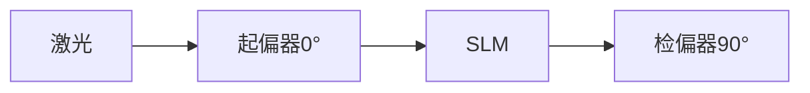

# 为什么要使用偏振片，以及使用相机观察是否需要使用ccd光阑：仅见单一矩形（slm窗口形状）光斑

## 问题摘要

本切片围绕“为什么要使用偏振片，以及使用相机观察是否需要使用ccd光阑：仅见单一矩形（slm窗口形状）光斑”展开。起始诉求是：仅见单一矩形（slm窗口形状）光斑 后续进展或反馈是：不能加入凸透镜吗内容覆盖原始对话 T20-T26。

## 原始对话

当前使用的全息图文件。

# 用户：

仅见单一矩形（slm窗口形状）光斑

# DeepSeek：

**原始回答**

根据您的描述，在SLM上加载全息图后仅观察到**单一矩形光斑**（形状与SLM窗口一致），这明确表明当前是**直接投影模式**而非光学全息再现。以下是专业分析和解决方案：

---

### 一、问题本质：直接投影 vs 光学再现
| **特征** | **直接投影（当前状态）** | **光学全息再现（目标状态）** |
|----------|------------------------|----------------------------|
| **光学机制** | SLM作为空间光阀，像素级控制透光率 | SLM作为衍射元件，调制光波相位 |
| **观测现象** | SLM窗口形状的均匀光斑 | 分离的零级和±1级衍射像 |
| **物理本质** | 振幅调制（0-255控制光强） | 相位调制（0-255控制0-2π相位延迟） |
| **验证方法** | 旋转偏振片仅改变亮度 | 旋转偏振片改变衍射像位置/对比度 |

---

### 二、根本原因诊断
1. **SLM工作模式错误**
   - 您的SLM（透射式

否实现真正的光学再现。

# 用户：

如果没加入偏振片白板上5个光点，中间一个，上下左右各一个是slm正常吗？

# DeepSeek：

**原始回答**

根据您的描述，当**未加入偏振片**时，白板上出现**中心光点+上下左右四个对称光点**，这是SLM（空间光调制器）在**无偏振调制下的典型衍射现象**，属于正常表现，但需要进一步分析其物理机制和全息实验的适配性。以下是详细解析：

---

### **一、现象解释：5个光点的来源**
1. **中心光点（0级衍射）**  
   - **来源**：SLM的**像素间隙**（填充因子77%）导致部分光未被调制，直接透射形成零级光斑。  
   - **强度**：通常最亮，占总光能的30%-50%。

2. **四周四个光点（±1级衍射）**  
   - **来源**：SLM的**像素周期性排列**（1024×768，像素间距12.5μm）产生的夫琅禾费衍射。  
   - **位置公式**：  
     $$
     \Delta x = \frac{\lambda \cdot d}{p}
     $$  
     - \(\lambda\)：激光波长（632.8nm）  
     - \(d\)：SLM到白板距离（假设1米

内容，以便进一步诊断。

# 用户：

什么算正常，加入偏振片，未加入偏振片都写一下

# DeepSeek：

**原始回答**

以下是关于SLM（空间光调制器）在 **加入偏振片** 和 **未加入偏振片** 时的正常表现与异常判断的详细对比说明，帮助您准确诊断实验状态：

---

### **一、未加入偏振片时的正常现象**
#### **1. 典型表现**
- **五个衍射光点**：  
  - **中心光斑（0级）**：最亮，由SLM像素间隙（填充因子77%）的未调制光直接透射形成。  
  - **四周四个光点（±1级）**：对称分布，由SLM像素周期性结构（12.5μm间距）的衍射产生。  
  - **光点间距公式**：  
    $$
    \Delta x = \frac{\lambda \cdot d}{p} \quad (\lambda=632.8\text{nm}, p=12.5\mu m)
    $$  
    例如：当 \(d=1\text{m}\) 时，\(\Delta x \approx 5\text{cm}\)。

- **光强分布**：  
  - 中心光斑强度 > 四周光点（能量集中于零级）。

#### **2. 物

截图，以便进一步诊断。

# 用户：

slm是否正常工作与偏振片，凸透镜，slm间距离有关系吗？

# DeepSeek：

**原始回答**

SLM（空间光调制器）的正常工作与**偏振片配置**、**凸透镜的位置**以及**SLM与光学元件的距离**密切相关，但不同因素对其影响程度和机制不同。以下是具体分析：

---

### **一、偏振片与SLM工作的关系**
#### **1. 核心作用**
- **相位调制的必要条件**：  
  SLM的液晶分子需要通过偏振光实现相位调制。若偏振片配置错误（如角度不匹配），SLM可能仅表现为**振幅调制**（即透光/遮光），无法实现全息再现。
- **正确配置**：  
  - 起偏器方向与SLM液晶分子取向成 **45°**（最大化相位调制）。  
  - 检偏器与起偏器正交（消光位后微调5°-10°以优化衍射效率）。

#### **2. 异常表现**
- **无偏振片**：SLM仅作为光栅，产生固定衍射光点（如您之前观察到的5个光斑）。  
- **偏振片角度错误**：衍射效率低下，再现像暗淡或消失。

---

### **二、凸透镜对SLM工作的影响**
#### **1. 透镜位置的作用**
- **光束准直**：  

现像质量反向优化光路。

# 用户：

那么在凸透镜slm偏振片都在同一条导轨上时，他们之间的距离该为多少

# DeepSeek：

**原始回答**

在光学导轨上搭建SLM（空间光调制器）、凸透镜和偏振片的光路时，各元件之间的距离需根据 **激光扩束准直** 和 **相位调制需求** 精确计算。以下是具体配置方法和步骤：

---

### **一、光路元件功能与距离关系**
| **元件**       | **作用**                  | **距离要求**                                                                 |
|----------------|--------------------------|-----------------------------------------------------------------------------|
| **激光器**     | 提供相干光源              | 出射光束直接进入扩束系统（无严格距离要求）                                   |
| **空间滤波器** | 滤波+扩束    

SLM的波前调制效果。

# 用户：

距离调整完毕，但是未加偏振片仍然是矩形光斑。该如何解决问题。没有slm自带软件。实相位调制模式调节验软件高度集成么办法对slm进行代码调试与

# DeepSeek：

**原始回答**

您面临的核心问题是：**在没有SLM厂商软件的情况下，如何通过硬件调整和外部编程实现相位调制模式**。以下是系统性解决方案，结合硬件配置和代码控制，无需SLM专用软件：

---

### 一、问题根源分析
1. **未加偏振片仅见矩形光斑**：
   - 表明SLM处于**纯振幅调制模式**，液晶分子未产生相位延迟
   - 可能原因：偏振配置错误或驱动信号不匹配

2. **无厂商软件的限制**：
   - 无法直接设置相位模式
   - 无法校准灰度-相位曲线

---

### 二、硬件级解决方案：强制相位调制
#### 偏振光路配置（关键！）

1. **确定SLM液晶分子方向**：
   - 用偏振片检测激光反射：旋转偏振片至反射光最弱时，偏振方向即液晶分子方向（假设为θ）
   - 若无反射光，默认θ=45°（多数SLM标准）

2. **偏振片角度设置**：
   - 起偏器角度：**θ +

过程可在1小时内完成。

# 用户：

不能加入凸透镜吗

# DeepSeek：

**原始回答**

在数字全息实验中，**凸透镜是光路中的关键元件**，必须加入且位置至关重要。以下是凸透镜的必要性、正确配置方法以及您当前问题的解决方案：

---

### 一、凸透镜的必要性
#### **1. 核心作用**
| **功能**         | **原因**                                                                 | **不加透镜的后果**                     |
|------------------|-------------------------------------------------------------------------|----------------------------------------|
| **激光准直**     | 将空间滤波器输出的发散光转为平行光                                        | 光束发散，SLM上光斑不均，再现像模糊      |
| **匹

## 关键结论

原对话最后阶段给出的主要判断或处理方向：以下是凸透镜的必要性、正确配置方法以及您当前问题的解决方案： 一、凸透镜的必要性 **1. 核心作用** **功能** | **原因** | **不加透镜的后果** | **激光准直** | 将空间滤波器输出的发散光转为平行光 | 光束发散，SLM上光斑不均，再现像模糊 | **匹

## 上下文关系

- 所属项目：770f58ad01-optics-03
- 当前阶段：阶段3/3
- 前置切片：为什么要使用偏振片，以及使用相机观察是否需要使用ccd光阑：没有找到厂商支持，但是找到了详细数据_e0472108.md
- 后续切片：无
- 附件说明：无
