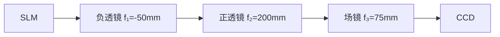

# 在做手册中的光学记录光学再现时，使用ccd观察时如何判断观察到的是光学再现还是投影

## 问题摘要

本切片围绕“在做手册中的光学记录光学再现时，使用ccd观察时如何判断观察到的是光学再现还是投影”展开。起始诉求是：在做手册中的光学记录光学再现时，使用ccd观察时如何判断观察到的是光学再现还是投影 后续进展或反馈是：使用双透镜后ccd相机捕捉的像太大了，没有办法看清slm输出图案内容覆盖原始对话 T1-T3。

## 原始对话

# 用户：

在做手册中的光学记录光学再现时，使用ccd观察时如何判断观察到的是光学再现还是投影

# DeepSeek：

**原始回答**

在光学记录光学再现实验中，使用CCD观察时，可通过以下特征判断观察到的是**光学再现像**而非SLM的简单投影：

---

### **关键判断依据**
1. **位置偏移**：
   - **光学再现像**：因离轴全息记录，再现像会出现在**零级亮斑的左上或右上方**（取决于参考光角度），与光轴中心存在明显偏移（手册图9/11标注）。
   - **投影图像**：直接透射的SLM图像始终位于光轴中心，无空间偏移。

2. **伴随光斑**：
   - **光学再现像**：必然伴随三个衍射级：
     - **零级亮斑**（中心最强直透光）
     - **+1级原始像**（目标再现像）
     - **-1级共轭像**（对称位置的虚像或畸变像）
   - **投影图像**：仅有一个居中图像，无额外衍射斑。

3. **距离依赖性**：
   - **光学再现像**：仅在特定再现距离（≈记录距离 `d`）清晰成像。移动CCD时，像的清晰度会显著变化。
   - **投影图像**：在任何距离均可观察到清晰图像，无距离依赖性。

4.

仅供参考，请仔细甄别。

# 用户：

3m距离太长了是否可以在光路中加入光学器件使得ccd在50cm内观察到

# DeepSeek：

**原始回答**

在光学记录光学再现实验中，若需将观测距离从 **3米缩短至50cm以内**，可通过在光路中加入**光学缩束系统**或**相位补偿设计**实现。以下是具体方案及操作步骤：

---

### **方案一：加入缩束光学系统（推荐）**
#### **原理**  
利用透镜组合压缩光束发散角，等效缩短再现距离，使衍射像在近处清晰成像。

#### **光路改造**  

1. **缩束透镜组设计**：
   - 在SLM与CCD之间加入两片透镜（L1、L2），构成**望远镜缩束系统**（Galilean型或Keplerian型）。
   - **透镜参数示例**（需根据实际计算）：
     - L1（负透镜）：焦距 \( f_1 = -50\text{mm} \)
     - L2（正透镜）：焦距 \( f_2 = 200\text{mm} \)
   

仅供参考，请仔细甄别。

# 用户：

使用双透镜后ccd相机捕捉的像太大了，没有办法看清slm输出图案

# DeepSeek：

**原始回答**

针对CCD视野无法容纳缩束后SLM输出图案的问题，需通过**光路优化**和**参数调整**解决。以下是具体解决方案及操作步骤：

---

### **问题根源分析**
1. **缩束系统副作用**：
   - 望远镜缩束系统（如Galilean型）虽缩短观测距离，但**视角扩大**，导致SLM边缘光线超出CCD靶面。
2. **SLM显示范围**：
   - SLM加载的全息图包含**中心零级斑+边缘再现像**，缩束后像场角增大。

---

### **解决方案**
#### **方案一：优化缩束光路（硬件调整）**

1. **加入场镜（Field Lens）**：
   - 在L2与CCD间添加**正场镜**（焦距 \( f_3 \approx 50-100\text{mm} \)），将发散光束重新准直。
   - **参数计算**：

## 关键结论

原对话最后阶段给出的主要判断或处理方向：原始回答** 针对CCD视野无法容纳缩束后SLM输出图案的问题，需通过**光路优化**和**参数调整**解决。以下是具体解决方案及操作步骤： **问题根源分析** 1. **缩束系统副作用**： 望远镜缩束系统（如Galilean型）虽缩短观测距离，但**视角扩大**，导致SLM边缘光线超出CCD靶面。

## 上下文关系

- 所属项目：81467ddb54-optics-01
- 当前阶段：阶段1/3
- 前置切片：无
- 后续切片：激光原理与分析_cb552067.md
- 附件说明：无
