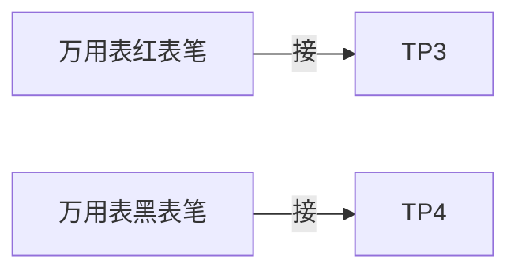

# 帮助我完成自动光功率控制实验：一步一步详细分解实验步骤

## 问题摘要

本切片围绕“帮助我完成自动光功率控制实验：一步一步详细分解实验步骤”展开。起始诉求是：一步一步详细分解实验步骤 后续进展或反馈是：修改一下，测量tp3与tp4是万用表的电压档位还是电流档内容覆盖原始对话 T17-T19。

## 原始对话

APC的直流控制特性！

# 用户：

一步一步详细分解实验步骤

# DeepSeek：

**原始回答**

### **自动光功率控制（APC）实验分步操作指南**

#### **一、实验设备检查**
1. **模块连接检查**
   - 确认25号光收发模块与23号光功率计模块通过光纤跳线连接
   - 检查2号模块TH7(DoutD)到25号模块TH2的导线连接
   - 确保所有模块供电正常（电源指示灯亮）

2. **开关初始状态设置**
   - 25号模块：
     - S3拨至"数字"档（数字光发射模式）
     - J1拨至"10"（APC关闭状态）
     - S1拨至"光接收机"（若使用自发自收）
   - 2号模块：
     - S4拨码开关设置为"ON"（全1电平输出）

3. **旋钮初始位置**
   - W4（主功率调节）：顺时针旋到底
   - W2（功率微调）：旋至中间位置
   - W5（接收灵敏度）：逆时针旋到底（若涉及接收端）

#### **二、系统初始化**
1. **开机顺序**
   - 先开主控电源
   - 再开各模块电源（25号、23号、2号）
   - 等待30秒系统自检完成


均值，确保结果可靠性。

# 用户：

th3与th4测量电压还是电流

# DeepSeek：

**原始回答**

在自动光功率控制（APC）实验中，**TH3和TH4的测量对象及方法**需根据实验环节具体确定。以下是详细说明：

---

### **1. TH3与TH4的功能定义**
#### **（1）TH3（数字输出端）**
- **信号类型**：数字电信号（方波，DC耦合）
- **测量内容**：
  - **电压**：用示波器测量波形幅度（如0-3.3V）
  - **电流**：通常不直接测量（需串联电阻）

#### **（2）TH4（时钟输入/输出端）**
- **信号类型**：数字时钟信号（脉冲，DC耦合）
- **测量内容**：
  - **电压**：用示波器测频率/幅值
  - **电流**：一般不测量（高阻抗输入）

---

### **2. 实验中的具体测量方法**
#### **（1）测量电压（推荐）**
- **工具**：数字万用表（DC电压档）或示波器
- **连接方式**：
  ```mermaid
  graph LR
    A[TH3/TH4] -->|探头正极| B[万用表示波器]
    C[模块GND] 

/TH4的电参数数据！

# 用户：

修改一下，测量tp3与tp4是万用表的电压档位还是电流档

# DeepSeek：

**原始回答**

在自动光功率控制（APC）实验中，**测量TP3与TP4时应使用万用表的直流电压档（DC Voltage）**，而非电流档。以下是详细说明和操作规范：

---

### **1. 测量TP3-TP4的正确方法**
#### **（1）选择万用表档位**
- **档位**：直流电压档（DC V）  
- **量程**：建议选择 **2V或20V档**（TP3-TP4间电压通常为0.5-2.5V）

#### **（2）连接方式**

- **注意**：  
  - 无需断开电路，直接并联测量。  
  - 确保接触良好（可轻刮测试点氧化层）。

#### **（3）计算补偿电流**
- TP3-TP4之间为 **1kΩ电阻（R20）**，测得电压 \( U \) 后：  
  \[
  I_{comp} = \frac{U}{1000} \quad (\text{单位：mA})
  \]

## 关键结论

原对话最后阶段给出的主要判断或处理方向：以下是详细说明和操作规范： **1. 测量TP3-TP4的正确方法** **（1）选择万用表档位** **档位**：直流电压档（DC V） **量程**：建议选择 **2V或20V档**（TP3-TP4间电压通常为0.5-2.5V） **（2）连接方式** **注意**： 无需断开电路，直接并联测量。

## 上下文关系

- 所属项目：0c5649077d-optics-01
- 当前阶段：阶段5/6
- 前置切片：帮助我完成自动光功率控制实验：详细解释实验中的APC_0bfc9676.md
- 后续切片：帮助我完成自动光功率控制实验：表2.2.3 如何填写_7ce6dcee.md
- 附件说明：无
