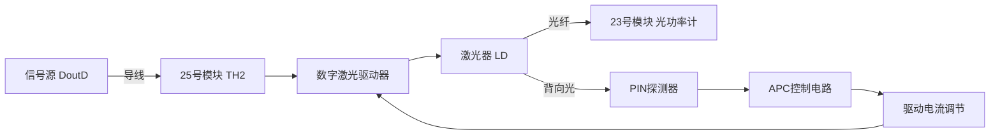

# 帮助我完成自动光功率控制实验：详细解释实验中的APC

## 问题摘要

本切片围绕“帮助我完成自动光功率控制实验：详细解释实验中的APC”展开。起始诉求是：详细解释实验中的APC 后续进展或反馈是：ac还是dc，内容覆盖原始对话 T14-T16。

## 原始对话

签，避免影响后续实验！

# 用户：

详细解释实验中的APC

# DeepSeek：

**原始回答**

### **自动光功率控制（APC）原理详解**

自动光功率控制（Automatic Power Control, APC）是光纤通信中用于稳定激光器（LD）输出光功率的关键技术，其核心是通过闭环反馈系统动态调节激光器的驱动电流，以补偿因温度变化、器件老化等因素引起的功率波动。

---

#### **1. APC的基本组成**
APC系统主要由以下三部分构成：
- **检测单元**：PIN光电二极管（或监控光电二极管），实时检测激光器的背向光或输出光功率，并转换为电信号。
- **控制单元**：比较器或运放电路，将检测信号与预设的参考电压（对应目标光功率）比较，生成误差信号。
- **执行单元**：驱动电路（如MOSFET或三极管），根据误差信号调整激光器的偏置电流（\(I_b\)）。

---

#### **2. APC的工作流程**
1. **光功率采样**  
   - 激光器的部分输出光被PIN二极管检测，产生光电流 \(I_{PD}\)，经跨阻放大器转换为电压 \(V_{PD}\)。  
   - 公式：\(V_{PD}

修复硬件后再继续实验！

# 用户：

帮助我画出自动光功率控制实验线路示意图，经检查仪器可能没什么问题。分析如何实验使得可以做出理想值

# DeepSeek：

**原始回答**

### **自动光功率控制（APC）实验理想操作指南**  
针对仪器无故障但数据异常的情况，以下是优化后的实验方案，确保获得理想数据：

---

### **1. 实验线路示意图**

> **关键连接说明**：
> - **TH2**：数字信号输入（确保S4="ON"，全1电平）
> - **光纤**：25号光发端 → 23号光功率计（S3="内部"）
> - **APC反馈**：PIN→运放→驱动管（重点监测TP3-TP4）

---

### **2. 理想实验流程（逐步操作）**

#### **步骤1：初始化设置**
1. **硬件连接**：
 

换同型号模块对比测试。

# 用户：

ac还是dc，

# DeepSeek：

**原始回答**

在自动光功率控制（APC）实验中，涉及的信号类型既有 **直流（DC）** 也有 **交流（AC）**，具体取决于检测和控制的环节。以下是详细分类和实验操作中的注意事项：

---

### **1. 信号类型区分**
| **环节**               | **信号类型** | **说明**                                                                 |
|-------------------------|--------------|--------------------------------------------------------------------------|
| **激光器驱动电流**       | DC           | 驱动激光器的偏置电流（\(I_b\)）为直流，维持稳定光功率输出。               |
| **光功率检测（PIN输出）** | DC           | PIN光电二极管检测的平均光功率

## 关键结论

原对话最后阶段给出的主要判断或处理方向：以下是详细分类和实验操作中的注意事项： **1. 信号类型区分** **环节** | **信号类型** | **说明** | **激光器驱动电流** | DC | 驱动激光器的偏置电流（\(I_b\)）为直流，维持稳定光功率输出。

## 上下文关系

- 所属项目：0c5649077d-optics-01
- 当前阶段：阶段4/6
- 前置切片：帮助我完成自动光功率控制实验：继续测试，“11”档位w4最大，w2最小_af1ebdf1.md
- 后续切片：帮助我完成自动光功率控制实验：一步一步详细分解实验步骤_3c62ccd8.md
- 附件说明：无
