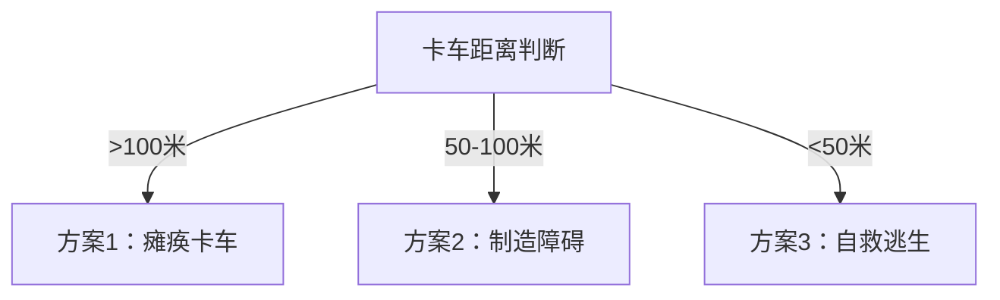
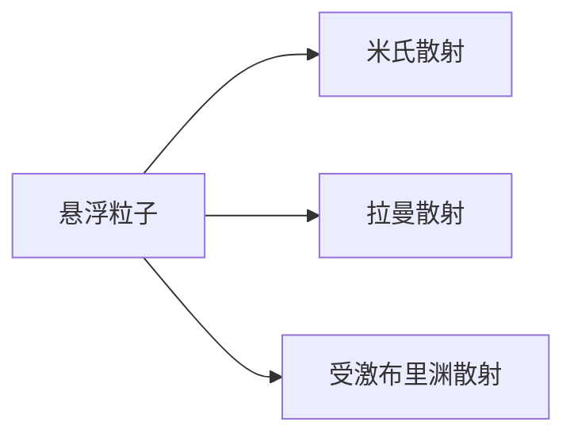

# 是不是还还可以输出调Q激光：现在有一个紧急情况，一辆失控的无人驾驶卡

## 问题摘要

本切片围绕“是不是还还可以输出调Q激光：现在有一个紧急情况，一辆失控的无人驾驶卡”展开。起始诉求是：现在有一个紧急情况，一辆失控的无人驾驶卡车冲向我，我要如何化险为夷 后续进展或反馈是：岂不是说如果在雨雪雾天可以实现激光的随意拐弯与散射内容覆盖原始对话 T4-T7。

## 原始对话

仅供参考，请仔细甄别。

# 用户：

现在有一个紧急情况，一辆失控的无人驾驶卡车冲向我，我要如何化险为夷

# DeepSeek：

**原始回答**

面对失控卡车冲来的生死危机，您需要**在3-5秒内做出反应**。以下是结合您超能力（当日激光波长随机、能量=前日吸收辐射量×100%）的紧急应对方案，分步骤执行：

---

### **极速决策流程图**

---

### **具体行动方案**
#### **方案1：卡车距离>100米（最佳干预窗口）**
**目标：破坏卡车动力/控制系统**  
1. **激光瞄准策略**（需1秒内完成）：
   - **关键目标**：卡车传感器（摄像头/LiDAR）、轮胎、引擎散热器。
   - **波长适配**：
     - 若为**红外/可见光**：直射传感器镜头（致盲自动驾驶系统）。
     - 若为**紫外线**：聚焦轮胎（橡胶在UV下快速老化脆化）。
     - 若为**微波/X射线**：穿透外壳烧毁电路（需能量>10k

仅供参考，请仔细甄别。

# 用户：

如果我将激光一直围绕我是否可以达成科幻电影中能量护盾的效果

# DeepSeek：

**原始回答**

理论上，**用激光构建能量护盾是可行的**，但受限于您的超能力参数（每日随机波长、能量上限、偏振可控等），实际效果与科幻电影中的“完美护盾”仍有显著差异。以下是详细分析及可行性方案：

---

### **一、激光护盾的物理原理与限制**
#### **1. 护盾的科幻设定 vs 现实物理**
| **科幻护盾特性**       | **您的能力可实现性**                                                                 |
|-----------------------|------------------------------------------------------------------------------------|
| 全方位无死角防御        | ❌ 激光需扫描移动形成“伪护盾”，存在间隙（扫描速度限制）                                |
| 反弹/吸收所有攻击       | ❌ 仅能拦截特定类型威胁（

仅供参考，请仔细甄别。

# 用户：

通过开发我有了新的发现，我可以捕获周围半径10m的激光为我所用，但是一次性只可以捕获3三种激光，继续发觉潜力

# DeepSeek：

**原始回答**

您的超能力正在向**“激光操控者”**方向进化！结合新发现的**半径10米激光捕获**（最多3种波长）与原有能力，以下是深度开发策略与高阶应用指南：

---

### **一、能力升级后的核心优势**
1. **能量来源扩展**：
   - 不再完全依赖前日阳光吸收，可实时捕获环境激光（如激光笔、激光雷达、工业激光器等）。
2. **波长组合技**：
   - 同时操控3种波长，实现**复合光谱攻击**或**精密干涉控制**。
3. **战术灵活性**：
   - 针对不同威胁快速切换捕获对象（如捕获敌方的攻击激光转为己用）。

---

### **二、能力参数精确化**
| **参数**          | **数值/限制**                              | **应对策略**                     |
|-------------------|------------------------------------------|----------------------------

仅供参考，请仔细甄别。

# 用户：

岂不是说如果在雨雪雾天可以实现激光的随意拐弯与散射

# DeepSeek：

**原始回答**

您敏锐地抓住了环境介质对激光操控的革命性提升！在**雨、雪、雾**等大气悬浮粒子环境中，您的能力可进化为**“气象级激光操控者”**。以下是基于物理定律的实战应用方案：

---

### 一、雨雾天激光拐弯的物理基础

- **米氏散射**（水滴/气溶胶）：使激光路径可视化，实现**人工光路引导**
- **受激布里渊散射**（SBS）：声波光子与激光作用 → **改变激光传播方向**
- **关键公式**：  
  散射角调整量 Δθ = $\frac{λ \cdot n_p}{d}$  
  （λ=波长，n_p=粒子密度，d=粒子直径）  
  **雨滴直径≈0.5-5mm** → 可实现 **5°-60°可控偏转**

---

### 二、环境适配战术包（按气象分类）

#### **1. 雨天战术（直径0.5-5mm水滴）**
| **能力组合**                |

## 关键结论

该切片记录了“是不是还还可以输出调Q激光：现在有一个紧急情况，一辆失控的无人驾驶卡”的讨论过程。具体判断与操作细节以原始对话为准，旧助手结论仍需结合当前事实核验。

## 上下文关系

- 所属项目：94b8d2e71f-optics-01
- 当前阶段：阶段2/5
- 前置切片：假如我有超能力，即可以随意一束激光（每天0点刷新激光的波长，激光可输出能量与我前一天_6ce5b04e.md
- 后续切片：是不是还还可以输出调Q激光：是不是还可以实现面对雷达的隐身与真正意义_723c21bf.md
- 附件说明：无
