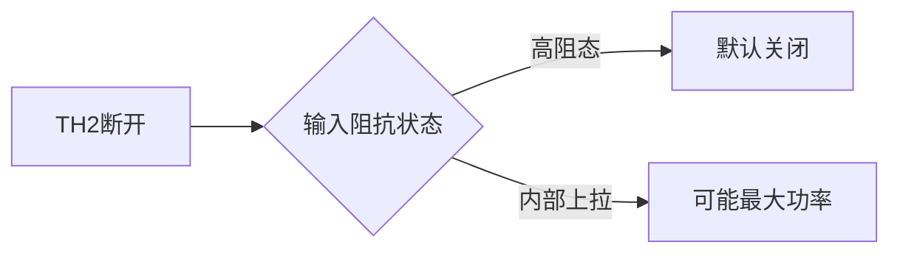

# 详细的帮助我完成光源P-I特性曲线测试，并且解答是否可以使用w2调节激光·：如果我把th2连接断开，是否激光器可以发

## 问题摘要

本切片围绕“详细的帮助我完成光源P-I特性曲线测试，并且解答是否可以使用w2调节激光·：如果我把th2连接断开，是否激光器可以发”展开。起始诉求是：如果我把th2连接断开，是否激光器可以发出激光，（激光器档位还在数字档） 后续进展或反馈是：消光比测试p00不也是输出低电平，不应该也是没激光输出吗内容覆盖原始对话 T13-T15。

## 原始对话

**，需要硬件级维修。

# 用户：

如果我把th2连接断开，是否激光器可以发出激光，（激光器档位还在数字档）

# DeepSeek：

**原始回答**

### **关于断开TH2后激光器工作状态的详细分析**

#### **1. 理论分析**
在ROE-CB05系统中，TH2（数字输入端）的连接状态与激光器工作关系如下：

| 连接状态 | 信号通路 | 激光器行为 | 风险等级 |
|----------|----------|------------|----------|
| **TH2正常连接** | 数字信号控制驱动电路 | 受控发光 | 安全 |
| **TH2完全断开** | 悬空输入（高阻态） | 可能行为：<br>① 完全关闭（默认安全状态）<br>② 最大功率输出（电路设计依赖） | 高风险 |

#### **2. 具体到您的系统验证**
**实验条件**：
- S3="数字"模式
- W4/W2旋至最大
- J1="10"（APC关闭）

**预期结果**：


**

驱动电路而非冒险测试。

# 用户：

我换一种问法th2连接不变，全部输出低电平，激光器是否应该输出激光

# DeepSeek：

**原始回答**

### **关于TH2保持连接且全低电平时激光器工作状态的权威分析**

#### **1. 数字光发射机核心逻辑**
在ROE-CB05系统中，激光器的开关控制遵循以下真值表：

| TH2输入电平 | APC状态 | W4位置 | 激光器输出 |
|-------------|----------|---------|------------|
| 高电平(＞2.7V) | 任意     | 有效    | **发光**   |
| 低电平(＜0.4V) | OFF(J1=10) | 最大    | **理论不发光** |
| 低电平(＜0.4V) | ON(J1=11)  | 最大    | **可能微光** |

#### **2. 您描述条件下的详细工作机制**
**给定参数**：
- TH2保持连接
- 全低电平（S4="OFF"）
- S3="数字"模式
- W4/W2最大
- J1="10"(APC关闭)

**信号通路分析**：
```mermaid
graph LR
    TH2 --> U3(比较器LM319)
 

步骤进行电流通路检测。

# 用户：

消光比测试p00不也是输出低电平，不应该也是没激光输出吗

# DeepSeek：

**原始回答**

### **关于消光比测试中P₀₀（全"0"码）光功率的深度解析**

#### **1. 理论预期 vs. 实际系统**
| 参数       | 理想情况              | 实际通信系统要求        | 物理实现原理                     |
|------------|-----------------------|-------------------------|----------------------------------|
| **全"0"码** | 绝对零光功率（0μW）   | 允许微量残余光（5-50μW）| 偏置电流（Ib）维持激光器稳定性   |

#### **2. 为什么P₀₀≠0？三大核心原因**
1. **偏置电流（Ib）的必要性**  
   - 激光器需要Ib≈0.7-0.9Ith（阈值电流）来：
     ```mermaid
     graph LR
         A[快速响应] --> B[减少开启延迟]
         C[避免弛豫振荡] -->

## 关键结论

原对话最后阶段给出的主要判断或处理方向：三大核心原因** 1. **偏置电流（Ib）的必要性** 激光器需要Ib≈0.7-0.9Ith（阈值电流）来： ```mermaid graph LR A[快速响应] --> B[减少开启延迟] C[避免弛豫振荡] -->

## 上下文关系

- 所属项目：c99961cee9-optics-01
- 当前阶段：阶段5/7
- 前置切片：详细的帮助我完成光源P-I特性曲线测试，并且解答是否可以使用w2调节激光·：s4全部调整到0，w2w4调整到最大p0_3c802075.md
- 后续切片：详细的帮助我完成光源P-I特性曲线测试，并且解答是否可以使用w2调节激光·：还是有点没理解，再仔细讲解一下_a68eb13e.md
- 附件说明：无
