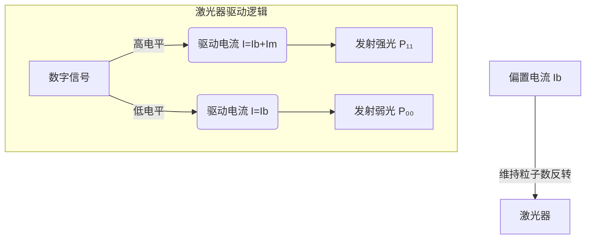
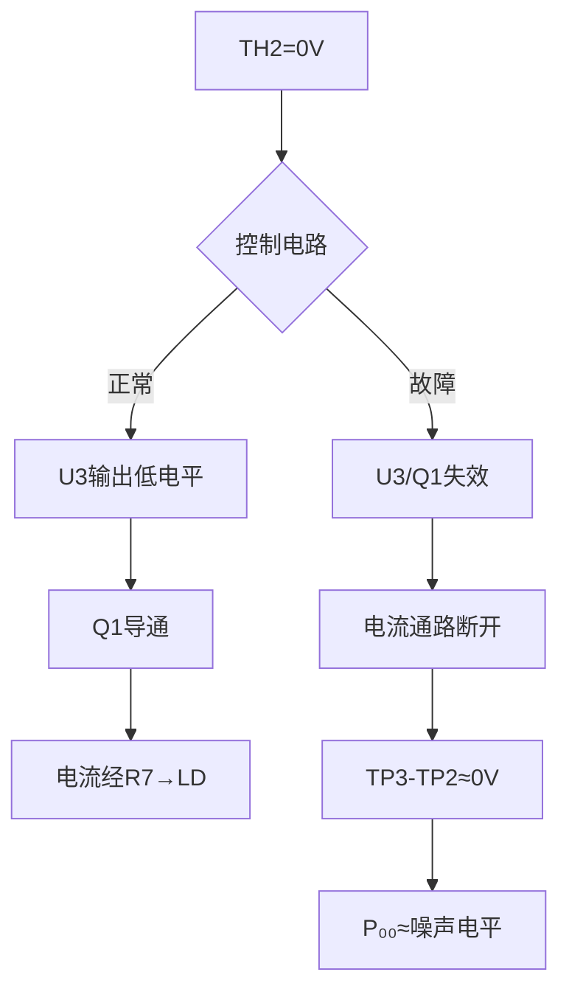

# 详细的帮助我完成光源P-I特性曲线测试，并且解答是否可以使用w2调节激光·：还是有点没理解，再仔细讲解一下

## 问题摘要

本切片围绕“详细的帮助我完成光源P-I特性曲线测试，并且解答是否可以使用w2调节激光·：还是有点没理解，再仔细讲解一下”展开。起始诉求是：还是有点没理解，再仔细讲解一下 后续进展或反馈是：s4全0电平，tp2，tp3<1mv内容覆盖原始对话 T16-T18。

## 原始对话

化（需Ith测试验证）

# 用户：

还是有点没理解，再仔细讲解一下

# DeepSeek：

**原始回答**

### **彻底解析消光比测试中的 P₀₀ 问题**

#### **一、核心矛盾点**
**您的疑问**：  
_"全0码时激光器应该关闭，为何实际存在 P₀₀（残余光功率）？"_

**简答**：  
激光器 ≠ LED，需要**偏置电流（Ib）维持工作点**，全0码时并非完全关闭，而是维持微量发光！

---

#### **二、激光器工作原理（图解）**

- **Ib（偏置电流）**：0.7~0.9倍阈值电流，使激光器处于"临界发光"状态
- **Im（调制电流）**：承载数据的波动电流

> 📌 **关键结论*

判断故障源的核心指标！

# 用户：

s4全0电平，tp2，tp3<1uw

# DeepSeek：

**原始回答**

### **终极解析：S4全0电平下TP2-TP3光功率＜1μW的深度机制**

#### 一、核心问题本质
您观察到的现象：  
**S4=OFF（全0码）→ TP2-TP3光功率＜1μW**  
这正是消光比测试中 **P₀₀ 的测量点**，但该值远低于正常范围（5-50μW）。以下是分层解析：

---

### 二、信号通路与物理实现

#### 关键节点预期值：
| 节点        | 正常值 (S4=OFF) | 您的测量值 |

这是锁定故障源的关键！

# 用户：

s4全0电平，tp2，tp3<1mv

# DeepSeek：

**原始回答**

### **终极故障诊断报告：TP3-TP2电压＜1mV的深度解析**

#### 一、核心问题锁定
**您的测量数据**：
- S4="OFF"（全0码）
- TP3-TP2间电压：**<1mV**
- 电阻R7=33Ω

**计算驱动电流**：
\[ I = \frac{U}{R} = \frac{0.001V}{33Ω} ≈ 0.03mA \]

**结论**：  
驱动电流几乎为零，证明**激光器驱动电路完全未工作**！

---

### 二、故障机制图解

---

### 三、故障点定位表
| 故障点 | 检测

## 关键结论

原对话最后阶段给出的主要判断或处理方向：原始回答** **终极故障诊断报告：TP3-TP2电压＜1mV的深度解析** 一、核心问题锁定 您的测量数据**： S4="OFF"（全0码） TP3-TP2间电压：**<1mV** 电阻R7=33Ω 计算驱动电流**： \[ I = \frac{U}{R} = \frac{0.001V}{33Ω} ≈ 0.03mA \] 结论**： 驱动电流几乎为零，证明**激光器驱动电路完全未工作**！

## 上下文关系

- 所属项目：c99961cee9-optics-01
- 当前阶段：阶段6/7
- 前置切片：详细的帮助我完成光源P-I特性曲线测试，并且解答是否可以使用w2调节激光·：如果我把th2连接断开，是否激光器可以发_e6b0931a.md
- 后续切片：详细的帮助我完成光源P-I特性曲线测试，并且解答是否可以使用w2调节激光·：输出消光比为36.3dB是否正常_0e013776.md
- 附件说明：无
