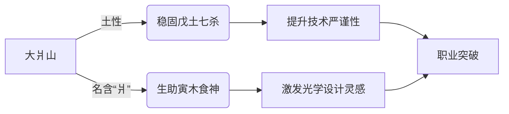

# 八字命格与流年讨论：性格喜欢水，是否会造成什么影响

## 问题摘要

本切片围绕“八字命格与流年讨论：性格喜欢水，是否会造成什么影响”展开。起始诉求是：性格喜欢水，是否会造成什么影响 后续进展或反馈是：虽说地名叫银湖，但是住处并看不见湖，起床窗外可以看见一座山峰叫做大爿山内容覆盖原始对话 T9-T11。

## 原始对话

独属于自己的华彩乐章。

# 用户：

性格喜欢水，是否会造成什么影响

# DeepSeek：

**原始回答**

根据您的八字（**辛巳 壬辰 壬寅 戊申**）和亲水倾向，现结合命局分析影响及调整建议：

---
### **命局水势本质**
1. **先天水态**：  
   - 日主壬水坐寅（病地），但得月令辰库+月干比肩 → **中强之水**（如江河奔涌，非泛滥汪洋）  
   - 时干戊土七杀制水 → **水势有制**（形成「食神制杀」的平衡格局）  

2. **亲水行为**：  
   主动亲近水域（居住近水、水上运动、多穿黑色等），相当于 **「人为增强水五行」**。

---
### **潜在影响分析**
#### ✅ 增益效应
| 领域        | 积极作用                  | 命理机制                     |  
|------------|--------------------------|----------------------------|  
| **思维能力** | 直觉力、策略性提升        | 水主智，补益日主壬水         |  
| **事业机遇** 

舵前行，抵达理想彼岸。

# 用户：

所以我在杭州银湖工作，是进行大学教学仪器光学工程师，是否符合命格

# DeepSeek：

**原始回答**

根据您的八字（**辛巳 壬辰 壬寅 戊申**）和职业属性，现从命理角度分析匹配度：

---
### **命格与职业契合点**
1. **食神制杀格的天然适配**  
   - 时干戊土七杀（技术难题）被日支寅木食神（创意解法）制约 → **光学工程师需破解精密技术问题**的特性完全应合此格局  
   - 月令辰土水库通壬水 → 象征**光学仪器中光的流体特性研究**（如光纤传导、透镜折射）  

2. **五行能量共振**  
   | 职业要素       | 命理呼应                     |  
   |----------------|----------------------------|  
   | **光学（火）** | 年支巳火（偏财）被激活 → 教学仪器研发带来财运 |  
   | **精密（金）** | 辛金透干+申金时支 → 应合金相仪器制造的命理基础 |  
   | **教育（木）** | 寅木食神 → 将技术转化为教学方案的天赋 |  

3. **地域加持**  
   - 杭州属

写属于自己的科技诗篇。

# 用户：

虽说地名叫银湖，但是住处并看不见湖，起床窗外可以看见一座山峰叫做大爿山

# DeepSeek：

**原始回答**

根据您的八字（**辛巳 壬辰 壬寅 戊申**）和居住环境（窗外见大爿山），现从风水与命理角度综合分析：

---
### **环境能量解读**
1. **山形补益**  
   - 山属土，对应您八字月令辰土、时干戊土 → **增强命局制水平衡**  
   - 「大爿山」之名暗藏玄机：  
     ✅ **「爿」（pán）** 为劈开的木片（补益日支寅木）  
     ✅ **「大」** 应辰土水库（厚载万物）  

2. **缺湖的命理转化**  
   - 虽名「银湖」不见水，但：  
     → 壬水日主自通辰库（月支），**不依赖外水**  
     → 山势反成「水之堤坝」，防壬水泛滥（应合时干戊土制水）  

---
### **山势与命局互动**

---
##

## 关键结论

该切片记录了“八字命格与流年讨论：性格喜欢水，是否会造成什么影响”的讨论过程。具体判断与操作细节以原始对话为准，旧助手结论仍需结合当前事实核验。

## 上下文关系

- 所属项目：6b68ff7090-thought-01
- 当前阶段：阶段3/6
- 前置切片：2001年4月9日男生命格分析原理与分析_c5c13595.md
- 后续切片：处于富阳区会不会使得火势过大_4b78a869.md
- 附件说明：无
