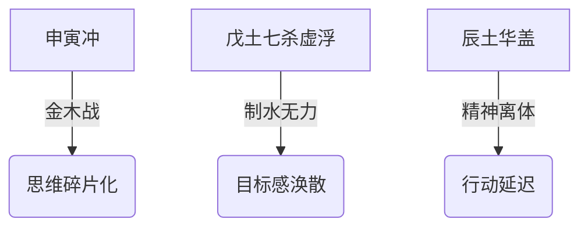

# 我的mbti是intp

## 问题摘要

本切片围绕“我的mbti是intp”展开。起始诉求是：我的mbti是intp 后续进展或反馈是：帮帮我如何提高自控力内容覆盖原始对话 T18-T19。

## 原始对话

仅供参考，请仔细甄别。

# 用户：

我的mbti是intp

# DeepSeek：

**原始回答**

根据您的八字（**辛巳 壬辰 壬寅 戊申**）与INTP人格特质，结合命理与心理学交叉分析如下：

---
### **INTP特质与命局共鸣点**
#### 1. **核心认知功能契合**
| **MBTI功能** | **八字映射**               | 表现举例                     |  
|--------------|--------------------------|----------------------------|  
| **主导：Ti**  | 壬水智性 + 申金偏印        | 光学仪器研发需精密逻辑（Ti） |  
| **辅助：Ne**  | 寅木食神发散               | 突发灵感改进设计方案（Ne）   |  

#### 2. **天然优势强化**
- **伤官驾杀格局** → 破解复杂系统的天赋（应合Ti）  
- **申寅冲** → 思维跳跃性（Ne显化）被命理合理化  

---
### **潜在冲突与调适**
#### ⚠️ **能量矛盾点

仅供参考，请仔细甄别。

# 用户：

帮帮我如何提高自控了力

# 用户：

帮帮我如何提高自控力

# DeepSeek：

**原始回答**

根据您的八字（**辛巳 壬辰 壬寅 戊申**）和INTP特质，结合命理与认知科学，为您定制自控力提升方案：

---
### **自控力薄弱的核心症结**
#### 1. **命理根源**

#### 2. **INTP强化机制**
- Ti功能过度反刍 → 消耗决策能量  
- Ne功能发散过载 → 逃避现实约束  

---
### **四维提升方案**
#### 1. **时间锚定法（借火固土）**
- **巳时（9-11点）**：  
  激活年支巳火（正官）→ 处理**最抗拒的要事**  
- **操作**：  
  ✅ 用红色计时器设定45分钟专注段  
  ✅ 完成后用激光笔照射手心3秒（火象仪式）  

#### 2. **空间结界术（以木制金）**
- **工作区改造**：  
  🔷 铺设墨绿桌垫（寅木能量场）

## 关键结论

该切片记录了“我的mbti是intp”的讨论过程。具体判断与操作细节以原始对话为准，旧助手结论仍需结合当前事实核验。

## 上下文关系

- 所属项目：6b68ff7090-thought-01
- 当前阶段：阶段6/6
- 前置切片：感觉没什么异性缘_6a2d34cf.md
- 后续切片：无
- 附件说明：无
