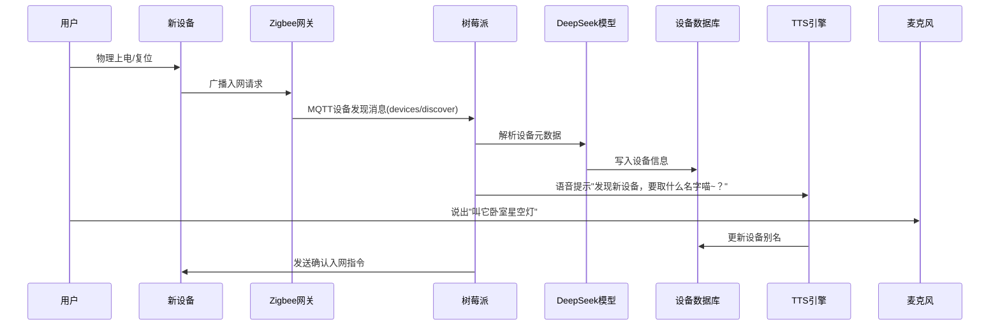

# 这套方案是否要树莓派一直连接电脑

## 问题摘要

本切片围绕“这套方案是否要树莓派一直连接电脑”展开。起始诉求是：这套方案是否要树莓派一直连接电脑 后续进展或反馈是：如果我安装了新的智能家居设备是否可以不需要再烧录一遍，直接控制内容覆盖原始对话 T16-T17。

## 原始对话

任务分流到家庭服务器。

# 用户：

这套方案是否要树莓派一直连接电脑

# DeepSeek：

**原始回答**

您的智能家居中控方案**不需要树莓派一直连接电脑**，整个系统设计为完全独立运行。以下是关键说明：

---

### **一、系统独立性设计**
| 模块                | 运行方式                  | 依赖设备               |
|---------------------|-------------------------|----------------------|
| **语音识别**        | 本地Vosk引擎             | ReSpeaker麦克风阵列   |
| **NLP推理**         | Coral加速卡+量化模型     | Google Coral USB     |
| **设备控制**        | Zigbee/WiFi本地协议      | SONOFF网关           |
| **语音合成**        | 本地Festival TTS引擎     | 内置扬声器           |

---

### 

交互即可实现全屋控制。

# 用户：

如果我安装了新的智能家居设备是否可以不需要再烧录一遍，直接控制

# DeepSeek：

**原始回答**

在您的现有架构下，**添加新智能家居设备无需重新烧录系统**。以下是实现动态扩展的完整方案：

---

### **一、设备接入自动化流程**

---

### **二、关键技术支持**
#### 1. **跨协议自动发现**
| 协议      | 发现方式                            | 触发命令

## 关键结论

该切片记录了“这套方案是否要树莓派一直连接电脑”的讨论过程。具体判断与操作细节以原始对话为准，旧助手结论仍需结合当前事实核验。

## 上下文关系

- 所属项目：488c80393e-life-06
- 当前阶段：独立主题
- 前置切片：无
- 后续切片：无
- 附件说明：无
