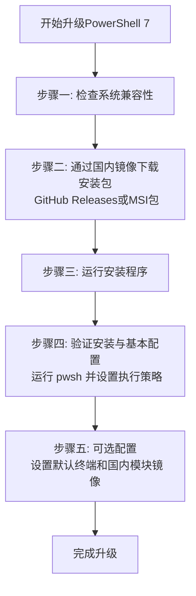

# DeepSeek与PowerShell安装配置：仔细阅读之前的对话总结，回答问题# De

## 问题摘要

本切片围绕“DeepSeek与PowerShell安装配置：仔细阅读之前的对话总结，回答问题# De”展开。起始诉求是：仔细阅读之前的对话总结，回答问题# DeepSeek API PowerShell 集成 - 重新开始指南 📋 当前状态总结 ✅ 已确认的工作项 **API 连接正常**：英文查询 `testds "Hello"` 成功返回响应 **网络通信正常**：能够与 DeepSeek… 后续进展或反馈是：电脑有winget环境但是，下载连接还是github下载超时了内容覆盖原始对话 T1-T3。

## 原始对话

# 用户：

仔细阅读之前的对话总结，回答问题# DeepSeek API PowerShell 集成 - 重新开始指南

## 📋 当前状态总结

### ✅ 已确认的工作项
- **API 连接正常**：英文查询 `testds "Hello"` 成功返回响应
- **网络通信正常**：能够与 DeepSeek API 建立连接
- **基本功能正常**：请求发送和响应接收机制工作

### ❌ 待解决的问题
- **中文显示乱码**：中文响应显示为乱码字符（如 `ä½ å¥½ï¼ð`）
- **编码转换问题**：需要正确处理 UTF-8 编码的中文内容

## 🔧 解决方案路径

### 方案一：编码修复（优先尝试）
```powershell
# 在 Invoke-DeepSeek 函数中添加编码修复逻辑
$bytes = [System.Text.Encoding]::GetEncoding("ISO-8859-1").GetBytes($answer)
$result = [System.Text.Encoding]::UTF8.GetString($bytes)
```

### 方案二：使用 Windows Terminal（推荐）
1. 安装 Windows Terminal：`winget install Microsoft.WindowsTerminal`
2. 在更现代的终端中测试，通常能更好地处理 Unicode

### 方案三：临时英文模式
```powershell
# 暂时使用英文避免编码问题
dse "Please answer in Chinese: 请用中文介绍你自己"
```

## 🚀 立即行动步骤

### 步骤 1：测试当前状态
```powershell
# 重新加载配置文件
. $PROFILE

# 测试基本功能
testds "Hello"
testds "你好"
```

### 步骤 2：应用编码修复
如果中文仍然乱码，在函数中添加编码转换逻辑

### 步骤 3：验证修复
```powershell
ds "请用中文简单介绍你自己" -NoHistory
```

## 💡 关键发现

1. **根本原因**：PowerShell 5.1 的默认控制台对 UTF-8 支持有限
2. **API 工作正常**：问题纯粹是显示层面的编码问题
3. **解决方案**：需要在接收响应后进行正确的编码转换

## 📝 后续建议

1. **短期**：使用编码修复方案继续在 PowerShell 5.1 中工作
2. **中期**：考虑安装 Windows Terminal 获得更好的 Unicode 支持
3. **长期**：争取安装 PowerShell 7，提供原生的 UTF-8 支持

---

**是否需要我详细解释某个特定步骤，或者你有其他偏好？** 我们可以从编码修复开始，或者尝试其他方案。

# DeepSeek：

**原始回答**

好的，我已经仔细阅读了对话总结。

根据总结，您的问题是：**如何解决 DeepSeek API 在 PowerShell 集成中返回中文乱码（如 `ä½ å¥½ï¼ð`）的问题？**

这是一个纯粹的**显示编码问题**，而非 API 或网络故障。根本原因在于您使用的 PowerShell 5.1 默认控制台（如 `conhost.exe`）对 UTF-8 编码的支持不完善。

以下是基于总结为您梳理的解决方案，请按顺序尝试：

### 首选且最有效的解决方案：应用编码修复

这是最直接、无需安装新软件的解决方法。请按以下步骤操作：

1.  **找到并编辑您的 PowerShell 配置文件**（通常为 `Microsoft.PowerShell_profile.ps1`）。
2.  **在您的 `Invoke-DeepSeek` 或 `ds` 函数中**，找到接收 API 响应（`$answer` 或 `$response.content`）的部分。
3.  **在返回或显示结果之前，添加以下两行编码转换代码**：

```powe

 配置文件的具体步骤？

# 用户：

OK，我现在想要升级到powershell7一劳永逸，帮助使用国内镜像使用powershell升级

# DeepSeek：

**原始回答**

你决定升级到 PowerShell 7 来一劳永逸地解决中文编码等问题，并用国内镜像加速，这个思路非常正确。作为AI助手，我理解你希望过程清晰顺畅。我会帮你梳理利用国内镜像升级 PowerShell 7 的步骤。

虽然搜索结果中的相关信息较少，但我会结合自己的知识，给你提供一个清晰的流程。下面是主要步骤的概览：



下面是每个步骤的详细说明。

# 🚀 使用国内镜像升级PowerShell 7指南

## 📋 升级前的准备工作


何问题，欢迎随时提问。

# 用户：

电脑有winget环境但是，下载连接还是github下载超时了

# DeepSeek：

**原始回答**

好的，这个问题非常常见。Winget 默认的源（Source）就是 GitHub，在国内直接访问很容易因为网络问题导致下载超时或失败。

别担心，我们有几种方法可以解决。最推荐的方法是**使用 Winget 的本地安装包缓存功能**，或者**手动下载后让 Winget 进行安装**。

---

### 方案一：使用 Winget 的 `--download` 和 `--install` 选项（推荐）

这是最优雅的解决方案。它先只下载安装包，如果下载失败，你可以借助其他工具（如浏览器、下载 accelerator）下载同版本安装包，再让 winget 完成安装。

**步骤如下：**

1.  **首先，尝试让 winget 只下载而不安装：**
    以**管理员身份**打开 PowerShell 或 CMD，运行：
    ```powershell
    winget install Microsoft.PowerShell --download --accept-package-agreements --accept-sou

## 关键结论

原对话最后阶段给出的主要判断或处理方向：原始回答** 好的，这个问题非常常见。Winget 默认的源（Source）就是 GitHub，在国内直接访问很容易因为网络问题导致下载超时或失败。

## 上下文关系

- 所属项目：baf411af77-software-01
- 当前阶段：阶段1/5
- 前置切片：无
- 后续切片：DeepSeek与PowerShell安装配置：还是找个国内镜像吧，你给的加速连接一个要_dbb00f4f.md
- 附件说明：无
