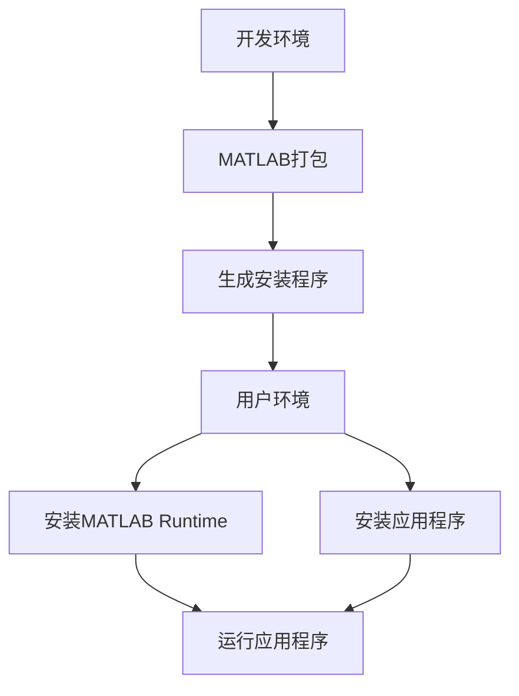

# 更换方案使用下载matlab runtime，详细讲解

## 问题摘要

本切片围绕“更换方案使用下载matlab runtime，详细讲解”展开。起始诉求是：更换方案使用下载matlab runtime，详细讲解内容覆盖原始对话 T4-T4。

## 原始对话

整MATLAB的需求。

# 用户：

更换方案使用下载matlab runtime，详细讲解

# DeepSeek：

**原始回答**

# 使用MATLAB Runtime部署独立应用程序的完整指南

我将详细讲解如何使用MATLAB Runtime部署应用程序，让用户无需安装完整MATLAB即可运行您的程序。

## 整体解决方案流程



## 详细步骤说明

### 第一步：在MATLAB中打包应用程序

1. **准备MATLAB环境**
   - 确保安装MATLAB Compiler工具箱
   - 准备主程序文件：`散斑b套数据分析.m`
   - 准备应用程序图标（.ico格式）

2. **创建打包脚本 (`build_speckle_app.m`)**
```matlab
function build_speckle

## 关键结论

原对话最后阶段给出的主要判断或处理方向：整体解决方案流程 详细步骤说明 第一步：在MATLAB中打包应用程序 1. **准备MATLAB环境** 确保安装MATLAB Compiler工具箱 准备主程序文件：`散斑b套数据分析.m` 准备应用程序图标（.ico格式） 2. **创建打包脚本 (`build_speckle_app.m`)** ```matlab function build_speckle

## 上下文关系

- 所属项目：4197a0b33d-software-01
- 当前阶段：阶段2/2
- 前置切片：个.m文件用于matlab，但是使用他要电脑下载matlab，太大了，怎么样可以_a302865c.md
- 后续切片：无
- 附件说明：无
