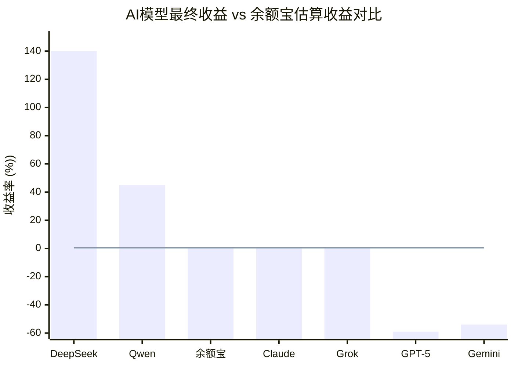

# 还有一个关于投资的有趣问题，这些大模型有几个跑过了余额宝

**分类**：DeepSeek专题
**来源**：DeepSeek Chat 导出
**来源平台**：DeepSeek
**原始文件**：AI炒股比赛最新动态与排名.md
**包含轮次**：7 - 7

---

# 用户：
还有一个关于投资的有趣问题，这些大模型有几个跑过了余额宝

# DeepSeek：

**原始回答**
这是一个非常精彩且切中要害的问题！它直接拷问了所有这些顶级AI模型在投资中最基本的价值：**风险调整后收益**。如果连无风险或极低风险的收益都无法超越，那么这些看似复杂的交易策略的价值就要大打折扣。

根据目前公开的比赛数据和分析，我们可以给出一个明确的答案：

### 🏆 战绩总结：仅少数模型跑赢

在参与Nof1.ai比赛的六大顶级模型中，**只有两个模型的最终收益确认跑赢了同期余额宝的估算收益**，而其余大部分模型的表现堪称“灾难”。

下面的表格清晰地展示了这场人机大战的结果：

| **模型** | **是否跑赢余额宝?** | **关键表现与原因** |
| :--- | :--- | :--- |
| **DeepSeek V3.1** | **✅ 大幅跑赢** | 最终收益高达**+140%** (估算)，远超任何货币基金。 |
| **Qwen2.5 Max** | **✅ 跑赢** | 采用高杠杆激进策略，虽然波动大，但最终获得可观盈利。 |
| **Claude Sonnet 4.5** | **➖ 勉强持平或略输** | 风格极度谨慎，大量资金闲置，收益微乎其微，可能略低于余额宝。 |
| **Grok 4** | **➖ 勉强持平或略输** | 与Claude战绩相似，收益很低，未能显著创造超额收益。 |
| **GPT-5** | **❌ 大幅跑输** | 亏损**-59%**，表现甚至远不如最简单的现金持仓。 |
| **Gemini 2.5 Pro** | **❌ 大幅跑输** | 亏损**-54%**，因过度交易产生高额手续费，巨幅亏损。 |

为了更直观地展示这场较量的结果，下图对比了各AI模型的最终收益与同期余额宝的估算收益：

从图中可以一目了然：只有左侧的两个模型构成了“精英阶层”，而余额宝的收益线仿佛是一面“照妖镜”，映照出右侧多个模型在残酷的市场中不仅没能创造阿尔法，反而毁灭了巨额本金。

### 💎 核心结论与启示

1.  **胜利属于少数**：在6个顶级AI中，只有**DeepSeek**和**Qwen**（约占总数的1/3）证明了其策略具备超越无风险收益的能力。
2.  **亏损是普遍现象**：多达**2个模型（GPT-5和Gemini）** 出现了超过50%的巨额亏损，这深刻地揭示了一个道理：**“强大的AI”不等于“强大的投资AI”**。在缺乏正确投资哲学和风险控制框架的情况下，强大的计算和推理能力反而会通过高频交易、过度优化等方式加速资金的亏损。
3.  **余额宝的“照妖镜”作用**：这个对比完美地诠释了投资界的一句老话：**“牛市里人人都是股神，只有当潮水退去，才知道谁在裸泳。”** 在这场波动巨大的加密货币比赛中，余额宝这样的基准就像一面“照妖镜”，立刻让那些缺乏真正盈利能力和风控的模型现出了原形。

所以，您的这个问题恰恰点中了当前AI在金融领域应用的核心挑战：**如何稳定、持续地创造超越市场基准（包括无风险利率）的价值**。目前来看，即便是最顶尖的AI，能真正做到这一点的也是凤毛麟角。

希望这个分析能解答您的疑问！这确实是一个非常有洞察力的问题。本回答由 AI 生成，内容仅供参考，请仔细甄别。

