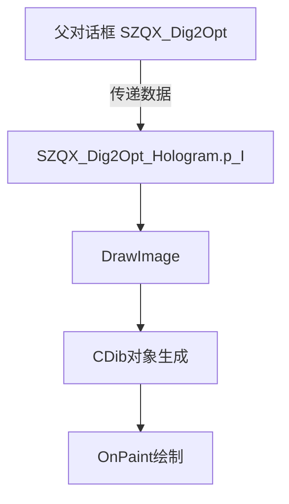

# SZOX_Dig2Opt_Hologram.cpp代码如下，帮助我理解// SZQX_Dig2Opt_Hologram.cpp : 实现文件

**分类**：光学与物理实验
**来源**：DeepSeek Chat 导出
**来源平台**：DeepSeek
**原始文件**：SLM全息再现异常问题分析与解决.md
**包含轮次**：15 - 16

---

# 用户：
SZOX_Dig2Opt_Hologram.cpp代码如下，帮助我理解// SZQX_Dig2Opt_Hologram.cpp : 实现文件
//

#include "stdafx.h"
#include "SZQX.h"
#include "SZQX_Dig2Opt_Hologram.h"
#include "SZQX_Dig2Opt.h"//父对话框

// SZQX_Dig2Opt_Hologram 对话框

IMPLEMENT_DYNAMIC(SZQX_Dig2Opt_Hologram, CDialog)

SZQX_Dig2Opt_Hologram::SZQX_Dig2Opt_Hologram(CWnd* pParent /*=NULL*/)
	: CDialog(SZQX_Dig2Opt_Hologram::IDD, pParent)
{
    pDib_I = NULL;
}

SZQX_Dig2Opt_Hologram::~SZQX_Dig2Opt_Hologram()
{
	if (pDib_I != NULL)
	{
		delete(pDib_I);
		pDib_I = NULL;
	}
}

void SZQX_Dig2Opt_Hologram::DoDataExchange(CDataExchange* pDX)
{
	CDialog::DoDataExchange(pDX);
}


BEGIN_MESSAGE_MAP(SZQX_Dig2Opt_Hologram, CDialog)
	ON_WM_PAINT()
END_MESSAGE_MAP()


// SZQX_Dig2Opt_Hologram 消息处理程序

void SZQX_Dig2Opt_Hologram::OnPaint()
{
	CPaintDC dc(this); // device context for painting
	// TODO: 在此处添加消息处理程序代码
	// 不为绘图消息调用 CDialog::OnPaint()
	int Nrows = p_I.num_rows()/2;//行
	int Mcols = p_I.num_cols()/2;//列
	if(pDib_I != NULL)
	{
		pDib_I->Draw(&dc,0,0,Mcols,Nrows);
	}
}

void SZQX_Dig2Opt_Hologram::DrawImage()
{
	if(pDib_I != NULL){
		delete(pDib_I);
		pDib_I = NULL;
	}
	pDib_I = new CDib(p_I);
}

void SZQX_Dig2Opt_Hologram::GetHolo()
{
	SZQX_Dig2Opt *pDlg = (SZQX_Dig2Opt *)GetParent()->GetParent();//获得父对话框
	p_I = pDlg->p_I;//将父对话框的m_Image传给本窗口的m_Image

	DrawImage();
}

# DeepSeek：

**原始回答**
根据提供的代码分析，`SZQX_Dig2Opt_Hologram.cpp` 是一个基于MFC框架的对话框类实现文件，主要负责**全息图的显示处理**，但当前代码中**未直接包含SLM相位控制的核心逻辑**。以下是详细解析：

---

### **代码功能分解**
#### 1. **基础结构**
- 继承自MFC的`CDialog`类，用于创建对话框界面
- 核心成员变量：
  ```cpp
  CDib* pDib_I;       // 用于存储和绘制位图(DIB)
  Matrix p_I;         // 存储图像数据矩阵（可能是全息图数据）
  ```

#### 2. **关键方法**
| 方法 | 功能描述 |
|------|----------|
| `OnPaint()` | 在对话框上绘制全息图（缩小至原图1/4尺寸） |
| `DrawImage()` | 将矩阵数据`p_I`转换为DIB格式用于显示 |
| `GetHolo()` | 从父对话框获取全息图数据并刷新显示 |

#### 3. **数据流分析**


---

### **缺失的SLM控制部分**
当前代码仅实现**全息图显示功能**，缺少以下关键模块：
1. **SLM设备通信接口**
   - 无SLM初始化、相位模式设置等代码
   - 未见`SLM_LoadImage()`等设备控制函数

2. **相位数据转换**
   - 未将全息图数据转换为SLM可识别的相位调制信号
   - 缺少灰度-相位映射处理（LUT应用）

3. **硬件交互逻辑**
   - 无HDMI/VGA输出控制
   - 无实时刷新机制

---

### **SLM相关代码的可能位置**
根据架构设计，以下文件更可能包含SLM控制代码：
1. **`SZQX_Dig2Opt.cpp`** (父对话框)
   - 应包含"发送到SLM"按钮的事件处理
   - 可能定义`SLM_Control`等成员对象

2. **`SZQXDig.cpp`** 
   - 可能封装底层SLM驱动接口
   - 实现`SendToSLM()`等硬件交互方法

3. **`Dib.cpp`**
   - 可能包含相位数据编码逻辑
   - 实现BMP到SLM格式的转换

---

### **代码增强建议**
若需在此文件中添加SLM控制功能，可扩展如下：
```cpp
// 添加SLM控制头文件
#include "SLM_Controller.h" 

class SZQX_Dig2Opt_Hologram : public CDialog {
    // 新增成员变量
    SLM_Controller m_slm; 

    // 新增方法
    void SendToSLM() {
        if(pDib_I) {
            // 转换相位数据
            PhaseMap phase = ConvertToPhase(pDib_I->GetData()); 
            // 发送到SLM
            m_slm.LoadPhasePattern(phase); 
        }
    }
};

// 在消息映射中添加按钮响应
BEGIN_MESSAGE_MAP(SZQX_Dig2Opt_Hologram, CDialog)
    ON_BN_CLICKED(IDC_BTN_SEND, &SZQX_Dig2Opt_Hologram::SendToSLM)
END_MESSAGE_MAP()
```

---

### **调试建议**
1. **在父对话框中查找SLM调用**：
   ```cpp
   // 在SZQX_Dig2Opt.cpp中搜索：
   m_slm.Init(); 
   m_slm.SetPhaseMode();
   ```

2. **检查资源文件**：
   - 查看`.rc`文件中是否包含SLM控制按钮（如"发送到设备"）

3. **运行时监控**：
   - 使用SPY++工具监视窗口消息
   - 在`GetHolo()`调用后设置断点，追踪数据流向

---

### **结论**
当前`SZQX_Dig2Opt_Hologram.cpp`仅实现**全息图可视化**功能，**SLM相位控制逻辑应存在于父对话框或底层驱动文件中**。建议优先检查：
1. `SZQX_Dig2Opt.cpp`中的设备控制代码
2. 项目中的`SLM_Controller`类或类似硬件封装类
3. 资源文件中定义的SLM操作按钮事件

如需进一步分析，请提供父对话框或SLM相关驱动文件的代码。

# 用户：
// SZQX_Dig2Dig.cpp : 实现文件
//

#include "stdafx.h"
#include "SZQX.h"
#include "SZQX_Dig2Dig.h"
#include ".\include\fft\fft2.h"
#include ".\include\fft\GS_matlab.h"
#include ".\include\fft\cpukit.h"
#include ".\include\SZQX_InLine.h"//为SZQX编写的公用函数

// SZQX_Dig2Dig 对话框

IMPLEMENT_DYNAMIC(SZQX_Dig2Dig, CDialog)

SZQX_Dig2Dig::SZQX_Dig2Dig(CWnd* pParent /*=NULL*/)
	: CDialog(SZQX_Dig2Dig::IDD, pParent)
{
	//初始化常量
	Lambda = 0.6328;
	K = 2*PI/Lambda;
	dx0 = dy0 = dxh = dyh = 5.200;
}

SZQX_Dig2Dig::~SZQX_Dig2Dig()
{
}

void SZQX_Dig2Dig::DoDataExchange(CDataExchange* pDX)
{
	CDialog::DoDataExchange(pDX);
	DDX_Control(pDX, IDC_tabDig2Dig, tabDig2Dig);
}


BEGIN_MESSAGE_MAP(SZQX_Dig2Dig, CDialog)
	ON_NOTIFY(TCN_SELCHANGE, IDC_tabDig2Dig, &SZQX_Dig2Dig::OnTcnSelchangetabdig2dig)
	ON_BN_CLICKED(IDC_btnReadOriImage, &SZQX_Dig2Dig::OnBnClickedbtnreadoriimage)
	ON_BN_CLICKED(IDC_btnGenerationHolo, &SZQX_Dig2Dig::OnBnClickedbtngenerationholo)
	ON_BN_CLICKED(IDC_btnReconstruction, &SZQX_Dig2Dig::OnBnClickedbtnreconstruction)
	ON_BN_CLICKED(IDC_btnSaveBMP, &SZQX_Dig2Dig::OnBnClickedbtnsavebmp)
END_MESSAGE_MAP()


// SZQX_Dig2Dig 消息处理程序

BOOL SZQX_Dig2Dig::OnInitDialog()
{
	CDialog::OnInitDialog();

	// TODO:  在此添加额外的初始化

	//初始化对话框各控件位置与大小
	GetDlgItem(IDC_btnReadOriImage)->SetWindowPos(NULL,800-200, 20-5, 64, 36, SWP_SHOWWINDOW); 

	GetDlgItem(IDC_staChoiceFun)->SetWindowPos(NULL,800-260, 70-5, 200, 80, SWP_SHOWWINDOW);
	GetDlgItem(IDC_rbFresnelConvolution)->SetWindowPos(NULL,800-200, 80-5, 90, 36, SWP_NOZORDER);
	GetDlgItem(IDC_rbFresnelWithDigiSubtract)->SetWindowPos(NULL,800-200, 110-5, 90, 36, SWP_NOZORDER);

	GetDlgItem(IDC_btnGenerationHolo)->SetWindowPos(NULL,800-200, 160-5, 64, 36, SWP_SHOWWINDOW); 
	GetDlgItem(IDC_btnReconstruction)->SetWindowPos(NULL,800-200, 200-5, 64, 36, SWP_SHOWWINDOW); 

	GetDlgItem(IDC_staD)->SetWindowPos(NULL,800-250, 270-5, 64, 36, SWP_SHOWWINDOW); 
	GetDlgItem(IDC_editD)->SetWindowPos(NULL,800-150, 270-5, 64, 18, SWP_SHOWWINDOW); 
	GetDlgItem(IDC_staSita)->SetWindowPos(NULL,800-250, 310-5, 64, 36, SWP_SHOWWINDOW); 
	GetDlgItem(IDC_editSita)->SetWindowPos(NULL,800-150, 310-5, 64, 18, SWP_SHOWWINDOW);
	GetDlgItem(IDC_staGenerationHolo)->SetWindowPos(NULL,800-260, 250-5, 200, 100, SWP_SHOWWINDOW);

	GetDlgItem(IDC_staD1)->SetWindowPos(NULL,800-250, 400-5, 64, 36, SWP_SHOWWINDOW); 
	GetDlgItem(IDC_editD1)->SetWindowPos(NULL,800-150, 400-5, 64, 18, SWP_SHOWWINDOW); 
	GetDlgItem(IDC_staReconstruction)->SetWindowPos(NULL,800-260, 370-5, 200, 80, SWP_SHOWWINDOW);

	GetDlgItem(IDC_btnSaveBMP)->SetWindowPos(NULL, 800-200, 470, 64, 36, SWP_SHOWWINDOW);

	GetDlgItem(IDC_staPartition)->SetWindowPos(NULL, 520, 0 , 2, 750, SWP_SHOWWINDOW);

	//添加标签控件子选项卡名称
	tabDig2Dig.InsertItem(0, "原图");
	tabDig2Dig.InsertItem(1, "全息图");
	tabDig2Dig.InsertItem(2, "再现图");

	//关联对话框,并且将IDC_tabDig2Dig控件设为父窗口
	pageOriImage.Create(IDD_SZQX_Dig2Dig_OriImage_tab_dlg, GetDlgItem(IDC_tabDig2Dig));
	pageHologram.Create(IDD_SZQX_Dig2Dig_Hologram_tab_dlg, GetDlgItem(IDC_tabDig2Dig));
	pageReImage.Create(IDD_SZQX_Dig2Dig_ReImage_tab_dlg, GetDlgItem(IDC_tabDig2Dig));

	//控制IDC_tabDig2Dig客户区大小与位置
	CRect rs;
	CRect rsTab;
	rsTab.top = 0;
	rsTab.bottom = 520+20;
	rsTab.left = 0;
	rsTab.right = 520;

	rs.top = rsTab.top+20;
	rs.bottom = rsTab.bottom;
	rs.left = rsTab.left;
	rs.right = rsTab.right;

	//tab控件位置大小
	tabDig2Dig.MoveWindow(&rsTab);
	//调整Tab页面对话框的位置
	pageOriImage.MoveWindow(&rs);
	pageHologram.MoveWindow(&rs);
	pageReImage.MoveWindow(&rs);
	HideAllTab();

	pageOriImage.ShowWindow(true);//显示

	//设置默认的选项卡
	tabDig2Dig.SetCurSel(0);//默认在第一个选项卡

	//设置单选按钮
	((CButton *)GetDlgItem(IDC_rbFresnelConvolution))->SetCheck(TRUE);//选上
	((CButton *)GetDlgItem(IDC_rbFresnelWithDigiSubtract))->SetCheck(FALSE);//不选上

	//初始化参数
	GetDlgItem(IDC_editD)->SetWindowText("90");//衍射距离
	GetDlgItem(IDC_editSita)->SetWindowText("1.6");//参考光夹角
	GetDlgItem(IDC_editD1)->SetWindowText("90");//再现距离

	return TRUE;  // return TRUE unless you set the focus to a control
	// 异常: OCX 属性页应返回 FALSE
}

void SZQX_Dig2Dig::OnTcnSelchangetabdig2dig(NMHDR *pNMHDR, LRESULT *pResult)
{
	// TODO: 在此添加控件通知处理程序代码
	int CurSel = tabDig2Dig.GetCurSel();
	switch(CurSel) 
	{ 
	case 0: 
		pageOriImage.ShowWindow(true); //显示
		pageHologram.ShowWindow(false); 
		pageReImage.ShowWindow(false);
		break; 
	case 1: 
		pageOriImage.ShowWindow(false); 
		pageHologram.ShowWindow(true);  //显示
		pageReImage.ShowWindow(false);
		break;
	case 2:
		pageOriImage.ShowWindow(false); 
		pageHologram.ShowWindow(false); 
		pageReImage.ShowWindow(true);//显示
		break; 
	default: 
		; 
	} 

	*pResult = 0;
}

void SZQX_Dig2Dig::PostNcDestroy()
{
	// TODO: 在此添加专用代码和/或调用基类

	delete this;
	CDialog::PostNcDestroy();
}

Matrix<double> SZQX_Dig2Dig::FresnelConvolution(Matrix<double> &pU0, double D_temp, double sita)//利用卷积法衍射，不作数字相减
{
	//这个函数不改变输入的原图 pU0 信息，只输出全息图I_temp，
	//对于显示的全息图，根据是否使用数字相减法作决定

	//变量定义
	int Nrows = pU0.num_rows();//行
	int Mcols = pU0.num_cols();//列
	double theta = sita*PI/180.0000;//对夹角作弧度转换
	Matrix<double> Xh_cols(Nrows, Mcols);//xh：全息面上坐标x轴初始化
	Matrix<double> Yh_rows(Nrows, Mcols);//yh：。。。。。。y。。。。
	Matrix<complex<double>> hTransfer(Nrows, Mcols);//传递函数
	Matrix<double> h_theta(Nrows,Mcols);//传递函数的幅角θ矩阵
	Matrix<complex<double>> F(Nrows,Mcols);//输入图像的傅里叶变换
	Matrix<complex<double>> comU0(Nrows,Mcols);//复数形式的 U0
	Matrix<complex<double>> HImpulse(Nrows, Mcols);//传递函数hTransfer的脉冲响应
	Matrix<complex<double>> HFTemp(Nrows, Mcols);//创建H.*F的临时交换矩阵
	Matrix<complex<double>> O(Nrows, Mcols);//O为全息面上的衍射图像
	Matrix<complex<double>> R(Nrows, Mcols);//参考光
	Matrix<double> R_Theta(Nrows, Mcols);//简化程序，引入参考光幅角矩阵
	Matrix<complex<double>> ih(Nrows, Mcols);//全息图的复数形式
	Matrix<double> I_temp(Nrows, Mcols);//创建全息振幅图的临时矩阵
	Matrix<double> pU0_temp(Nrows, Mcols);//创建原图的临时矩阵
    pU0_temp = pU0;//将原图数据传到内部变量pU0_temp
	//常数项因子
	//C0 = exp(j*k*d)/(j*lambda*d)  
	//   = [cos(k*d)+jsin(k*d)]/j*lambda*d
	//   = [sin(k*d)/(lambda*d)]-j*[cos(k*d)/(lambda*d)]
	std::complex<double> C0 = complex<double> ( sin(K*D_temp)/(Lambda*D_temp), -cos(K*D_temp)/(Lambda*D_temp) );

	//建立X方向坐标，原程序如下：
	////x = -M/2:1:(M/2-1); 
	////y = N/2:-1:(-N/2+1); 
	////[X,Y] = meshgrid(x,y);%建立坐标系
	////xh = dxh.*X;yh = dyh.*Y;

	for(int irows = 0; irows<Nrows; irows++)
		for(int jcols = 0; jcols<Mcols; jcols++)
			Xh_cols[irows][jcols] = dxh*(jcols-Mcols/2);

	for(int irows = 0; irows<Nrows; irows++)
		for(int jcols = 0; jcols<Mcols; jcols++)
			Yh_rows[irows][jcols] = dyh*(Nrows/2-irows);

	////h = exp((j*k)/(2*d)*(xh.^2+yh.^2)); %利用卷积法衍射

	for(int irows = 0; irows<Nrows; irows++)
		for(int jcols = 0; jcols<Mcols; jcols++)
			h_theta[irows][jcols] = K/(2*D_temp)*( Xh_cols[irows][jcols]*Xh_cols[irows][jcols]+Yh_rows[irows][jcols]*Yh_rows[irows][jcols] );

	for(int irows = 0; irows<Nrows; irows++)
		for(int jcols = 0; jcols<Mcols; jcols++)
			hTransfer[irows][jcols] = complex<double>( cos(h_theta[irows][jcols]), sin(h_theta[irows][jcols]) );

	////F = fftshift(fft2(fftshift(U0)));
	////H = fftshift(fft2(fftshift(h)));
	////mat2gray(U0)
	mat2Gray(pU0_temp, 0.0, 1.0);

	for(int irows = 0; irows<Nrows; irows++)
		for(int jcols = 0; jcols<Mcols; jcols++)
			comU0[irows][jcols] = complex<double>( pU0_temp[irows][jcols], 0.000 );

	F = fftshift(fft2(fftshift(comU0)));
	HImpulse = fftshift(fft2(fftshift(hTransfer)));

	for(int irows = 0; irows<Nrows; irows++)
		for(int jcols = 0; jcols<Mcols; jcols++)
			HFTemp[irows][jcols] = HImpulse[irows][jcols]*F[irows][jcols];

	////O = C0.*fftshift(ifft2(fftshift(H.*F))); %衍射图
	O = fftshift(ifft2(fftshift(HFTemp)));

	for(int irows = 0; irows<Nrows; irows++)
		for(int jcols = 0; jcols<Mcols; jcols++)
			O[irows][jcols] = O[irows][jcols]*C0;

	////R = exp( j*k*(xh*sind(sita) + yh*sind(sita) ));%参考光
	for(int irows = 0; irows<Nrows; irows++)
		for(int jcols = 0; jcols<Mcols; jcols++)
			R_Theta[irows][jcols] = K*(Xh_cols[irows][jcols]*sin(theta)+Yh_rows[irows][jcols]*sin(theta));

	for(int irows = 0; irows<Nrows; irows++)
		for(int jcols = 0; jcols<Mcols; jcols++)
			R[irows][jcols] = complex<double> ( cos(R_Theta[irows][jcols]), sin(R_Theta[irows][jcols]) );

	////ih = O+R;
	ih = O+R;

	////I = abs(ih);
	////I = I.^2;
	I_temp = ampOfComplex(ih);

	for(int irows = 0; irows<Nrows; irows++)
		for(int jcols = 0; jcols<Mcols; jcols++)
			I_temp[irows][jcols] = I_temp[irows][jcols]*I_temp[irows][jcols];

	//不作任何处理必须做 mat2Gray！！
	mat2Gray(I_temp, 0.00, 1.00);

	return I_temp;
}

Matrix<double> SZQX_Dig2Dig::FresnelWithDigiSubtract(Matrix<double> &pU0, double D_temp, double sita)//加入数字相减的衍射
{
	//这个函数不改变输入的原图 pU0 信息，只输出全息图I_temp，
	//对于显示的全息图，根据是否使用数字相减法作决定

	//变量定义
	int Nrows = pU0.num_rows();//行
	int Mcols = pU0.num_cols();//列
	double theta = sita*PI/180.0000;//对夹角作弧度转换
	double R_AverageAmp = 0.000;//参考光平均振幅
	Matrix<double> Xh_cols(Nrows, Mcols);//xh：全息面上坐标x轴初始化
	Matrix<double> Yh_rows(Nrows, Mcols);//yh：。。。。。。y。。。。
	Matrix<complex<double>> hTransfer(Nrows, Mcols);//传递函数
	Matrix<double> h_theta(Nrows,Mcols);//传递函数的幅角θ矩阵
	Matrix<complex<double>> F(Nrows,Mcols);//输入图像的傅里叶变换
	Matrix<complex<double>> comU0(Nrows,Mcols);//复数形式的U0
	Matrix<complex<double>> HImpulse(Nrows, Mcols);//传递函数hTransfer的脉冲响应
	Matrix<complex<double>> HFTemp(Nrows, Mcols);//创建H.*F的临时交换矩阵
	Matrix<complex<double>> O(Nrows, Mcols);//O为全息面上的衍射图像
	Matrix<complex<double>> R(Nrows, Mcols);//参考光
	Matrix<double> R_Theta(Nrows, Mcols);//简化程序，引入参考光幅角
	Matrix<double> O_Amp(Nrows,Mcols);//物光的振幅
	Matrix<double> R_Amp(Nrows,Mcols);//参考光振幅
	Matrix<double>R_Square(Nrows, Mcols);//求R光强R_Amp.^2
	Matrix<double>O_Square(Nrows, Mcols);//求O光强
	Matrix<complex<double>> ih(Nrows, Mcols);//全息图的复数形式
	Matrix<double> I_temp(Nrows, Mcols);//创建全息振幅图的临时矩阵
	Matrix<double> pU0_temp(Nrows, Mcols);//创建原图的临时矩阵
	pU0_temp = pU0;//将原图数据传到内部变量pU0_temp
	//常数项因子
	//C0 = exp(j*k*d)/(j*lambda*d)  
	//   = [cos(k*d)+jsin(k*d)]/j*lambda*d
	//   = [sin(k*d)/(lambda*d)]-j*[cos(k*d)/(lambda*d)]
	std::complex<double> C0 = complex<double> ( sin(K*D_temp)/(Lambda*D_temp), -cos(K*D_temp)/(Lambda*D_temp) );

	//建立X方向坐标，原程序如下：
	////x = -M/2:1:(M/2-1); 
	////y = N/2:-1:(-N/2+1); 
	////[X,Y] = meshgrid(x,y);%建立坐标系
	////xh = dxh.*X;yh = dyh.*Y;

	for(int irows = 0; irows<Nrows; irows++)
		for(int jcols = 0; jcols<Mcols; jcols++)
			Xh_cols[irows][jcols] = dxh*(jcols-Mcols/2);

	for(int irows = 0; irows<Nrows; irows++)
		for(int jcols = 0; jcols<Mcols; jcols++)
			Yh_rows[irows][jcols] = dyh*(Nrows/2-irows);

	////h = exp((j*k)/(2*d)*(xh.^2+yh.^2)); %利用卷积法衍射

	for(int irows = 0; irows<Nrows; irows++)
		for(int jcols = 0; jcols<Mcols; jcols++)
			h_theta[irows][jcols] = K/(2*D_temp)*( Xh_cols[irows][jcols]*Xh_cols[irows][jcols]+Yh_rows[irows][jcols]*Yh_rows[irows][jcols] );

	for(int irows = 0; irows<Nrows; irows++)
		for(int jcols = 0; jcols<Mcols; jcols++)
			hTransfer[irows][jcols] = complex<double>( cos(h_theta[irows][jcols]), sin(h_theta[irows][jcols]) );

	////F = fftshift(fft2(fftshift(U0)));
	////H = fftshift(fft2(fftshift(h)));
	////mat2gray(U0)
	mat2Gray(pU0_temp, 0.0, 1.0);

	for(int irows = 0; irows<Nrows; irows++)
		for(int jcols = 0; jcols<Mcols; jcols++)
			comU0[irows][jcols] = complex<double>( pU0_temp[irows][jcols], 0.000 );

	F = fftshift(fft2(fftshift(comU0)));
	HImpulse = fftshift(fft2(fftshift(hTransfer)));

	for(int irows = 0; irows<Nrows; irows++)
		for(int jcols = 0; jcols<Mcols; jcols++)
			HFTemp[irows][jcols] = HImpulse[irows][jcols]*F[irows][jcols];

	////O = C0.*fftshift(ifft2(fftshift(H.*F))); %衍射图
	O = fftshift(ifft2(fftshift(HFTemp)));

	for(int irows = 0; irows<Nrows; irows++)
		for(int jcols = 0; jcols<Mcols; jcols++)
			O[irows][jcols] = O[irows][jcols]*C0;

	////R =sum(sum(abs(O)))/(N*M)* exp((j)*k*(xh*sind(sita) + yh*sind(sita) ));%参考光
	for(int irows = 0; irows<Nrows; irows++)
		for(int jcols = 0; jcols<Mcols; jcols++)
			R_Theta[irows][jcols] = K*(Xh_cols[irows][jcols]*sin(theta)+Yh_rows[irows][jcols]*sin(theta));

	O_Amp = ampOfComplex(O);

	for(int irows = 0; irows<Nrows; irows++)
		for(int jcols = 0; jcols<Mcols; jcols++)
			R_AverageAmp = R_AverageAmp+O_Amp[irows][jcols];

	R_AverageAmp = R_AverageAmp/(Nrows*Mcols);

	for(int irows = 0; irows<Nrows; irows++)
		for(int jcols = 0; jcols<Mcols; jcols++)
			R[irows][jcols] = complex<double> ( R_AverageAmp*cos(R_Theta[irows][jcols]), R_AverageAmp*sin(R_Theta[irows][jcols]) );

	R_Amp = ampOfComplex(R);

	for(int irows = 0; irows<Nrows; irows++)
		for(int jcols = 0; jcols<Mcols; jcols++)
			R_Square[irows][jcols] = R_Amp[irows][jcols]*R_Amp[irows][jcols];

	for(int irows = 0; irows<Nrows; irows++)
		for(int jcols = 0; jcols<Mcols; jcols++)
			O_Square[irows][jcols] = O_Amp[irows][jcols]*O_Amp[irows][jcols];

	////ih = O+R;
	ih = O+R;
	////I = abs(ih);
	////I = I.^2;
	I_temp = ampOfComplex(ih);

	for(int irows = 0; irows<Nrows; irows++)
		for(int jcols = 0; jcols<Mcols; jcols++)
			I_temp[irows][jcols] = I_temp[irows][jcols]*I_temp[irows][jcols];

	//数字相减不需要做 mat2Gray！！
	I_temp = I_temp-R_Square-O_Square;

	return I_temp;
}

Matrix<double>  SZQX_Dig2Dig::HoloReconstruction(Matrix<double> &I, double D_temp, double D1)//再现全息图
{
	//这个函数不改变输入的全息图 I信息，只输出再现图U，
	//此函数对于经过各种全息处理方法得到的全息图都可再现。

	//变量定义
    int Nrows = I.num_rows();//行
	int Mcols = I.num_cols();//列
	double dx, dy;//再现平面坐标比例
	Matrix<double> X_cols(Nrows, Mcols);//再现平面坐标x轴初始化
	Matrix<double> Y_rows(Nrows, Mcols);//。。。。。。y。。。。
	Matrix<double> Xh_cols(Nrows, Mcols);//xh：全息面上坐标x轴初始化
	Matrix<double> Yh_rows(Nrows, Mcols);//yh：。。。。。。y。。。。
	Matrix<double> C_Theta(Nrows, Mcols);//C的幅角
	Matrix<complex<double>> C(Nrows, Mcols);
	Matrix<double> C1_Theta(Nrows, Mcols);//C1的幅角
	Matrix<complex<double>> C1(Nrows, Mcols);
	Matrix<complex<double>> Uh2(Nrows, Mcols);//全息图与平面波相乘
	Matrix<complex<double>> Uh2_fft(Nrows, Mcols);
	Matrix<complex<double>> U_complex(Nrows, Mcols);//复数形式的U
	Matrix<double> U(Nrows, Mcols);//再现像
	//常数项因子
	//C0 = exp(j*k*d)/(j*lambda*d)  
	//   = [cos(k*d)+jsin(k*d)]/j*lambda*d
	//   = [sin(k*d)/(lambda*d)]-j*[cos(k*d)/(lambda*d)]
	std::complex<double> C0 = complex<double> ( sin(K*D_temp)/(Lambda*D_temp), -cos(K*D_temp)/(Lambda*D_temp) );

	////d1=d;%再现的距离,即可改变大小，也可改变正负
	////dx=(lambda*d1)/(M*dxh);dy=(lambda*d1)/(N*dyh);%再现像平面的坐标和全息平面坐标的关系
	////x = dx.*X;y = dy.*Y;
	//D1 = D_temp;
	dx = (Lambda*D1)/(Mcols*dxh);
	dy = (Lambda*D1)/(Nrows*dyh);

	for(int irows = 0; irows<Nrows; irows++)
		for(int jcols = 0; jcols<Mcols; jcols++)
			X_cols[irows][jcols] = dx*(jcols-Mcols/2);

	for(int irows = 0; irows<Nrows; irows++)
		for(int jcols = 0; jcols<Mcols; jcols++)
			Y_rows[irows][jcols] = dy*(Nrows/2-irows);

	for(int irows = 0; irows<Nrows; irows++)
		for(int jcols = 0; jcols<Mcols; jcols++)
			Xh_cols[irows][jcols] = dxh*(jcols-Mcols/2);

	for(int irows = 0; irows<Nrows; irows++)
		for(int jcols = 0; jcols<Mcols; jcols++)
			Yh_rows[irows][jcols] = dyh*(Nrows/2-irows);

	////C = exp((j*k)/(2*d1)*(x.^2+y.^2));
	for(int irows = 0; irows<Nrows; irows++)
		for(int jcols = 0; jcols<Mcols; jcols++)
			C_Theta[irows][jcols] = K/(2*D1)*( X_cols[irows][jcols]*X_cols[irows][jcols]+Y_rows[irows][jcols]*Y_rows[irows][jcols] );

	for(int irows = 0; irows<Nrows; irows++)
		for(int jcols = 0; jcols<Mcols; jcols++)
			C[irows][jcols] = complex<double>( cos(C_Theta[irows][jcols]), sin(C_Theta[irows][jcols]) );

	////C1 = exp((j*k)/(2*d1)*(xh.^2+yh.^2));
	for(int irows = 0; irows<Nrows; irows++)
		for(int jcols = 0; jcols<Mcols; jcols++)
			C1_Theta[irows][jcols] = K/(2*D1)*( Xh_cols[irows][jcols]*Xh_cols[irows][jcols]+Yh_rows[irows][jcols]*Yh_rows[irows][jcols] );

	for(int irows = 0; irows<Nrows; irows++)
		for(int jcols = 0; jcols<Mcols; jcols++)
			C1[irows][jcols] = complex<double>( cos(C1_Theta[irows][jcols]), sin(C1_Theta[irows][jcols]) );

	//由于采用带夹角的参考光导致傅里叶频移，所以使用平面波去重建，即R=1
	////% R_conj=conj(R);
	////% Uh1=R_conj.*I;
	////Uh1 = I;
	////Uh2=C1.*Uh1;
	for(int irows = 0; irows<Nrows; irows++)
		for(int jcols = 0; jcols<Mcols; jcols++)
			Uh2[irows][jcols] = C1[irows][jcols]*I[irows][jcols];

	////Uh2_fft=fftshift(fft2(fftshift(Uh2)));
	Uh2_fft = fftshift(fft2(fftshift(Uh2)));

	////U=C0.*C.*(Uh2_fft);%利用傅里叶变换法实现再现
	for(int irows = 0; irows<Nrows; irows++)
		for(int jcols = 0; jcols<Mcols; jcols++)
			U_complex[irows][jcols] = C0*C[irows][jcols]*Uh2_fft[irows][jcols];

	////U = abs(U);
	U = ampOfComplex(U_complex);

	//不使用数字相减得到的U，取光强无法看到信息，所以只取振幅
	/*for(int irows = 0; irows<Nrows; irows++)
		for(int jcols = 0; jcols<Mcols; jcols++)
			U[irows][jcols] = U[irows][jcols]*U[irows][jcols];*/

	return U;
}

void SZQX_Dig2Dig::HideAllTab()
{
	pageOriImage.ShowWindow(false);
	pageHologram.ShowWindow(false);
	pageReImage.ShowWindow(false);
}

void SZQX_Dig2Dig::OnBnClickedbtnreadoriimage()//读图按钮
{
	// TODO: 在此添加控件通知处理程序代码
	tabDig2Dig.SetCurSel(0);

	//每次读图都必须取消所有选项卡对话框
	HideAllTab();

	CString filter = "BMP (*.bmp)|*.bmp|All (*.*)|*.*||";

	CFileDialog openDlg(TRUE, NULL, NULL, OFN_FILEMUSTEXIST| OFN_HIDEREADONLY, filter);///TRUE为OPEN对话框，FALSE为SAVE AS对话框
	if(openDlg.DoModal() != IDOK){
		return;
	}
	CString filePath = openDlg.GetPathName();
	readFromBmp(pU0, LPCTSTR(filePath));

	//读图限制
	int sign = ReadBMPLimit(pU0);

	if (sign == 1)
	{
		AfxMessageBox("图片尺寸过大，建议压缩");
		pU0 = Matrix<double>(0,0);
		return;
	}//end if

	if (sign == 2)
	{
		AfxMessageBox("图片尺寸不标准，进行扩充");
	}//end if

	pageOriImage.GetImage();//子窗口获取原图
	pageOriImage.ShowWindow(true);
	Invalidate();
}

void SZQX_Dig2Dig::OnBnClickedbtngenerationholo()//生成计算全息图按钮
{
	// TODO: 在此添加控件通知处理程序代码
	tabDig2Dig.SetCurSel(1);

	int Nrows = pU0.num_rows();//行
	if (Nrows == 0){
		AfxMessageBox("读图有误");
		return;
	}//end if

	HideAllTab();

	UpdateData(TRUE);
	int Radio1_FC, Radio2_FDS;//创建单选按钮变量
	Radio1_FC = ((CButton *)GetDlgItem(IDC_rbFresnelConvolution))->GetCheck();
	Radio2_FDS = ((CButton *)GetDlgItem(IDC_rbFresnelWithDigiSubtract))->GetCheck();

	CString str_D;
	GetDlgItem(IDC_editD)->GetWindowText(str_D);//获得当前衍射距离编辑框中数值
	D = atof(str_D);

	if (D <= 0)
	{
		AfxMessageBox("请输入距离");
		return;
	}//end if

	D = D*1000;//将单位转为微米

	CString str_Sita;
	GetDlgItem(IDC_editSita)->GetWindowText(str_Sita);//获得当前参考光夹角编辑框中数值
	double sita = atof(str_Sita);//参考光夹角

	if (sita <=0.000 || sita >2.500)
	{
		AfxMessageBox("夹角设置有误，请重新输入");
		return;
	}//end if

	if (Radio1_FC == 1)
	{
		I = FresnelConvolution(pU0, D, sita);
	}//end if

	if (Radio2_FDS == 1)
	{
		I = FresnelWithDigiSubtract(pU0, D, sita);
	}//end if

	p_I = I;
	mat2Gray(p_I, 0, 255);//保证输出图像在灰度的值域范围

	pageHologram.GetHolo();
	pageHologram.ShowWindow(true);
}

void SZQX_Dig2Dig::OnBnClickedbtnreconstruction()//仿真再现按钮
{
	// TODO: 在此添加控件通知处理程序代码
	tabDig2Dig.SetCurSel(2);

	int Nrows = I.num_rows();//行
	if (Nrows == 0){
		AfxMessageBox("没有全息图");
		return;
	}

	HideAllTab();

	UpdateData(TRUE);
	CString str_D1;
	GetDlgItem(IDC_editD1)->GetWindowText(str_D1);//获得当前再现距离编辑框中数值
	double D1 = atof(str_D1);//参考光夹角
	D1 = D1*1000;//将单位转为微米

	pU = HoloReconstruction(I, D, D1);
	mat2Gray(pU, 0, 255);

	pageReImage.GetReImage();
	pageReImage.ShowWindow(true);
}

void SZQX_Dig2Dig::OnBnClickedbtnsavebmp()//保存仿真结果按钮
{
	// TODO: 在此添加控件通知处理程序代码
	//检测是否计算仿真结果
	if (pU.num_cols() == 0){
		AfxMessageBox("没有仿真结果");
		return;
	}

	CString filter = "BMP (*.bmp)|*.bmp|All (*.*)|*.*||";
	CFileDialog openDlg(FALSE, NULL, NULL, OFN_FILEMUSTEXIST| OFN_HIDEREADONLY, filter);///TRUE为OPEN对话框，FALSE为SAVE AS对话框
	if(openDlg.DoModal() != IDOK){
		return;
	}

	CString fileName;
	fileName = openDlg.GetFileName();
	fileName += ".bmp";
	imWrite(pU,(LPCTSTR)fileName);
}
这是SZQXDig.cpp

# DeepSeek：

**原始回答**
根据代码分析，`SZQX_Dig2Dig.cpp` 实现了数字全息的核心计算流程，但 **不直接控制SLM硬件**。以下是关键结论和解决方案：

---

### **核心结论**
1. **该文件是算法实现层**：
   - 包含全息图生成（`FresnelConvolution`/`FresnelWithDigiSubtract`）
   - 全息图再现（`HoloReconstruction`）
   - 但不包含任何SLM硬件控制代码

2. **SLM控制逻辑应在其他文件中**：
   - 父类`SZQX_Dig2Opt`（在`SZQX_Dig2Opt.cpp`中）可能包含设备接口
   - `SZQXDig.cpp` 更可能是底层驱动封装

---

### **SLM控制代码的可能位置**
#### 1. **父对话框 `SZQX_Dig2Opt`**
- 应包含"发送到SLM"按钮的事件处理
- 可能定义`SLM_Controller`等硬件控制成员

#### 2. **底层驱动 `SZQXDig.cpp`**
- 预期功能：
  ```cpp
  class SZQXDig {
  public:
      bool InitSLM();          // 初始化设备
      bool LoadPhaseImage(Matrix<double>& img);  // 加载相位图
      bool SetLUT(const vector<double>& lut);    // 配置相位查找表
  };
  ```

#### 3. **项目配置文件**
- 检查`SZQX.rc`资源文件：
  - 查找`IDC_BTN_SEND_TO_SLM`等按钮定义
  - 确认消息映射关系

---

### **当前代码的SLM相关缺陷**
| **缺失功能**         | **风险**                     | **解决方案**                     |
|----------------------|-----------------------------|----------------------------------|
| 无硬件初始化代码     | SLM可能未正确连接           | 在`SZQXDig.cpp`中添加USB/HDMI驱动 |
| 无相位-灰度映射      | 再现像失真                  | 加载LUT文件（需厂商提供）         |
| 无实时刷新机制       | 图像更新延迟                | 实现双缓冲和定时刷新              |

---

### **紧急解决方案（无厂商支持）**
#### 1. **手动模拟SLM控制**
在`OnBnClickedbtnsavebmp()`后添加发送逻辑：
```cpp
void SZQX_Dig2Dig::OnBnClickedbtnsavebmp() {
    // ...原有保存代码...

    // 新增SLM发送功能
    CString cmd;
    cmd.Format("copy %s L:\\SLM\\phase.bmp", fileName); // 假设SLM监控L盘
    system(LPCTSTR(cmd)); 
}
```

#### 2. **通过第三方库控制SLM**
若SLM支持通用API：
```cpp
// 在SZQXDig.cpp中添加
#include <Windows.h>
void SendToSLM(LPCSTR bmpPath) {
    HINSTANCE hSLM = LoadLibrary("SLM_API.dll");
    typedef void(*SLM_LoadImg)(LPCSTR);
    SLM_LoadImg pFunc = (SLM_LoadImg)GetProcAddress(hSLM, "LoadImage");
    if(pFunc) pFunc(bmpPath);
}
```

#### 3. **硬件信号注入**
使用Arduino模拟SLM信号：
```cpp
// Arduino代码（通过串口控制）
void setup() {
  Serial.begin(9600);
  pinMode(SLM_CLK, OUTPUT); 
}

void loop() {
  if(Serial.available()) {
    byte imgData[1024];
    Serial.readBytes(imgData, 1024);
    // 将imgData写入SLM驱动板...
  }
}
```

---

### **关键调试建议**
1. **验证数据流**：
   ```mermaid
   graph LR
   A[全息图生成] --> B[保存为BMP]
   B --> C{SLM监控文件夹?}
   C -->|是| D[自动加载]
   C -->|否| E[手动传输]
   ```

2. **检查硬件连接**：
   - 使用USB监听工具（如Bus Hound）抓取SLM通信数据
   - 确认分辨率匹配（1024×768@60Hz）

3. **测试模式**：
   ```cpp
   // 生成测试图案
   Matrix<double> testPattern(768, 1024);
   testPattern.fill(128); // 50%灰度
   imWrite(testPattern, "test.bmp");
   // 观察SLM是否显示均匀灰场
   ```

---

### **下一步行动**
1. **提供`SZQXDig.cpp`代码**：确认底层驱动实现
2. **检查厂商文档**：查找隐藏的SLM控制API
3. **物理层调试**：用示波器检测SLM信号输入

如需进一步分析，请补充相关文件代码。当前证据表明SLM控制逻辑应存在于`SZQXDig.cpp`或父对话框类中。

