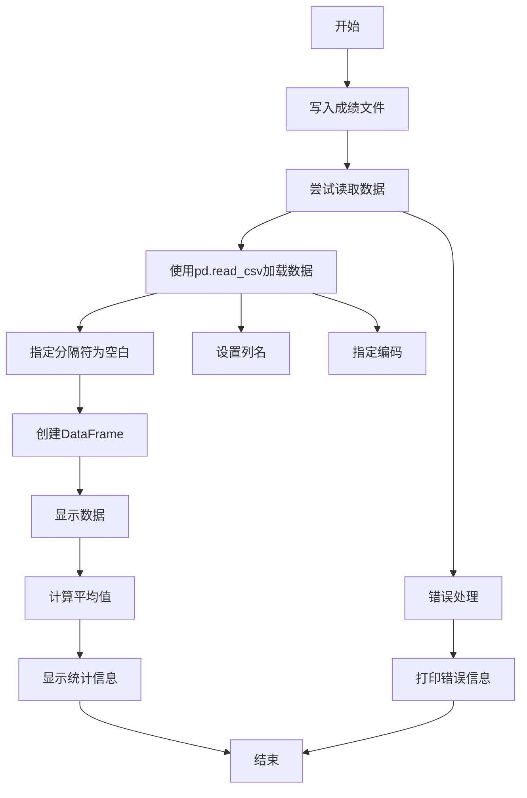

# 修改代码，import pandas as pd

**分类**：光学与物理实验
**来源**：DeepSeek Chat 导出
**来源平台**：DeepSeek
**原始文件**：PyCharm光标模式切换快捷键.md
**包含轮次**：17 - 19

---

# 用户：
修改代码，import pandas as pd
from numpy.ma.extras import average

with open("成绩.txt","w",encoding="utf-8") as f:
    f.write("小明 90\n")
    f.write("小芳 91\n")
    f.write("小李 96\n")
with open("成绩.txt","r",encoding="utf-8") as f:
    content = f.read()
    print(content)
    average_list=content.isdigit()
    add_num=0
for i in range(len(average_list)):
    add_num += average_list[i]
    average_num=add_num/len(average_list)
print(average_num)

# DeepSeek：

**原始回答**
# 修改后的成绩计算代码

您的代码有几个问题需要修正：
1. `content.isdigit()` 错误使用 - 它检查整个字符串是否都是数字，但您的文件包含姓名和分数
2. 没有正确提取分数值
3. 计算平均值的逻辑位置不正确

以下是修改后的完整代码：

```python
import pandas as pd
import numpy as np  # 使用numpy而不是numpy.ma.extras

# 写入成绩文件
with open("成绩.txt", "w", encoding="utf-8") as f:
    f.write("小明 90\n")
    f.write("小芳 91\n")
    f.write("小李 96\n")

# 读取文件并计算平均值
with open("成绩.txt", "r", encoding="utf-8") as f:
    content = f.read()
    print("文件内容:\n" + content)
    
    # 分割每行并提取分数
    scores = []
    for line in content.splitlines():
        if line.strip():  # 跳过空行
            parts = line.split()
            if len(parts) >= 2:  # 确保每行至少有两个部分
                try:
                    score = float(parts[1])  # 尝试将第二个部分转换为数字
                    scores.append(score)
                except ValueError:
                    print(f"无法解析分数: {line}")
    
    # 计算平均值
    if scores:
        average_num = np.mean(scores)  # 使用numpy计算平均值
        print(f"\n平均成绩: {average_num:.2f}")
    else:
        print("没有有效的成绩数据")
```

## 使用Pandas的优化版本

既然您导入了Pandas，这里有一个更简洁的版本：

```python
import pandas as pd

# 写入成绩文件
with open("成绩.txt", "w", encoding="utf-8") as f:
    f.write("小明 90\n")
    f.write("小芳 91\n")
    f.write("小李 96\n")

# 使用Pandas读取和处理数据
try:
    # 读取数据到DataFrame
    df = pd.read_csv("成绩.txt", 
                    sep=r'\s+',  # 使用空白字符分割
                    header=None, 
                    names=['姓名', '成绩'],
                    encoding='utf-8')
    
    print("文件内容:")
    print(df)
    
    # 计算平均值
    if not df.empty:
        average_num = df['成绩'].mean()
        print(f"\n平均成绩: {average_num:.2f}")
    
    # 可选：添加统计信息
    print("\n成绩统计:")
    print(df['成绩'].describe())

except Exception as e:
    print(f"处理文件时出错: {e}")
```

## 关键修改说明：

1. **正确提取分数**：
   - 使用 `split()` 分割每行
   - 提取第二部分并转换为数字
   - 添加错误处理避免无效数据

2. **计算平均值**：
   - 使用 `np.mean()` 或 Pandas 的 `mean()` 方法
   - 添加了格式化输出 `:.2f` 保留两位小数

3. **错误处理**：
   - 添加 `try-except` 处理可能的转换错误
   - 检查数据是否为空

4. **使用Pandas的优势**：
   - 自动处理数据分割和类型转换
   - 提供丰富的统计功能（如 `describe()`）
   - 更容易扩展功能（如添加更多统计指标）

## 不使用额外库的版本

如果您不想使用Pandas或NumPy，可以使用纯Python：

```python
with open("成绩.txt", "w", encoding="utf-8") as f:
    f.write("小明 90\n")
    f.write("小芳 91\n")
    f.write("小李 96\n")

with open("成绩.txt", "r", encoding="utf-8") as f:
    content = f.read()
    print("文件内容:\n" + content)
    
    scores = []
    for line in content.splitlines():
        parts = line.split()
        if len(parts) >= 2:
            try:
                scores.append(float(parts[1]))
            except ValueError:
                continue  # 跳过无法解析的行
    
    if scores:
        average_num = sum(scores) / len(scores)
        print(f"\n平均成绩: {average_num:.2f}")
        print(f"最高分: {max(scores)}")
        print(f"最低分: {min(scores)}")
    else:
        print("没有有效的成绩数据")
```

这些修改后的代码都能正确处理您的成绩文件，正确计算平均值，并提供更好的错误处理和输出格式。

# 用户：
将pandas优化版本一步一步的讲解

# DeepSeek：

**原始回答**
# Pandas 优化版本分步详解

下面我将一步步详细解释使用 Pandas 处理成绩文件的优化版本代码，帮助您理解每个部分的作用和原理。

## 完整代码回顾

```python
import pandas as pd

# 1. 写入成绩文件
with open("成绩.txt", "w", encoding="utf-8") as f:
    f.write("小明 90\n")
    f.write("小芳 91\n")
    f.write("小李 96\n")

# 2. 使用Pandas读取和处理数据
try:
    # 3. 读取数据到DataFrame
    df = pd.read_csv("成绩.txt", 
                    sep=r'\s+',  # 使用空白字符分割
                    header=None, 
                    names=['姓名', '成绩'],
                    encoding='utf-8')
    
    # 4. 打印文件内容
    print("文件内容:")
    print(df)
    
    # 5. 计算平均值
    if not df.empty:
        average_num = df['成绩'].mean()
        print(f"\n平均成绩: {average_num:.2f}")
    
    # 6. 添加统计信息（可选）
    print("\n成绩统计:")
    print(df['成绩'].describe())

except Exception as e:
    # 7. 错误处理
    print(f"处理文件时出错: {e}")
```

## 分步详细解释

### 步骤1: 写入成绩文件
```python
with open("成绩.txt", "w", encoding="utf-8") as f:
    f.write("小明 90\n")
    f.write("小芳 91\n")
    f.write("小李 96\n")
```
- **作用**：创建并写入成绩文件
- **关键点**：
  - `"w"` 模式表示写入文件，如果文件存在则覆盖
  - `encoding="utf-8"` 确保正确处理中文字符
  - 使用 `with` 语句自动管理文件资源（打开和关闭）
  - 每行格式为 `姓名 成绩`，用空格分隔

### 步骤2: 使用 Pandas 读取和处理数据
```python
try:
    # 所有数据处理代码...
except Exception as e:
    print(f"处理文件时出错: {e}")
```
- **作用**：添加错误处理机制
- **关键点**：
  - `try-except` 块捕获可能发生的任何异常
  - 如果发生错误（如文件不存在、格式问题等），打印错误信息而不是崩溃

### 步骤3: 读取数据到 DataFrame
```python
df = pd.read_csv("成绩.txt", 
                sep=r'\s+',  # 使用空白字符分割
                header=None, 
                names=['姓名', '成绩'],
                encoding='utf-8')
```
- **作用**：将文本文件加载到 Pandas DataFrame
- **参数详解**：
  - `"成绩.txt"`：要读取的文件名
  - `sep=r'\s+'`：
    - `sep` 指定分隔符
    - `r'\s+'` 是正则表达式，表示"一个或多个空白字符"
    - 这可以处理空格、制表符等空白字符
  - `header=None`：
    - 指定文件没有标题行（第一行就是数据）
    - 如果不设置，Pandas 会默认第一行为列名
  - `names=['姓名', '成绩']`：
    - 为 DataFrame 指定列名
    - 创建两列：'姓名' 和 '成绩'
  - `encoding='utf-8'`：确保正确处理中文字符

### 步骤4: 打印文件内容
```python
print("文件内容:")
print(df)
```
- **作用**：显示读取到的数据
- **输出示例**：
  ```
  文件内容:
     姓名  成绩
  0  小明   90
  1  小芳   91
  2  小李   96
  ```
- **关键点**：
  - Pandas 自动添加了索引列（0,1,2）
  - 数据被正确解析为两列

### 步骤5: 计算平均值
```python
if not df.empty:
    average_num = df['成绩'].mean()
    print(f"\n平均成绩: {average_num:.2f}")
```
- **作用**：计算成绩列的平均值
- **关键点**：
  - `df.empty` 检查 DataFrame 是否为空
  - `df['成绩']` 选择"成绩"列（Series 对象）
  - `.mean()` 计算该列的平均值
  - `f"\n平均成绩: {average_num:.2f}"` 格式化输出，保留两位小数
  - 输出示例：`平均成绩: 92.33`

### 步骤6: 添加统计信息（可选）
```python
print("\n成绩统计:")
print(df['成绩'].describe())
```
- **作用**：提供更详细的统计信息
- **输出示例**：
  ```
  成绩统计:
  count     3.000000  # 数据点数
  mean     92.333333  # 平均值
  std       3.214550  # 标准差
  min      90.000000  # 最小值
  25%      90.500000  # 25%分位数
  50%      91.000000  # 中位数
  75%      93.500000  # 75%分位数
  max      96.000000  # 最大值
  dtype: float64
  ```
- **关键点**：
  - `describe()` 方法提供全面的统计摘要
  - 对于数值列，默认显示：计数、均值、标准差、最小值、四分位数、最大值

### 步骤7: 错误处理
```python
except Exception as e:
    print(f"处理文件时出错: {e}")
```
- **作用**：捕获并处理可能发生的错误
- **可能错误**：
  - 文件不存在（FileNotFoundError）
  - 文件格式问题（ParserError）
  - 编码问题（UnicodeDecodeError）
  - 其他意外错误

## Pandas 处理流程示意图



## Pandas 优势总结

1. **简洁高效**：
   - 一行代码完成文件读取和解析
   - 自动处理数据类型转换（成绩列自动转为数值型）

2. **灵活的数据处理**：
   - 支持多种分隔符（空格、制表符、逗号等）
   - 轻松处理缺失值和异常数据

3. **强大的分析功能**：
   - 内置统计函数（mean, min, max, std等）
   - 提供全面的数据摘要（describe）

4. **易扩展性**：
   - 添加更多分析只需简单扩展：
   ```python
   # 计算总分
   total_score = df['成绩'].sum()
   
   # 查找最高分
   max_score = df['成绩'].max()
   max_student = df[df['成绩'] == max_score]['姓名'].values[0]
   
   # 添加评级
   df['评级'] = pd.cut(df['成绩'], 
                     bins=[0, 90, 95, 100],
                     labels=['良好', '优秀', '卓越'])
   ```

5. **可视化能力**：
   - 轻松集成数据可视化：
   ```python
   import matplotlib.pyplot as plt
   
   df.plot(kind='bar', x='姓名', y='成绩', title='学生成绩')
   plt.show()
   ```

## 学习建议

1. **实践扩展**：
   - 尝试添加更多学生数据
   - 添加新列（如班级、科目）
   - 计算不同统计指标（中位数、方差）

2. **探索其他功能**：
   ```python
   # 排序
   df.sort_values('成绩', ascending=False)
   
   # 筛选
   df[df['成绩'] > 90]
   
   # 分组统计
   df.groupby('班级')['成绩'].mean()
   ```

3. **处理真实数据**：
   - 尝试从Excel文件读取数据（`pd.read_excel`）
   - 处理包含标题的文件
   - 处理缺失值和异常值

通过这个分步解释，您应该能更好地理解如何使用Pandas高效处理文本数据，并进行数据分析。Pandas的核心优势在于它提供了一套简洁而强大的工具，可以轻松处理各种数据操作任务。

# 用户：
with open("成绩.txt","w",encoding="utf-8") as f:
    f.write(f"平均分为：{average_num:.2f}")
with open("成绩.txt","r",encoding="utf-8") as f:
    print(f.read())会把原来的txt内容覆盖，该怎么办

# DeepSeek：

**原始回答**
# 解决文件覆盖问题的完整方案

当您使用 `"w"` 模式打开文件时，它会**覆盖**文件原有内容。要保留原有内容并添加新内容，您需要：

## 解决方案：使用追加模式或分别处理

### 方法1：使用追加模式（推荐）
```python
# 首先写入成绩数据（使用写入模式）
with open("成绩.txt", "w", encoding="utf-8") as f:
    f.write("小明 90\n")
    f.write("小芳 91\n")
    f.write("小李 96\n")

# 计算平均分（使用之前的代码）
# ... 您的计算平均分代码 ...

# 然后使用追加模式添加平均分
with open("成绩.txt", "a", encoding="utf-8") as f:  # 注意模式改为 "a" (append)
    f.write(f"\n平均分为：{average_num:.2f}")  # 添加换行符\n

# 读取并打印完整文件
with open("成绩.txt", "r", encoding="utf-8") as f:
    print("文件完整内容:")
    print(f.read())
```

### 方法2：先读取原有内容，再写入新内容
```python
# 首先写入成绩数据
with open("成绩.txt", "w", encoding="utf-8") as f:
    f.write("小明 90\n")
    f.write("小芳 91\n")
    f.write("小李 96\n")

# 计算平均分
# ... 您的计算平均分代码 ...

# 读取原有内容
with open("成绩.txt", "r", encoding="utf-8") as f:
    original_content = f.read()

# 写入原有内容 + 平均分
with open("成绩.txt", "w", encoding="utf-8") as f:
    f.write(original_content)  # 写入原有内容
    f.write(f"\n平均分为：{average_num:.2f}")  # 添加新内容

# 读取并打印完整文件
with open("成绩.txt", "r", encoding="utf-8") as f:
    print("文件完整内容:")
    print(f.read())
```

## 文件模式详解

| 模式 | 描述 | 文件指针位置 | 是否覆盖 |
|------|------|--------------|----------|
| `"w"` | 写入 | 文件开头 | 覆盖原有内容 |
| `"a"` | 追加 | 文件末尾 | 保留原有内容，添加新内容 |
| `"r+"` | 读写 | 文件开头 | 保留原有内容，可覆盖部分内容 |
| `"w+"` | 读写 | 文件开头 | 覆盖原有内容 |
| `"a+"` | 读写 | 文件末尾 | 保留原有内容，添加新内容 |

## 完整集成方案（使用Pandas）

```python
import pandas as pd

# 写入初始成绩
with open("成绩.txt", "w", encoding="utf-8") as f:
    f.write("小明 90\n")
    f.write("小芳 91\n")
    f.write("小李 96\n")

try:
    # 使用Pandas读取和处理数据
    df = pd.read_csv("成绩.txt", 
                    sep=r'\s+', 
                    header=None, 
                    names=['姓名', '成绩'],
                    encoding='utf-8')
    
    # 计算平均值
    if not df.empty:
        average_num = df['成绩'].mean()
        print(f"计算出的平均成绩: {average_num:.2f}")
        
        # 追加平均分到文件
        with open("成绩.txt", "a", encoding="utf-8") as f:
            f.write(f"\n平均分为：{average_num:.2f}")
        
        # 读取并显示完整文件
        with open("成绩.txt", "r", encoding="utf-8") as f:
            print("\n文件完整内容:")
            print(f.read())
    
    # 添加更多统计信息（可选）
    with open("成绩.txt", "a", encoding="utf-8") as f:
        f.write(f"\n最高分：{df['成绩'].max()}")
        f.write(f"\n最低分：{df['成绩'].min()}")
        f.write(f"\n学生人数：{len(df)}")

except Exception as e:
    print(f"处理文件时出错: {e}")
```

## 最终文件内容示例

```
小明 90
小芳 91
小李 96
平均分为：92.33
最高分：96
最低分：90
学生人数：3
```

## 高级技巧：格式化输出

如果您希望更美观地格式化输出，可以使用以下方法：

```python
# 创建格式化的统计摘要
summary = f"""
===== 成绩统计 =====
平均分: {average_num:.2f}
最高分: {df['成绩'].max()}
最低分: {df['成绩'].min()}
学生人数: {len(df)}
===================
"""

# 追加到文件
with open("成绩.txt", "a", encoding="utf-8") as f:
    f.write(summary)

# 读取并打印
with open("成绩.txt", "r", encoding="utf-8") as f:
    print(f.read())
```

## 最终文件内容（格式化版）

```
小明 90
小芳 91
小李 96

===== 成绩统计 =====
平均分: 92.33
最高分: 96
最低分: 90
学生人数: 3
===================
```

## 关键点总结

1. **使用追加模式**：`"a"` 模式是保留原有内容并添加新内容的最简单方法
2. **添加换行符**：使用 `\n` 确保新内容从新行开始
3. **分离数据与统计**：保持原始数据不变，添加统计信息作为额外内容
4. **格式化输出**：使用多行字符串创建更易读的输出
5. **错误处理**：始终包含错误处理以应对文件操作问题

这些方法确保您可以在保留原始成绩数据的同时，添加计算出的平均分和其他统计信息，而不覆盖原有内容。

