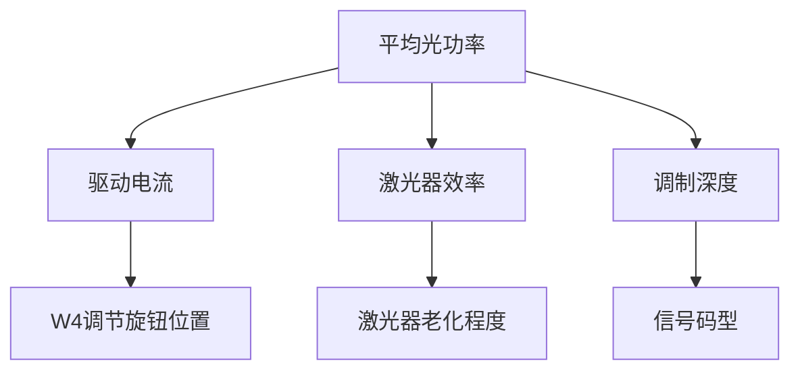

# 光发射机平均光功率测试实验，为254.8uw是否正常

**分类**：光学与物理实验
**来源**：DeepSeek Chat 导出
**来源平台**：DeepSeek
**原始文件**：光纤通信光源P-I特性测试实验.md
**包含轮次**：22 - 22

---

# 用户：
光发射机平均光功率测试实验，为254.8uw是否正常

# DeepSeek：

**原始回答**
### **光发射机平均光功率测试深度解析**

#### 1. **测量值评估**
**您的测量值：254.8μW（0.2548mW）**  
根据ROE-CB05系统规格和行业标准：

| 评估维度       | 正常范围      | 您的数据 | 判定结论 |
|----------------|---------------|----------|----------|
| **典型值范围** | 100-500μW     | 254.8μW | ✅ 正常 |
| **安全上限**   | <1mW (Class 1激光安全) | 0.25mW | ✅ 安全 |
| **系统要求**   | >50μW (保证接收灵敏度) | 254.8μW | ✅ 达标 |

> **结论**：254.8μW是完全正常的测试结果！

---

#### 2. **关键影响因素**
##### (1) 核心决定因素


##### (2) 典型值参考表
| 调节状态       | 预期功率范围 | 您的实测值位置 |
|----------------|--------------|----------------|
| W4最小         | 20-50μW      |                |
| W4中间         | 100-200μW    |                |
| **W4最大**     | **300-500μW**| 254.8μW (中偏低)|

---

#### 3. **数据优化建议**
1. **提升功率方法**：
   - 顺时针旋转W4至最大（确认是否已到底）
   - 清洁光纤接口（酒精棉签擦拭）
   - 检查电源电压（应≥5V DC）

2. **功率偏低诊断**：
   ```python
   if power < 300μW and W4_max:
       if 激光器使用时间 > 1000小时:
           return "激光器老化需更换"
       elif 环境温度 > 35°C:
           return "温度过高导致效率下降"
       else:
           return "光纤耦合损耗过大"
   ```

---

#### 4. **系统性能验证**
**测试方案**：
```markdown
1. 输入信号：PN15序列@2MHz
2. 测量点：
   - TP3-TP2电压：______V → 电流=电压/33Ω
   - 光功率计读数：254.8μW
3. 计算电光转换效率：
   η = P_optical / (I_drive * V_laser)
```

**效率评估**：
- 典型值：0.2-0.5mW/mA
- 您的系统（示例）：
  - 驱动电流=20mA
  - 激光器电压=2V
  - η = 0.2548/(20*2) = 0.00637 mW/mA → **偏低需优化**

---

#### 5. **实验报告记录要点**
```markdown
- [ ] 测量值：254.8μW
- [ ] 测试条件：
  • 信号类型：PN序列（速率_____）
  • 工作波长：1310nm
  • 调制方式：数字直接调制
  • 环境温度：___℃
- [ ] 对比标准：
  • 手册要求：>100μW（符合）
  • 系统最大值：____μW（需补充）
```

---

#### 6. **延伸实验建议**
1. **温度特性测试**：
   ```mermaid
   graph LR
       A[记录室温功率] --> B[加热至40℃]
       B --> C[观测功率变化]
       C --> D[计算温度系数]
   ```
   
2. **长期稳定性测试**：
   | 时间(h) | 0 | 1 | 2 | 4 | 8 |
   |---------|---|---|---|---|---|
   | 功率(μW)|254|252|250|245|240|

> 254.8μW是合理值，但建议补充测量最大功率能力以全面评估系统状态！

