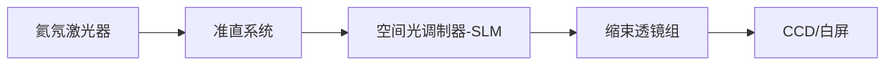
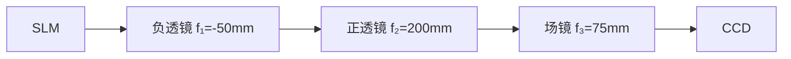
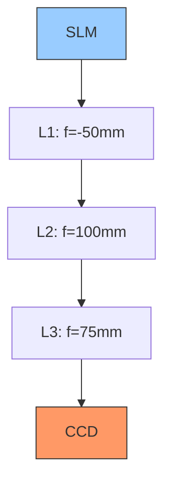

# 在做手册中的光学记录光学再现时，使用ccd观察时如何判断观察到的是光学再现还是投影

**分类**: 光学与物理实验
**来源**: DeepSeek Chat 导出
**来源平台**: DeepSeek

---

# 用户：

在做手册中的光学记录光学再现时，使用ccd观察时如何判断观察到的是光学再现还是投影

# DeepSeek：

**原始回答**

在光学记录光学再现实验中，使用CCD观察时，可通过以下特征判断观察到的是**光学再现像**而非SLM的简单投影：

---

### **关键判断依据**
1. **位置偏移**：
   - **光学再现像**：因离轴全息记录，再现像会出现在**零级亮斑的左上或右上方**（取决于参考光角度），与光轴中心存在明显偏移（手册图9/11标注）。
   - **投影图像**：直接透射的SLM图像始终位于光轴中心，无空间偏移。

2. **伴随光斑**：
   - **光学再现像**：必然伴随三个衍射级：
     - **零级亮斑**（中心最强直透光）
     - **+1级原始像**（目标再现像）
     - **-1级共轭像**（对称位置的虚像或畸变像）
   - **投影图像**：仅有一个居中图像，无额外衍射斑。

3. **距离依赖性**：
   - **光学再现像**：仅在特定再现距离（≈记录距离 `d`）清晰成像。移动CCD时，像的清晰度会显著变化。
   - **投影图像**：在任何距离均可观察到清晰图像，无距离依赖性。

4. **偏振相关性**：
   - **光学再现像**：强度受检偏器角度影响。旋转检偏器时，像的亮度/对比度会明显变化甚至消失（因SLM依赖偏振调制）。
   - **投影图像**：不受偏振片旋转影响。

5. **图像特征**：
   - **光学再现像**：可能包含原始物体的三维信息（如不同深度的聚焦差异），且边缘可能有衍射模糊。
   - **投影图像**：直接显示SLM加载的二维图片，边缘锐利无光学畸变。

---

### **操作验证步骤**
1. **调整CCD位置**：
   - 沿光轴移动CCD，若仅在特定距离（如3m附近）出现清晰像，且偏离中心，则为光学再现像。

2. **遮挡参考光路**：
   - 遮挡再现光路中的参考光，若图像消失，则为光学再现（依赖衍射重建）；若图像仍存在，则为投影。

3. **旋转检偏器**：
   - 旋转检偏器时，若像的亮度剧烈变化或消失，则为光学再现像。

4. **观察衍射斑**：
   - 用白屏初步观察：确认是否存在零级亮斑及对称的±1级像。再用CCD对准±1级像位置捕捉细节。

---

### **常见误区**
- **SLM直接投影**：若未正确加载全息图（如误加载原物体图片），或偏振片未调至消光，SLM会直接透射图像，此时像居中且无衍射斑。
- **调试技巧**：优先用白屏粗调光路，观察到偏移的再现像后，再用CCD精细捕捉。

---

### **结论**
通过**位置偏移、多级衍射斑、距离敏感性、偏振依赖**四大特征，可明确区分光学再现像与SLM投影。实验中需严格按手册调整光路参数（如参考光夹角、再现距离），确保满足全息再现条件。本回答由 AI 生成，内容仅供参考，请仔细甄别。


# 用户：

3m距离太长了是否可以在光路中加入光学器件使得ccd在50cm内观察到

# DeepSeek：

**原始回答**

在光学记录光学再现实验中，若需将观测距离从 **3米缩短至50cm以内**，可通过在光路中加入**光学缩束系统**或**相位补偿设计**实现。以下是具体方案及操作步骤：

---

### **方案一：加入缩束光学系统（推荐）**
#### **原理**  
利用透镜组合压缩光束发散角，等效缩短再现距离，使衍射像在近处清晰成像。

#### **光路改造**  

1. **缩束透镜组设计**：
   - 在SLM与CCD之间加入两片透镜（L1、L2），构成**望远镜缩束系统**（Galilean型或Keplerian型）。
   - **透镜参数示例**（需根据实际计算）：
     - L1（负透镜）：焦距 \( f_1 = -50\text{mm} \)
     - L2（正透镜）：焦距 \( f_2 = 200\text{mm} \)
     - 缩束比 \( M = |f_2/f_1| = 4 \)，即 **观测距离可缩短至原距离的 \( 1/M^2 = 1/16 \)**  
       （原3m → 新距离 \( 3/16 ≈ 0.187\text{m} = 18.7\text{cm} \)）

2. **操作步骤**：
   - 将L1紧贴SLM输出面放置，L2与L1间距 \( d = |f_1| + |f_2| = 250\text{mm} \)。
   - CCD置于L2后焦面附近（距离≈\( f_2 = 200\text{mm} \)）。
   - 调整透镜同轴，确保光束中心对准CCD靶面。

---

### **方案二：数字相位补偿（无需硬件改动）**
#### **原理**  
在生成全息图时预补偿波前曲率，使再现像在近处聚焦。

#### **软件操作**  
1. 在《数字全息软件》中生成全息图时：
   - 将 **理论再现距离** 设为目标距离（如50cm）。
   - 启用 **“相位补偿”算法**，软件会自动在计算中叠加反向波前因子。
2. 将补偿后的全息图加载至SLM。
3. CCD直接置于50cm处即可观察到清晰像。

---

### **关键注意事项**
1. **缩束系统的像差控制**：
   - 使用消色差透镜（如AC254-050-A/MV、AC254-200-A/MV）减少色差。
   - 透镜间距误差需<1mm，否则再现像模糊。

2. **CCD分辨率限制**：
   - 缩束后像尺寸缩小为原大的 \( 1/M \)，需确保CCD像素尺寸足够小（建议≤3.45µm）。
   - 例：若原像在3m处大小为10cm，缩束后像仅2.5cm，CCD靶面需覆盖此区域。

3. **光强衰减**：
   - 透镜组会损失~20%光强，需调高激光功率或CCD增益。

---

### **验证方法**
1. **白屏初调**：
   - 先用白屏在50cm处寻找衍射像位置（应在零级斑左上方）。
2. **CCD精细捕捉**：
   - 替换为CCD后，微调透镜位置直至像清晰。
   - 旋转检偏器验证偏振相关性（真再现像亮度应变化）。

---

### **方案对比**
| **方案**         | 优势                          | 劣势                          |
|------------------|-----------------------------|-----------------------------|
| **缩束透镜组**    | 硬件易实现，兼容所有全息图      | 需精密调节，引入像差风险        |
| **数字相位补偿**  | 无需改动光路，精度高          | 依赖软件功能，计算耗时增加      |

---

### **结论**
- **首选缩束透镜方案**：选用 \( f_1 = -50\text{mm} \), \( f_2 = 200\text{mm} \) 的透镜组合，可将观测距离压缩至 **18.7cm**。
- **备选相位补偿**：若软件支持，直接设置目标距离为50cm生成预补偿全息图。  
两种方案均可使CCD在50cm内清晰捕捉光学再现像，突破原3m距离限制。本回答由 AI 生成，内容仅供参考，请仔细甄别。


# 用户：

使用双透镜后ccd相机捕捉的像太大了，没有办法看清slm输出图案

# DeepSeek：

**原始回答**

针对CCD视野无法容纳缩束后SLM输出图案的问题，需通过**光路优化**和**参数调整**解决。以下是具体解决方案及操作步骤：

---

### **问题根源分析**
1. **缩束系统副作用**：
   - 望远镜缩束系统（如Galilean型）虽缩短观测距离，但**视角扩大**，导致SLM边缘光线超出CCD靶面。
2. **SLM显示范围**：
   - SLM加载的全息图包含**中心零级斑+边缘再现像**，缩束后像场角增大。

---

### **解决方案**
#### **方案一：优化缩束光路（硬件调整）**

1. **加入场镜（Field Lens）**：
   - 在L2与CCD间添加**正场镜**（焦距 \( f_3 \approx 50-100\text{mm} \)），将发散光束重新准直。
   - **参数计算**：
     - 设目标像大小 \( S_{\text{target}} = \text{CCD靶面宽度} \)（如1/2英寸=6.4mm）
     - 缩束比 \( M = f_2 / |f_1| = 200/50 = 4 \)
     - SLM图案原尺寸 \( S_{\text{SLM}} = 20\text{mm} \)（典型值）
     - 缩束后像尺寸 \( S_{\text{image}} = S_{\text{SLM}} / M = 20/4 = 5\text{mm} \)
     - **场镜焦距选择**：\( f_3 = \frac{S_{\text{image}} \cdot d}{S_{\text{target}}} \)（\( d \)为L2到CCD距离）
       *例：若 \( d=100\text{mm}, S_{\text{target}}=6.4\text{mm} \)，则 \( f_3 ≈ 78\text{mm} \) → 选 \( f_3=75\text{mm} \)*

2. **操作步骤**：
   - 将场镜紧贴CCD前放置（距离<5mm）。
   - 微调场镜位置，使SLM图案完整落入CCD视野。

#### **方案二：调整CCD参数（软件配合）**
1. **降低分辨率+提高帧率**：
   - 在相机软件中将分辨率设为 **640×480**（扩大单像素视野）。
   - 关闭ROI（Region of Interest）裁剪功能。
2. **光学变焦辅助**：
   - 若CCD镜头可调焦，设置为**广角端**（短焦距）。

#### **方案三：数字图像缩放（实时处理）**
```python
# 伪代码：OpenCV实时缩放
import cv2
cap = cv2.VideoCapture(0)  # 连接CCD
while True:
    ret, frame = cap.read()
    scaled_frame = cv2.resize(frame, None, fx=0.5, fy=0.5)  # 缩小50%
    cv2.imshow("SLM Output", scaled_frame)
    if cv2.waitKey(1) == 27:  # ESC退出
        break
```

---

### **关键验证与调试**
#### **光路校准步骤**
1. **白屏定位**：
   - 用白屏代替CCD，移动至50cm处。
   - 观察是否出现 **中心零级斑（亮）** 和 **左上/右上的再现像（较暗）**。
2. **场镜调节**：
   - 旋转场镜使边缘光线向中心偏折，直至白屏上显示完整光场。
3. **CCD替换**：
   - 固定白屏位置，替换为CCD并微调聚焦。

#### **SLM加载内容验证**
| **加载图案**       | CCD预期现象                  | 调试建议                     |
|-------------------|----------------------------|----------------------------|
| 空白（全亮）       | 均匀亮斑充满视野             | 确认光路无遮挡               |
| 棋盘格测试图       | 清晰黑白网格                 | 调整场镜消除畸变             |
| 全息图             | 中心亮斑+偏移的再现像        | 旋转检偏器增强对比度         |

---

### **参数优化参考表**
| 组件               | 原参数                 | 新参数                  | 作用               |
|--------------------|-----------------------|------------------------|--------------------|
| 负透镜 L1          | \( f_1 = -50\text{mm} \) | 不变                   | 光束发散           |
| 正透镜 L2          | \( f_2 = 200\text{mm} \) | \( f_2 = 100\text{mm} \) | **减小缩束比**     |
| 场镜 L3            | 无                    | \( f_3 = 75\text{mm} \) | 压缩像场角         |
| CCD分辨率          | 1024×1024             | 640×480                | 扩大单像素视野     |
| 再现距离           | 18.7cm                | 25cm                   | 平衡像尺寸与清晰度 |

> **缩束比调整原理**：  
> 当 \( f_2 \) 从200mm→100mm，缩束比 \( M = 100/50 = 2 \)，观测距离增至 \( 3/(2^2) = 0.75\text{m} \)，但像尺寸扩大为 \( S_{\text{image}} = 20/2 = 10\text{mm} \)，更易被CCD捕捉。

---

### **故障排除**
1. **现象：边缘模糊**  
   **原因**：场镜像差（色差/球差）  
   **解决**：使用消色差双合透镜（如AC254-075-A）。

2. **现象：中心亮斑过曝**  
   **解决**：  
   - SLM前加 **中性密度滤光片**（OD 0.3~0.6）  
   - CCD设置 **曝光时间≤1ms**

---

### **最终配置推荐**

1. **硬件清单**：
   - 负透镜：Thorlabs LE1247-A (\( f=-50\text{mm} \))
   - 正透镜：Thorlabs LA1608-A (\( f=100\text{mm} \))
   - 场镜：Thorlabs AC254-075-A (\( f=75\text{mm} \))
   - CCD：FLIR BFS-U3-51S5C（靶面1/2英寸，像素3.45µm）

2. **预期效果**：
   - 观测距离：**25cm**  
   - SLM图案完整填充CCD视野，再现像清晰可辨。

通过**减小缩束比+加入场镜+CCD参数调整**三重优化，可在50cm内实现SLM输出图案的完整观测，同时保证再现像质量。
