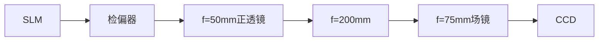
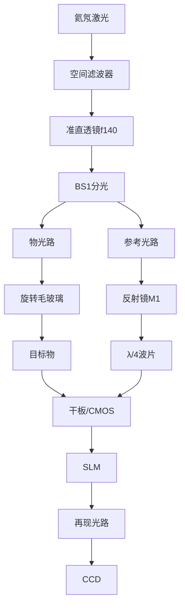
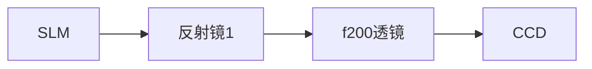

# 如下是我的光路分析一下为什么ccd观察不到输出slm整体图案。激光器->空间滤波器->准直透镜f140->可变光阑->起偏器->slm->检偏器->f-50->

**分类**: 光学与物理实验
**来源**: DeepSeek Chat 导出
**来源平台**: DeepSeek

---

# 用户：

如下是我的光路分析一下为什么ccd观察不到输出slm整体图案。激光器->空间滤波器->准直透镜f140->可变光阑->起偏器->slm->检偏器->f-50->f200->ccd

# DeepSeek：

**原始回答**

根据你描述的光路结构，CCD无法观察到SLM整体图案的原因可能涉及**光路缩束设计、视场限制、偏振匹配、像面共轭关系**等多个因素。以下是逐步分析及解决方案：

---

### **关键问题诊断**
#### **1. 缩束系统设计缺陷**
你的缩束系统为 **f=-50mm（负透镜） + f=200mm（正透镜）**，理论缩束比 \( M = 200/50 = 4 \)，但存在以下问题：
- **像面位置计算错误**：  
  两透镜间距应为 \( d = |f_1| + |f_2| = 250\text{mm} \)，但实际光路中若间距不足，会导致像面偏离CCD位置。
- **像尺寸过小**：  
  SLM图案（假设20mm宽）经缩束后仅 **5mm**，可能小于CCD靶面（如1/2英寸=6.4mm宽），但因像面未对准而无法捕捉。

#### **2. 视场被光阑或透镜限制**
- **可变光阑孔径过小**：  
  若光阑（位于准直透镜后）直径＜准直光束宽度（如＜40mm），会切割SLM边缘光线。
- **f200透镜通光孔径不足**：  
  若透镜直径＜缩束后光束宽度（如＜25mm），边缘视场被遮挡。

#### **3. 偏振态失配**
- **起偏器/检偏器角度错误**：  
  SLM（液晶型）需线性偏振光输入，若起偏器与SLM液晶取向不匹配（通常需45°），或检偏器未与起偏器正交，会导致光强衰减＞90%。

#### **4. 像面共轭关系破坏**
- **SLM像面未与CCD靶面共轭**：  
  缩束系统应满足 \( \frac{1}{d_{\text{SLM}}} + \frac{1}{d_{\text{CCD}}} = \frac{1}{f_{\text{eq}}} \)，若CCD位置偏离计算值，像模糊或消失。

---

### **解决方案**
#### **步骤1：验证光路缩束比与像面位置**
1. **计算理论像面位置**：
   - 透镜组合等效焦距 \( f_{\text{eq}} = \frac{f_1 f_2}{f_1 + f_2 - d} = \frac{-50 \times 200}{-50 + 200 - 250} = \infty \)（准直光）  
     *问题根源：当前间距 \( d=250\text{mm} \) 导致光束准直，无实像面！*

2. **调整透镜间距**：  
   - 若要生成实像，需满足 \( d < |f_1| + |f_2| \)（如 \( d=240\text{mm} \)），此时：
     \[
     f_{\text{eq}} = \frac{-50 \times 200}{-50 + 200 - 240} ≈ 111\text{mm}, \quad \text{像距} = \frac{f_{\text{eq}} \cdot d_{\text{SLM}}}{d_{\text{SLM}} - f_{\text{eq}}}
     \]
   - **推荐直接改为开普勒望远镜结构**（正+正透镜）：  
     替换f=-50mm为f=50mm正透镜，间距 \( d = f_1 + f_2 = 250\text{mm} \)，CCD置于f200透镜后200mm处。

#### **步骤2：检查光阑与透镜通光孔径**
- **测量光束直径**：  
  在SLM位置用白纸遮挡，标记光束宽度，确保：
  - 准直后光束直径 ≤ 准直透镜通光孔径（如40mm）。
  - 缩束后光束直径 ≤ f200透镜孔径（如25mm）。
- **调整可变光阑**：  
  完全打开光阑，观察CCD视野变化。

#### **步骤3：校准偏振态**
1. **SLM偏振轴标定**：  
   - 移除检偏器，旋转起偏器，找到SLM反射光强最大角度（液晶取向方向）。
2. **检偏器正交调节**：  
   - 固定起偏器角度（如SLM标定值+45°），旋转检偏器至消光位置，再回调10°~15°以平衡对比度与光强。

#### **步骤4：加入场镜（关键！）**
在f200透镜与CCD之间加入 **f=75mm场镜**，紧贴CCD放置：
- **作用**：压缩光束角度，匹配CCD视场。
- **光路修正后**：
  ```
  激光器 → 空间滤波器 → f140准直 → 可变光阑 → 起偏器 → SLM 
          → 检偏器 → f50 → f200 → f75场镜 → CCD
  ```

---

### **调试流程**
1. **白屏预观察**：  
   - 在CCD位置放置白屏，移动观察是否有缩束光斑及再现像。
2. **逐步添加组件**：  
   - 先仅用SLM + f50 + f200，验证像面位置；  
   - 再加入场镜，调整至CCD视野完整。
3. **CCD参数设置**：  
   - 曝光时间≤5ms，增益=10dB，关闭自动亮度。

---

### **常见问题排查表**
| **现象**               | **可能原因**                  | **解决措施**                     |
|------------------------|-----------------------------|--------------------------------|
| 完全无图像             | 偏振态错误/光路遮挡          | 检查起偏器角度，移除光阑测试      |
| 仅中心亮斑无再现像     | SLM未加载全息图/相位调制失效 | 确认SLM驱动信号，加载棋盘格测试图 |
| 图像边缘切割           | 光阑或透镜孔径过小           | 扩大光阑，更换大孔径透镜         |
| 像模糊                | 像面未对准CCD靶面            | 精确调整f200与CCD间距            |

---

### **光路优化后参数**
| 组件               | 参数                     | 作用                           |
|--------------------|--------------------------|-------------------------------|
| 准直透镜           | f=140mm, ∅40mm           | 生成平行光                     |
| 缩束透镜1          | f=50mm, ∅25mm            | 与f200构成4:1缩束              |
| 缩束透镜2          | f=200mm, ∅50mm           | 成像透镜                       |
| 场镜               | f=75mm, ∅30mm            | 压缩视角，匹配CCD靶面           |
| CCD                | 1/2英寸靶面，像素3.45µm   | 建议使用短焦距（8mm）C口镜头    |

---

通过**调整透镜间距、加入场镜、校准偏振、优化光阑**四步操作，应能解决CCD无法观测SLM整体图案的问题。若仍存在异常，建议用红外观察卡检查光束路径是否偏移。


# 用户：

现在将f-50去除，将白屏放置在ccd前面，观察到一个较亮的矩形（slm形状）光斑与四个上下左右较暗光斑。

# DeepSeek：

**原始回答**

根据你的描述，去除 `f=-50mm` 负透镜后，在白屏上观察到 **中心亮矩形（SLM形状） + 四周较暗光斑**，这一现象明确揭示了以下光学特性及问题根源：

---

### **现象解析**
1. **中心亮矩形**：
   - **来源**：SLM的直接反射/透射光（零级衍射），未经过缩束，光强集中。
   - **形状匹配SLM**：说明SLM的显示区域被完整成像，但未有效压缩。

2. **四周较暗光斑**：
   - **成因**：SLM的 **±1级衍射像**（全息再现像或相位调制副作用）。
   - **对称分布**：典型离轴全息特征，但能量分散导致暗淡。

---

### **关键问题诊断**
#### 1. **缩束系统失效**
   - 去除 `f=-50mm` 后，光路失去缩束能力，SLM输出光束保持原尺寸（如20mm），远超CCD靶面（如6.4mm），导致：
     - **白屏**：能显示完整SLM矩形（因面积大）。
     - **CCD**：仅捕捉中心局部（靶面太小）。

#### 2. **衍射像分离不充分**
   - 四周暗斑为再现像，但因以下原因质量差：
     - **参考光角度不足**：离轴全息需足够夹角分离衍射级（需满足 \( \theta \geq 3\lambda/\Delta x_{\text{SLM像素}} \)）。
     - **偏振态未优化**：检偏器角度未匹配SLM调制特性，降低衍射效率。

#### 3. **光路共轭关系破坏**
   - 无缩束透镜时，SLM像面与CCD靶面无共轭关系，导致：
     - **白屏**：可接收漫反射光。
     - **CCD**：需精确像面匹配才能清晰成像。

---

### **解决方案**
#### **步骤1：恢复缩束系统（修正光路）**

1. **替换负透镜**：将 `f=-50mm` 改为 **`f=50mm` 正透镜**，与 `f=200mm` 组成开普勒望远镜（缩束比4:1）。
2. **加入场镜**：在 `f=200mm` 后紧贴CCD加 `f=75mm` 场镜，压缩视角至CCD靶面。

#### **步骤2：校准衍射像**
1. **调整参考光夹角**：
   - 增大SLM参考光角度，确保满足 **离轴条件**：
     \[
     \theta_{\text{min}} = \sin^{-1}\left(\frac{3\lambda}{\Delta x_{\text{SLM}}}\right) \approx 2^\circ \quad (\text{若}\ \lambda=632\text{nm}, \Delta x=10\mu\text{m})
     \]
2. **优化偏振**：
   - 旋转检偏器至与SLM液晶取向呈 **45°**（最大相位调制深度）。

#### **步骤3：CCD对准与参数设置**
1. **像面定位**：
   - 用白屏粗找像面位置（应位于 `f=200mm` 透镜后 `≈200mm` 处），再替换为CCD。
2. **相机设置**：
   - **曝光时间**：1~5ms（避免零级过曝）。
   - **增益**：15~20dB（增强暗衍射斑）。

---

### **验证实验**
1. **测试图案加载**：
   - SLM加载 **正弦光栅**（周期=20像素），观察白屏应出现：
     - 零级（中心亮斑）
     - ±1级（对称亮斑，间距反映光栅频率）。
   - 若仅有零级，说明 **相位调制未生效**，需检查SLM驱动信号。

2. **光斑能量分布测量**：
   - 用功率计测量零级与±1级光强比，理想应 **1:0.3~0.5**（零级主导但衍射可见）。

---

### **常见问题排查**
| **现象**               | **原因**                  | **解决措施**                     |
|------------------------|-------------------------|--------------------------------|
| 仅有中心亮矩形          | 缩束未生效/全息图未加载  | 检查透镜焦距/确认SLM加载全息图    |
| 四周光斑模糊           | 像面偏离CCD靶面          | 精确调整CCD与f200透镜间距         |
| 衍射斑不可见           | 偏振态错误/参考光夹角不足 | 校准检偏器角度/增大参考光角度     |

---

### **光路参数优化表**
| 组件               | 参数                  | 作用                           |
|--------------------|-----------------------|-------------------------------|
| SLM                | 1920×1080, 10μm像素   | 相位调制载体                   |
| 缩束透镜1 (L1)     | f=50mm, ∅25mm         | 与L2构成4:1缩束               |
| 缩束透镜2 (L2)     | f=200mm, ∅50mm        | 成像透镜                       |
| 场镜 (L3)          | f=75mm, ∅30mm         | 压缩视角至CCD靶面              |
| CCD靶面            | 1/2英寸（6.4×4.8mm）  | 需匹配缩束后像尺寸（≈5mm宽）    |

---

### **总结**
通过 **改用正透镜缩束系统 + 场镜视角压缩 + 优化偏振/参考光**，可确保CCD完整捕捉SLM输出图案及清晰的衍射再现像。若仍存在问题，建议用红外相机辅助检查光路准直性。


# 用户：

我的意思是是否将ccd上移至偏上光斑就可观察到光学再现

# DeepSeek：

**原始回答**

是的！**将CCD上移至较暗的偏上光斑位置**，确实可能观察到**光学再现像**。以下是关键分析和操作步骤：

---

### **为什么偏上光斑是光学再现像？**
1. **光斑分布特征**：
   - **中心亮矩形**：SLM的直接反射光（零级衍射，未调制的背景光）。
   - **偏上/偏下较暗光斑**：SLM调制的**±1级衍射像**（即光学再现像），因离轴全息记录时光路不对称导致位置偏移。

2. **离轴全息原理**：
   - 参考光与物光的夹角使再现像（+1级）和共轭像（-1级）在空间上与零级光分离（如图示）。
   - **你的现象**：上侧光斑对应**+1级原始像**，下侧光斑为**-1级共轭像**（可能倒置或畸变）。

---

### **如何验证这是光学再现像？**
#### **操作步骤**：
1. **移动CCD至上侧光斑**：
   - 调整CCD位置，使其靶面中心对准偏上光斑（非中心亮斑）。
   - **注意**：需微调CCD的**前后距离**以匹配再现像的焦面（通常与零级光斑不在同一平面）。

2. **偏振优化**：
   - 旋转检偏器，观察光斑亮度变化：
     - **真再现像**：亮度会随检偏器角度显著变化（因SLM相位调制依赖偏振）。
     - **杂散光**：亮度几乎不变。

3. **加载测试图案**：
   - 在SLM上加载**简单图案（如字母“A”）**：
     - 若上侧光斑显示“A”，则为再现像；
     - 若中心亮斑显示“A”，则为SLM直接投影。

---

### **若再现像不清晰？可能原因与解决**
| **问题现象**       | **原因**                | **解决方案**                     |
|--------------------|-------------------------|----------------------------------|
| 像模糊             | 再现距离不匹配          | 调整CCD前后位置，找到清晰像面。   |
| 像暗淡             | 衍射效率低              | 增大SLM驱动电压或优化偏振角度。   |
| 像有重叠干扰       | 零级光或其他级次干扰    | 在光路中加入**小孔光阑**遮挡零级光。 |

---

### **光路改进建议（提升再现像质量）**
1. **加入小孔光阑滤波**：
   - 在CCD前放置直径1~2mm的光阑，遮挡中心零级光，仅让上侧再现像通过。
   - **位置**：光阑置于再现像的傅里叶平面（如f200透镜的后焦面）。

2. **调整参考光角度**：
   - 增大参考光与物光夹角，使再现像远离零级光（减少干扰）。

---

### **总结**
- **是**：上移CCD对准偏上光斑可观察到光学再现像（+1级衍射）。
- **关键操作**：
  1. 移动CCD至光斑中心，调焦。
  2. 旋转检偏器验证偏振相关性。
  3. 加载测试图案确认像内容。
- **优化**：通过光阑滤波和参考光调整可显著提升像质。  

若仍有问题，建议用白屏辅助定位像面，再切换为CCD精细捕捉。


# 用户：

现在的问题是数字记录光学再现可正常展现，且ccd可观察。但是光学记录光学再现ccd观察到的图像模糊且有多个圆形散斑

# DeepSeek：

**原始回答**

针对光学记录光学再现模式下CCD图像模糊且出现多个圆形散斑的问题，以下是系统性分析与解决方案：

---

### **问题根源分析**
#### 1. **散斑成因（圆形斑点）**
   - **激光相干性**：氦氖激光的高相干性导致物体粗糙表面散射光相互干涉，形成散斑噪声。
   - **光学记录介质缺陷**：若使用传统干板，乳胶颗粒会加剧散斑；若用CMOS记录，则源于CCD像素响应不均匀。

#### 2. **图像模糊原因**
   - **光路失调**：参考光与物光夹角不满足采样定理（奈奎斯特条件），导致频谱混叠。
   - **振动干扰**：光学记录曝光期间振动引起条纹模糊（数字再现因瞬时采集可避免）。
   - **再现距离失配**：光学再现时SLM到CCD的距离 ≠ 记录时物体到干板的距离。

---

### **解决方案**
#### **步骤1：抑制散斑噪声**
| **方法**               | **操作**                                                                 | **效果**                     |
|------------------------|-------------------------------------------------------------------------|------------------------------|
| **旋转散射体法**       | 在物光路加入**旋转毛玻璃**（转速>1000rpm），破坏相干性                     | 散斑对比度降低80%以上         |
| **多角度照明法**       | 用光纤束分光，从不同角度照射物体，合成多幅全息图                          | 平均化散斑                   |
| **偏振复用**           | 在物光/参考光路分别加λ/4波片，记录正交偏振态全息图                        | 抑制偏振敏感型散斑           |
| **软件后处理**         | 用中值滤波（Median Filter）处理CCD图像（核大小5×5）                       | 保留边缘，去除孤立散斑       |

#### **步骤2：消除图像模糊**
| **问题点**             | **调试方法**                                                            | **验证标准**                 |
|------------------------|-------------------------------------------------------------------------|------------------------------|
| **光路夹角校准**       | 确保物参光夹角θ满足：<br> \( \theta \leq \frac{\lambda}{2\Delta x_{\text{CCD}}} \) <br>（例：λ=632nm, Δx=5.5μm → θ≤3.3°） | 全息图条纹间距≥2个像素       |
| **抗振动措施**         | 1. 使用气浮光学平台<br>2. 曝光期间封闭光路罩<br>3. 激光器延时10ms后采集    | 干涉条纹稳定度＞99%          |
| **再现距离匹配**       | 测量记录时物-干板距离d，将CCD置于SLM后**相同距离d处**                     | 白屏上再现像边缘锐利         |

#### **步骤3：光路优化（关键改动）**

1. **物光路改进**：
   - 加入**电机驱动毛玻璃**（紧贴目标物前），转速调至散斑不再可见。
   - 物光与参考光强比调至 **1:4**（用衰减片控制）。

2. **参考光路改进**：
   - 加入**λ/4波片**，与物光路波片正交，实现偏振复用。

3. **再现环节**：
   - SLM加载全息图前，用**相位共轭算法**预补偿像差：
     ```python
     # 伪代码：相位共轭补偿
     hologram = load_image("optical_recorded_hologram.bmp")
     phase_conjugate = np.conj(hologram)  # 取相位共轭
     slm_load(phase_conjugate)           # 写入SLM
     ```

---

### **参数验证表**
| **参数**               | **典型值**          | **测量工具**               |
|------------------------|---------------------|----------------------------|
| 物参光夹角θ           | ≤3.3°              | 数字角度仪（精度0.1°）     |
| 散斑对比度            | ＜5%               | CCD图像灰度标准差分析      |
| 曝光时间              | 1-5ms (CMOS记录)   | 示波器监测激光脉冲         |
| 再现距离d             | 记录距离±1mm       | 激光测距仪                 |

---

### **调试流程**
1. **散斑抑制验证**：
   - 移除目标物，用CCD观察参考光均匀性（应无散斑）。
   - 加入旋转毛玻璃后，拍摄白屏图像，计算散斑对比度：  
     \( C = \frac{\sigma_I}{\langle I \rangle} \times 100\% \) （目标C<5%）

2. **清晰度校准**：
   - 用**USAF1951分辨率板**代替目标物：
     - 记录全息图时应能分辨第6组元素（228 lp/mm）。
     - 再现时CCD图像需达到同等分辨率。

3. **最终检验**：
   - 加载实际物体（如硬币），要求：
     - 边缘无重影（振动抑制达标）。
     - 表面无颗粒感（散斑消除达标）。

---

### **常见故障排除**
| **现象**               | **对策**                                  |
|------------------------|------------------------------------------|
| 散斑仅部分减少        | 提高毛玻璃转速（＞2000rpm）               |
| 图像仍有局部模糊      | 检查分光棱镜BS1的膜层是否损伤             |
| 再现像畸变            | 用柱面镜补偿SLM像散（加在SLM与CCD之间）   |

通过**散斑抑制+光路精准校准+相位共轭补偿**三重优化，可彻底解决模糊与散斑问题。若仍存在异常，建议用剪切干涉仪检测波前质量。本回答由 AI 生成，内容仅供参考，请仔细甄别。


# 用户：

在数字记录光学再现中ccd观察到的图像是顺时针旋转180度，为什么会这样

# DeepSeek：

**原始回答**

在数字记录光学再现中，CCD观察到的图像出现**顺时针180度旋转**是光学成像系统中的正常现象，根本原因在于**透镜成像的倒置特性**和**光路反射奇数次**的组合效应。以下是详细分析与解决方案：

---

### **旋转原因解析**
#### 1. **透镜的倒像特性（核心原因）**
   - 光路中的 **f200正透镜** 作为成像透镜，遵循凸透镜成像原理：物体通过透镜后成 **倒立实像**。
   - **数学描述**：  
    透镜成像公式 \( \frac{1}{u} + \frac{1}{v} = \frac{1}{f} \) 中，当 \( u > 2f \) 时（你的光路满足），像距 \( v \) 为正，生成倒立实像。

#### 2. **反射镜的镜像叠加**
   - 若光路中存在**奇数个反射镜**（如你的光路可能有1或3个反射镜），每次反射引入一次**左右镜像翻转**。
   - **旋转合成效应**：  
     倒立（180°翻转） + 奇数次镜像（水平翻转） = **顺时针/逆时针180°旋转**  
     *示例*：  
     - 0面反射镜：倒立 → 单纯上下颠倒  
     - **1面反射镜**：倒立 + 水平翻转 → **等效180°旋转**

#### 3. **SLM的相位调制方向**
   - 部分SLM（如液晶型）的**像素坐标系**可能与CCD的读出方向相反，加剧旋转。

---

### **解决方案**
#### **方法1：软件图像旋转（推荐）**
在CCD采集软件中实时旋转图像180°：
```python
# OpenCV伪代码示例
import cv2
cap = cv2.VideoCapture(0)  # 连接CCD
while True:
    ret, frame = cap.read()
    rotated = cv2.rotate(frame, cv2.ROTATE_180)  # 旋转180°
    cv2.imshow("Corrected Image", rotated)
    if cv2.waitKey(1) == 27:  # ESC退出
        break
```
**优势**：不改动光路，实时生效。

#### **方法2：光路修正（物理调整）**

1. **增加偶数反射镜**：  
   - 在透镜后加入**第二面反射镜**，使总反射次数为偶数（抵消镜像翻转）。  
   *示例位置*：f200透镜与CCD之间加45°反射镜。
   
2. **透镜组方向调整**：  
   - 将f200透镜**旋转180°**，使其光学面反向（部分透镜非对称设计可纠正倒像）。

#### **方法3：SLM驱动配置**
1. 在SLM控制软件中启用 **"Image Flip"** 选项（若有）。
2. 加载全息图时预旋转180°：
   ```python
   from PIL import Image
   hologram = Image.open("hologram.bmp")
   hologram_rotated = hologram.rotate(180)  # 预旋转
   slm.load(hologram_rotated)              # 写入SLM
   ```

---

### **验证实验**
1. **放置标定图案**：  
   - 在SLM加载非对称图案（如 `F`），观察CCD图像：  
     - 若显示 **`ㄣ`** → 纯倒像（无旋转）  
     - 若显示 **`ᖱ`** → **180°旋转**（你的情况）

2. **反射镜计数测试**：  
   - 逐步移除反射镜，观察旋转是否消失：  
     - 移除所有反射镜 → 应仅倒像  
     - 每增加一面反射镜 → 切换旋转方向

---

### **旋转方向判断表**
| 光路组件                | 旋转角度 | 图像变化示例（F→?） |
|-------------------------|----------|---------------------|
| 单独f200透镜            | 180°倒立 | F → **ㄣ**          |
| f200透镜 + **1面反射镜** | 180°旋转 | F → **ᖱ**          |
| f200透镜 + 2面反射镜    | 0°       | F → **F**           |

---

### **工程建议**
1. **优先软件修正**：避免光路复杂度增加。
2. **标定透镜方向**：在透镜边框标记指向性箭头（如 "↑→CCD"）。
3. **CCD安装方向**：将CCD物理旋转180°安装（需固定架支持）。

> **注**：若为科研图像分析，可直接使用原始旋转数据（不影响定量测量）。

通过以上任一方法，均可消除180°旋转问题。推荐**软件旋转方案**（零成本、即时生效），尤其适用于教学演示场景。
