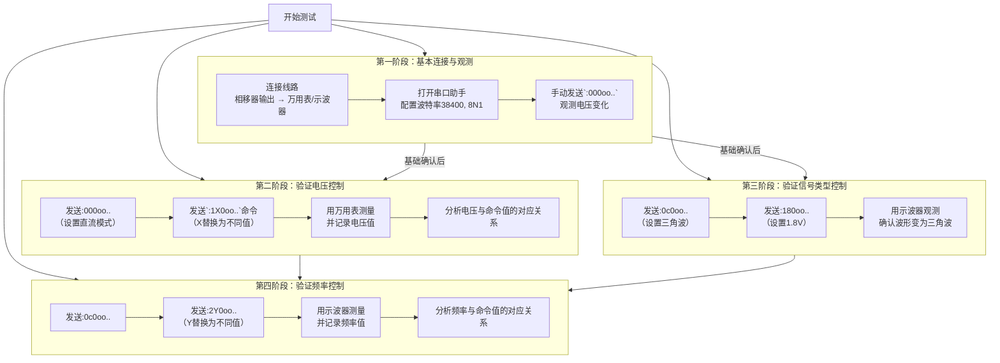

# 实验测试步骤指导

光学与物理实验
**来源**: DeepSeek Chat 导出
**来源平台**: DeepSeek

---

# 用户：

如何进行接下来的测试，

# DeepSeek：

**原始回答**

非常好！接下来是**最令人兴奋的实践测试阶段**。我们将通过一系列严谨的步骤来验证我们的理论，并最终确保你的新软件能够可靠地控制相移器。

整个测试计划遵循 **“由简到繁，逐个验证”** 的原则，如下图所示：

---

### 第一阶段：基本连接与观测

**目标：** 确认硬件连接正确，并且相移器能对我们的命令产生反应。

1.  **准备工作：**
    *   **硬件连接：** 将相移器的信号输出线连接到**万用表**（电压档）或**示波器**的探头上。
    *   **软件准备：** 在电脑上打开一个**串口调试助手**软件（如 AccessPort、友善串口助手、甚至 Python 的 `pyserial` 库）。这是独立于你新软件的测试工具。

2.  **初步测试：**
    *   在串口调试助手中，选择正确的串口号（COM4），设置参数：**波特率 38400, 8数据位, 无奇偶校验, 1停止位, 无流控**。
    *   在发送区，选择 **“按字符串发送”**。
    *   手动输入第一条命令：`:000oo..` （注意，最后一个点是两个字符：回车+换行，在有些软件里可以直接输入 `\r\n` 来代表）。
    *   **点击发送**。
    *   **立即观察万用表示数**。你是否看到电压发生了变化（比如从0V跳变到某个值）？

**结果分析：**
*   **如果电压变化了**：**太棒了！** 这直接证明命令有效，通信链路是通的。
*   **如果没反应**：检查接线、串口是否被其他程序占用、波特率是否正确。确保发送的是字符串而不是十六进制数（除非调试助手明确设置了16进制发送）。

---

### 第二阶段：验证电压控制命令 (`:1X0oo..`)

**目标：** 确认 `:1X0oo..` 命令能精确控制输出电压，并找出数值编码规律。

1.  **发送设置命令：** 先发送 `:000oo..` 确保设置为直流模式。
2.  **发送电压命令：** 按顺序发送以下命令，每次发送后记录万用表上显示的稳定电压值。
    *   `:180oo..` -> 电压值 = ? V
    *   `:190oo..` -> 电压值 = ? V
    *   `:200oo..` -> 电压值 = ? V
    *   `:150oo..` -> 电压值 = ? V

3.  **分析规律：**
    *   比较命令中的数字（180, 190, 200, 150）和实际电压值（如1.80V, 1.90V, 2.00V, 1.50V）。
    *   **很可能你会发现：`命令值 = 电压值 * 100`。** 这就是协议的编码方式！

---

### 第三阶段：验证信号类型命令 (`:0X0oo..`)

**目标：** 确认 `:0c0oo..` 和 `:000oo..` 能切换信号类型。**这一步需要示波器。**

1.  **设置一个可识别的电压：** 先发送 `:190oo..`（期望得到1.90V直流）。
2.  **切换信号类型：** 发送 `:0c0oo..` 命令。
3.  **观察示波器：** 屏幕上的直线直流信号是否变成了一个幅值约为1.90V的三角波？
4.  **切换回来：** 再发送 `:000oo..` 命令，波形应该又变回一条直线。

**结果分析：**
*   如果波形成功切换，就证实了 `:000oo..` 和 `:0c0oo..` 分别是直流和三角波的命令。

---

### 第四阶段：验证频率控制命令 (`:2Y0oo..`)

**目标：** 确认在三角波模式下，`:2Y0oo..` 命令能控制频率。

1.  **设置三角波和电压：** 发送 `:0c0oo..` 和 `:180oo..`。
2.  **发送频率命令：** 按顺序发送以下命令，每次发送后用示波器测量波形频率。
    *   `:240oo..` -> 频率 = ? Hz
    *   `:210oo..` -> 频率 = ? Hz
    *   `:2100oo..` (注意这里是4位数 `2100`) -> 频率 = ? Hz
3.  **分析规律：** 找出命令数值（如240）和实际频率（如24.0Hz? 240Hz?）之间的关系。

---

### ✅ 测试后的行动

*   **创建命令映射表：** 将测试得到的准确命令（如 `SetVoltage(1.5)` -> `:150oo..`）封装到你新软件的代码中。
*   **编写发送函数：** 编写一个 helper 函数，接收浮点电压值，将其转换为整数，并格式化成命令字符串发送。
*   **优化UI：** 根据测试结果，设置电压和频率滑块的合理范围。

**记住，第一次测试可能不会百分百顺利，但任何反应（甚至是错误反应）都是宝贵的数据，能帮助我们更深入地了解协议。** 祝你测试顺利！
