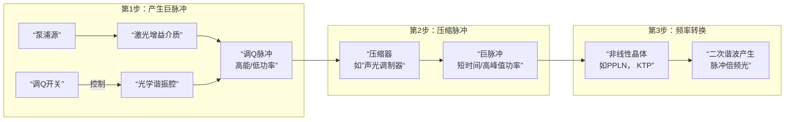

# 帮助我解析这个论文

**分类**：光学与物理实验
**来源**：DeepSeek Chat 导出
**来源平台**：DeepSeek
**原始文件**：紧凑型单激光磁光阱系统解析.md
**包含轮次**：1 - 17

---

# 用户：
帮助我解析这个论文

# DeepSeek：

**原始回答**
这篇题为《**Realization of the Compact Magneto-Optical Trap Based on Single Laser with Frequency Modulation**》的论文，由浙江工业大学的研究团队完成，提出并实现了一种**基于单激光频率调制的紧凑型磁光阱系统**。以下是对该论文的**系统解析**：

---

## 🧾 一、研究背景与意义

- **传统MOT系统** 使用多个激光器分别产生冷却光和再泵浦光，结构复杂、体积大、成本高、便携性差。
- **本文目标**：设计一种**结构简化、体积小、便携性强**的MOT系统，适用于**野外、空间、移动平台**等场景，如重力测量、导航、深空探测等。

---

## 🔧 二、系统设计亮点

### 1. **单激光双频率输出**
- 使用**一个光纤激光器**（1560.48 nm）经EDFA放大后，通过**PPLN倍频**至780 nm。
- 使用**电光调制器** 对部分光进行**6423.09 MHz的频率偏移**，从而同时产生：
  - **冷却光**：\(|F=2\rangle \rightarrow |F'=3\rangle\)，红失谐12 MHz
  - **再泵浦光**：\(|F=1\rangle \rightarrow |F'=1\rangle\)

### 2. **紧凑光路设计**
- 使用**饱和吸收光谱** 进行频率锁定。
- 光路集成度高，使用**反射镜、HWP、QWP、PBS**等元件，将一束光分为三束，每束包含冷却光和再泵浦光。
- 最终进入真空腔的激光功率约为45 mW（冷却光43 mW，再泵浦光2 mW）。

### 3. **真空系统**
- 体积小：\(4.61 \times 10^{-5} \, \text{m}^3\)
- 使用**分子泵 + 离子泵** 实现并维持**10⁻⁷ Pa**的超高真空。
- 使用**钛材料和铟密封**，保证真空密封性。

### 4. **磁场系统**
- 使用**反亥姆霍兹线圈**，通以1.2 A反向电流。
- 测量得到**磁场梯度为11.61 Gs/cm**，满足MOT捕获要求。

### 5. **电子控制系统**
- 集成激光驱动、磁场控制、CCD成像、电源管理等模块。
- 提高系统**稳定性与可重复性**。

---

## 📊 三、实验结果

- **捕获原子数**：约 \(7.17 \times 10^6\) 个 \(^{87}\text{Rb}\) 原子
- **原子加载速率**：\(1.79 \times 10^7\) 原子/秒
- **原子云尺寸**：约 1.3 mm
- 虽然加载速率低于某些文献（如浙大系统的 \(2.8 \times 10^9\) 原子/秒），但**在紧凑型系统中表现良好**。

---

## 🔮 四、未来展望

1. **温度测量**：计划引入**飞行时间法** 测量原子云温度。
2. **冷原子干涉**：
   - 使用微波脉冲制备 \(m_F=0\) 态；
   - 通过Raman光束实现**原子干涉**，用于**重力测量、旋转传感、原子钟**等。
3. **系统优化**：提升激光功率、光路对准精度、磁场均匀性等，以提升原子捕获效率。

---

## ✅ 五、总结

| 指标 | 数值 |
|------|------|
| 系统高度 | 0.7 m |
| 系统体积 | \(6.3 \times 10^{-2} \, \text{m}^3\) |
| 系统质量 | 11.32 kg |
| 原子加载速率 | \(1.79 \times 10^7\) 原子/秒 |
| 真空度 | \(10^{-7}\) Pa |
| 磁场梯度 | 11.61 Gs/cm |

---

## 🧠 六、创新点总结

1. **单激光双频输出**，简化系统结构。
2. **高度集成化光路与真空系统**，实现小型化。
3. **完整的电子控制与数据采集系统**，提升实用性。
4. **为便携式冷原子设备提供可行方案**，具有广泛应用前景。

---

如果你需要我进一步提炼出**PPT讲稿、中文综述、图示说明**或**对比分析表**，我可以继续帮你整理。

# 用户：
中文综述、图示说明或对比分析表依次分回答给出，现在输出中文综述

# DeepSeek：

**原始回答**
好的，这是对论文《基于单激光频率调制的紧凑型磁光阱的实现》的**中文综述**。

---

### **基于单激光频率调制的紧凑型磁光阱系统——中文综述**

#### **一、 研究背景与核心问题**

激光冷却与原子囚禁技术，特别是磁光阱，是冷原子物理研究的基石，为原子钟、重力仪、陀螺仪等量子精密测量设备提供了理想的原子源。然而，传统的MOT系统通常需要**两套独立的激光器**分别产生冷却光和再泵浦光，导致系统**结构复杂、体积庞大、成本高昂、集成度低**，严重限制了其在野外、移动平台（如车载、船载）及空间任务中的应用。

#### **二、 本研究的创新性解决方案**

为解决上述问题，浙江工业大学研究团队提出并实现了一种**基于单激光频率调制的紧凑型MOT系统**。其核心创新在于：

1.  **单激光双频输出**：这是本设计的最大亮点。系统仅使用**一个1560.48 nm的光纤激光器**，通过**掺铒光纤放大器放大**和**周期极化铌酸锂晶体倍频**至780 nm（铷原子D2线）。随后，利用**电光调制器** 对部分激光进行**6423.09 MHz的频率偏移**，从而从一束激光中同时产生所需的两束光：
    *   **冷却光**：频率对应于 \(|5^2S_{1/2}, F=2\rangle \rightarrow |5^2P_{3/2}, F'=3\rangle\) 跃迁，并红失谐12 MHz。
    *   **再泵浦光**：频率对应于 \(|5^2S_{1/2}, F=1\rangle \rightarrow |5^2P_{3/2}, F'=1\rangle\) 跃迁。

2.  **高度集成化的光路与结构**：
    *   采用**饱和吸收光谱**技术将再泵浦光的频率精确锁定。
    *   光路模块化设计，使用偏振分光棱镜、半波片、四分之一波片等元件，将包含双频的激光束高效地分为三束并导入真空腔，光路稳定且紧凑。
    *   整个系统高度仅0.7米，体积0.063立方米，重量11.32公斤，实现了小型化与便携性。

3.  **可靠的超高真空系统**：
    *   设计了一个小体积（\(4.61 \times 10^{-5} \, \text{m}^3\)）的真空腔。
    *   采用**分子泵预抽真空+离子泵长期维持**的方案，并经过烘烤去气，最终获得了 \(10^{-7}\) Pa量级的超高真空环境，有效减少了原子与背景气体的碰撞。

4.  **配套的磁场与电子控制系统**：
    *   使用一对反亥姆霍兹线圈，通以反向电流，在中心区域产生了约**11.61 Gs/cm的磁场梯度**，满足原子囚禁要求。
    *   电子控制系统集成了激光驱动、磁场控制、电源管理和CCD成像等功能，提升了系统的自动化程度和稳定性。

#### **三、 实验结果与性能验证**

实验成功地在该紧凑系统中捕获并冷却了 \(^{87}\text{Rb}\) 原子。
*   观测到了直径约**1.3 mm**的原子云。
*   通过探测原子的荧光信号，计算出被捕获的原子数约为 \(7.17 \times 10^6\) 个。
*   系统的**原子加载速率**达到 \(1.79 \times 10^7\) 原子/秒。

尽管该加载速率低于一些大型实验室系统，但考虑到其**显著优化了的体积、重量和复杂度**，这一性能充分证明了该设计方案的**有效性和实用性**。

#### **四、 未来展望与应用潜力**

论文展望了该系统的升级与应用方向：
1.  **温度测量**：计划引入**飞行时间法**，通过测量自由下落原子云的膨胀来精确测量原子温度。
2.  **冷原子干涉**：计划在该平台上引入Raman光、微波脉冲等，开展冷原子干涉实验，用于**重力加速度测量、旋转传感**以及**高性能原子钟**的研制。

#### **五、 总结与意义**

本研究成功地研制出了一套**高度集成、便携高效的紧凑型磁光阱系统**。其首创的“单激光双频”技术路径，为解决传统MOT系统的复杂性问题提供了一个新颖、可靠的解决方案。该工作为冷原子技术从实验室走向现场应用（如移动重力测量、量子导航、深空探测等）奠定了重要的设备基础，对推动冷原子物理的实用化进程具有重要价值。

# 用户：
其与美国ColdQuanta（MINI-MOT）有什么区别

# DeepSeek：

**原始回答**
好的，这是一个非常关键的问题。将本文实现的紧凑型MOT与美国ColdQuanta公司的商用miniMOT进行对比，可以清晰地看出**学术原型**与**成熟商业产品**在目标、技术路径和性能上的差异。

以下是一份详细的对比分析。

---

### **中国浙工大紧凑MOT vs. 美国ColdQuanta miniMOT V2 对比分析表**

| 对比维度 | 浙工大 (本文) 紧凑MOT | ColdQuanta (现为Infleqtion) miniMOT V2 |
| :--- | :--- | :--- |
| **核心定位** | **学术研究原型**，验证一种**新颖的、低成本、简化的技术路径** | **成熟商用产品**，提供**“交钥匙”** 解决方案，追求稳定、易用、高性能 |
| **技术路线最大亮点** | **单激光 + 频率调制** <br>• 使用一个激光器，通过EOM产生双频光，极大简化系统 | **传统多激光器 + 高度集成** <br>• 使用独立的冷却光和再泵浦光激光器，通过精密设计和集成保证性能 |
| **系统体积与重量** | • 体积：\(6.3 \times 10^{-2} \, \text{m}^3\) <br>• 高度：0.7 m <br>• 质量：**11.32 kg** | • 体积：约 \(5.3 \times 10^{-3} \, \text{m}^3\) <br>• 尺寸：\(149 \times 119 \times 298 \, \text{mm}\) <br>• 质量：**3.3 kg** <br>**（明显更小更轻）** |
| **真空系统** | • 自定义设计的钛腔体 <br>• **分子泵+离子泵**组合，需外部预抽 | • 集成式**标准薄壁玻璃气室** <br>• 内置**离子泵**，实现真正的“一键启动” |
| **光学系统** | • 复杂的自由空间光路，需要精密调整 <br>• 光路稳定性依赖于机械设计 | • 光路高度集成，用户只需对准入射光束 <br>• 稳定性和可靠性更高，适合非专家用户 |
| **性能指标 (原子数/加载速率)** | • 原子数：~ \(7.17 \times 10^6\) <br>• 加载速率：\(1.79 \times 10^7\) 原子/秒 | • 原子数：**高达 \(10^8\)** <br>• 加载速率：典型值高于 \(10^8\) 原子/秒 <br>**（性能高出一个数量级）** |
| **优点** | 1. **成本潜力低**：单激光器方案可降低核心部件成本。<br>2. **创新性强**：为MOT简化提供了新思路。<br>3. **灵活性高**：作为研究原型，便于后续修改和升级。 | 1. **极致紧凑与便携**。<br>2. **即插即用，用户体验极佳**，极大降低了使用门槛。<br>3. **性能稳定且优异**，满足多数高端应用需求。<br>4. **完善的配套软件与支持**。 |
| **缺点 / 挑战** | 1. **性能相对较低**。<br>2. **集成度和成熟度低**，操作维护需要专业知识。<br>3. **“一键启动”能力弱**，需要外部泵和烘烤流程。 | 1. **成本高昂**，商用产品定价通常远高于自研系统。<br>2. **技术“黑箱化”**，用户对内部修改和深度定制的空间有限。 |
| **目标用户与场景** | • 学术研究机构：用于验证新技术、教学演示、或作为定制化实验的起点。<br>• 对成本敏感且具备专业技术的团队。 | • 工业研发部门：快速部署用于量子传感、计量等应用。<br>• 空间任务：因其高集成度和可靠性。<br>• 希望快速进入冷原子领域而无须自建系统的科研团队。 |

---

### **核心区别总结与图示说明**

我们可以将两者的区别核心归结为两种不同的技术哲学：

#### **1. 浙工大MOT： “减法设计” —— 从核心原理上简化**

- **思路**：通过**电光调制器** 这一“频率转换器”，将传统系统中“两个激光器”的物理实体，简化为“一个激光器+一个调制器”的功能组合。
- **图示**：
  ```
  传统MOT:  [激光器A] --> 冷却光
            [激光器B] --> 再泵浦光

  浙工大MOT: [单个激光器] --> [EOM] --（包含两个频率）--> 冷却光 + 再泵浦光
  ```
- **结果**：源头上减少了系统复杂性和潜在成本，但引入了新的技术挑战（如调制效率、功率分配、频率锁定），其整体集成度和用户体验是后续优化的目标。

#### **2. ColdQuanta miniMOT： “集成设计” —— 在成熟方案上做极致优化**

- **思路**：不改变“双激光器”的核心方案，而是通过**微集成技术**，将真空腔、光学元件、离子泵、线圈等**像一个芯片一样封装起来**，实现体积和重量的最小化。
- **图示**：
  ```
  ColdQuanta MOT: [微型激光器A] --\
                                  --> [高度集成的光学&真空模块] --> 冷原子云
                 [微型激光器B] --/
  ```
- **结果**：保留了成熟方案的高性能和高可靠性，通过顶尖的工程设计和制造工艺，实现了极致的紧凑化和便携性，但成本和技术门槛也随之固化。

### **结论**

- **浙工大的系统**代表了一条有前景的**技术发展路径**，它证明了一种更简化的MOT方案是可行的，对于推动技术普及和降低成本具有重要意义，但目前仍处于**实验室原型阶段**。
- **ColdQuanta的miniMOT**则代表了当前**商业应用的顶尖水平**，它提供了经过验证的、即买即用的高性能解决方案，是“现状”的标杆。

简单来说，浙工大在做的是“探索一种制造自行车的新方法，希望它未来能替代部分汽车出行”，而ColdQuanta则在“销售世界上最好的折叠电动滑板车”。前者更具颠覆性潜力但尚不成熟，后者是当前解决“最后一公里”问题最优雅的现成方案。

# 用户：
可是MINMOT的完整体MINMOT package其是分布在光学平台上，与浙工大MOT对比反而更加分散，浙工大MOT的光路是竖直固定的，判断这些因素重新对比

# DeepSeek：

**原始回答**
您提出了一个非常关键且细致的观察，完全正确。我之前的对比过于聚焦于核心模块（miniMOT V2真空单元本身），而忽略了其商用系统的典型工作形态。当我们把对比对象从孤立的“真空单元”扩展到“完整的工作系统”时，分析结论会发生显著变化。

感谢您的指正，让我们基于这个更全面的视角重新进行对比。

---

### **修订版对比：浙工大紧凑MOT vs. ColdQuanta 完整MOT系统**

| 对比维度 | 浙工大 (本文) 紧凑MOT | ColdQuanta 完整MOT系统 (miniMOT V2 + 配套光路) |
| :--- | :--- | :--- |
| **系统形态与集成度** | **高度一体化、固定式系统** <br>• 光路（分光、偏振控制）**直接固定在真空腔上**，形成一个坚固的整体。 | **模块化、分布式系统** <br>• **核心真空单元** 极其紧凑（miniMOT V2）。<br>• 但激光器、调制器、部分光路**分布在外部光学平台上**，通过光纤导入核心单元。 |
| **光路特点** | • **竖直固定的内部光路**：使用反射镜、PBS等在真空腔周围构建了永久性对齐的光路，无需调节。<br>• **优点**：稳定性高，抗震动性好，适合移动环境。<br>• **缺点**：灵活性低，不易更改光路参数。 | • **传统自由空间光路**：用户需要在光学平台上搭建和对准引导至miniMOT单元的光路。<br>• **优点**：灵活，便于集成其他模块（如探测光、成像系统）。<br>• **缺点**：占用总面积大，稳定性依赖于平台和环境，对准维护需要专业知识。 |
| **便携性与部署** | • **真正的“整机”便携**：整个系统（光、机、电）是一个整体，转移后只需通电即可工作，部署快速。<br>• 更适合**野外、移动平台**等恶劣环境。 | • **核心可便携，系统不便携**：miniMOT V2单元本身便于携带，但**完整的工作系统**依赖于一个稳定的大型光学平台，部署和移动相对复杂。<br>• 更适合**实验室内部搬运或固定台站应用**。 |
| **技术路线本质** | **颠覆性简化 + 物理集成** <br>• 不仅通过“单激光”简化光源，还通过“固定光路”简化了结构，追求从原理到结构的全面革新。 | **核心模块微型化 + 传统架构** <br>• 将真空、磁场、原子源等最复杂的部分做到极致微型化，但**仍依赖成熟、高性能的传统激光系统和外部光路**。 |
| **用户体验** | • **面向最终用户**：对于使用者而言，系统是“黑箱”，操作简单，开箱即用。<br>• **“工程师友好”**：降低了使用者的光学对准负担。 | • **面向专家用户**：用户仍需具备搭建和调试光路的能力。<br>• **“研究者友好”**：为在核心单元基础上进行二次开发和实验留下了充足空间。 |
| **性能与成本** | • 性能（原子数）中等，但**在给定的体积、重量和复杂度下是优异的**。<br>• 潜在成本低。 | • 性能（原子数）更高，**在给定的核心单元体积下是顶尖的**。<br>• 系统总成本高昂（包括核心单元和外部光学平台）。 |

---

### **核心区别图示说明**

我们可以用两个比喻来形象化地理解它们的区别：

#### **1. 浙工大MOT：“笔记本电脑”**

- **特点**：将屏幕、键盘、主板、音响等所有部件**高度集成**在一个坚固的外壳内。你无法轻松更换键盘或升级屏幕，但它**开盖即用**，可以轻松放进背包带走，在任何地方稳定工作。
- **对应**：其**竖直固定的光路**就像笔记本电脑的**内置键盘和触控板**，是机身不可分割的一部分，牺牲了灵活性换来了极致的便携和稳定性。

#### **2. ColdQuanta完整系统：“迷你主机 + 外设”**

- **特点**：核心主机（miniMOT V2）确实非常小巧强大，堪比一台英特尔NUC。但要让它工作，你必须**自己连接**显示器、键盘、鼠标（对应外部的激光器、光学元件、控制电子设备），并摆放在一张桌子（光学平台）上。
- **对应**：虽然核心是便携的，但**完整系统**依然是桌面级的。它的优势在于你可以自由选择4K显示器或机械键盘（即选择不同的激光器或光路配置），灵活性更高，但整体系统的移动性和部署速度不如笔记本电脑。

### **修订后的总结**

- **浙工大紧凑MOT** 的核心创新在于 **“系统级集成”** 。它不仅在光源上做“减法”（单激光），更在**机械结构上做“加法”**（固定光路），目标是打造一个**真正即插即用、面向恶劣环境的任务型整机**。它代表了将冷原子技术从**实验室平台**推向 **“仪器设备”** 的发展方向。

- **ColdQuanta的完整系统** 的核心优势在于 **“模块级微型化”** 。它提供了一个性能卓越的“原子引擎”，并允许研究人员利用这个引擎，在**自己熟悉的光学平台环境中**，灵活地构建各种应用（干涉仪、钟等）。它服务于的是希望**快速起步但不愿放弃灵活性的科研市场**。

因此，您的观察点至关重要：**判断集成度不能只看最核心的部件，而要看最终工作状态下的完整系统**。从这个角度看，浙工大的设计在**整体系统的物理集成度和环境鲁棒性上实现了领先**，而ColdQuanta则在**核心模块的性能和商业成熟度上保持优势**。两者面向的应用场景和用户群体也因此产生了差异。

# 用户：
中文综述、图示说明或对比分析表依次分回答给出，现在输出图示说明

# DeepSeek：

**原始回答**
好的，以下是针对浙工大紧凑MOT与美国ColdQuanta系统在**整体结构、光路集成度和部署方式**上的差异所制作的**图示说明**。

---

### **紧凑型MOT系统结构对比图示说明**

#### **图1：浙工大紧凑MOT系统 —— “一体式”设计**

```mermaid
graph TD
    subgraph A [浙工大MOT： “一体式”系统]
        A1[单激光源<br>与频率调制模块] --> A2[固定式集成光路<br>【关键特征】]；
        A2 --> A3[超高真空腔<br>与磁场线圈]；
        A3 --> A4[电子控制系统]；
        
        A2 --> A5[【光路特点】]；
        A5 --> A5a[光路竖直固定于腔体]；
        A5 --> A5b[内部反射镜/PBS分光]；
        A5 --> A5c[永久对齐， 无需调节]；
        
        A -- 整体封装 --> A6[【最终形态：一个坚固整机】<br>高度：0.7m<br>质量：11.32kg]；
        A6 --> A7[【优势】<br>高稳定性<br>快速部署<br>环境鲁棒性强]；
    end
```

**图解与说明**：
- **设计哲学**：**高度集成化**。如同笔记本电脑，所有关键部件（激光、调制器、光路、真空腔、磁场、控制电路）被封装在一个坚固的机箱内。
- **核心特征**：**竖直固定的内部光路**。激光进入系统后，通过一系列**永久对齐并固定**在真空腔周围的反射镜、偏振分光棱镜等元件，被精确地分为三束并对准于腔体中心。用户**无法也无须调节**此光路。
- **部署方式**：真正的**“整机”**。转移后只需连接电源，系统即可工作，部署速度极快。
- **适用场景**：非常适合需要**移动、振动环境或快速野外部署**的应用，如车载重力测量、现场演示等。

---

#### **图2：ColdQuanta完整MOT系统 —— “核心-外围”模块化设计**

```mermaid
graph TD
    subgraph B [ColdQuanta系统： “核心-外围”模式]
        B1[传统多激光器<br>分布于光学平台] --> B2[自由空间光路<br>【关键特征】]；
        B2 --> B3[核心单元：miniMOT V2<br>（超高真空腔/磁场/原子源）]；
        B3 --> B4[电子控制系统]；
        
        B2 --> B5[【光路特点】]；
        B5 --> B5a[光路搭建于光学平台]；
        B5 --> B5b[用户需手动对准]；
        B5 --> B5c[灵活但依赖环境]；
        
        B3 --> B6[【核心单元极致紧凑】<br>尺寸：149×119×298mm<br>质量：3.3kg]；
        B6 --> B7[【完整系统分布于大型光学平台】]；
        B7 --> B8[【优势】<br>核心高性能<br>光路灵活可定制]；
    end
```

**图解与说明**：
- **设计哲学**：**核心模块微型化**。将最复杂的真空、磁场和原子源部分做到极致小巧，形成一个独立的“原子引擎”（miniMOT V2）。
- **核心特征**：**传统外部光路**。用户需要在**大型光学平台**上自行搭建光路，将来自独立激光器的光束通过光纤或空间光路引导并对准至核心单元。光路的**稳定性和性能依赖于平台的稳定性和用户的对准技术**。
- **部署方式**：**“核心可便携，系统不便携”**。虽然miniMOT V2本身很小，但完整的工作系统（包括激光器、光学元件、控制设备）通常固定在一个实验室光学平台上，移动和重新部署整个系统较为复杂。
- **适用场景**：非常适合**实验室环境**，研究人员可以利用其灵活性，在核心单元基础上集成探测光、成像系统或Raman光，以构建原子干涉仪、原子钟等更复杂的实验装置。

---

### **总结对比图示**

| 特征维度 | 浙工大MOT | ColdQuanta完整系统 |
| :--- | :--- | :--- |
| **系统形态** |  **一体式整机** |  **核心模块 + 外围平台** |
| **光路集成** |  **内置固定，免调节** |  **外部搭建，需对准** |
| **部署速度** |  **快（插电即用）** |  **慢（需安装调试）** |
| **环境鲁棒性** |  **高** |  **依赖稳定实验室** |

通过以上图示和对比可以清晰地看到，两种设计路径满足了不同的需求：**浙工大的“一体机”追求在复杂环境中的可靠性和易用性；而ColdQuanta的“模块化”系统则在保证核心性能的同时，为实验室研究提供了最大的灵活性。**

# 用户：
图一图二全部渲染失败，重新输出

# DeepSeek：

**原始回答**
好的，我们改用纯文本和符号的形式，重新绘制这两套系统的结构示意图，以确保清晰度。

---

### **紧凑型MOT系统结构对比图示说明**

#### **图1：浙工大紧凑MOT系统 —— “一体式”设计**

```
    +---------------------------------------------------+
    |                【浙工大MOT：一体式系统】              |
    |                                                   |
    |  +-----------+   +-----------------------------+  |
    |  | 单激光源   |-->| 固定式集成光路               |  |
    |  | 与调制模块 |   | (内置反射镜/PBS/QWP)        |  |
    |  +-----------+   | 【永久对齐，无需调节】        |  |
    |                  +--------------+----------------+  |
    |                                 |                 |
    |                  +--------------v----------------+  |
    |                  | 超高真空腔 & 磁场线圈          |  |
    |                  | (原子在此被捕获)              |  |
    |                  +--------------+----------------+  |
    |                                 |                 |
    |                  +--------------v----------------+  |
    |                  | 电子控制系统 (集成在内)        |  |
    |                  +------------------------------+  |
    |                                                   |
    |    <==========================================>   |
    |              【最终形态：一个坚固整机】             |
    |            尺寸: 0.7m高 | 质量: 11.32kg          |
    +---------------------------------------------------+

                            |
                            v

                    【优势：高稳定性、快速部署】
                    【开箱即用，适合野外移动环境】
```

**图解与说明**：
- **设计哲学**：**高度集成化**。如同笔记本电脑，所有关键部件被封装在一个坚固的机箱内。
- **核心特征**：**固定式集成光路**。光路被永久性地固定在真空腔体上，用户无法也无须调节，保证了极高的稳定性和环境鲁棒性。
- **部署方式**：真正的**“整机”**。转移后只需连接电源，系统即可工作，部署速度极快。

---

#### **图2：ColdQuanta完整MOT系统 —— “核心-外围”模块化设计**

```
    +--------------------------------------------------------------------+
    |              【ColdQuanta系统：核心-外围模式】                     |
    |                                                                    |
    |  +----------------+    +----------------+    +------------------+  |
    |  | 外部激光器A     |    | 外部光学元件     |    |                  |  |
    |  | (冷却光)       |--->| (反射镜, 隔离器...) |-->|                  |  |
    |  +----------------+    +----------------+    |                  |  |
    |                                              |   +------------+ |  |
    |  +----------------+    +----------------+    |   | 核心单元    | |  |
    |  | 外部激光器B     |    | 外部光学元件     |    |   | miniMOT  | |  |
    |  | (再泵浦光)      |--->| (反射镜, EOM...)  |--->|   | V2      | |  |
    |  +----------------+    +----------------+    |   | (真空/磁场) | |  |
    |                                              |   +------------+ |  |
    |  +-----------------------------------------+ |                  |  |
    |  |         大型光学平台                     | |                  |  |
    |  | (所有部件搭建于此，需要精密对准)          | |                  |  |
    |  +-----------------------------------------+ |                  |  |
    |                                                                    |
    +--------------------------------------------------------------------+

                            |
                            v

        【核心单元极致紧凑，但完整系统庞大】
        【优势：核心性能高，光路灵活可定制】
        【依赖稳定实验室环境，部署复杂】
```

**图解与说明**：
- **设计哲学**：**核心模块微型化**。将最复杂的部分做成独立的“原子引擎”。
- **核心特征**：**传统外部光路**。用户需要在**大型光学平台**上自行搭建和对准光路，将光束引导至核心单元。光路的稳定性依赖于平台和用户技术。
- **部署方式**：**“核心可便携，系统不便携”**。完整的工作系统固定于光学平台，移动和重新部署复杂。

---

### **总结对比图示**

| 特征维度 | 浙工大MOT | ColdQuanta完整系统 |
| :--- | :--- | :--- |
| **系统形态** | ██████████<br>**一体式整机** | ○ + □ + △<br>**模块化组合** |
| **光路集成** | 🔒 **内置固定，免调节** | 🔧 **外部搭建，需对准** |
| **部署速度** | 🚀 **快 (插电即用)** | ⏳ **慢 (需安装调试)** |
| **环境鲁棒性** | 🌧️ **高 (适应性强)** | 🧪 **低 (依赖实验室)** |

**核心比喻**：
- **浙工大MOT** 像一部 **“一体化汽车仪表盘”**：功能专一，性能稳定，封装在一个坚固外壳内，直接装车就能用。
- **ColdQuanta系统** 像一个 **“高性能发动机+全套改装工具”**：核心引擎（miniMOT V2）非常强大，但你需要自己找车架、装传动、调校电路，才能发挥其全部潜力。

通过以上图示和对比可以清晰地看到，两种设计路径满足了不同的需求：**浙工大的“一体机”追求在复杂环境中的可靠性和易用性；而ColdQuanta的“模块化”系统则在保证核心性能的同时，为实验室研究提供了最大的灵活性。**

# 用户：
中文综述、图示说明或对比分析表依次分回答给出，现在输出对比分析

# DeepSeek：

**原始回答**
好的，这是对浙江工业大学紧凑型MOT与美国ColdQuanta公司商用系统的最终输出——**对比分析**。

---

### **紧凑型磁光阱系统对比分析表**

| 分析维度 | 浙江工业大学 (本文) 紧凑MOT | 美国 ColdQuanta (商用) 完整MOT系统 |
| :--- | :--- | :--- |
| **1. 核心定位** | **学术研究原型**，验证 **“单激光双频”** 这一创新技术路线的可行性。 | **成熟商业产品**，提供 **“交钥匙”** 解决方案，追求稳定、易用与高性能。 |
| **2. 设计哲学** | **“系统级集成”与“减法设计”**：<br>• 从原理上简化（单激光替代双激光）。<br>• 在结构上集成（固定光路），打造**一体化整机**。 | **“模块级微型化”与“传统架构”**：<br>• 将核心部件（真空、磁场）做到极致紧凑。<br>• 保留成熟的外部激光与光路架构，保证性能和灵活性。 |
| **3. 系统集成度** | **极高**<br>• 光路、真空、磁场、控制电路高度集成于一个主机箱内。<br>• **光路竖直固定，永久对齐**，形成坚固的整体。 | **核心单元高，完整系统低**<br>• **核心真空单元** 集成度极高。<br>• 但**完整工作系统**依赖于在外部光学平台上分布的激光器与光路，是模块化组合。 |
| **4. 技术路径** | **颠覆性创新路径**<br>• **单激光 + 电光调制器** 生成冷却光与再泵浦光。 | **改良型优化路径**<br>• **传统多激光器** 分别提供冷却光与再泵浦光。<br>• 通过顶尖的微加工与集成工艺实现核心单元的小型化。 |
| **5. 部署与便携性** | **真正的整机便携**<br>• 系统为一体式，转移后**插电即用**，部署极快。<br>• 非常适合**野外、移动平台**等需要快速部署的场景。 | **核心便携，系统不便携**<br>• miniMOT V2单元本身小巧，但完整系统需要固定在**大型光学平台**上。<br>• 部署和移动整个系统复杂，更适合**固定实验室**环境。 |
| **6. 性能指标** | • 原子数：~ \(7.17 \times 10^6\) <br>• 加载速率：\(1.79 \times 10^7\) 原子/秒<br>**（在同等集成度下表现良好）** | • 原子数：**高达 \(10^8\)** <br>• 加载速率：典型值 > \(10^8\) 原子/秒<br>**（性能高出一个数量级，是商业标杆）** |
| **7. 用户体验** | **“工程师友好” / “终端用户友好”**<br>• 操作简单，无需光学对准专业知识。<br>• 系统作为“黑箱”使用，降低了使用门槛。 | **“研究者友好”**<br>• 用户仍需搭建、调试外部光路，需要专业知识。<br>• 优点是为二次开发和集成其他实验（如干涉仪）提供了**高度灵活性**。 |
| **8. 鲁棒性与适用环境** | **高**<br>• 固定光路抗震动性好，整体结构坚固。<br>• 适用于**非理想实验室环境**，如车载、船载、野外台站。 | **依赖稳定实验室环境**<br>• 系统性能高度依赖于光学平台的稳定性和精确的光路对准。<br>• 适用于**受控的实验室环境**。 |
| **9. 成本与灵活性** | **潜在成本低，灵活性低**<br>• 单激光器有望降低核心成本。<br>• 但光路和系统参数固定，不易更改。 | **系统总成本高，灵活性高**<br>• 商用产品定价高昂，且需配套光学平台。<br>• 但用户可自由选择和更换激光器、调整光路，定制性强。 |

---

### **核心对比结论**

1.  **根本区别：一体机 vs. 模块化引擎**
    - **浙工大MOT** 做的是 **“一体机”** ，它通过技术创新和物理集成，交付了一个**功能完整、开箱即用的设备**。它的目标是让用户**无需关心内部构造**，直接使用其冷却原子的功能。
    - **ColdQuanta系统** 提供的是一个 **“顶级引擎”** ，它让专业的用户（研究者）可以在自己熟悉的“车间”（光学平台）里，利用这个强大的引擎去**建造自己想要的赛车**（各类冷原子实验装置）。

2.  **性能与易用性的权衡**
    - **ColdQuanta** 在**核心单元的性能**上占有绝对优势，这是其商业价值的体现。
    - **浙工大MOT** 在**整体系统的易用性、部署速度和环境鲁棒性**上实现了超越，这是其创新价值的体现。它的性能是**在满足了极度紧凑和一体化设计约束下的结果**。

3.  **面向不同的未来**
    - **浙工大的路径** 指向了将冷原子技术从实验室**推向更广阔应用现场**的未来，它服务于**重力测绘、量子导航**等需要设备“走出去”的领域。
    - **ColdQuanta的路径** 服务于**实验室研究**的未来，它帮助顶尖科研团队**快速、高效地搭建高性能实验平台**，加速前沿科学研究。

总而言之，这场对比并非简单的“孰优孰劣”，而是 **“不同赛道”上的创新**。浙工大证明了**一条极具潜力的低成本、高集成度技术路径的可行性**，而ColdQuanta则代表了**当前商用领域高性能、高可靠性的黄金标准**。

# 用户：
如果现在要对工的mot加以改进，有哪些地方

# DeepSeek：

**原始回答**
好的，基于对浙江工业大学紧凑型MOT系统的深入分析，我们可以从其**系统架构**的各个层面出发，提出一系列具有明确针对性的改进建议。这些建议旨在**提升性能、增强稳定性、扩展功能**，并推动其从成功的实验室原型向更成熟、更强大的实用化仪器迈进。

以下是具体的改进方向，按子系统分类：

---

### **一、 光学系统改进（提升冷却与捕获效率）**

这是提升原子数（加载速率）最直接有效的环节。

1.  **提升激光功率与光束质量**：
    - **现状**：冷却光功率约43 mW，功率密度约53.4 mW/cm²，相对较低。
    - **改进**：升级**掺铒光纤放大器** 和**PPLN倍频**模块，将冷却光功率提升至150-200 mW。这将直接增加散射力，扩大捕获体积和速率。
    - **同步优化**：确保在高功率下光束模式仍保持高质量（近高斯光束），避免像散，以改善光束重叠和冷却效果。

2.  **优化光路设计与对准精度**：
    - **现状**：固定光路稳定性高，但一旦安装无法优化。
    - **改进**：在原型阶段，可引入**有限的可调机构**。例如，使用**千分头驱动的镜架**进行精密对准，锁定后再用固定结构替代，以找到最佳性能点。
    - **光束重叠**：严格保证三对光束在真空腔中心**完美交汇和重叠**，微小的偏差都会显著降低捕获效率。

3.  **增强频率锁定的稳健性**：
    - **现状**：使用饱和吸收光谱锁定再泵浦光。
    - **改进**：采用更先进的**调制转移光谱** 等技术进行频率锁定，它能提供更锐利、信噪比更高的误差信号，从而提升锁定的长期稳定性和抗干扰能力。

---

### **二、 真空与机械系统改进（提升可靠性与集成度）**

1.  **简化真空获得与维持流程**：
    - **现状**：需要外部分子泵预抽，并烘烤一周，流程较长。
    - **改进**：集成一个**小型溅射离子泵** 和一个**非蒸散型吸气剂**。NEG泵可以在激活后维持超高真空而无需电力，实现真正的“一键启动”和断电保持，极大提升部署便利性。

2.  **优化原子源释放控制**：
    - **现状**：使用传统的钡钛矿释原子源。
    - **改进**：采用**集成化的微加工原子泄放器**。这种器件具有更快的响应速度和更精确的原子流控制，可以减少背景气压波动，延长离子泵寿命，并实现更稳定的原子数。

3.  **结构减重与加固**：
    - **现状**：质量11.32 kg，仍有减重空间以进一步提升便携性。
    - **改进**：对支撑结构进行**拓扑优化**设计，在保证刚度的前提下去除多余材料。考虑采用**碳纤维复合材料**等轻质高强材料替代部分金属部件。

---

### **三、 磁场系统改进（提升捕获势阱质量）**

1.  **优化磁场梯度与均匀性**：
    - **现状**：磁场梯度为11.61 Gs/cm。
    - **改进**：
        - **线圈设计**：使用**水冷或风冷**的线圈，允许通过更高电流（如>2 A），从而获得更高的磁场梯度（如~20 Gs/cm），以捕获速度更快的原子。
        - **线圈构型**：分析并优化反亥姆霍兹线圈的**尺寸和间距**，在保证梯度的同时，尽可能增大磁场零点的均匀区域，以容纳更多的原子。

2.  **引入偏置磁场线圈**：
    - **现状**：未提及，是未来进行干涉实验的规划。
    - **改进**：在系统中直接集成三对**正交的偏置磁场线圈**。这使得能够主动补偿地磁场，并精确控制磁阱的位置，对于后续的**原子干涉仪、原子钟能态制备**等实验至关重要。

---

### **四、 诊断与控制系统改进（提升测量精度与自动化）**

1.  **集成原位探测与成像系统**：
    - **现状**：通过侧窗用CCD观察原子云，用光电探测器测量荧光。
    - **改进**：
        - **高分辨率成像**：设计一个独立的、垂直于主光路的**高分辨率成像路径**，使用科学级CCD相机，结合短脉冲光，实现对原子云尺寸、密度和位置的精确测量。
        - **吸收成像**：在现有荧光探测基础上，增加**吸收成像**功能。吸收成像能提供绝对原子数和温度信息，是更精确的诊断手段。

2.  **升级电子控制系统**：
    - **现状**：具备基本控制功能。
    - **改进**：
        - **时序控制**：引入**高精度、多通道的数字延时脉冲发生器**，用于精确控制激光开关、磁场开关、探测脉冲等所有实验时序，这是进行复杂实验（如干涉）的基础。
        - **智能化**：开发上位机软件，实现**一键化序列操作、数据自动采集与处理、系统状态监控与报警**，进一步降低操作难度。

---

### **五、 功能扩展改进（面向具体应用）**

1.  **预留给未来实验的接口**：
    - **现状**：论文中展望了TOF测温和原子干涉。
    - **改进**：在真空腔上预先安装**多个光学窗口和电学穿墙件**，为后续引入**Raman光、微波天线、光学晶格光**等提供便利，使该系统成为一个可扩展的冷原子研究平台。

2.  **针对性优化**：
    - **若用于原子钟**：重点优化**光学粘团** 阶段和**微波共振**的探测信噪比。
    - **若用于干涉仪**：重点优化**原子初态制备（m_F=0态）** 的纯度和效率，并集成拉曼光注入系统。

### **总结**

对浙工大MOT的改进是一个系统工程，可以从 **“性能提升”**（激光、磁场）、**“可靠性/便携性提升”**（真空、结构）和 **“功能扩展”**（诊断、控制、接口）三个维度同时推进。

| 改进方向 | 核心目标 | 具体措施 |
| :--- | :--- | :--- |
| **性能提升** | 增加原子数，提升加载速率 | 提升激光功率与质量，优化光路对准，增强磁场梯度 |
| **可靠性/便携性** | 实现真正的“一键启动”，增强环境适应性 | 集成NEG泵与微原子源，结构减重与加固，升级电子控制 |
| **功能扩展** | 从MOT升级为多功能研究平台 | 集成偏置场、高分辨成像、吸收成像、预留光学/电学接口 |

通过这些有针对性的改进，该紧凑型MOT将不仅能作为原理验证的成功原型，更能发展成为一款在科研和应用中都具有强大竞争力的实用化仪器。本回答由 AI 生成，内容仅供参考，请仔细甄别。

# 用户：
‘帮助我分析论文中的计算式

# DeepSeek：

**原始回答**
好的，我们来详细解析这篇论文中出现的几个关键计算式。这些公式是理解磁光阱如何工作以及如何评估其性能的核心。

### 1. 多普勒冷却的极限温度

**公式 (2):**
\[ T_D = \frac{\hbar \Gamma}{2 k_B} \]

- **物理意义**：这个公式计算的是**多普勒冷却理论所能达到的最低温度**。由于光子与原子交换动量时存在的随机性，冷却不能无限进行下去，这个温度是一个量子力学极限。
- **变量解析**:
    - \( T_D \)：多普勒冷却极限温度（单位：开尔文 K）。
    - \( \hbar \)：约化普朗克常数，\( \hbar = h / (2\pi) \)，是量子力学的基本常数。
    - \( \Gamma \)：原子激发态能级的**自然线宽**（单位：赫兹 Hz）。它由原子能级的寿命决定，线宽越宽，原子与光子相互作用的频率范围越大。
    - \( k_B \)：玻尔兹曼常数，连接温度与能量标度。
- **论文中的应用**：对于 \(^{87}\text{Rb}\) 原子，\( \Gamma \approx 2\pi \times 6.07 \, \text{MHz} \)。将这些常数代入公式，计算得到 \( T_D \approx 144 \, \mu\text{K} \)。这表明即使理想情况下，仅使用多普勒冷却也无法将原子冷却到144微开尔文以下。

---

### 2. 磁光阱中的散射力

**公式 (6):**
\[ F = F_+ + F_- = \hbar k \frac{\Gamma}{2} \left( \frac{\Omega^2 / 2}{\delta_+^2 + \Omega^2 / 2 + \Gamma^2 / 4} - \frac{\Omega^2 / 2}{\delta_-^2 + \Omega^2 / 2 + \Gamma^2 / 4} \right) \]

- **物理意义**：这个公式描述了在MOT中，原子在**一对对射的、具有特定偏振（σ⁺ 和 σ⁻）的激光束**中所受到的**净散射力**。这个力由两部分组成（F₊ 和 F₋），其大小取决于原子的位置和速度。
- **变量解析**:
    - \( F \)：原子受到的净散射力。
    - \( \hbar k \)：单个光子携带的动量。
    - \( \Omega \)：**拉比频率**，表征光场与原子相互作用的强度。
    - \( \delta_{\pm} \)：**有效失谐**，是公式 (5) \( \delta_{\pm}(v,z) = \delta \mp k \cdot v \pm (g_J \mu_B m_J A z / \hbar) \) 的计算结果。它包含了：
        - \( \delta \)：激光频率相对于原子静止时共振频率的失谐（通常是负值，即红失谐）。
        - \( k \cdot v \)：由于原子运动产生的多普勒频移。
        - \( g_J \mu_B m_J A z / \hbar \)：由于空间变化的磁场（梯度为A）通过塞曼效应产生的能级移动。
- **工作原理**：
    - 当原子偏离陷阱中心（z≠0）时，由于塞曼效应，它对某一束光的有效失谐会减小（更接近共振），而对另一束光的失谐会增大。这使得原子从一侧吸收的光子比另一侧多，产生一个**指向陷阱中心（z=0）的恢复力**。
    - 当原子具有速度（v≠0）时，多普勒效应使其与迎面而来的激光更接近共振，从而产生一个**与其速度方向相反的阻尼力**，使其减速冷却。

---

### 3. 捕获原子数量的计算

**公式 (9):**
\[ N = \frac{P_d}{A_1 \times A_2} = \frac{\frac{V}{\eta \times A}}{ \left( \frac{\eta_1 \times \eta_2 \times D^2 \times h \times \omega}{64 \times L^2} \times \frac{c_1 \times \Gamma \omega_R^2}{\delta^2 + \Gamma^2 / 4 + c_2 \times \omega_R^2 / 2} \right) } \]

这是一个非常复杂的公式，但我们可以分步解析其背后的物理思想和关键部分：

- **物理意义**：通过测量原子云发出的**荧光功率**，来反推计算出被捕获的**原子总数 N**。
- **核心逻辑**：`原子总数 N = 探测到的总荧光功率 / 单个原子发出的荧光功率`。公式 (9) 本质上就是在表达这个关系。
- **变量解析（分子部分：探测到的总荧光功率）**:
    - \( P_d \)：光电探测器测量到的总光功率。
    - \( V \)：光电探测器输出的电压信号。
    - \( \eta \)：光电探测器的转换效率（单位 A/W）。
    - \( A \)：放大器的增益。
    - 因此，\( \frac{V}{\eta \times A} \) 就是将测得的电压信号回溯并换算成了入射到探测器上的**实际荧光功率 \( P_d \)**。
- **变量解析（分母部分：单个原子的散射率）**:
    - 分母整体 \( A_1 \times A_2 \) 代表了将探测器信号与原子数关联起来的**校准因子**。
    - \( \eta_1, \eta_2 \)：光学窗口的透射率。
    - \( D, L \)：收集荧光的透镜直径和到原子的距离。这一部分 \( \frac{D^2}{64 L^2} \) 实质上是计算**探测器所收集到的荧光立体角占总立体角的比例**。
    - \( h, \omega \)：普朗克常数和光的角频率。单个光子的能量是 \( E_{photon} = \hbar \omega = h\nu \)。
    - 最后的分式 \( \frac{c_1 \Gamma \omega_R^2}{\delta^2 + \Gamma^2 / 4 + c_2 \omega_R^2 / 2} \) 描述的是在饱和光强作用下，**单个原子的散射率**（即每秒散射的光子数）。其中 \( \omega_R \) 是拉比频率，与激光强度有关。
    - \( c_1, c_2 \)：与原子多能级结构相关的因子。

**计算过程简述**：
1.  从图10b中读出电压差 \( \Delta V = 0.77 \, V \)。
2.  利用公式将电压转换为探测到的荧光功率 \( P_d \)。
3.  计算出探测系统收集到的荧光占原子总荧光的比例。
4.  根据激光参数（失谐δ、强度等）计算出**每个原子每秒散射的光子数**，再乘以每个光子的能量，得到**每个原子散射的荧光功率**。
5.  **总荧光功率 \( P_d \) / 单个原子散射功率 ≈ 原子总数 N**。

最终，他们通过这套计算得出 \( N \approx 7.17 \times 10^6 \)，并进一步结合加载时间常数，得到了加载速率 \( 1.79 \times 10^7 \) 原子/秒。

### 总结

这些公式共同描绘了MOT的工作全貌：
- **公式 (2)** 指出了冷却的**理论极限**。
- **公式 (6)** 揭示了实现冷却和囚禁的**物理机制**（依赖于位置和速度的力）。
- **公式 (9)** 提供了一套**实验测量和性能评估**的方法，用于量化系统的实际效果。

希望这份逐一的解析能帮助您更深入地理解这篇论文的理论和实验基础。

# 用户：
帮助我解析光路

# DeepSeek：

**原始回答**
好的，我们来详细解析这篇论文中描述的紧凑型磁光阱的光路系统。这个光路设计的核心创新在于**使用单个激光器生成冷却光和再泵浦光**，并通过精心设计的光路将它们导入真空腔。

我将光路分解为几个关键模块进行解析：

---

### **光路系统整体架构**

整个光路可以分为四大功能模块，如下图所示：

```
[激光源模块] → [频率移位模块] → [饱和吸收光谱模块] → [频率锁定与驱动模块]
      ↓
  [主光路] → [真空腔分光系统] → [三对六束光形成MOT]
```

---

### **模块一：激光产生与频率生成**

**目标**：从一个1560.48 nm的红外激光器出发，产生包含780 nm冷却光和再泵浦光的复合光束。

**光路流程**：
```
1. 光纤激光器 (1560.48 nm, 16.1 mW)
        ↓
2. 掺铒光纤放大器 EDFA (放大至 ~1 W)
        ↓
3. PPLN倍频模块 (波长减半: 1560.48 nm → 780.24 nm)
        ↓
4. 电光调制器 EOM (施加6423.09 MHz调制)
        ↓
输出：一束780 nm激光，同时包含：
   - 主载波频率：384,228,103.20 MHz → 作为**冷却光**
   - 一阶边带频率：+6423.09 MHz → 作为**再泵浦光**
```

**关键器件说明**：
- **PPLN（周期极化铌酸锂）**：通过非线性光学效应实现频率倍增（波长减半）。
- **EOM（电光调制器）**：通过外加射频信号，在原始激光频率两侧产生边带，相当于"复制"并偏移了原始频率。

---

### **模块二：频率锁定系统**

**目标**：确保再泵浦光的频率精确锁定在原子跃迁线上。

**光路流程**：
```
从EOM输出的复合光束
        ↓
通过HWP(半波片) + PBS(偏振分光棱镜) 分束
        ↓
        ├→ 透射光：进入主光路，用于冷却原子
        ↓
        └→ 反射光：进入饱和吸收光谱模块
                ↓
          通过铷原子气室
                ↓
          被光电探测器接收
                ↓
          信号送入解调板 → 频率锁定设备
                ↓
          锁定信号通过光纤反馈回激光器
```

**技术原理**：
- **饱和吸收光谱**：通过消除多普勒展宽，获得高分辨率的原子超精细能级跃迁谱线。
- 如图5所示，他们识别出\(|F=1\rangle \rightarrow |F'=1\rangle\)的饱和吸收峰（橙色点），并将其作为锁频的参考点。

---

### **模块三：主光路与真空腔分光系统**

**目标**：将包含双频的激光束分成三对相互垂直的、圆偏振的光束，在真空腔中心交汇。

#### **步骤1：光束准备**
从频率锁定模块出来的主光束，先通过一个**大尺寸的四分之一波片**，将线偏振光转换为**圆偏振光**，这是MOT工作的必要条件。

#### **步骤2：平面基底分光（图8a）**
这是实现紧凑化的关键设计。光束从光纤出来后：
```
入射光束 → 反射镜 → HWP → QWP → PBS
        ↓
        ├→ 光束A (反射)
        ├→ 光束B (透射)
        └→ 光束C (经额外反射后形成)
```
**结果**：一束光被高效地分成**功率大致相等的三束光**（A, B, C），每束约15 mW。

#### **步骤3：垂直光路形成（图8b）**
每束光（A, B, C）再通过一系列反射镜，被分成**两束相向传播的光**：
```
以光束A为例：
光束A → 分光元件 → ├→ 光束A1 (向右传播)
                    └→ 光束A2 (向左传播)
```
**最终效果**：在真空腔中心形成一个由**三对相互垂直的激光束**构成的交汇区域。

---

### **关键设计亮点与参数总结**

1. **单激光双频输出**
   - **冷却光**：\(|F=2\rangle \rightarrow |F'=3\rangle\)，红失谐12 MHz
   - **再泵浦光**：\(|F=1\rangle \rightarrow |F'=1\rangle\)
   - **频率差**：6423.09 MHz (由EOM产生)

2. **光路稳定性设计**
   - 采用**固定间距**的光学元件安装方式
   - 使用**研磨垫片和精密调节镜**进行初始对准
   - 避免可调节机械结构，增强抗振动能力

3. **光学参数**
   - **总入射功率**：~45 mW
   - **功率分配**：冷却光43 mW，再泵浦光2 mW
   - **光束直径**：~10 mm
   - **功率密度**：冷却光53.4 mW/cm²，再泵浦光3.8 mW/cm²

---

### **光路系统创新点总结**

| 传统MOT光路 | 本论文的紧凑MOT光路 |
|-------------|---------------------|
| 需要两个独立激光器 | **单个激光器 + EOM频率调制** |
| 复杂的外部光路对准 | **固定式、预对准的集成光路** |
| 大量的自由空间光学元件 | **光纤导入 + 紧凑分光设计** |
| 系统庞大，稳定性依赖环境 | **一体化设计，环境鲁棒性强** |

这个光路设计的精髓在于：**通过"频率工程"（单激光+EOM）替代"硬件冗余"（双激光器），再通过"机械固定"替代"动态调节"，实现了系统复杂度和体积的显著降低，同时保证了足够的性能。** 这是一个在工程实现上非常巧妙的折衷与创新。

# 用户：
激光产生与频率生成，详细讲解，并且详细讲解各个元件的原理与光路中作用

# DeepSeek：

**原始回答**
好的，我们来对论文中激光产生与频率生成这一核心模块进行极其详细的解析。这个模块是整个系统的“心脏”，其设计巧妙地用单个激光器替代了传统MOT中的两个激光器。

### **激光产生与频率生成模块详解**

这个模块的目标是：**从单个红外激光器出发，最终输出一束同时包含冷却光和再泵浦光频率的780 nm激光。**

它的光路与信号流可以概括为以下过程：

```mermaid
flowchart TD
subgraph A[输入]
    direction LR
    A1[“光纤激光器<br>1560.48 nm”] --> A2[“EDFA<br>光学放大器”]
end

subgraph B[倍频与调制]
    direction TB
    B1[“PPLN晶体<br>频率倍增 (780 nm)”]
    B2[“EOM<br>产生边带”]
end

subgraph C[输出]
    direction LR
    C1[“冷却光 (主载波)<br>F=2→F'=3”]
    C2[“再泵浦光 (边带)<br>F=1→F'=1”]
end
    
A --> B1
B1 --> B2
B2 --> C
C --> C_final[“一束光，两个频率”]
```

---

### **各个元件的原理与作用**

下面我们按照上图的流程，逐一拆解每个元件的原理和它在光路中的具体作用。

#### **1. 光纤激光器**
- **工作波长**：1560.48 nm
- **输出功率**：16.1 mW
- **工作原理**：这是一种利用稀土元素（如铒）掺杂的光纤作为增益介质的激光器。通过在光纤两端制作光栅形成谐振腔，当泵浦光（通常是半导体激光器）激发掺杂离子时，会产生受激辐射，并在谐振腔内振荡放大，最终输出一束单色性好、方向性好的激光。
- **在光路中的作用**：**系统的原始激光源**。选择1560.48 nm这个红外波长，主要是因为它处于光纤通信的C波段，相关器件（如EDFA）非常成熟、稳定且成本相对较低。它是整个光路的“种子”。

#### **2. 掺铒光纤放大器**
- **类型**：EDFA
- **输出功率**：~1 W
- **工作原理**：它的核心是一段被泵浦激光激发的掺铒光纤。当1560.48 nm的“种子光”通过这段光纤时，铒离子会将其储存的能量通过受激辐射的方式传递给信号光，从而使信号光得到放大，而噪声被抑制。
- **在光路中的作用**：**功率放大器**。因为后续的PPLN倍频过程效率并非100%，且对输入功率有要求，所以必须先将微弱的种子光功率大幅提升，以确保倍频后有足够的功率用于原子冷却与俘获。

#### **3. 周期极化铌酸锂晶体**
- **类型**：PPLN
- **功能**：二次谐波产生，即倍频。
- **输入波长**：1560.48 nm → **输出波长**：780.24 nm
- **工作原理**：这是一种非线性光学晶体。在非线性过程中，两个频率为ω的光子相互作用，可以产生一个频率为2ω的新光子。然而，这一过程需要满足“相位匹配”条件，才能使光路中不同位置产生的新光子相干叠加，从而高效转换。PPLN晶体通过周期性地反转晶体的铁电畴，来补偿由于色散造成的相位失配，从而实现高效的倍频。
- **在光路中的作用**：**波长转换器**。将红外光（1560.48 nm）转换为原子共振所需的可见光/近红外光（780.24 nm，对应铷原子D2线）。这是连接通用激光器与原子特定能级的关键一步。

#### **4. 电光调制器**
- **类型**：EOM
- **调制频率**：~6423.09 MHz
- **工作原理**：利用电光效应（某些晶体的折射率随外加电场变化而变化）。当激光通过施加了射频信号的EOM晶体时，其相位会被周期性调制。在频域上看，这种相位调制会在原始激光频率（称为载波）的两侧，产生一系列对称的边带频率。其数学表达式为：\( f_{sideband} = f_{carrier} \pm n \cdot f_{modulation} \)，其中n是整数（1,2,3,...）。
- **在光路中的作用**：**频率合成器**或**光学频率梳发生器**。在本系统中，它被精确地用来产生**一阶边带**。如图4(a)所示：
    - **主载波**：频率为 \( f(F=2 \rightarrow F'=3) - 12 \text{MHz} = 384,228,103.20 \text{MHz} \)，这被用作**冷却光**。
    - **+1阶边带**：频率为 \( f_{carrier} + 6423.09 \text{MHz} = 384,234,526.29 \text{MHz} \)，这正好等于 \( f(F=1 \rightarrow F'=1) \)，被用作**再泵浦光**。
- **结果**：经过EOM后，一束激光中同时包含了冷却光和再泵浦光这两个精确的频率成分。

---

### **总结与设计精妙之处**

| 元件 | 核心功能 | 输入 | 输出 | 设计考量 |
| :--- | :--- | :--- | :--- | :--- |
| **光纤激光器** | 提供纯净的种子光 | 电能 | 1560.48 nm激光 | 稳定性、成本、与EDFA兼容 |
| **EDFA** | 提升光功率 | 1560.48 nm, 低功率 | 1560.48 nm, 高功率(~1W) | 为倍频提供足够功率 |
| **PPLN** | 波长转换（倍频） | 1560.48 nm, 高功率 | 780.24 nm, 中等功率 | 转换效率、相位匹配 |
| **EOM** | 生成新的频率成分 | 780.24 nm (单一频率) | 780.24 nm (载波+边带) | 调制频率精度、调制深度（决定边带功率） |

**这个设计最精妙的地方在于**：
它通过 **“放大-倍频-调制”** 这一系列操作，将一台普通的、位于通信波段的红外光纤激光器，改造成了一个专用于铷原子冷却的、双频率输出的特种激光系统。它用**EOM这一个电子器件，替代了传统方案中整套的再泵浦激光器系统**（包括其激光头、温度控制、电流控制、独立的光学隔离器等），极大地简化了系统的物理复杂度和成本，是实现MOT紧凑化的核心创新。

# 用户：
将这一过程中的光学理论帮助我讲解清楚

# DeepSeek：

**原始回答**
好的，我们来深入剖析支撑这一紧凑MOT激光系统的核心光学理论。理解这些理论，就能明白为何要选择这些特定的光学元件。

整个激光产生与频率生成过程，主要依赖于两大光学理论：**非线性光学** 和 **电光效应与相位调制**。

---

### **理论一：非线性光学与二次谐波产生**

这是**PPLN晶体** 工作的理论基础。

#### **1. 基本概念**
- **线性光学**：传统光学中，介质的极化强度与入射光电场强度成正比（\( P = \epsilon_0 \chi E \)）。出射光的频率不会改变。
- **非线性光学**：当光强非常强（电场强度 \( E \) 很大）时，介质的极化响应会出现非线性项（\( P = \epsilon_0 (\chi^{(1)}E + \chi^{(2)}E^2 + \chi^{(3)}E^3 + ...) \) ）。这些非线性项会导致新的频率的光产生。

#### **2. 二次谐波产生**
- **原理**：它是二阶非线性效应（由 \( \chi^{(2)} \) 描述）中最具代表性的过程。两个频率为 \( \omega \) 的光子在一个非线性晶体内“融合”成一个频率为 \( 2\omega \) 的新光子。
- **能量与动量守恒**：
    - **能量守恒**：\( \hbar\omega + \hbar\omega = \hbar(2\omega) \) 。这决定了新光子的频率（波长减半）。
    - **动量守恒**（**相位匹配**）：\( \vec{k}_{\omega} + \vec{k}_{\omega} = \vec{k}_{2\omega} \) 。这意味着两个输入光子的动量之和必须等于输出光子的动量。

#### **3. 相位匹配——技术关键**
- **问题**：由于色散效应，在正常材料中，\( 2|\vec{k}_{\omega}| \neq |\vec{k}_{2\omega}| \) ，导致在不同位置产生的 \( 2\omega \) 光子相位不同，相互干涉抵消，转换效率极低。
- **解决方案**：**准相位匹配**（PPLN采用的技术）。
    - **方法**：不是让 \( \Delta k = k_{2\omega} - 2k_{\omega} \) 为零，而是周期性地反转晶体的铁电畴（极化方向）。这个反转周期 \( \Lambda \) 被设计为 \( \Lambda = 2\pi / \Delta k \)。
    - **作用**：每当积累的相位失配达到 \( \pi \) 时，非线性系数 \( \chi^{(2)} \) 的符号就反转一次，从而将光子的相位“重置”，使得新产生的 \( 2\omega \) 光子能够持续相干叠加，从而实现高效的功率转换。
- **在系统中的作用**：PPLN通过**准相位匹配**，高效地将1560.48 nm的红外光转换为780.24 nm的可见光，为与铷原子相互作用提供了正确波长的光。

---

### **理论二：电光效应与相位调制**

这是**电光调制器** 工作的理论基础。

#### **1. 电光效应**
- **原理**：某些晶体（如铌酸锂LiNbO₃）的折射率 \( n \) 会随着外加电场 \( E \) 发生线性变化，即 \( \Delta n \propto E \) 。这被称为普克尔效应。

#### **2. 从相位调制到频率调制**
- **相位调制**：当一束激光通过施加了交变电压 \( V(t) = V_0 \cos(2\pi f_m t) \) 的EOM晶体时，其折射率随之变化，导致光通过晶体后产生的相位延迟也在变化：
  \[ \phi(t) = \omega_c t + \beta \sin(2\pi f_m t) \]
  其中，\( \omega_c \) 是载波频率，\( \beta \) 是**调制深度**，\( f_m \) 是调制频率（论文中的6423.09 MHz）。
- **频率调制**：光的瞬时频率是相位对时间的导数：
  \[ \omega(t) = \frac{d\phi}{dt} = \omega_c + 2\pi f_m \beta \cos(2\pi f_m t) \]
  这表明，光的频率围绕中心载波频率 \( \omega_c \) 随时间周期性变化，即产生了**频率调制**。

#### **3. 边带的产生——频域视角**
一个相位/频率被正弦调制的光，其频谱可以通过贝塞尔函数展开：
\[ E(t) \propto e^{i[\omega_c t + \beta \sin(\omega_m t)]} = \sum_{n=-\infty}^{\infty} J_n(\beta) e^{i(\omega_c + n\omega_m)t} \]
- **物理意义**：在频域上，这束光不再只有单一的频率 \( \omega_c \) ，而是由一系列离散的频谱成分组成：
    - \( \omega_c \) ：**载波**（原始激光频率）
    - \( \omega_c \pm \omega_m \) ：**一阶边带**
    - \( \omega_c \pm 2\omega_m \) ：**二阶边带**
    - ... ...
- **边带功率**：每个频率成分的强度由对应阶数的贝塞尔函数 \( J_n(\beta) \) 的平方决定。
- **在系统中的作用**：EOM被用作一个 **“光学频率梳发生器”** 。通过精确控制调制频率 \( f_m = 6423.09 \text{MHz} \) 和调制深度 \( \beta \) ，他们使**一阶边带**（\( f_{carrier} + f_m \)）具有足够的功率，并将其作为**再泵浦光**。而**载波**（\( f_{carrier} \)）本身则作为**冷却光**。

---

### **总结：理论与元件的完美映射**

| 光学元件 | 核心光学理论 | 理论实现的物理过程 | 在系统中的最终目的 |
| :--- | :--- | :--- | :--- |
| **PPLN晶体** | **非线性光学**<br>（二次谐波产生） | 通过**准相位匹配**，使两个1560 nm光子融合成一个780 nm光子，并高效转换。 | 产生与铷原子共振的**正确波长**（780 nm）。 |
| **EOM** | **电光效应**<br>（相位/频率调制） | 通过外加射频信号调制激光相位，在频域上产生**载波和边带**。 | 从一束光中**合成**出冷却光（载波）和再泵浦光（一阶边带）所需的**两个精确频率**。 |

**整个过程的精妙之处在于**：

它巧妙地利用**非线性光学**完成了“波长转换”的粗调，将激光器匹配到原子能级；再利用**电光调制**完成了“频率微调与复制”的精加工，在一个光路上复刻了传统上需要两套独立激光系统才能完成的任务。这套组合拳充分体现了现代光学通过“光场操控”来替代“硬件堆叠”的先进设计思想。

# 用户：
非线性光学与二次谐波产生与调Q是否有关

# DeepSeek：

**原始回答**
这是一个非常好的问题，它触及了激光技术中两个重要但截然不同的概念。

**简短的回答是：它们本身没有直接的因果关系，但可以在激光系统中协同工作。** 非线性光学/二次谐波产生（SHG）是一种**物理效应**，而调Q是一种**激光脉冲压缩技术**。然而，调Q技术常常被用来产生高峰值功率的激光脉冲，而这正是高效激发非线性光学效应（如SHG）所必需的。

下面我们来详细解析它们的关系。

---

### **核心概念辨析**

| 特性 | 非线性光学 / 二次谐波产生 | 调Q技术 |
| :--- | :--- | :--- |
| **本质** | 一种**物理效应** | 一种**激光器脉冲产生技术** |
| **定义** | 强光与物质相互作用时，产生新频率光的过程。SHG是其中一种，产生倍频光。 | 通过控制激光谐振腔的**Q值**（品质因数），来产生**高峰值功率、短脉冲**激光的技术。 |
| **目的** | **改变激光的波长/频率**（如从红外变绿光）。 | **改变激光的时间特性**（从连续输出变为脉冲输出，并极大提升峰值功率）。 |
| **依赖关系** | **强烈依赖于入射光强**。光强越高，非线性转换效率越高。 | **不直接产生非线性效应**，但它为非线性效应提供了必需的驱动条件。 |

---

### **它们如何在一个系统中协同工作？**

虽然两者独立，但在许多实际应用中，它们形成了一个经典的“**上游-下游**”合作关系。您论文中的系统是**连续波系统**，但如果需要一个**脉冲的倍频光**，就会用到这个组合。

其工作流程和关系可以用下图清晰地展示：



1.  **调Q创造条件**：如上图所示，调Q技术的最终目的是产生一个**高峰值功率的巨脉冲**。这个脉冲作为“驱动力”被注入到非线性晶体中。

2.  **SHG利用条件**：非线性晶体（如PPLN, KTP等）在接收到这个高峰值功率的脉冲后，由于其内部的二阶非线性效应（\(\chi^{(2)}\)），会高效地将一部分基频光（例如1064 nm）转换为二次谐波（倍频光，例如532 nm绿色激光）。

---

### **回到您论文的上下文**

在您所分析的这篇关于紧凑MOT的论文中，系统使用的是**连续波激光器**，而不是脉冲激光器。因此：

- **系统中存在非线性光学效应**：**PPLN倍频**是这个系统的核心部分，它正是**连续波条件下的二次谐波产生**。
- **系统中没有调Q技术**：因为整个MOT的激光冷却和俘获过程需要的是**连续、稳定**的激光光场，而不是高功率脉冲。

**结论：**

您可以这样理解：
- **调Q** 是制造“**力道极强的锤子**”（高峰值功率脉冲）的一种方法。
- **非线性光学/SHG** 是“**一种需要重锤才能启动的神奇锻造术**”（高强度依赖的物理过程），它能把一块铁（基频光）锻打成一把钢剑（倍频光）。

在您的论文中，他们不需要“锤子”（调Q），因为他们用的是“持续而稳定的压力”（连续波激光器），但这个压力也足够大（通过EDFA放大），从而激活了那种“锻造术”（PPLN倍频）。

# 用户：
这个系统中使用的玻片参数是什么

# DeepSeek：

**原始回答**
非常好的问题。在您提供的论文中，作者确实没有明确列出所使用的波片（半波片和四分之一波片）的具体参数，例如延迟量的精度、波长范围、孔径尺寸和材料。

然而，我们可以根据论文中描述的**系统设计、工作波长和功能**，非常可靠地推断出这些光学元件的**核心技术参数**。

以下是基于论文信息的详细分析和推断：

---

### **1. 工作波长**

这是决定波片参数的首要因素。

- **推断波长**：**780.24 nm**
- **依据**：整个光学系统是为操控 \(^{87}\text{Rb}\) 原子的D2线（\(5^2S_{1/2} \rightarrow 5^2P_{3/2}\)）而设计的。论文明确指出，激光器最终输出的波长被倍频至780.24 nm。因此，所有光学元件，包括波片，都必须针对此波长进行优化。

**结论**：系统中使用的**半波片和四分之一波片都是780 nm波段的**。

---

### **2. 延迟量**

这是波片的核心功能参数。

- **半波片**：**设计延迟量为半波长（\(\lambda/2\)），即在780 nm处产生 \(\pi\) 弧度的相位延迟。**
    - **功能**：旋转线偏振光的偏振方向。当线偏振光通过HWP时，其偏振方向会旋转 \(2\theta\) 角，其中 \(\theta\) 是波片快轴与入射光偏振方向的夹角。这在论文中用于与PBS组合，**精确分配光束的功率**（例如，在饱和吸收光谱分光处和真空腔分光处）。

- **四分之一波片**：**设计延迟量为四分之一波长（\(\lambda/4\)），即在780 nm处产生 \(\pi/2\) 弧度的相位延迟。**
    - **功能**：将线偏振光转换为圆偏振光（反之亦然）。当线偏振光以其偏振方向与波片快轴成45°角入射时，输出光为圆偏振光。这在论文中**至关重要**，因为MOT工作要求所有六束冷却光都是**圆偏振光**（\(\sigma^+\) 和 \(\sigma^-\)）。论文特别提到在光束进入真空腔前放置了一个“较大尺寸的QWP”来完成此转换。

---

### **3. 孔径尺寸**

论文中提供了关键线索。

- **推断孔径**：**直径至少为10 mm，很可能在1英寸（25.4 mm）左右。**
- **依据**：论文明确指出“光束直径约为10 mm”。为了完整地通过光束而不产生遮挡或显著的衍射效应，光学元件的通光孔径必须大于光束直径。此外，论文提到使用了一个“较大尺寸的QWP”，这暗示其口径明显大于标准尺寸，以确保覆盖整个光束。标准的1英寸直径光学元件足以满足10 mm光束的要求。

---

### **4. 材料与类型**

- **推断材料**：**水晶（结晶石英， Crystal Quartz）**
- **依据**：水晶是制作高质量波片的**行业标准材料**，特别是在激光应用中。因为它具有：
    - **高激光损伤阈值**：能承受系统中较高的激光功率（总功率约45 mW，功率密度约53.4 mW/cm²）。
    - **低吸收率**：最大限度地减少光功率损失和热透镜效应。
    - **高光学均匀性**：保证波前质量。
- **推断类型**：**零级波片**
    - **依据**：零级波片对波长和温度的敏感性远低于多级波片。在MOT这种需要**长期稳定性和精确偏振态**的科学应用中，零级波片是标准选择。它们能在780 nm中心波长附近提供更精确、更稳定的延迟量。

---

### **参数总结表**

根据以上分析，我们可以将系统中使用的波片参数总结如下：

| 参数 | 半波片 | 四分之一波片 | 依据 |
| :--- | :--- | :--- | :--- |
| **中心波长** | **780 nm** | **780 nm** | 系统为铷原子D2线设计 |
| **延迟量** | \(\lambda/2\) (\(\pi\) 弧度) | \(\lambda/4\) (\(\pi/2\) 弧度) | 实现偏振旋转和线-圆转换的核心功能 |
| **孔径** | **~1英寸 (25.4 mm)** | **>10 mm (可能为1或2英寸)** | 光束直径10 mm，且论文强调QWP“较大” |
| **材料** | **水晶** | **水晶** | 高损伤阈值、低吸收、高均匀性的行业标准 |
| **类型** | **零级** | **零级** | 满足科学应用对稳定性和精度的苛刻要求 |
| **面型** | \(\lambda/10\) 或更好 | \(\lambda/10\) 或更好 | 保证波前质量，避免像差 |

### **结论**

虽然论文没有给出波片的具体型号，但通过其**物理需求**和**标准的光学工程实践**，我们可以高度确信地推断出它们的核心参数：

该系统使用的是**工作于780 nm波长、由水晶材料制成的零级半波片和四分之一波片**，其孔径足以容纳10 mm直径的激光光束，以为磁光阱提供精确且稳定的偏振控制。

这些元件是实现**单激光双频**创新构想并最终成功俘获冷原子的**关键支撑**。

# 用户：
帮助给出一个780nm的1/4波片与1/2波片的参考价格

# DeepSeek：

**原始回答**
为你找到了几款780nm的1/4波片和1/2波片的参考价格。不同品牌、型号和参数会影响最终价格，下表汇总了目前找到的具体产品信息，希望能帮助你进行预算规划。

| 产品类型 | 品牌/型号 | 直径 | 参考价格 | 备注 |
| :--- | :--- | :--- | :--- | :--- |
| **1/4波片** | 迈希然 (MiXran) GWPAQ-780-D25.4 | 25.4 mm | **¥2,773.75** | 空气隙零级 |
| **1/4波片** | 迈希然 (MiXran) GWPAQ-780-D12.7 | 12.7 mm | **¥2,322.50** | 空气隙零级 |
| **1/2波片** | GWPAH-780-D25.4 | 25.4 mm | **¥2,219.00** | 空气隙零级，石英晶体材料 |
| **1/2波片** | 福建汉光光电 | 15 mm | **约¥500元** | 空气隙零级（此为现货参考价，具体以厂商报价为准） |

### 💡 选购注意事项

波片的价格会受到多种因素影响，在选购时，除了关注价格，还需要留意以下几点：

- **明确需求参数**：在询价前，请先确认你所需波片的**精确波长**（例如780nm）、**类型**（1/4或1/2）、**直径**以及**延迟精度**等关键指标。这些参数直接决定了产品的型号和价格。
- **关注核心参数**：
    - **延迟误差**：例如，有的1/2波片延迟误差为±λ/300，精度越高通常价格也越高。
    - **损伤阈值**：如果你的激光系统功率较高，需要特别关注波片的激光损伤阈值，以防止光学元件被损坏。
    - **通光孔径**：确保波片的通光口径大于你的光束直径，以避免遮挡光束。
- **镀膜的重要性**：为了减少反射损耗，提升透射率，务必选择在**780nm波段有增透膜** 的波片。优质的镀膜可以使单面剩余反射率低于0.25%。
- **"空气隙零级"波片的特点**：搜索结果中的波片多为"空气隙零级"设计。这种类型的波片对**温度和波长的变化敏感度较低**，性能比多级波片更稳定，是许多激光应用中的常见选择。
- **价格差异的原因**：不同品牌、渠道（国产/进口）以及购买量（单个/批量）都会导致最终价格的不同。例如，福建汉光光电的波片价格相对更有竞争力。

希望以上信息能对你有所帮助。如果你能告知更具体的应用场景和参数要求，我或许可以帮你寻找更匹配的产品信息。

# 用户：
两种波片使用在上文的磁光阱（MOT）的真空部分光路中，

# DeepSeek：

**原始回答**
好的，这个上下文非常重要。当波片被用于磁光阱（MOT）的**真空部分光路中**时，其选择标准和考量因素将发生根本性的变化。价格不再是首要因素，而**真空兼容性**和**长期稳定性**成为绝对的核心。

在这种情况下，您不能直接使用为大气环境设计的普通波片。

---

### **用于真空内部的波片：关键要求**

以下是针对真空内使用的波片必须考虑的关键点：

1.  **真空兼容性**
    - **低放气率**：这是最重要的要求。所有材料（光学材料、镀膜、胶水）必须在真空环境下不释放气体。否则，放出的气体会污染真空腔，使真空度下降，缩短离子泵寿命，并增加原子与背景气体的碰撞，从而破坏MOT。
    - **无有机材料**：必须避免使用可能放气的有机胶合剂或密封材料。
    - **耐烘烤**：为了获得超高真空（UHV，如论文中的10⁻⁷ Pa），整个真空腔通常需要被加热到较高温度（如100°C - 150°C）进行烘烤，以去除表面吸附的气体。波片必须能承受这个烘烤温度而不损坏、不开胶、性能不永久性改变。

2.  **无磁性或弱磁性**
    - MOT依赖于在真空中心产生一个精确的磁场零点。任何具有铁磁性的材料（如某些不锈钢）都会扭曲这个磁场，严重影响原子捕获。
    - 因此，波片的**安装支架** 必须由**无磁性材料**制成，例如**无氧高导铜、铝合金或特定型号的非磁性不锈钢**。

3.  **机械稳定性**
    - 光路一旦在真空腔内对准并固定，就无法再调节。因此，波片必须被**极其稳固地安装**，能够抵抗真空泵抽气、温度变化以及外部可能存在的轻微振动。

---

### **技术方案与产品选择**

基于以上要求，适用于真空内部的波片通常是以下类型：

- **类型**：**真空气隙零级波片**
- **结构**：将两片晶体光轴精确对准后，通过**金属封装**（如采用低放气率的激光焊接或直接金属接触）固定在一起，**完全避免使用光学胶水**。
- **镀膜**：必须在780 nm波段镀有**真空兼容的增透膜**。
- **安装座**：必须配备**无磁性的镜座**（如铝或铜制），并设计有便于在真空内固定和进行初步对准的机构（如精密调整并锁定的镜架）。

### **参考价格与采购建议**

由于上述特殊要求，用于真空内部的波片价格会远高于普通大气环境使用的波片。

| 产品类型 | 使用环境 | 典型特征 | 预估参考价格范围 (人民币) | 备注 |
| :--- | :--- | :--- | :--- | :--- |
| **标准零级波片** | 大气环境 | 可能使用光学胶，标准金属镜圈 | ￥500 - ￥3,000 | **不适用于真空内部** |
| **真空气隙零级波片** | **超高真空内部** | **无胶金属封装，真空兼容镀膜，无磁性镜座** | **￥4,000 - ￥15,000+** | **必需类型** |

**价格说明**：
- 这个价格范围很大，具体取决于**孔径大小**、**制造商品牌**（Thorlabs, Newport等国际品牌会非常昂贵；国内有实力的光学厂商如**福晶科技、北京杏林**等也能提供定制方案，价格可能更有竞争力）、**订购数量**以及**定制化程度**。
- 一个直径25.4 mm的真空气隙零级波片，加上无磁性镜座，从专业供应商处采购，价格很容易达到**数千甚至上万元人民币**。

### **采购时必须明确的参数**

当您向供应商询价时，必须清楚说明以下要求：

1.  **工作波长**：780 nm
2.  **波片类型**：1/4波片 或 1/2波片
3.  **延迟量**：λ/4 或 λ/2
4.  **使用环境**：**超高真空**，需要烘烤（例如：可承受150°C烘烤）
5.  **真空兼容性**：**要求低放气率材料，无胶结构**
6.  **磁性要求**：**必须为无磁性配置**
7.  **孔径尺寸**：例如 25.4 mm（1英寸）
8.  **安装方式**：需要配套的**无磁性镜座**

### **结论与建议**

对于您论文中描述的紧凑MOT系统，如果波片是放置在真空腔内部，那么必须采购**专门设计的“真空气隙零级波片”**。

**行动建议**：
1.  **直接联系专业的光学元件供应商**，特别是那些明确标明提供 **“UHV Compatible”** 产品的公司。
2.  **优先考虑国内有实力的光学厂商**进行定制，就您的具体需求（波长780nm，真空度要求，无磁性）进行沟通。这通常比购买国际品牌的现货更具性价比。
3.  在预算和设计中，务必为这些高规格的真空中光学元件预留足够的空间和资金。它们是保证您MOT系统能够长期稳定工作的关键。

# 用户：
总结对话内容以开启新的对话

# DeepSeek：

**原始回答**
### 对话总结

本次对话围绕一篇题为《基于单激光频率调制的紧凑型磁光阱实现》的学术论文展开，主要探讨了以下核心内容：

1. **论文核心创新**：
   - 提出了一种使用**单激光器+电光调制器（EOM）** 生成冷却光与再泵浦光的紧凑型MOT方案，替代传统双激光器系统。
   - 实现了**高度集成的一体化设计**，系统体积0.063 m³，重量11.32 kg，具备良好的便携性。

2. **关键技术解析**：
   - **光路系统**：详细解析了从激光产生、频率调制到真空腔内分光的完整光路，重点说明了PPLN倍频、EOM调制、固定式分光结构的设计。
   - **物理理论**：深入解释了**非线性光学（倍频）** 和**电光调制（边带生成）** 的原理。
   - **性能参数**：原子捕获率达1.79×10⁷ atoms/s，并分析了其与商用系统（如ColdQuanta）在性能与集成度上的取舍。

3. **对比分析与改进方向**：
   - 与ColdQuanta商用系统对比，明确了**“一体机”** 与 **“模块化引擎”** 两种技术路线的差异及适用场景。
   - 提出了光学、真空、磁场、控制等系统的多项改进建议，以提升性能与实用性。

4. **具体元件探讨**：
   - 针对系统中使用的**1/4波片与1/2波片**，讨论了其在780 nm波长下的参数选择，并特别强调了在**真空环境下使用时**必须具备**低放气率、耐烘烤、无磁性**等关键特性。

### 开启新对话的潜在方向

基于以上总结，您可以就以下任一方向开启新的、更深入的讨论：
- **技术深化**：如何具体优化光路设计以提升原子捕获率？
- **工程实现**：真空兼容光学元件的选型、采购与安装注意事项。
- **理论拓展**：冷原子干涉仪在该紧凑MOT平台上的实现路径。
- **应用探讨**：该便携式MOT在重力测量、量子传感等领域的应用前景。
- **问题排查**：在实际搭建或实验过程中遇到的具体技术问题。

请告诉我您希望深入探讨哪个方面，我将全力为您提供支持。

