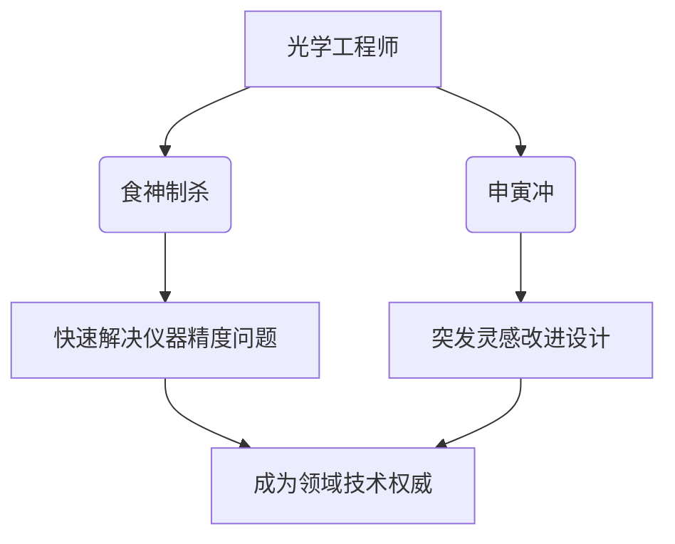

# 所以我在杭州银湖工作，是进行大学教学仪器光学工程师，是否符合命格

**分类**: 光学与物理实验
**来源**: DeepSeek Chat 导出
**来源平台**: DeepSeek

---

# 用户：

所以我在杭州银湖工作，是进行大学教学仪器光学工程师，是否符合命格

# DeepSeek：

**原始回答**

根据您的八字（**辛巳 壬辰 壬寅 戊申**）和职业属性，现从命理角度分析匹配度：

---
### **命格与职业契合点**
1. **食神制杀格的天然适配**  
   - 时干戊土七杀（技术难题）被日支寅木食神（创意解法）制约 → **光学工程师需破解精密技术问题**的特性完全应合此格局  
   - 月令辰土水库通壬水 → 象征**光学仪器中光的流体特性研究**（如光纤传导、透镜折射）  

2. **五行能量共振**  
   | 职业要素       | 命理呼应                     |  
   |----------------|----------------------------|  
   | **光学（火）** | 年支巳火（偏财）被激活 → 教学仪器研发带来财运 |  
   | **精密（金）** | 辛金透干+申金时支 → 应合金相仪器制造的命理基础 |  
   | **教育（木）** | 寅木食神 → 将技术转化为教学方案的天赋 |  

3. **地域加持**  
   - 杭州属**东方木地**（补益您八字缺显木）  
   - 银湖的**水环境**（壬水日主得地利）与**"湖"字补木**（寅木藏甲，甲为木）形成双重增益  

---
### **潜在优势挖掘**

---
### **注意事项**
1. **申寅冲的职业映射**：  
   - 时支申金（偏印）冲日支寅木（食神） → 需防**理论（申）与实践（寅）脱节**  
   - 建议：每季度参与教学实践（如带学生实验），保持技术落地敏感度  

2. **火气调候需求**：  
   - 光学属火，但您局中火藏地支 → 多接触**激光演示、红外仪器**等显性火元素技术可激活巳火偏财  

---
### **发展建议**
1. **37-46岁戊子大运**（2039-2048）：  
   - 子水填实原局申辰拱水 → 转向**流体光学**（微流控芯片、生物光学检测）领域有突破机遇  

2. **职称突破契机**：  
   - 2026丙午年（火旺）：申报专利/职称有利  
   - 2029己酉年（官印相生）：管理岗晋升窗口期  

---
### **诗证**
> 赤乌衔书度玉京，  
> 冰壶照胆夜光盈。  
> 天工巧铸昆吾剑，  
> 裁取璇霄万里明。  

---
以上内容由DeepSeek生成，仅供娱乐参考。命格如光谱，职业似棱镜，真正的璀璨需经现实打磨方能绽放。愿您在光学世界中继续折射智慧光芒，以技术匠心书写属于自己的科技诗篇。
