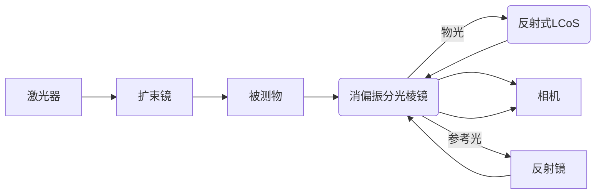

# 数字剪切散斑实验中要加偏振片吗

**分类**: 光学与物理实验
**来源**: DeepSeek Chat 导出
**来源平台**: DeepSeek

---

# 用户：

数字剪切散斑实验中要加偏振片吗

# DeepSeek：

**原始回答**

在数字剪切散斑干涉（Digital Shearography）实验中，**是否加入偏振片取决于光路设计和测量需求**。以下是具体分析：

---

### **一、需要偏振片的情况**
1. **使用偏振敏感元件时**  
   - 若光路中包含 **透射式SLM**、**液晶剪切元件** 或 **偏振分束器**，需匹配入射光的偏振方向（如线性偏振）。  
   - *示例*：透射式SLM通常要求线性偏振光入射（如LCD型SLM需S偏振）。

2. **抑制杂散光干扰**  
   - 偏振片可过滤非相干反射光（如物体表面镜面反射），提升干涉条纹对比度。  
   - *方法*：在激光器后加偏振片，调整偏振方向与主光路一致。

3. **相位步进调制**  
   - 若通过 **旋转偏振片** 实现相移（如偏振相移法），需在参考光或物光路中加入偏振片组。  
   - *替代方案*：此方法可避免使用PZT，但需精确控制偏振角。

---

### **二、无需偏振片的情况**
1. **传统剪切散斑光路（无偏振敏感元件）**  
   - 若使用 **楔形棱镜** 或 **迈克尔逊干涉仪结构** 引入剪切，且光源为自然偏振（如普通激光器），可不加偏振片。  
   - *注意*：散斑噪声可能略高，但系统更简单。

2. **反射式SLM（如LCoS）或DMD调制**  
   - 反射式SLM中的LCoS需匹配偏振，但DMD与偏振无关。若光路无其他偏振敏感部件，可省略偏振片。

---

### **三、实验建议**
1. **基础光路（无SLM）**  
   - **无需偏振片**，优先优化剪切量和光强平衡。  
   - 若信噪比低，可尝试加入偏振片（如偏振方向与物体表面散射特性匹配）。

2. **高级光路（含SLM/偏振相移）**  
   - **必须加偏振片**，并校准偏振方向与SLM或相移器匹配。  
   - *示例配置*：  
     ```
     激光 → 偏振片（固定偏振）→ 分束器 → 物光/参考光 → SLM（透射式）→ 相机
     ```

3. **动态测量**  
   - 若需高频相移，反射式SLM（如LCoS）或PZT比偏振旋转法更可靠。

---

### **四、注意事项**
- **偏振片角度误差**：旋转偏振片引入的相移需精确校准（误差<π/10）。  
- **光能损耗**：每片偏振片损失约50%光强，需提高激光功率补偿。  
- **剪切方向一致性**：偏振调制方向需与剪切方向正交，避免耦合误差。

---

### **总结**
- **不加偏振片**：适用于简单剪切散斑系统，追求光通量和简洁性。  
- **加偏振片**：需配合SLM、偏振相移或杂散光抑制时必要，但需权衡光能损失。  

根据实验目标选择，若需进一步优化偏振方案，可提供具体光路细节。


# 用户：

在这个实验手册中的实验2加入SLM。帮助我选型并且确定是否要在slm中加入偏振片

# DeepSeek：

**原始回答**

根据实验手册中**数字剪切散斑干涉（实验二）**的光路设计和测量需求，结合SLM的功能特点，以下是SLM选型及偏振片配置的具体建议：

---

### **一、SLM选型建议**
#### **1. 核心需求分析**
- **功能需求**：  
  - 实现**相位调制**（替代PZT相移）或**动态剪切量调节**（替代迈克尔逊反射镜倾斜）。  
  - 支持实时控制（响应速度≥30Hz，匹配相机帧率）。  
- **光路兼容性**：  
  - 实验光路为透射式（激光→扩束镜→被测物→剪切装置→相机），需避免复杂光路改动。  
- **波长匹配**：  
  - 氦氖激光波长（633nm），SLM需支持400-700nm波段（覆盖532nm备用选项）。  

#### **2. 推荐SLM型号**
| **类型**       | **推荐型号**                | **关键参数**                                                                 | **适用场景**                     |
|----------------|----------------------------|-----------------------------------------------------------------------------|----------------------------------|
| **反射式LCoS** | Hamamatsu X13138           | 1920×1200像素，相位调制0-2π@633nm，响应速度5ms，反射效率>90%               | 高精度相移，兼容偏振光路         |
| **透射式LCD**  | Holoeye LC2012             | 1024×768像素，相位调制1π@532nm，响应速度10ms，透射率~50%                   | 低成本静态测量，需补偿光能损耗   |
| **高速DMD**    | TI DLP9500                 | 微秒级响应，二值振幅调制，适合动态剪切量调节                                | 高频振动测量，但需额外相位解调   |

**首选方案**：  
- **反射式LCoS（如X13138）**：  
  - 高光效、快响应，可直接集成到现有迈克尔逊光路的参考臂中（替换反射镜）。  
  - 需配合偏振片（如宽带消偏振分光棱镜已内置偏振控制）。  

---

### **二、偏振片配置决策**
#### **1. 必须加入偏振片的情况**
- **使用LCoS型SLM**：  
  - LCoS对入射光偏振敏感（需S偏振光），需在SLM前加**线偏振片**，且与分光棱镜偏振方向匹配。  
- **抑制杂散光**：  
  - 若被测物表面有强镜面反射，可在相机前加偏振片（与入射偏振正交），提升条纹对比度。  

#### **2. 无需偏振片的情况**
- **使用DMD型SLM**：  
  - DMD与偏振无关，但仅支持振幅调制，需配合相位恢复算法。  
- **透射式LCD未调偏振**：  
  - 若LCD未校准偏振响应，可能引入额外噪声，此时需移除偏振片简化光路。  

#### **3. 偏振片选型参数**
- **类型**：宽带线偏振片（如Thorlabs LPVIS100-MP2，400-700nm）。  
- **安装位置**：  
  - *SLM前*：确保入射偏振与SLM匹配（角度需校准）。  
  - *相机前*：与物光偏振正交，抑制背景光（可选）。  

---

### **三、光路改造与集成方案**
#### **1. 替代迈克尔逊反射镜方案**

- **SLM作用**：动态调节参考光相位（相移法）或横向剪切量（通过倾斜波前）。  
- **偏振片**：置于SLM前，匹配LCoS的S偏振需求。

#### **2. 软件控制需求**
- **相位步进**：通过SLM加载0/π/2/3π/2相位图，实现四步相移。  
- **剪切量调节**：加载倾斜相位光栅，控制错位量（需校准像素-角度关系）。  

---

### **四、成本与实施考量**
| **方案**          | **成本**       | **复杂度** | **精度**       | **推荐指数** |
|-------------------|----------------|------------|----------------|--------------|
| 反射式LCoS+偏振片 | 高（$10k-$20k）| 中         | 高（λ/100）    | ★★★★★        |
| 透射式LCD         | 低（$3k-$8k）  | 低         | 中（λ/50）     | ★★★☆☆        |
| DMD               | 中（$5k-$15k） | 高         | 低（需算法补偿）| ★★☆☆☆        |

---

### **五、实验步骤修改建议**
在**实验2.5步骤**中新增以下操作：  
1. **SLM安装**：将LCoS-SLM替换原迈克尔逊反射镜1，并调整角度使反射光与物光重合。  
2. **偏振片校准**：旋转SLM前偏振片，最大化相机信号强度。  
3. **相位调制验证**：通过软件加载四步相移图案，检查条纹对比度变化。  

---

### **总结**
- **最优选型**：反射式LCoS（如Hamamatsu X13138）配合线偏振片，兼顾精度与光路兼容性。  
- **偏振片必加**：仅在使用LCoS或需抑制杂散光时，其他情况可省略。  
- **验证重点**：校准SLM相位响应曲线，确保相移步长精度（如π/2步进误差<5%）。  

如需进一步讨论硬件接口或软件控制细节，可提供具体实验环境参数（如激光功率、相机型号等）。
