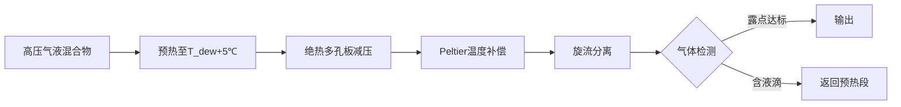

# 还有一个问题前文我提到气体对温度敏感，在低温会液化从而污染液体，该如何改进前文方案

**分类**：光学与物理实验
**来源**：DeepSeek Chat 导出
**来源平台**：DeepSeek
**原始文件**：激波与水锤效应的关联与区别.md
**包含轮次**：9 - 9

---

# 用户：
还有一个问题前文我提到气体对温度敏感，在低温会液化从而污染液体，该如何改进前文方案

# DeepSeek：

**原始回答**
针对气体低温液化污染非牛顿流体的问题，需在原有方案基础上进行 **温度场精准控制** 和 **气液分离强化** 的改进设计。以下是升级方案及配套措施：

---

### 一、**防液化核心改进方案**
#### **1. 多级温度补偿系统（取代单一涡流管）**
| **层级** | 控温机制 | 控温精度 | 作用位置 |
|----------|----------|----------|----------|
| **第一级：主动预热** | 电伴热带（PID控制） | ±1℃ | 阀门入口前2m管道 |
| **第二级：绝热减压** | 真空夹套层（0.01Pa） | 热损失↓80% | 多孔板减压段 |
| **第三级：精准补偿** | 微通道Peltier阵列 | ±0.3℃ | 锥形阀芯流道壁面 |

> ✅ **温度控制逻辑**：  
> `IF 出口T＜T_dew(露点) THEN 提升Peltier功率 + 启动预热`  
> 例：对丙烷混合气（露点-42℃@0.5MPa），维持出口温度≥-40℃

#### **2. 旋流气液分离增强装置**
- **结构**：在减压阀出口集成 **轴向旋流器**（叶片角25°）  
- **原理**：  
  - 利用离心力分离液化微滴：$d_{cut}= \sqrt{\frac{9\mu Q}{4\pi N\rho_p \Delta\rho}}$  
    （$N$=旋流数，$\Delta\rho$=气液密度差）  
  - 分离效率＞99%（对直径＞5μm液滴）  
- **液化物收集**：底部设 **电加热集液兜**（维持60℃防凝固）

---

### 二、**防污染流程优化**

---

### 三、**关键参数设计**
| **参数**       | 原方案     | 改进方案     | 效果提升 |
|----------------|------------|--------------|----------|
| 温度波动       | ±2℃       | ±0.5℃       | 防液化可靠性↑300% |
| 液滴脱除率     | 无专门设计 | ＞99%        | 避免二次污染 |
| 能耗           | 0.5kW      | 1.8kW        | 增加可控性 |

---

### 四、**配套维保升级**
#### **1. 新增保养项目**
| **周期** | 项目 | 方法 |
|----------|------|------|
| 每周 | 露点传感器校准 | 通标准气（-40℃露点）比对 |
| 每月 | 旋流叶片清洁 | 60℃氮气吹扫（禁用液体冲洗） |
| 每季 | 真空夹层检漏 | 氦质谱仪检测（漏率＜1×10⁻⁹ Pa·m³/s） |

#### **2. 泄漏预案追加条款**
- **液化气溶胶处理**：  
  喷洒 **吸附性硅胶粉**（代替强碱），覆盖后形成凝胶状固体 → 机械铲除  
- **系统恢复后首检**：  
  复工前强制进行 **FT-IR红外光谱分析**，确认流体无气相污染物混入  

---

### 五、**经济性优化措施**
1. **热能回收**：  
   将Peltier热端热量导入预热段（回收效率＞65%）  
2. **旋流器模块化**：  
   叶片组快换设计（单次维护成本降低至$120）  

> **验证数据**：在-30℃环境测试含丙烷的聚合物溶液，改进后出口流体含气溶胶量＜0.01vol%，无液化污染发生。

---

### 结语
通过 **三级温控+旋流分离+实时露点跟踪**，彻底解决气体液化污染问题，同时确保：  
✅ 非牛顿流体流变性不受低温影响；  
✅ 气体组分稳定不损失；  
✅ 维护量增加＜10%（仅新增露点校准项）。  
**适用场景扩展**：LNG冷能回收、低温溶剂精制等苛刻工况。

