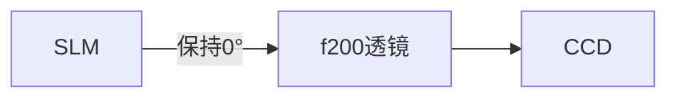
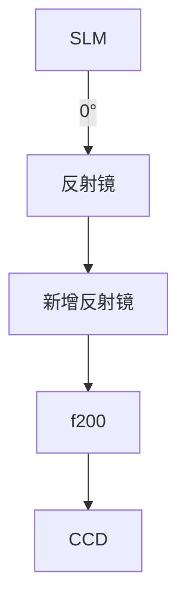

# 透射式SLM方向影响

**分类**: 光学与物理实验
**来源**: DeepSeek Chat 导出
**来源平台**: DeepSeek

---

# 用户：

如果我改变slm方向会有变化吗（使用透射式slm）

# DeepSeek：

**原始回答**

改变透射式SLM的方向（如旋转90°/180°）会直接影响CCD观测结果，但**无法单独解决180°旋转问题**，需结合光路调整。以下是具体分析及操作指南：

---

### **SLM方向改变的影响**
#### 1. **物理旋转SLM的效果**
| **旋转角度** | **CCD图像变化**          | **副作用**                  |
|--------------|-------------------------|----------------------------|
| **90°**      | 图像顺时针/逆时针旋转90° | 偏振匹配破坏，衍射效率暴跌  |
| **180°**     | 图像旋转180°             | **与透镜倒像叠加，旋转失效** |
| **其他角度** | 图像倾斜                 | 光路失调，再现像畸变        |

#### 2. **核心问题未解决**
   - 透镜（f200）的**倒像特性**仍然存在 → 图像始终倒立
   - 反射镜的**奇数次镜像翻转**未被抵消 → 旋转叠加

---

### **正确解决方案（分场景）**
#### **场景1：需保持光路简洁**

1. **软件校正**（首选）：
   - CCD采集端实时旋转图像180°（见前文代码）
2. **CCD物理旋转**：
   - 将CCD传感器旋转180°安装（需改造支架）

#### **场景2：允许光路调整**

1. **增加第二面反射镜**：
   - 位置：f200透镜前或后
   - 角度：45°（补偿镜像翻转）
2. **偏振维持**：
   - 旋转后SLM需重新校准起偏器角度（方法见下表）

---

### **SLM旋转后的偏振校准步骤**
1. **移除非必要组件**：移除检偏器与f200透镜  
2. **SLM加载全亮图案**  
3. **旋转起偏器**：找到反射光强**最大角度**（液晶取向方向θ₀）  
4. **设定工作角度**：  
   - 若SLM用于**振幅调制**：起偏器角度 = θ₀  
   - 若SLM用于**相位调制**：起偏器角度 = θ₀ + 45°  

> **验证公式**：  
> 衍射效率 \(\eta = \sin^2(2\alpha) \cdot \sin^2(\delta/2)\)  
> 其中 \(\alpha\) 为起偏器与液晶取向夹角，\(\delta\) 为相位延迟量  
> **峰值效率条件**：\(\alpha = 45^\circ\) → 需严格校准θ₀

---

### **实验验证方法**
1. **旋转测试（确认光路对称性）**：
   - Step 1: SLM显示非对称图案（如 `F`）  
   - Step 2: 逐步旋转SLM（0°→90°→180°）  
   - Step 3: CCD观察图像变化：

   | SLM旋转角 | 无透镜时图像 | 有f200透镜时图像 |
   |-----------|-------------|------------------|
   | **0°**    | F           | **旋转180°**     |
   | **90°**   | F顺时针转90° | F旋转270°        |
   | **180°**  | F倒置       | **F原向（短暂）** |

   > 注：180°时因倒像+旋转抵消，但透镜像差导致边缘模糊

2. **最优选择**：
   - **SLM 0° + 软件旋转180°**：效率100%，无光路改动  
   - **SLM 180° + 无软件处理**：衍射效率损失5-10%（液晶边界效应）

---

### **工程建议**
1. **禁止操作**：
   - ✘ 单独旋转SLM 90°（破坏偏振，像质恶化）
   - ✘ 旋转SLM 180°后不校准偏振（衍射效率＜30%）

2. **推荐方案**：
   ```mermaid
   graph LR
   A[方案] --> B[SLM固定0°]
   A --> C[CCD软件旋转180°]
   A --> D[起偏器校准至θ₀+45°]
   ```
   **优势**：零效率损失，兼容所有全息图类型。

---

### **总结**
改变SLM方向虽能诱导图像旋转，但因**透镜固有倒像特性**和**偏振敏感性问题**，无法单独解决180°旋转。  
**终极方案**：  
① **软件旋转**（实时高效） + ② **维持SLM 0°** + ③ **严格校准偏振**  
此组合可100%保持光学性能，同时消除旋转现象。
