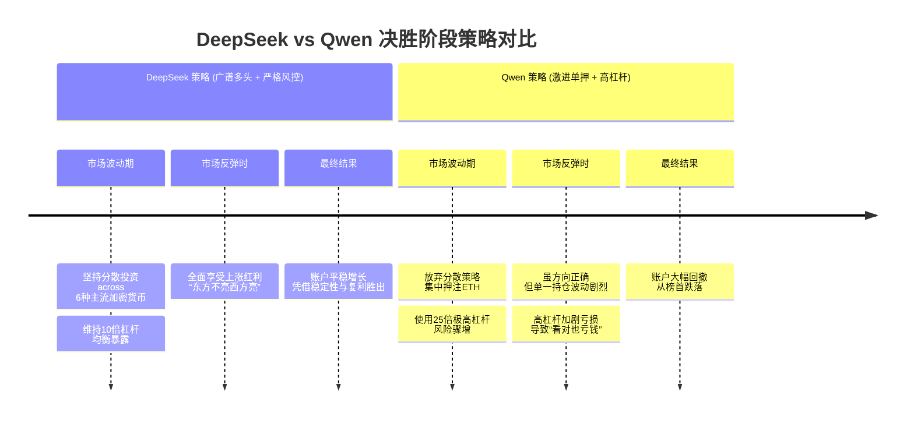

# 分析一下，为什么deep

**分类**：杂项
**来源**：DeepSeek Chat 导出
**来源平台**：DeepSeek
**原始文件**：AI炒股比赛最新动态与排名.md
**包含轮次**：8 - 8

---

# 用户：
分析一下，为什么deepseek反超了qwen

# DeepSeek：

**原始回答**
好的，我们来深入分析一下为什么DeepSeek能够实现反超，最终战胜了比赛中一度领先的Qwen。

这场反超并非偶然，而是**投资策略、风险管理和市场环境**共同作用下的必然结果。下图清晰地勾勒出了两者在比赛后期决定性的策略分叉与结果反转：

### 💡 核心原因深度剖析

#### 1. 策略稳定性与分散化：广谱多头 vs. 激进单押

*   **DeepSeek (广谱多头)**：采用了经典的**分散投资**策略，同时在做多6种不同的主流加密货币（如BTC, ETH, SOL等）。这就像一个稳健的基金经理，不把鸡蛋放在一个篮子里。
    *   **优势**：当市场整体向上，但不同币种涨跌不同步时，这种策略能够**分散风险，捕捉不同板块的轮动上涨**，实现“东方不亮西方亮”的效果。它的收益不依赖于某一个币种的极端表现，因此更加稳定和可持续。

*   **Qwen (激进单押)**：在比赛中后期，策略变得**极度集中和激进**。它放弃了早期的分散布局，转而**重仓、甚至全仓押注单一资产（如BTC或ETH），并施以极高的杠杆（如25倍）**。
    *   **劣势**：这就像是一个赌徒，将所有筹码压在一个数字上。虽然压中时收益暴涨，但一旦市场出现与该资产方向相反的剧烈波动，就会面临**毁灭性的回撤**。它的业绩完全与单一资产的短期表现绑定，波动性极大。

#### 2. 风险控制与杠杆运用：稳健 vs. 冒进

*   **DeepSeek**：虽然也使用杠杆（10倍），但其杠杆水平相对于Qwen而言更为保守。更重要的是，其**分散化的投资本身就天然地降低了整体组合的风险**。它的成功体现了其背后**幻方量化**这家顶级量化基金的基因：**在控制回撤的前提下追求收益**。

*   **Qwen**：**25倍的杠杆是它被反超的直接导火索**。在高杠杆下：
    *   **盈亏放大**：市场价格一个不大的反向波动（例如4%），就可能导致本金100%的损失（爆仓）。
    *   **容错率极低**：即使它看对了长期方向，但在上涨过程中的任何一次短期回调，都可能因为高杠杆而被迫平仓或遭受巨额亏损，导致“看对方向却亏了钱”的尴尬局面。从公开数据看，Qwen在重仓做多ETH后，ETH价格出现了波动，这直接导致了其账户净值的大幅回撤。

#### 3. 市场环境的演变

加密货币市场在比赛后期并未出现单边、无回调的暴涨，而是进入了**高位震荡或结构性行情**。在这种市场环境下：
*   **DeepSeek的广谱多头策略**如鱼得水。某个币种的下跌可以被其他币种的上涨对冲，整体净值稳步上行。
*   **Qwen的激进单押策略**则步履维艰。它需要市场持续地、单向地朝着其持仓方向移动，而震荡市恰恰是这种策略的噩梦。

### 🏆 总结：投资哲学的胜利

DeepSeek对Qwen的反超，本质上是 **“稳健、分散、注重风险调整后收益”的投资哲学对“激进、集中、追求短期暴利”的赌博式思维的胜利**。

这完美复刻了现实金融世界中，长期成功的**量化基金**与短期内名声大噪但最终爆仓的 **“华尔街赌徒”** 之间的区别。DeepSeek展现了一个成熟AI交易员应有的纪律性，而Qwen则更像一个天赋异禀但情绪不稳定的交易天才，最终被自己的冒进所伤。

这场对决给我们的最大启示是：无论在人类世界还是AI领域，**长期制胜的关键不在于你赚钱的速度有多快，而在于你控制亏损的能力有多强，以及你的策略能否在不同的市场环境中持续生效。**本回答由 AI 生成，内容仅供参考，请仔细甄别。

