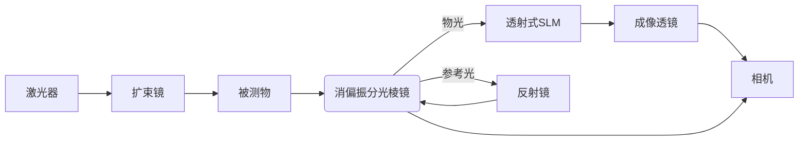

# 可以使用一个SLM参数如下透射

**分类**: 杂项
**来源**: DeepSeek Chat 导出
**来源平台**: DeepSeek

---

# 用户：

可以使用一个SLM参数如下透射式，0.63″屏幕，HDMI接口，1024×768，1Pi@532nm，400-700nm。吗？修改一下方案

# DeepSeek：

**原始回答**

根据提供的透射式SLM参数（0.63英寸屏幕、HDMI接口、1024×768分辨率、1π@532nm相位调制、400-700nm波段），以下是针对**数字剪切散斑实验（实验二）**的优化方案及具体修改建议：

---

### **一、SLM的可行性评估**
#### **1. 参数匹配性**
- **优点**：  
  - **波长兼容**：支持633nm氦氖激光（覆盖532nm备用波长）。  
  - **相位调制**：1π@532nm（约等效于0.6π@633nm），可满足基础相移需求（需校准）。  
  - **分辨率**：1024×768像素，适合中等精度剪切散斑测量。  
- **局限**：  
  - **调制深度不足**：1π@532nm在633nm下调制能力降低，需验证是否满足相位步进要求（如四步法需π/2步进）。  
  - **透射率低**：约50%~80%光能损耗，需提高激光功率补偿。  
  - **响应速度**：毫秒级（10ms），仅适合静态或低频动态测量。

#### **2. 与实验需求的匹配**
- **适用场景**：  
  - 静态离面位移测量、低频振动分析（如复合材料缺陷检测）。  
- **不适用场景**：  
  - 高频动态测量（如振动模态分析需kHz级响应）。  

---

### **二、光路改造方案**
#### **1. 替代迈克尔逊反射镜（透射式集成）**

- **SLM功能**：  
  - **相位调制**：加载四步相移图案（0, π/2, π, 3π/2），替代PZT实现相移。  
  - **剪切量调节**：通过倾斜相位光栅生成横向错位（需校准像素-剪切量关系）。  
- **偏振片配置**：  
  - **必须加入**：透射式SLM（如LCD型）需线性偏振光入射，在SLM前加偏振片（与激光偏振方向匹配）。  
  - **可选**：相机前加偏振片（与物光正交）抑制杂散光。

#### **2. 关键调整步骤**
1. **校准SLM相位响应**：  
   - 用干涉仪标定电压-相位曲线，确保1π@532nm对应的实际调制深度（633nm下可能需调整驱动电压）。  
2. **光强平衡**：  
   - 因SLM透射率低，需衰减参考光（使用实验原有的可调衰减器），使物光/参考光强度比≈1:1。  
3. **剪切量标定**：  
   - 加载倾斜相位光栅（如线性倾斜波前），通过相机观察剪切像，调整倾斜量至3-5mm（如实验步骤2.5要求）。  

---

### **三、软件控制优化**
1. **相位步进算法**：  
   - 修改实验软件，通过HDMI输入四步相移图案（需SLM支持实时刷新）：  
     ```python
     # 示例：生成四步相移图案（0, π/2, π, 3π/2）
     phase_steps = [0, np.pi/2, np.pi, 3*np.pi/2]
     for step in phase_steps:
         slm.load_phase_map(step * np.ones((768, 1024)))  # 全屏均匀相位
         camera.capture_image()  # 采集干涉图
     ```
2. **剪切量控制**：  
   - 加载倾斜相位光栅（如公式 `φ(x,y) = 2πfx·x`，`fx`为空间频率），通过调整`fx`控制剪切量。  

---

### **四、性能优化与误差补偿**
1. **调制深度不足的补救**：  
   - **多次曝光平均**：对同一相移步进多次采集，提升信噪比。  
   - **算法补偿**：通过标定数据反演实际相位-电压关系，软件校正非线性。  
2. **光能损耗补偿**：  
   - 提高激光功率（注意安全限值），或延长相机曝光时间（可能降低动态性能）。  

---

### **五、实验步骤修改建议**
在**实验2.5步骤**中新增以下操作：  
1. **安装SLM**：  
   - 将透射式SLM置于物光路中（图2-3替换反射镜1位置），调整角度使光路对准。  
2. **偏振片安装**：  
   - SLM前加线偏振片（如Thorlabs LPVIS100-MP2），旋转至最大透过率。  
3. **相位校准**：  
   - 通过软件加载0/π相位图，观察相机干涉条纹对比度变化，验证调制有效性。  

---

### **六、成本与备选方案**
| **方案**                | **成本**       | **优缺点**                                                                 |  
|-------------------------|----------------|----------------------------------------------------------------------------|  
| **当前透射式SLM**       | 低（$3k-$8k）  | 成本低，但需补偿光能损耗和调制深度；适合教学/静态实验。                     |  
| **升级反射式LCoS**      | 高（$10k-$20k）| 高光效、快响应，但需改造光路；适合科研/动态测量。                           |  

---

### **七、总结**
- **可行但需优化**：当前透射式SLM可用于实验，但需通过校准和软件补偿解决调制深度与光能损耗问题。  
- **必加偏振片**：因SLM偏振敏感，需在入射光路中加入偏振片。  
- **推荐配置**：  
  - **静态测量**：当前SLM+偏振片+四步相移算法。  
  - **动态测量**：建议升级反射式LCoS或保留原迈克尔逊结构。  

若需进一步协助校准或代码实现，可提供具体SLM型号和软件接口文档。
