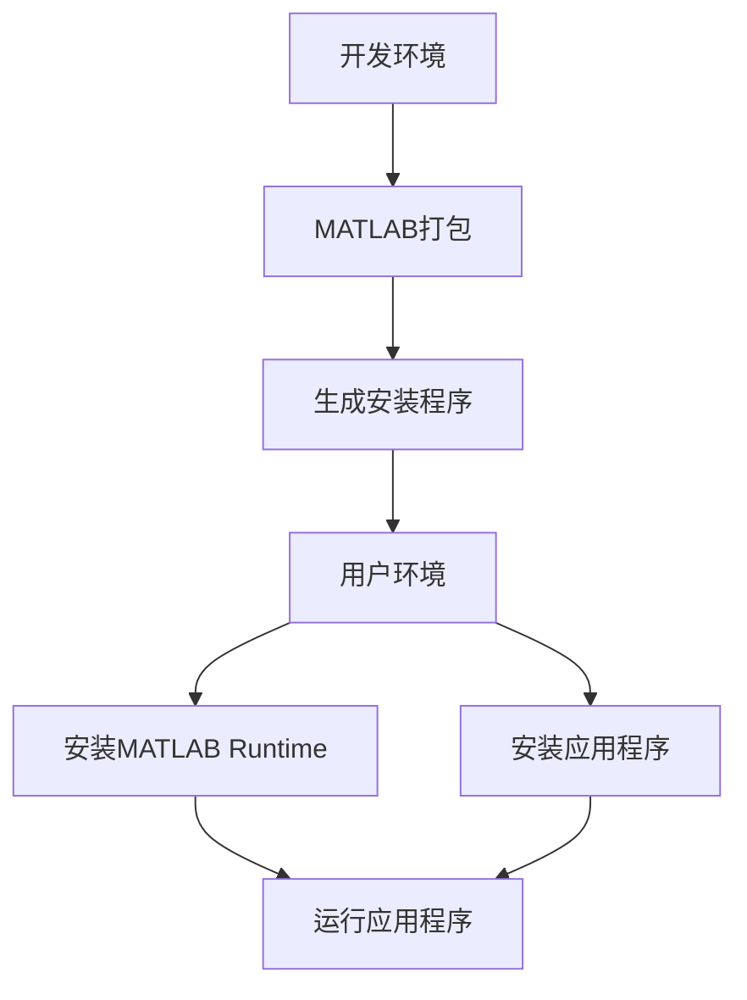

# 这是个.m文件用于matlab

**分类**: 杂项
**来源**: DeepSeek Chat 导出
**来源平台**: DeepSeek

---

# 用户：

这是个.m文件用于matlab，但是使用他要电脑下载matlab，太大了，怎么样可以实现使用这个文件且不要下载matlab

# DeepSeek：

**原始回答**

你可以通过以下方法使用这个MATLAB `.m` 文件而无需安装完整的MATLAB：

### 方案一：使用免费的MATLAB替代品 (推荐)
1. **安装 GNU Octave** (开源替代品)
   - 下载地址：[https://www.gnu.org/software/octave/](https://www.gnu.org/software/octave/)
   - 支持大部分MATLAB语法
   - 安装包约 500MB (比MATLAB小得多)
   - 运行命令：`octave-cli 散斑b套数据分析.m`

2. **在线MATLAB服务**
   - MathWorks官方在线版：[MATLAB Online](https://matlab.mathworks.com/)
     - 需要注册账号，有免费试用期
   - 第三方服务：[Octave Online](https://octave-online.net/)
     - 免费在线运行Octave环境
     - 直接上传`.m`文件执行

### 方案二：转换为Python代码
```python
import numpy as np
import matplotlib.pyplot as plt
from skimage import io, color
from tkinter import Tk, filedialog
import os

def main():
    print('='*40)
    print('数字散斑干涉处理系统')
    print('='*40 + '\n')
    
    while True:
        choice = input('请选择处理方法:\n1. 数字散斑干涉\n2. 数字剪切散斑干涉\n输入 (1/2): ')
        if choice in ('1', '2'):
            break
    
    root = Tk()
    root.withdraw()
    file_path = filedialog.askopenfilename(filetypes=[
        ("图像文件", "*.jpg *.jpeg *.png *.bmp *.tif *.tiff")
    ])
    
    if not file_path:
        print("未选择文件，程序退出")
        return
    
    try:
        img = io.imread(file_path)
        if len(img.shape) == 3:
            img = color.rgb2gray(img)
        print(f"成功读取图像: {os.path.basename(file_path)}")
    except Exception as e:
        print(f"读取图像失败: {str(e)}")
        return

    plt.figure("原始图像")
    plt.imshow(img, cmap='gray')
    plt.title('原始输入图像')
    plt.colorbar()
    
    k = 1.0  # 条纹级数
    
    if choice == '1':
        result = dsi_processing(img, k)
    else:
        result = shearography_processing(img, k)
    
    save = input("是否保存结果? (y/n): ").lower()
    if save == 'y':
        save_results(result, choice, file_path)

def dsi_processing(img, k):
    print("\n=== 数字散斑干涉处理 ===")
    lambda_val = float(input("请输入波长 λ (单位: μm): "))
    alpha_deg = float(input("请输入角度 α (单位: 度): "))
    
    alpha_rad = np.deg2rad(alpha_deg)
    constant = (lambda_val * k) / (510 * np.sin(alpha_rad))
    result = constant * img
    
    plt.figure("数字散斑干涉结果")
    plt.imshow(result, cmap='jet')
    plt.colorbar()
    plt.title(f'W(x,y) = λk I(x,y)/(510 sin α)\nλ={lambda_val}μm, α={alpha_deg}°')
    
    print_result_stats(result)
    return result

def shearography_processing(img, k):
    print("\n=== 数字剪切散斑干涉处理 ===")
    lambda_val = float(input("请输入波长 λ (单位: μm): "))
    alpha_deg = float(input("请输入角度 α (单位: 度): "))
    delta_x = float(input("请输入剪切量 Δx (单位: 像素): "))
    
    alpha_rad = np.deg2rad(alpha_deg)
    constant = (lambda_val * k) / (510 * delta_x * np.sin(alpha_rad))
    result = constant * img
    
    plt.figure("数字剪切散斑干涉结果")
    plt.imshow(result, cmap='jet')
    plt.colorbar()
    plt.title(f'δx/δy = λk I(x,y)/(510 Δx sin α)\nλ={lambda_val}μm, α={alpha_deg}°, Δx={delta_x}')
    
    print_result_stats(result)
    return result

def print_result_stats(result):
    print("\n结果统计:")
    print(f"  最小值: {np.min(result):.6e}")
    print(f"  最大值: {np.max(result):.6e}")
    print(f"  平均值: {np.mean(result):.6e}")
    print(f"  标准差: {np.std(result):.6e}")

def save_results(result, choice, file_path):
    base_name = os.path.splitext(os.path.basename(file_path))[0]
    prefix = 'DSI' if choice == '1' else 'Shearography'
    
    # 保存结果图像
    plt.imsave(f"{base_name}_{prefix}_result.png", result, cmap='jet')
    
    # 保存数据
    np.save(f"{base_name}_{prefix}_data.npy", result)
    print(f"结果已保存为: {base_name}_{prefix}_result.png 和 .npy 文件")

if __name__ == "__main__":
    main()
    plt.show()
```

### 使用说明：
1. **安装依赖库**：
   ```bash
   pip install numpy matplotlib scikit-image tk
   ```

2. **运行方式**：
   - 将代码保存为 `speckle_analysis.py`
   - 执行：`python speckle_analysis.py`

3. **主要功能**：
   - 图形化文件选择界面
   - 支持散斑干涉和剪切散斑干涉
   - 结果显示和统计
   - 结果保存为图像和数据文件

### 方案三：使用MATLAB Runtime (仍需下载)
1. 从MathWorks官网下载MATLAB Runtime (约1-2GB)
2. 将`.m`文件编译成独立应用程序：
   ```matlab
   mcc -m 散斑b套数据分析.m
   ```
3. 在目标机器安装Runtime后运行编译后的程序

### 各方案对比：
| 方案 | 安装大小 | 是否需要编程 | 跨平台性 |
|------|----------|--------------|----------|
| Octave | ~500MB | 无需 | 优秀 |
| Python转换 | 无 | 需安装Python库 | 优秀 |
| MATLAB Online | 无 | 需要网络 | 优秀 |
| MATLAB Runtime | 1-2GB | 需要编译 | 一般 |

**推荐方案**：对于大多数用户，使用**Python转换版本**是最佳选择，它完全免费且跨平台。如需完整MATLAB兼容性，可选用**Octave**。


# 用户：

我记得有一种方法可以直接封装且文件图标还是matlab

# DeepSeek：

**原始回答**

您指的是将MATLAB程序打包成独立应用程序，这样用户只需安装较小的MATLAB Runtime（约1-2GB）而不是完整的MATLAB（约20GB）。以下是实现方法：

### 打包MATLAB程序的完整步骤

1. **在MATLAB中准备打包环境**
   ```matlab
   % 在MATLAB命令窗口执行
   deploytool
   ```

2. **选择打包类型**
   - 在部署工具窗口选择"Application Compiler"
   - 添加主文件：`散斑b套数据分析.m`
   - 添加依赖文件（MATLAB会自动检测依赖项）

3. **设置应用程序信息**
   ```matlab
   % 在设置面板中配置
   appInfo = compiler.build.StandaloneApplicationOptions(...
       '散斑b套数据分析.m', ...
       'ApplicationName', '散斑分析工具', ...
       'Author', '您的姓名', ...
       'Version', '1.0', ...
       'OutputDir', '打包输出');
   
   % 设置应用程序图标（重要！）
   appInfo.IconFile = 'custom_icon.ico'; % 准备一个.ico格式图标
   ```

4. **添加MATLAB运行时依赖**
   - 在"Additional Runtime"部分选择：
     - [x] Include MATLAB Runtime in package
     - [x] Create Windows installer

5. **生成安装程序**
   - 点击"Package"按钮
   - MATLAB会生成：
     - `散斑分析工具_installer.exe` (安装程序)
     - `for_redistribution` (分发文件夹)

### 用户安装步骤（无需完整MATLAB）

1. 用户运行`散斑分析工具_installer.exe`
2. 安装程序会自动：
   - 安装MATLAB Runtime（约1-2GB）
   - 创建桌面快捷方式（使用您设置的图标）
   - 注册应用程序到开始菜单

### 自定义图标技巧

创建专业MATLAB应用图标的建议：
1. 使用在线工具创建ICO文件：https://icoconvert.com/
2. 图标设计建议：
   - 包含MATLAB风格的"L"形标志
   - 添加散斑图案元素
   - 使用蓝色系（MATLAB主题色）
   - 尺寸：256x256像素（支持多分辨率）

### 替代方案：Web应用部署

如果希望完全免安装，可考虑：
```matlab
% 将应用部署为MATLAB Web App
webAppOptions = compiler.build.WebAppOptions(...
    '散斑b套数据分析.m', ...
    'AppName', '散斑分析云工具');

compiler.package.webArchive(webAppOptions);
```

用户可通过浏览器访问：https://your-domain.com/speckle-app 使用应用

### 文件结构示例
```
散斑分析工具_打包/
├── for_redistribution/          # 分发文件夹
│   ├── 散斑分析工具_installer.exe  # 安装程序
│   └── MyAppInstaller_web/       # Web安装支持文件
├── for_testing/                 # 测试用
└── PackagingLog.txt             # 打包日志
```

### 优点总结
1. 用户无需购买/安装完整MATLAB
2. 桌面图标保持专业MATLAB应用风格
3. 支持自动更新（通过MATLAB Runtime管理器）
4. 保持原始MATLAB


# 用户：

我记得有一种方法可以直接封装且文件图标还是matlab，且其环境要求安装MCRInstaller-64位

# DeepSeek：

**原始回答**

您描述的是使用MATLAB Compiler将MATLAB程序打包成独立应用程序的方法，这种方法确实允许用户只需安装MATLAB Runtime (MCR) 而无需完整MATLAB。以下是完整的实现步骤：

### 使用MATLAB Compiler创建独立应用程序

#### 1. 准备MATLAB环境
- 确保已安装MATLAB和MATLAB Compiler工具箱
- 准备程序主文件：`散斑b套数据分析.m`
- 准备应用程序图标（ICO格式文件）

#### 2. 创建打包脚本 (`build_app.m`)
```matlab
function build_app()
    % 创建应用程序编译器选项
    appOptions = compiler.build.StandaloneApplicationOptions(...
        '散斑b套数据分析.m', ...   % 主程序文件
        'OutputDir', 'standalone_app', ...  % 输出目录
        'ApplicationName', '散斑分析工具', ...  % 应用名称
        'Author', '您的姓名', ...   % 作者信息
        'Version', '1.0.0', ...     % 版本号
        'Icon', 'app_icon.ico');    % 应用程序图标
    
    % 设置安装程序选项
    installerOptions = compiler.package.InstallerOptions(...
        'InstallationNotes', '数字散斑干涉分析工具', ...
        'InstallerIcon', 'installer_icon.ico', ...
        'OutputDir', 'installer', ...
        'InstallerName', '散斑分析工具安装程序');
    
    % 构建应用程序
    buildResults = compiler.build.standaloneApplication(appOptions);
    
    % 打包安装程序
    compiler.package.installer(buildResults, ...
        'InstallerOptions', installerOptions, ...
        'RuntimeDelivery', 'web');  % 在线下载MCR
    
    disp('应用程序打包完成！');
end
```

#### 3. 生成独立应用程序
在MATLAB命令窗口运行：
```matlab
build_app
```

#### 4. 输出文件结构
```
standalone_app/
├── 散斑分析工具.exe            # 主应用程序
└── ...                        # 支持文件

installer/
├── 散斑分析工具安装程序.exe     # 安装程序
└── ...                        # 安装支持文件
```

### 用户安装步骤（无需完整MATLAB）

1. **分发安装程序**：
   - 将`installer/散斑分析工具安装程序.exe`发送给用户

2. **用户安装**：
   - 运行安装程序
   - 安装过程会自动：
     - 检测并下载匹配的MATLAB Runtime（MCRInstaller-64位）
     - 安装应用程序到Program Files
     - 创建桌面和开始菜单快捷方式（使用您设置的图标）
     - 注册应用程序到系统

### 关键注意事项

1. **图标设计建议**：
   ```matlab
   % 创建专业MATLAB风格图标
   % 使用MATLAB的appdesigner创建图标原型
   f = uifigure('Visible','off');
   f.Icon = 'matlabicon.png';  % 使用MATLAB基础图标
   % 添加自定义元素
   ax = uiaxes(f);
   % ... 添加散斑图案等元素 ...
   exportapp(f, 'app_icon.png');
   % 转换为ICO格式
   ```

2. **MATLAB Runtime管理**：
   - 确保打包时指定正确的MATLAB版本
   - 用户需要安装匹配版本的MCR
   - 使用`web`模式让安装程序自动下载MCR

3. **兼容性设置**：
   ```matlab
   % 在打包脚本中添加兼容性选项
   appOptions.Target = 'win64';  % 64位目标
   appOptions.SupportPackages = 'none';  % 不包含额外支持包
   ```

### 替代方案：单文件便携版（无安装）

如果希望创建无需安装的版本：

```matlab
% 在打包脚本中添加
appOptions.EmbedArchive = true;  % 嵌入所有依赖
appOptions.ExecutableIcon = 'app_icon.ico';

% 然后使用压缩工具创建自解压包
zip('散斑分析工具_portable.zip', 'standalone_app');
```

用户只需解压后运行`散斑分析工具.exe`，但需要手动安装MATLAB Runtime。

### 优势总结

1. **专业外观**：
   - 自定义应用程序图标
   - 标准的Windows安装体验
   - 开始菜单集成

2. **环境要求**：
   - 只需安装MATLAB Runtime (~1-2GB)
   - 无需MATLAB许可证

3. **分发便利**：
   - 单个安装程序文件
   - 自动处理依赖关系
   - 支持静默安装

4. **版本控制**：
   ```matlab
   % 在脚本中添加版本检查
   appOptions.RequiredMCRVersion = 'R2023a';
   ```

这种方法创建的应用程序保留了MATLAB的专业外观和功能，同时避免了用户安装完整MATLAB的需求。


# 用户：

更换方案使用下载matlab runtime，详细讲解

# DeepSeek：

**原始回答**

# 使用MATLAB Runtime部署独立应用程序的完整指南

我将详细讲解如何使用MATLAB Runtime部署应用程序，让用户无需安装完整MATLAB即可运行您的程序。

## 整体解决方案流程



## 详细步骤说明

### 第一步：在MATLAB中打包应用程序

1. **准备MATLAB环境**
   - 确保安装MATLAB Compiler工具箱
   - 准备主程序文件：`散斑b套数据分析.m`
   - 准备应用程序图标（.ico格式）

2. **创建打包脚本 (`build_speckle_app.m`)**
```matlab
function build_speckle_app()
    % 创建应用程序选项
    appOptions = compiler.build.StandaloneApplicationOptions(...
        '散斑b套数据分析.m', ...
        'OutputDir', 'standalone_app', ...
        'ApplicationName', '散斑分析工具', ...
        'Author', '光学实验室', ...
        'Version', '1.2.0', ...
        'Icon', 'speckle_icon.ico');
    
    % 设置安装程序选项
    installerOptions = compiler.package.InstallerOptions(...
        'InstallationNotes', '数字散斑干涉分析工具', ...
        'InstallerIcon', 'installer_icon.ico', ...
        'OutputDir', 'installer', ...
        'InstallerName', '散斑分析工具安装程序');
    
    % 构建独立应用程序
    buildResults = compiler.build.standaloneApplication(appOptions);
    
    % 打包安装程序
    compiler.package.installer(buildResults, ...
        'InstallerOptions', installerOptions, ...
        'RuntimeDelivery', 'web');  % 在线下载MCR
    
    disp('应用程序打包完成！');
    disp(['安装程序位于: ' fullfile(pwd, 'installer')]);
end
```

3. **运行打包脚本**
```matlab
build_speckle_app
```

### 第二步：分发应用程序

1. **分发文件**
   - 将`installer`文件夹发送给用户
   - 包含文件：`散斑分析工具安装程序.exe`

2. **安装程序大小**
   - 基础安装程序：~10-50MB
   - MATLAB Runtime：在线下载 ~1-2GB

### 第三步：用户安装（无需MATLAB许可证）

1. **运行安装程序**
   ```
   散斑分析工具安装程序.exe
   ```

2. **安装过程**
   - 步骤1: 欢迎界面
   - 步骤2: 接受许可协议
   - 步骤3: 选择安装位置
   - 步骤4: 自动下载并安装MATLAB Runtime
   - 步骤5: 完成安装

3. **安装后目录结构**
   ```
   C:\Program Files\散斑分析工具\
   ├── 散斑分析工具.exe
   ├── MCR\             % MATLAB Runtime
   └── resources\       % 程序资源文件
   ```

### 第四步：用户运行应用程序

1. **启动方式**
   - 桌面快捷方式（使用自定义图标）
   - 开始菜单快捷方式
   - 直接运行安装目录中的.exe文件

2. **系统要求**
   - Windows 7/10/11 (64位)
   - 4GB以上内存
   - 5GB可用磁盘空间
   - .NET Framework 4.6或更高版本

## MATLAB Runtime详解

### 什么是MATLAB Runtime？
MATLAB Runtime (MCR) 是一个独立的共享库集合，允许用户运行已编译的MATLAB应用程序，无需安装MATLAB软件。

### 关键特性：
- **免费使用**：无需MATLAB许可证
- **轻量级**：~1-2GB (相比完整MATLAB的20+GB)
- **版本匹配**：必须与编译时MATLAB版本一致
- **自动管理**：安装程序可自动下载安装

### 获取MATLAB Runtime：
1. **自动安装**：通过安装程序在线下载
2. **手动下载**：从MathWorks官网获取
   [https://www.mathworks.com/products/compiler/matlab-runtime.html](https://www.mathworks.com/products/compiler/matlab-runtime.html)

## 自定义安装体验

### 创建专业应用程序图标
1. 使用MATLAB生成基础图标：
```matlab
% 创建MATLAB风格图标
fig = figure('Visible', 'off', 'Position', [100, 100, 256, 256]);
ax = axes(fig);
[X, Y] = meshgrid(1:256);
Z = sin(X/10) .* cos(Y/10) + randn(256)*0.1; % 散斑图案
imagesc(Z);
colormap(jet);
axis off;
saveas(fig, 'speckle_icon.png');

% 转换为ICO格式（需外部工具或在线转换器）
```

2. 推荐图标规格：
   - 尺寸：256×256像素
   - 格式：.ico
   - 包含多个分辨率：16x16, 32x32, 48x48, 256x256

### 静默安装选项
对于IT管理员批量部署：
```batch
散斑分析工具安装程序.exe -silent -destinationFolder "C:\Apps\Speckle"
```

## 高级部署选项

### 创建独立于版本的应用程序
```matlab
% 在打包脚本中添加
appOptions.Target = 'win64';  % 指定64位Windows平台
appOptions.SupportPackages = 'none';  % 不包含额外支持包
```

### 包含数据文件
```matlab
% 添加示例图像资源
appOptions.AdditionalFiles = {'sample_speckle.png', 'default_settings.mat'};
```

### 添加启动画面
```matlab
% 在打包脚本中添加
appOptions.SplashScreen = 'splash_screen.png';
```

## 故障排除

### 常见问题及解决方案

| 问题 | 原因 | 解决方案 |
|------|------|----------|
| 缺少MCR错误 | Runtime未安装 | 运行安装程序并确保选中"安装MATLAB Runtime" |
| 版本不匹配 | MCR版本与编译版本不同 | 安装正确版本的Runtime |
| 启动崩溃 | 依赖文件缺失 | 重新打包并包含所有依赖文件 |
| 图形显示问题 | 显卡驱动不兼容 | 更新显卡驱动或使用软件渲染 |

### 错误日志位置
```
% 应用程序日志
C:\Users\<用户名>\AppData\Local\Temp\散斑分析工具\logs

% 安装程序日志
C:\Users\<用户名>\AppData\Local\Temp\mwinstaller.log
```

## 优势总结

1. **专业用户体验**：
   - 自定义应用程序图标和安装程序
   - 标准的Windows安装流程
   - 开始菜单集成和桌面快捷方式

2. **便捷部署**：
   - 单个安装程序文件
   - 自动处理依赖关系
   - 支持静默安装

3. **成本效益**：
   - 无需用户购买MATLAB许可证
   - 运行时免费分发
   - 减少IT管理负担

4. **版本控制**：
   ```matlab
   % 在脚本中添加版本检查
   appOptions.RequiredMCRVersion = 'R2023a';
   ```

这种部署方式既保留了MATLAB的强大计算能力，又避免了用户安装完整MATLAB的需求，是分发专业MATLAB应用程序的理想解决方案。
