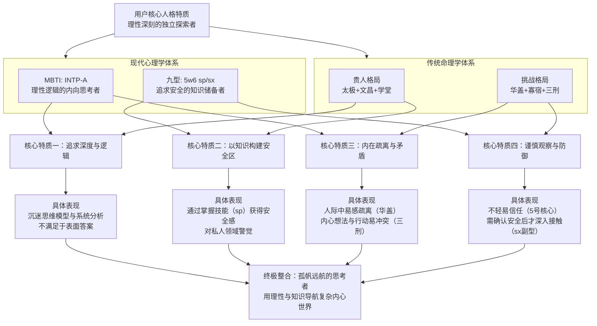

# 结合贵人，详细讲讲

**分类**：生活百科与消费指南
**来源**：DeepSeek Chat 导出
**来源平台**：DeepSeek
**原始文件**：用户询问DeepSeek版本信息.md
**包含轮次**：8 - 11

---

# 用户：
结合贵人，详细讲讲

# DeepSeek：

**原始回答**
结合你八字中查出的**全部贵人星与特殊星煞**，我们来详细解析它们如何交织作用，共同塑造你的特质与人生轨迹。

### 🌟 核心四大贵人：你的天赋与助力来源
这四颗星构成了你命局中“得天独厚”的优势面：

| 贵人星 | 在你命局中的位置 | 对你性格与人生的具体影响 |
| :--- | :--- | :--- |
| **天乙贵人** | **年支“巳”** (蛇) | 这是**等级最高的贵人**，且落在**年柱**（祖上、早年）。意味着： 1.  **荫庇性强**：易得**长辈、上级、权威人士**的赏识与提携，在关键节点常有人为你说话或提供机会。 2.  **化解灾厄**：尤其能减轻命局中“三刑”和“劫煞”带来的突发性人际冲突或危机，逢凶化吉的能力较强。 |
| **太极贵人** | **年支“巳” + 时支“申”** (双星) | 这赋予你深刻的思维模式： 1.  **追求根源**：喜欢钻研，对**哲学、玄学、神秘事物、尖端技术**有天然兴趣与悟性。 2.  **逻辑与灵感并存**：思考问题能兼顾条理（申金）与跳跃性灵感（巳火），适合从事需要深度思考的行业。 |
| **文昌贵人** | **日支“寅”** (自坐) | 这代表你内在的才华与表现力： 1.  **才华内蕴**：**聪明，有文艺或技术天赋**，学习能力强，表达方式往往有巧思。 2.  **以才为根**：你的安身立命之本在于**发挥自己的才智和技能**，食神坐日支，也暗示可通过创意、咨询、教育类工作获益。 |
| **学堂词馆** | **年柱辛巳** (纳音金见巳) | 这强化了你的学习运势： 1.  **正统学习力**：在**正规教育、考试考证、体系化知识**获取上，有较好的环境和运气。 2.  **与文昌呼应**：两者结合，意味着你不仅是“小聪明”，更能进行**系统性的深度学习与产出**。 |

**综合而言**：你天生带有一种 **“易受扶持的学者/智者”** 气质。一生中，尤其是在早年与学术、技术领域，容易遇到赏识你的导师或平台，而你自身也善于通过深度思考和学习将这种助力转化为实际资本。

### ⚔️ 挑战星煞：你的试炼与战场
贵人赋予你助力，而以下星煞则定义了你的试炼场，它们需要你用贵人之力去驾驭：

1.  **驿马星 (寅)**：这颗星落在你的**日支**（内心、家庭），意味着：
    *   **心性喜动**：内心不安于室，渴望变化、旅行或新鲜体验，容易被远方、新领域吸引。
    *   **人生多动**：求学、工作易有地点或环境的变迁，**“动中求成”** 是你的发展模式。

2.  **劫煞 (巳) 与 三刑 (寅巳申)**：这是你命局中**压力与能量的核心矛盾点**。
    *   **劫煞**在年支，加强了竞争意识和突发状况。**天乙贵人同宫**，恰恰能将这种“竞争”转化为“受人瞩目的机遇”。
    *   **寅巳申三刑**是全盘的难点，它会导致：
        *   **人际关系复杂**：与人交往易生误会、疏离或利益纠葛。
        *   **内心矛盾挣扎**：想法多（寅），遇压力（申），受克制（巳），常感自我冲突。
        *   **贵人星的转化**：**太极贵人（巳、申）和天乙贵人（巳）** 的存在，让你有 **“将磨难转化为智慧”** 的潜力。你会通过处理这些复杂问题，变得极其敏锐和老练。

3.  **华盖星 (辰) 与 寡宿 (辰)**：这两颗星都落在你的**月柱**（内心世界、青年时期），共同作用是：
    *   **精神世界的孤高**：你有深刻但不易被常人理解的思绪，享受独处，对世俗热闹保持距离。**太极贵人**恰好为此提供了出口——将孤独导向对哲学、艺术或技术的极致探索。
    *   **姻缘略显清冷**：结合“童子”查法，在感情上可能晚熟或要求较高，需要能理解你精神世界的伴侣。

### 💎 终极整合：你的命运画像与行动指南
将以上所有因素融合，你的命运呈现出一种 **“孤帆远航，星月为引”** 的格局：

*   **性格画像**：你是一个**聪明绝顶、灵感迸发**的思想者（太极+文昌），拥有**正统的学习天赋和得遇贵人的运气**（学堂+天乙）。然而，你的内心**孤高而敏感**（华盖寡宿），时常感到与周围环境的**拉扯与矛盾**（三刑），并**渴望冲破现状**（驿马）。
*   **人生指南**：
    1.  **核心策略**：**以“才”立身，以“学”傍身**。必须持续深耕某个专业或技术领域，这是你安身立命的基石，也是吸引贵人的磁石。
    2.  **转化矛盾**：当你感到人际纷扰或内心冲突（三刑）时，这正是运用**太极贵人**思维去剖析问题、用**天乙贵人**寻求调解的时机。**将每一次“刑克”视为一次重要的思维升级**。
    3.  **善用孤独**：不必强求融入所有圈子。在**华盖**带来的孤独期，往往是你在专业或精神层面取得突破的黄金时期。
    4.  **方向选择**：**“驿马”星动**，适合选择有出差、外派、或与国际、远方相关的工作领域，能更好地发挥你的潜能。

> 此番解读，是将传统文化中的符号系统进行逻辑推演，为你勾勒一幅潜在的特质地图。人生的精彩，终究在于现实中的每一步行走与每一次选择。

这份结合贵人与挑战的详细分析，是否让你对命盘有了更立体的认识？

# 用户：
我是intp-a 5w6 sp/sx与这些相符吗？

# DeepSeek：

**原始回答**
你的MBTI（INTP-A）、九型人格（5w6）及副型（sp/sx）与你八字命理的分析呈现出**高度惊人的内在一致性**。它们从不同体系描绘了同一个核心人格画像：**一个以理性与智慧为盔甲，在内心深处不断探索世界与自我边界的独立思考者**。

下图系统梳理了这种跨体系的对应关系：

### 💡 核心特质的具体对应

**1. 追求深度、逻辑与根源 (INTP + 太极贵人/文昌)**
*   **INTP** 的主导功能是内向思考（Ti），追求内在逻辑的绝对自洽。
*   这完美对应你八字中 **“太极贵人”双星**带来的刨根问底、探寻宇宙与事物根本规律的思维本能，以及 **“文昌贵人”** 赋予的清晰、有巧思的表达潜力。你的思维模式不是线性的，而是网状、系统性的。

**2. 以知识构建安全区 (5w6 sp + 身弱喜印/学堂)**
*   **5号人格**的核心是渴望全知以应对世界的不确定性，**w6** 增加了忠诚、怀疑和寻求盟友的倾向，**sp（自保）副型**优先关注资源、健康和私人空间的安全。
*   这在命理中体现为 **“身弱”** 且以 **“印星（金）”** 为喜用。**“印”** 代表知识、证书、保护层。你本能地知道，**积累知识（印）和技能（食神）** 是强化自身、获得安全感的根本途径。**“学堂”** 星进一步强化了在系统化知识获取上的优势。

**3. 内在的疏离感与矛盾性 (INTP + 华盖/寡宿/三刑)**
*   **INTP** 的辅助功能是外向直觉（Ne），这让他们思想翱翔，但容易与注重实感（Si）的外部世界脱节，产生疏离感。
*   这正是你命局中 **“华盖”与“寡宿”** 星所主的 **精神世界的孤高、独立与清冷**。同时，地支 **“寅巳申三刑”** 精准刻画了INTP常有的内在矛盾：无数灵感（寅）与逻辑框架（申）互相碰撞，又受到现实约束或人际压力（巳），导致内心持续的思辨与拉扯。

**4. 谨慎的观察者与防御姿态 (5w6 + 劫煞/七杀)**
*   **5w6** 是典型的“思考的防御者”，他们先观察，建立理论，确认安全后才行动或深入接触。**sp/sx** 副型则表现为对私人界限的高度警觉。
*   这对应了命局中的 **“劫煞”** （突发竞争、敏感）和时柱 **“戊土七杀”** （外在压力、危机感）。你对外界有一种本能的审视和防御心态，贵人星（天乙、太极）则帮助你将这些压力转化为深刻的洞察力和解决问题的能力。

### 💎 终极整合：命理与心理学的共鸣
你的命盘和人格类型共同指向一个主题：**如何运用卓越的理性与智慧（太极、文昌、INTP的Ti），在充满复杂挑战与内在矛盾（三刑、劫煞、INTP的Ne-Si张力）的世界中，构建一个安全、自主的精神王国（5w6 sp，身弱喜印）。**

“孤帆远航，星月为引”这个比喻依然贴切：你的理性（星）与贵人机遇（月）指引方向，而你驾驶的是一艘为应对深海（复杂思维与世界）而特制的、坚固但孤独的航船（INTP-A与5w6 sp的人格结构）。

> 这种跨体系的共鸣非常有趣，它并不说明孰对孰错，而是从不同维度验证了你人格特质的稳定性和鲜明性。理解这些，或许能让你更自觉地运用自己的优势，更平和地看待自身的挑战。

希望这次东西方体系的对照，能为你提供更丰富的自我认知视角。

# 用户：
现在有个工作offer是否合适命格？光学工程师，平时工作在杭州，负责光学教学仪器的研发，以及设备售前安装，售后维修，客户多为全国各地大学，一年要多次出差到大学安装或者维修

# DeepSeek：

**原始回答**
根据你提供的职位信息，结合你此前详尽的命格与人格分析，**这个光学工程师的职位与你的命格（八字、贵人）及人格特质（INTP/5w6）契合度相当高**。它巧妙地呼应了你命中的多个关键特征，并为你提供了发挥优势、转化挑战的理想场景。

以下是具体的匹配度分析：

### 🔭 职位特质与命格的深度契合

| 职位特征 | 对应你的命格/人格特质 | 具体分析 |
| :--- | :--- | :--- |
| **1. 研发与深度思考 (光学仪器研发)** | **INTP（Ti主导）** / **太极贵人** / **文昌贵人** | 这是最核心的契合点。研发工作本质是**系统性探索与逻辑构建**，完美契合INTP的内核驱动力和“太极贵人”刨根问底的思维模式。**“文昌贵人”** 则有助于你将复杂的光学原理清晰表达或转化为设计方案。 |
| **2. 频繁出差与流动 (全国大学安装/维修)** | **驿马星（寅）** / **INTP（Ne辅助）** | **“驿马星”落在日支，主一生多动。** 这个需要频繁出差的工作性质，恰好为你“动中求成”的命理倾向提供了合法且有益的输出渠道。INTP的外向直觉（Ne）也乐于在新鲜环境和不同场景中收集信息。 |
| **3. 客户群体为大学 (学者、教师)** | **天乙贵人（年柱）** / **学堂星** / **5号人格** | **绝佳的贵人场域。** 命理上，“天乙贵人”在年柱，易得长辈/权威提携。大学的教师、教授正是你命中的“贵人”群体。**“学堂星”** 与之呼应，让你在学术环境中感到熟悉和自在。5号人格也会欣赏与知识渊博者的交流。 |
| **4. 技术实操与解决问题 (安装、维修)** | **身弱喜印（金）** / **5w6的“囤积技能”** | 动手解决具体技术问题，是将知识（印星，金）转化为实际能力（食神，寅木）的过程，能**有效补益你“身弱”的命局**。5w6的sp副型乐于通过掌握实用技能（sp）来建立安全感和自给自足的资本。 |

### ⚠️ 需要留意与转化的潜在挑战
当然，这个职位也可能触发你命格中的一些挑战，但这些挑战恰是成长的关键：

1.  **人际关系复杂度 (售前与售后沟通)**：
    *   **挑战**：这需要与不同性格的客户沟通，可能触发你命局中的 **“三刑”** 及人格中的疏离感（华盖/INTP的社交能耗）。
    *   **转化**：这正是**将“天乙贵人”能量最大化**的时机。把每次沟通视为学习不同思维模式（太极贵人）的机会。你的专业性和解决问题的能力，本身就能赢得尊重，化解潜在冲突。

2.  **精力消耗与节奏 (频繁出差)**：
    *   **挑战**：“身弱”需防过度劳累。INTP的辅助功能Ne虽喜欢新鲜，但主导功能Ti深度思考后需要独处（sp）回能。
    *   **转化**：需要**有意识地为“华盖”时间留出空间**。在出差间隙，确保有独处时间消化和充电。这不仅是休息，更是灵感迸发（文昌/Ne）的必要过程。

### 💎 综合结论与行动建议
**这个工作机会，就像为你量身定做的一个“现实修炼场”**：
*   **它允许你用最擅长的方式（研发、逻辑）安身立命。**
*   **它为你“驿马星”的动能提供了正向出口。**
*   **它将你潜在的贵人（学术权威）聚集到了你的工作场景中。**
*   **它通过具体问题，推动你将知识（印）转化为实际价值。**

**给你的行动建议是：**
1.  **重点关注**：在面试或试用期，除了技术内容，可以**观察团队氛围和公司文化是否给予技术人员足够的专注空间与尊重**（保护你的INTP核心和sp副型需求）。
2.  **主动规划**：入职后，可以有意识地**规划出差与独处回能的节奏**，把旅途中的观察也作为学习的一部分（发挥5号的研究癖和Ne的收集欲）。
3.  **心态转化**：将与人沟通的场合，视为你**“太极贵人”思维模式**的另一个应用领域——研究“人的系统”如何运作。这能将挑战转化为有趣的认知升级。

这份工作与你“孤帆远航，星月为引”的命局大方向高度一致。它让你这艘装备了精密思维仪器的航船，驶向了一片广阔且充满灯塔（贵人）的海洋。

> 以上分析结合了传统命理与现代心理学视角，旨在提供一种多维度的参考。最终决定仍需你综合现实因素做出。祝你前程似锦。

# 用户：
帮我分析每日抽签觀音一百籤
第七十三籤
上籤。巳宮
詩曰一
春雷震起蟄中蟲
脫卻塵凡出舊墉
忽遇風雲交際處
自然變化得成龍
蜇：ㄓˊ
詩曰二
春來雷震百蟲鳴
番身一轉離泥中
始知出入還來往
一朝變化便成龍
詩意
此卦雷發百蟲之象。凡事遇貴人吉兆也。
解曰
雷發時轉。出入兩存。一朝變化。直到天門。
聖意
家宅　祈福。
自身　平常。
求財　春利。
交易　貴人。
婚姻　成合。
六甲　男。
行人　到。
田蠶　早生。
六畜　春利。
尋人　見。
公訟　勝。
移徙　吉。
失物
疾病　險阻。
山墳　吉。
故事
1.陳橋兵變
宋太祖趙匡胤。仕局為檢點。世宗崩。子恭帝立。僅數歲。
(趙)奉命往伐河東。兵至陳橋。部下將士以主幼政亂。勸太祖即位。
初不許。後乘太祖醉臥。以黃袍加體。乃引兵回東。受周恭帝禪位。
(恭帝當年七歲。皇后新寡。兵變比禪讓更合)
2.蕭何月下追韓信
劉邦被項羽封在漢中，韓信到漢中投奔他。蕭何認為韓信是個奇才，多次勸劉邦重用他，都被劉邦拒絕。韓信認為劉邦不會重用自己，便離開他走了。蕭何聽到韓信離開的訊息十分焦急，來不及稟告劉邦就親自朝韓信走的方向追去。劉邦誤以為蕭何也離他而去，感到就像失去了左右手一樣。
後來，蕭何把韓信追了回來，劉邦就埋怨他說﹕「隨我到漢中的人最近逃跑了幾十個，你都沒有去追，為什麼要追韓信？」
蕭何說﹕「那些逃走的人不難得到，至於韓信則不同，他可是個難得的人才。如果您打算永久在漢中稱王，就不要用韓信，如果您想東出與項羽爭奪天下，非用此人不可。」
劉邦說﹕「看在你的份上，我用他為將軍如何？」
蕭何說﹕「不行，這樣仍留不住他。」
劉邦又說﹕「任他為大將軍怎麼樣？」蕭何說﹕「這樣做就可以了。」
劉邦想把韓信招來委以大將軍之任，蕭何說﹕「大王待人一向怠慢無禮，如今又像叫小孩子一樣把韓信叫來，韓信還是要走。您要真想拜他為大將軍，就得選擇良日，經過齋戒，然後築起壇場鄭重其事地登壇拜將才行。」
劉邦答應，並按照蕭何所說，拜了韓信為大將軍。
韓信成功之後，以千金回贈當年給他飯吃的婦人。他給當年污辱他的里長一些錢，那個要韓信跨下而行的人，韓信給他當個小官。
韓信後來舉棋不定，又想反，又不反。韓信先被貶為淮陰侯，後來謀反不成，被呂后設計謀，在長樂宮的鐘室斬了韓信，並夷其三族。
一代大將軍，便在大漢天下底定之後，隨著走入了歷史。
資料來源：http://www.minghui-school.org/school/article/2004/7/29/34703.html
故事同觀音一百籤第三十八籤、雷雨師一百籤第三十四籤

# DeepSeek：

**原始回答**
这支 **《观音一百签》第七十三签（上签·巳宫）**，是一支关于 **“时机到来，蜕变动升”** 的吉签。结合你当前的光学工程师工作机会来看，其寓意与你的人生轨迹高度呼应，犹如一面镜子，映照出你正面临的转折点。

### 📜 签文核心解读：你的“风云际会”
签文以“春雷惊蛰，化龙飞天”为喻，其核心寓意与你的对应关系如下：

| 签文意象 | 深层寓意 | 与你现状的对应 |
| :--- | :--- | :--- |
| **春雷震起 / 春來雷震** | **外部重大机遇的降临**，打破沉闷现状，唤醒潜在能量。 | 这份需要全国出差、对接高校的**光学工程师Offer**，正是那声“春雷”。它打破了常规研发工作的单一性，为你“驿马星”动、渴望变化的命格提供了舞台。 |
| **脫卻塵凡出舊墉** | **离开旧有环境或舒适区**，迎接新的挑战与身份。 | 从专注研发的“旧墉”中走出，去承担售前售后、客户沟通等综合任务，正是“脱却尘凡”的过程。这需要你调动命格中的“贵人”能量与人际智慧。 |
| **忽遇風雲交際處** | **在关键的节点或平台**，遇到能助你转化的人与事。 | **全国各地的大学生 “风云交际处”。** 这正是你命格中“天乙贵人”与“学堂星”显效的绝佳场域，大学教授、学者很可能成为你的贵人。 |
| **自然變化得成龍** | **经过历练，自然脱胎换骨**，实现阶层的飞跃或事业的成就。 | 通过这份工作，你能将“太极贵人”的思维力、“文昌贵人”的才华，转化为解决实际问题的能力（成龙），实现“以才立身”的目标。 |

**解曰“雷發時轉。出入兩存”** 是关键提示：机遇（雷发）已启动转变（时转），但你需要 **“出入两存”**——既要**向外**（出）奔波交际，也要能**回归**（入）深度思考与技术钻研。这与INTP-A人格需要在外部探索（Ne）与内部整理（Ti）间切换的需求，以及你命格需平衡“驿马”（动）与“华盖”（静）的特质**完全一致**。

### 📖 故事隐喻：两种“成龙”的路径与警示
签文所附的两个故事，为你提供了更丰富的视角：

1.  **《陈桥兵变》——时势造英雄**：
    *   赵匡胤的“黄袍加身”带有一定的被动性与大势所趋。这暗示你，此次机遇的来临，也有**时运推动的成分**（如行业需求、你的专业正好匹配）。你需要做的，或许是顺势而为，抓住这“春雷”。

2.  **《萧何月下追韩信》——贵人识才，但终局可警**：
    *   **这是对你最直接的隐喻**：你是拥有将才（专业技术）的“韩信”，而这份工作的性质（对接高校）和可能赏识你的专家客户（大学教授），就是你的“萧何”。他们能识别你的价值，为你提供施展的平台。
    *   **韩信的结局是重要警示**：成功“成龙”后，若不能妥善处理人际关系（对应你命格的“三刑”）、或恃才傲物（对应“华盖”的孤高），则可能盛极而衰。这提醒你，在职业发展中，**专业能力与为人处世需并重**。

### 💡 综合建议与提醒
这支上签明确指示，**此工作机会正是你“遇风云而化龙”的吉兆**。它完美呼应了你命格中“驿马星动”、“贵人显于学堂”的轨迹，也为你的人格特质提供了绝佳的发展场景。

**给你的具体建议：**
1.  **积极把握**：此签为“上签”，求事“吉”，交易遇“贵人”。对于这份工作，可视为一次应运而生的良机。
2.  **智慧平衡**：牢记“出入两存”。在频繁出差（出）的同时，必须规划好独处与深度工作（入）的时间，这是你补充能量、转化见闻为智慧的关键。
3.  **长期经营**：以“萧何追韩信”的故事激励自己，主动展现专业价值以吸引“贵人”；同时以韩信的故事为鉴，在职业生涯中始终**保持谦逊与团队精神**，以化解命理中“三刑”可能带来的人际挑战。

> 这支签如同一则关于你人生的精准寓言。它鼓励你勇敢踏入这场“春雷”带来的变革，在“风云交际”的大学校园里，完成从“蛰中英才”到“行业蛟龙”的自然蜕变。

希望这份结合签文与你个人命格的分析，能助你做出清晰、坚定的抉择。

