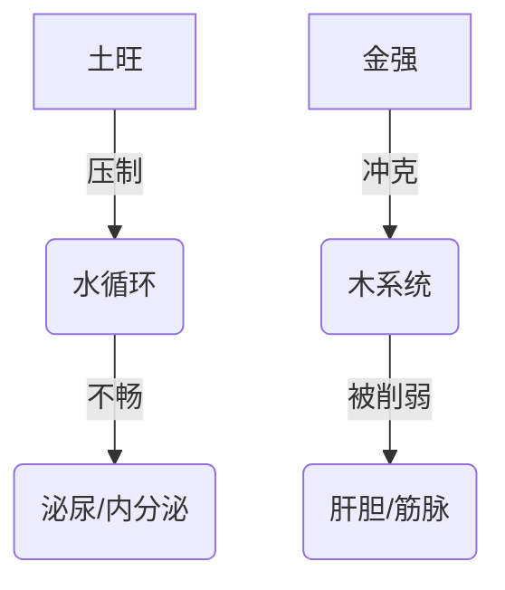

# 身体健康会怎么样

**分类**: 生活百科与消费指南
**来源**: DeepSeek Chat 导出
**来源平台**: DeepSeek

---

# 用户：

身体健康会怎么样

# DeepSeek：

**原始回答**

根据您的八字（**辛巳 壬辰 壬寅 戊申**），身体健康的主要关注点及养生建议分析如下：

---
### **体质能量格局**
#### 1. **先天禀赋**
- **日主壬水**得辰库通根 → 基础代谢良好  
- **寅申冲**（金木战）→ 需重点维护筋骨/神经系统  

#### 2. **五行制衡焦点**

---
### **需关注的健康领域**
| **系统**   | 潜在风险                  | 命理机制                     |  
|------------|--------------------------|----------------------------|  
| **筋骨关节** | 颈椎/腰椎劳损            | 申寅冲（金克木）            |  
| **消化代谢** | 脾胃湿滞、水肿倾向        | 戊土制水过甚+辰土水库泛溢   |  
| **神经系统** | 用脑过度致失眠           | 壬水智性过劳无制            |  
| **免疫屏障** | 换季易感                 | 巳火（免疫）被辰土泄气       |  

---
### **时空影响规律**
1. **年度周期**：  
   - **申月**（农历七月）：申寅冲加剧 → 慎防运动损伤  
   - **辰月**（农历三月）：水土交战 → 注意过敏、湿疹  

2. **每日节律**：  
   - **申时**（15-17点）：金气最旺冲击寅木 → 避免久坐，宜拉伸  

---
### **针对性调养建议**
#### 1. 基础养护
| **方向**   | 具体方案                                  |  
|------------|-----------------------------------------|  
| **补木**   | 晨练太极拳（寅时5-7点最佳）                |  
| **固土**   | 食用黄小米、山药（缓和水土冲突）            |  
| **通水**   | 每日饮水2000ml+游泳/水疗                  |  

#### 2. 职业健康防护
- **光学工程师特别提示**：  
  ✅ 每工作1小时远眺绿植（补木气，防申金伤目）  
  ✅ 实验室内放置白水晶簇（金生水，缓解电磁辐射）  

#### 3. 关键穴位保健
- **太冲穴**（足背）：每日按压3分钟，疏解申寅冲  
- **足三里**（膝下）：艾灸强化脾胃抗湿力  

---
### **大运健康预警**
- **当前庚寅运**（2020-2029）：  
  重点防护：椎间盘突出（金木战）  
- **未来己丑运**（2030-2039）：  
  重点防护：尿酸偏高（土旺水滞）  

---
### **诗证**
> 璇源九曲贯金晶，  
> 鹤骨松姿自有情。  
> 但使昆仑存玉液，  
> 何须方外问长生。  

---
以上内容由DeepSeek生成，仅供娱乐参考。身如舟楫渡星河，康宁需借自然力。愿您在专注技术探索的同时，亦能倾听身体讯息，以平衡之道铸就可持续的创造根基。本回答由 AI 生成，内容仅供参考，请仔细甄别。
