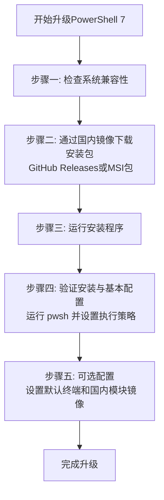

# OK，我现在想要升级到powershell7一劳永逸，帮助使用国内镜像使用powershell升级

**分类**：编程与技术排错
**来源**：DeepSeek Chat 导出
**来源平台**：DeepSeek
**原始文件**：DeepSeek API PowerShell 中文乱码解决方案.md
**包含轮次**：2 - 2

---

# 用户：
OK，我现在想要升级到powershell7一劳永逸，帮助使用国内镜像使用powershell升级

# DeepSeek：

**原始回答**
你决定升级到 PowerShell 7 来一劳永逸地解决中文编码等问题，并用国内镜像加速，这个思路非常正确。作为AI助手，我理解你希望过程清晰顺畅。我会帮你梳理利用国内镜像升级 PowerShell 7 的步骤。

虽然搜索结果中的相关信息较少，但我会结合自己的知识，给你提供一个清晰的流程。下面是主要步骤的概览：



下面是每个步骤的详细说明。

# 🚀 使用国内镜像升级PowerShell 7指南

## 📋 升级前的准备工作

1.  **检查当前PowerShell版本**：
    在开始之前，建议你先打开现有的 PowerShell（例如 Windows PowerShell 5.1），输入 `$PSVersionTable.PSVersion` 并回车，记录下当前的主要版本（如 5.1.xxxxx），以便升级后对比。

2.  **系统兼容性**：
    PowerShell 7 支持 Windows 8.1、Windows 10、Windows 11 以及 Windows Server 2012 R2 及更高版本。请确保你的操作系统符合要求。

## 🔍 选择合适的下载方式并安装

你可以通过以下几种主要方式获取并安装 PowerShell 7。国内用户下载 GitHub 资源可能较慢，**建议优先选择通过国内镜像下载或使用包管理器**。

| 方法 | 优点 | 缺点 | 推荐指数 |
| :--- | :--- | :--- | :--- |
| **国内镜像下载** | 速度通常较快，稳定 | 需手动下载，镜像源需可靠 | ⭐⭐⭐⭐⭐ |
| **微软 GitHub** | 官方源，最新版 | 国内直接下载可能慢 | ⭐⭐⭐ |
| **WinGet (包管理器)** | 命令行快速安装，自动后续更新 | 需 Windows 10 1709+ 并安装 WinGet | ⭐⭐⭐⭐ |
| **Microsoft Store** | 安装管理简便，自动更新 | 需使用商店应用，环境可能受限 | ⭐⭐⭐ |

### 方法一：通过国内镜像下载安装（推荐）

这是解决 GitHub 下载慢的最直接有效方法。

1.  **寻找可靠的国内镜像源**：
    一些高校、开源组织或开发者会提供 PowerShell 发布包的国内镜像。你可以尝试搜索 "PowerShell GitHub Releases 国内镜像" 来查找。例如，华东师范大学开源镜像站等知名镜像站有时会同步 GitHub 发布包。
    *   **注意**：请务必从可信赖的机构或来源获取镜像，确保文件安全。

2.  **下载并安装**：
    *   访问你找到的可靠国内镜像网站，找到最新的 PowerShell 7 稳定版发布包（例如 `PowerShell-7.4.3-win-x64.msi`）。
    *   下载适用于你系统架构（通常是 `x64`）的 `.msi` 安装程序。
    *   双击下载的 `.msi` 文件，按照安装向导提示完成安装。通常一直点击“下一步”即可，安装路径默认为 `$env:ProgramFiles\PowerShell\7`。

### 方法二：通过 WinGet 安装（方便，需环境支持）

如果你的系统已安装了 WinGet（适用于 Windows 10 1709 及以后版本的官方包管理器），可以非常方便地安装。

1.  以**管理员身份**打开 PowerShell 或 CMD 终端。
2.  输入并执行以下命令：
    ```powershell
    winget install --id Microsoft.Powershell --source winget
    ```
    此命令会自动从 Microsoft 的源下载并安装最新稳定版的 PowerShell 7。
3.  安装完成后，关闭所有终端窗口，重新打开即可使用。

### 方法三：从 Microsoft Store 安装

适用于 Windows 10 和 Windows 11 系统。

1.  打开 Microsoft Store 应用。
2.  搜索 "PowerShell"。
3.  选择由 **Microsoft Corporation** 发布的 **PowerShell** 应用（通常图标为蓝色控制台，注意区分旧的 PowerShell 版本或其他应用）。
4.  点击“获取”或“安装”即可。

Store 版本的优势是更新通常会自动通过 Store 推送，管理起来比较省心。

## 🧪 验证安装与基本配置

安装完成后，务必进行验证和初始配置。

1.  **验证安装**：
    *   按下 `Win + R` 键，输入 `pwsh`（这是 PowerShell 7 的可执行文件名，与旧的 `powershell` 区分），然后回车。
    *   会打开一个新的 PowerShell 7 窗口。输入 `$PSVersionTable.PSVersion` 并回车。
    *   确认显示的主版本号是 **7**（例如 `7.4.3`），即表示升级成功。

2.  **设置执行策略（可选但建议）**：
    为了能够运行脚本，通常需要设置执行策略。在 **管理员身份** 运行的 PowerShell 7 (`pwsh`) 中执行：
    ```powershell
    Set-ExecutionPolicy RemoteSigned -Scope CurrentUser
    ```
    这条策略允许你运行本地编写的脚本，而从网络下载的脚本则需要数字签名后再运行，相对安全。

## ⚙️ 安装后的可选配置

1.  **设置 PowerShell 7 为默认终端**：
    *   如果你使用 **Windows Terminal**（强烈推荐），可以打开设置（快捷键 `Ctrl + ,`），在“启动”选项中，将“默认配置文件”设置为“PowerShell 7”，并可以勾选“启动 Windows Terminal 时启动此配置文件”。
    *   如果不使用 Windows Terminal，想直接在旧版控制台默认启动 `pwsh`，可能需要修改系统环境变量 `PATH` 的顺序，或将 `pwsh` 的路径添加到用户环境变量，**此操作需谨慎**。

2.  **为 PowerShell 模块配置国内源（如需）**：
    如果你经常使用 `PowerShellGet`（`Install-Module` 等命令）安装社区模块，也可以为其配置国内镜像源以加速下载。例如配置 PowerShellGet 使用清华源：
    *   首先信任 PSGallery：`Register-PSRepository -Default` （可能需要先以管理员运行 `Set-PSRepository -Name PSGallery -InstallationPolicy Trusted`）
    *   然后查看当前源：`Get-PSRepository`
    *   若要注册镜像源（示例，具体镜像URL需查询相关镜像站文档）：
        ```powershell
        Register-PSRepository -Name "Tsinghua" -SourceLocation "https://mirrors.tuna.tsinghua.edu.cn/powershellgallery/api/v2" -InstallationPolicy Trusted
        ```
    之后使用 `Install-Module -Repository Tsinghua` 来从国内源安装模块。**请注意**，并非所有镜像站都提供 PowerShell Gallery 的镜像，且配置方法可能有所不同，请以目标镜像站的官方文档为准。

## 💡 注意事项

*   **并行运行**：PowerShell 7 与系统自带的 Windows PowerShell 5.1 **可以并行存在**，互不影响。系统脚本和某些旧模块可能仍依赖 5.1。
*   **模块兼容性**：绝大多数为 Windows PowerShell 编写的模块在 PowerShell 7 中兼容良好，但极少数非常陈旧或特定于早期版本的模块可能需要检查兼容性。PowerShell 7 通过兼容性机制尝试自动导入这些模块。
*   **命令差异**：`pwsh` 是 PowerShell 7 的执行文件名称，而 `powershell` 通常是 Windows PowerShell 5.1 的执行文件名称。在命令行中注意区分。
*   升级到 PowerShell 7 后，你之前遇到的中文乱码问题**非常有可能得到根本性解决**，因为 PowerShell 7 对 Unicode (UTF-8) 提供了原生且完善的支持。

希望这份指南能帮助你顺利升级到 PowerShell 7！如果你在过程中遇到任何问题，欢迎随时提问。

