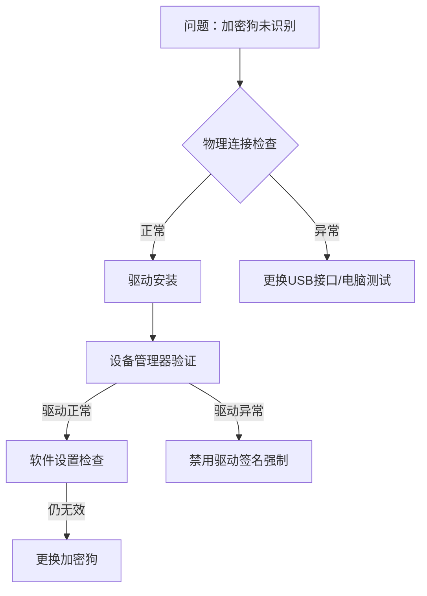

# 加密狗弹窗问题解决

编程与技术排错
**来源**: DeepSeek Chat 导出
**来源平台**: DeepSeek

---

# 用户：

这是ezcad软件的加密狗，如何使其不出现图二弹窗

# DeepSeek：

**原始回答**

根据提供的文件信息和弹窗提示，EzCad软件无法检测到加密狗（硬件锁），导致进入演示模式。以下是系统化的解决方案：

### 核心解决步骤：
1. **安装加密狗驱动程序**  
   - 您提供的文件列表（`Lmc.sys`, `LMCUSB.sys`, `JCZLMC.inf`等）是加密狗的关键驱动
   - **操作步骤**：
     - 将包含这些文件的文件夹复制到 `C:\EzCadDrivers`（路径不要含中文）
     - 右键单击 `JCZLMC.inf` 文件 → 选择“安装”
     - 重启电脑使驱动生效

2. **检查硬件连接**  
   - 将加密狗插入电脑 **后置USB接口**（前置接口供电可能不足）
   - 尝试不同USB接口，避免使用USB集线器
   - 观察加密狗指示灯：
     - 常亮/闪烁 → 硬件正常
     - 无反应 → 可能硬件故障

3. **设备管理器验证**  
   - 按 `Win+R` 输入 `devmgmt.msc` 打开设备管理器
   - 检查是否存在：
     - `HID-compliant device`（正常识别）
     - 带黄色感叹号的 `USB Controller`（驱动异常）
     - 未知设备 → 右键更新驱动 → 手动指向 `JCZLMC.inf`

### 进阶排查方案：

4. **禁用驱动签名强制（Windows 10/11）**  
   - 长按Shift点击重启 → 疑难解答 → 高级选项 → 启动设置 → 重启
   - 按 `F7` 选择“禁用驱动程序强制签名”
   - 重新安装驱动

5. **软件兼容性设置**  
   - 右键EzCad快捷方式 → 属性 → 兼容性
   - 勾选：
     - ✔ 以管理员身份运行
     - ✔ Windows 7 兼容模式

6. **加密狗故障确认**  
   - 在另一台电脑安装相同驱动测试
   - 若多台电脑无法识别 → 加密狗硬件损坏（需联系供应商更换）

### 关键注意事项：
- **驱动日期问题**：2017年的驱动需兼容模式安装（右键inf文件→属性→兼容性→Windows 7）
- **安全软件拦截**：临时关闭杀毒软件/防火墙（特别是360、McAfee等）
- **系统日志检查**：  
  `事件查看器 → Windows日志 → 系统` 筛选 `Event ID 6416`（设备安装错误）

> 如完成所有步骤仍无效，可能是：  
> (1) 加密狗与软件版本不匹配（需联系EzCad供应商）  
> (2) 硬件锁芯片损坏（需返修）  
> 建议提供软件版本号（Help → About查看）以便进一步排查驱动兼容性。本回答由 AI 生成，内容仅供参考，请仔细甄别。
