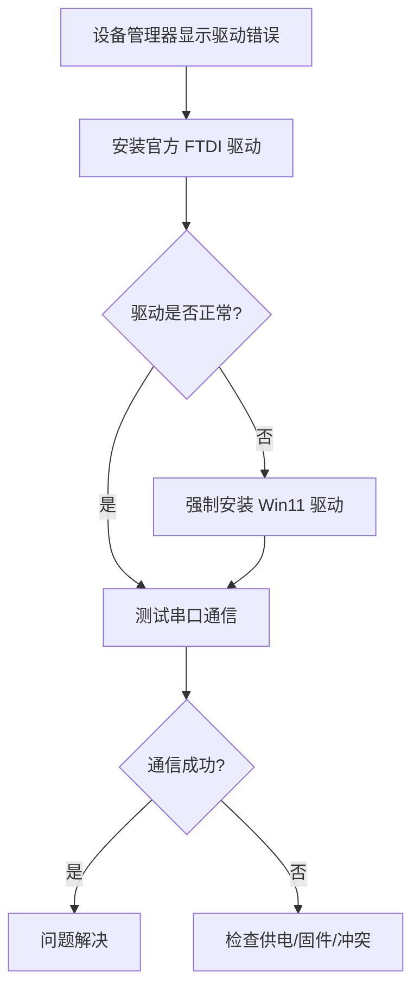

# 我这边拥有一个USB控制的的压电陶瓷驱动器使用USB进行控制，在一台Win11笔记本电脑上可以使用。但是在一台Win10台式机上会显示“串口com号读失败1”，

**分类**: 编程与技术排错
**来源**: DeepSeek Chat 导出
**来源平台**: DeepSeek

---

# 用户：

我这边拥有一个USB控制的的压电陶瓷驱动器使用USB进行控制，在一台Win11笔记本电脑上可以使用。但是在一台Win10台式机上会显示“串口com号读失败1”，且在设备管理器中改设备为FT232R USB UART是显示改设备的驱动程序未被安装（代码28），然而在win11笔记本中没有需要安装驱动也可以正常使用

# DeepSeek：

**原始回答**

您遇到的问题是 **FT232R USB UART 驱动在 Win10 上未正确安装**，导致压电陶瓷驱动器无法通过串口通信（COM 端口读失败），而在 Win11 上能自动识别。以下是系统化的解决方案：

---

### **1. 确认驱动问题**
- **现象对比**：
  - **Win11**：系统自带驱动，自动识别为 COM 端口（无需手动安装）
  - **Win10**：设备管理器显示 **FT232R USB UART** 带黄色感叹号，错误代码 **28**（驱动未安装）

---

### **2. 解决方案**
#### **方法 1：手动安装官方 FTDI 驱动**
1. **下载官方驱动**：
   - 访问 FTDI 官网：[FT232R 驱动下载页](https://www.ftdichip.com/Drivers/VCP.htm)
   - 选择 **Windows 10 兼容版本**（如 `FTDI CDM v2.12.36.4 WHQL Certified`）

2. **安装步骤**：
   - 解压下载的驱动包。
   - 在设备管理器中右键 **FT232R USB UART** → **更新驱动程序** → **浏览计算机以查找驱动程序**。
   - 指向解压后的文件夹，完成安装。

3. **验证安装**：
   - 设备管理器中的 **FT232R** 应变为 **USB Serial Port (COMx)**，无感叹号。

#### **方法 2：强制使用 Win11 兼容驱动**
如果官方驱动无效，可尝试强制安装 Win11 的驱动：
1. 在 **Win11 笔记本** 上：
   - 打开设备管理器，找到正常工作的 **FT232R** 设备。
   - 右键 → **属性** → **驱动程序** → **驱动程序详细信息**，记录 `.sys` 和 `.inf` 文件路径（如 `ftser2k.sys`）。

2. 将相关文件复制到 Win10 电脑：
   - 从 Win11 的 `C:\Windows\System32\drivers\` 复制 `.sys` 文件。
   - 从 `C:\Windows\INF\` 复制 `.inf` 文件（如 `oemXX.inf`）。

3. 在 Win10 上手动指定驱动路径：
   ```powershell
   pnputil /add-driver "C:\path\to\oemXX.inf" /install
   ```

#### **方法 3：清除冲突的 COM 端口配置**
某些情况下，旧的 COM 端口配置会导致冲突：
1. 打开 **注册表编辑器**（`regedit`）。
2. 导航至：
   ```plaintext
   HKEY_LOCAL_MACHINE\SYSTEM\CurrentControlSet\Control\COM Name Arbiter
   ```
3. 删除 `ComDB` 键值（系统会自动重建）。
4. 重启电脑后重新插拔设备。

---

### **3. 检查硬件与系统设置**
| **项目**               | **操作**                                                                 |
|------------------------|--------------------------------------------------------------------------|
| **USB 端口兼容性**      | 尝试更换台式机的 USB 端口（优先使用 **USB 2.0 端口**，避免 USB 3.0 兼容性问题） |
| **设备管理器设置**      | 确保 **COM 端口号** 未被占用（如 COM1 通常保留给旧硬件）                     |
| **第三方软件冲突**      | 关闭杀毒软件（如 360 安全卫士可能拦截驱动安装）                              |

---

### **4. 验证通信**
安装成功后，使用 **串口调试工具** 测试通信：
1. 下载 [Putty](https://www.putty.org/) 或 [Tera Term](https://osdn.net/projects/ttssh2/)。
2. 选择正确的 COM 端口（如 COM3），设置波特率（与压电陶瓷驱动器匹配，如 **9600**）。
3. 发送测试指令（参考设备手册），观察是否有响应。

---

### **5. 故障排查**
如果仍报错 **“串口 COM 号读失败 1”**：
1. **检查设备供电**：
   - 部分 USB 设备需要额外供电，尝试使用带外接电源的 USB Hub。
2. **更新固件**：
   - 联系压电陶瓷驱动器厂商，确认是否需要更新 FT232R 固件（通过 [FTDI 工具](https://www.ftdichip.com/Utilities.htm)）。
3. **系统日志分析**：
   - 在 Win10 的事件查看器中（`eventvwr.msc`），筛选 **System 日志**，查找 **FTDI** 或 **COM 端口** 相关错误。

---

### **总结步骤**


请按顺序尝试上述方法，通常 **方法 1（官方驱动）** 即可解决。如果问题持续，可能是硬件兼容性问题，建议联系设备供应商提供针对 Win10 的专用驱动。


# 用户：

这是其一段事件中的报错由于下列错误， Diagnostic Service Host服务启动失败:
服务帐户配置中不存在服务正常运行所需的特权。你可以使用 Services Microsoft
Management Console(MMC管理单元(services.msc)和 Local Security Settings MMC 管理
单元(secpol.msc)来查看服务配置和帐户配置。

# DeepSeek：

**原始回答**

您遇到的 **Diagnostic Service Host 服务启动失败** 问题是由于服务账户权限配置错误导致的。以下是系统化的解决方案：

---

### **1. 问题根源分析**
错误信息表明：
- **服务账户**（通常是 `NT AUTHORITY\LocalService`）缺少必要的特权
- 可能原因：
  - 安全策略中被误删了服务账户权限
  - 服务配置被第三方软件修改
  - 系统文件损坏

---

### **2. 解决方案**

#### **方法 1：重置服务账户权限（推荐）**
**步骤：**
1. 按 `Win+R` 输入 `services.msc` 打开服务管理器
2. 找到 **Diagnostic Service Host** 服务 → 右键 **属性**
3. 切换到 **登录** 选项卡：
   - 选择 **此账户** → 输入 `NT AUTHORITY\LocalService`
   - 密码留空
   - 勾选 **允许服务与桌面交互**
4. 点击 **应用** → **确定**

#### **方法 2：通过组策略修复**
1. 按 `Win+R` 输入 `secpol.msc`
2. 导航至：
   ```
   安全设置 > 本地策略 > 用户权限分配
   ```
3. 检查并确保以下权限包含 `Local Service` 账户：
   - 作为服务登录
   - 以批处理作业登录
   - 替换进程级别令牌

#### **方法 3：使用系统文件检查**
在管理员命令提示符中执行：
```cmd
sfc /scannow
dism /online /cleanup-image /restorehealth
```

#### **方法 4：重建服务配置**
1. 导出当前配置（备份）：
   ```cmd
   sc qc DiagSvcs > C:\DiagSvcs_backup.txt
   ```
2. 重置服务：
   ```cmd
   sc config DiagSvcs obj= "NT AUTHORITY\LocalService" password= ""
   ```

---

### **3. 验证修复**
1. 重启服务：
   ```cmd
   net start DiagSvcs
   ```
2. 检查事件查看器：
   - 按 `Win+R` 输入 `eventvwr.msc`
   - 查看 **Windows 日志 > 系统** 中是否有新错误

---

### **4. 高级排查**
如果仍失败，可能需要：
1. 检查注册表权限：
   ```cmd
   regini HKEY_LOCAL_MACHINE\SYSTEM\CurrentControlSet\Services\DiagSvcs
   ```
2. 使用 Process Monitor 监控服务启动过程

---

### **预防措施**
1. 避免使用优化软件修改系统服务
2. 定期备份系统还原点
3. 对于企业环境，建议通过组策略统一配置

> 注意：操作前建议创建系统还原点。如果问题持续，可能是更深层次的系统损坏，需考虑系统重置。


# 用户：

忘掉上一个报错，这才是distributedCOM的报错计算机-默认 权限设置并未向在应用程序容器 Microsoft Windows.Shel IExperienceHost10.0.19041.5072 neutral neutral cw5n1h2bxyewy SID (S-1-15-2-155514346-
10016
无
2573954481-755741238-1654018636-12333318293075935687--2861478708)中运行的地址 LocalHost(使用 LRPC中的用户DESKTOP- IO03OVRIVustc SID (S-1-5-
无
10016
21-2942219632893739544-1904321087-1001)授予针对CLSID 为
7040
无
无
7000
(C2F03A33-21F5-47FA-B4BB-156362A2F239]
7000
无
APPID 为
无
7000
(316CDED5-E4AE-4B15--9113-7055D84DCC97

# DeepSeek：

**原始回答**

您遇到的 **Distributed COM (DCOM) 权限错误** 是由于 Windows Shell Experience Host（`ShellExperienceHost.exe`）在运行时缺少必要的 DCOM 访问权限。以下是系统化的解决方案：

---

### **1. 错误分析**
- **核心问题**：  
  `S-1-15-2-...`（应用程序容器 SID）未被授权访问 `CLSID {C2F03A33-...}` 和 `APPID {316CDED5-...}` 的 DCOM 组件。
- **影响范围**：  
  可能导致开始菜单、任务栏或系统界面功能异常（如无法打开设置、搜索框无响应）。

---

### **2. 解决方案**

#### **方法 1：通过注册表修复 DCOM 权限**
1. **打开注册表编辑器**（`regedit`）  
   → 导航至以下路径：
   ```
   HKEY_CLASSES_ROOT\AppID\{316CDED5-E4AE-4B15-9113-7055D84DCC97}
   ```
2. **修改权限**：
   - 右键 `{316CDED5...}` → **权限** → **高级**
   - 点击 **添加** → 选择主体 → 输入 `ALL APPLICATION PACKAGES`
   - 勾选 **基本权限** 中的 `读取` 和 `执行`
   - 勾选 **仅应用于此容器** → 确定

3. **对 CLSID 重复操作**：
   ```
   HKEY_CLASSES_ROOT\CLSID\{C2F03A33-21F5-47FA-B4BB-156362A2F239}
   ```

#### **方法 2：重置 Windows 应用权限**
1. 以管理员身份运行 PowerShell：
   ```powershell
   Get-AppXPackage -AllUsers | Foreach {Add-AppxPackage -DisableDevelopmentMode -Register "$($_.InstallLocation)\AppXManifest.xml"}
   ```
2. 重置 DCOM 默认权限：
   ```powershell
   dcomcnfg
   ```
   - 进入 **组件服务 > 计算机 > 我的电脑 > DCOM 配置**
   - 找到 **ShellExperienceHost** 对应的 APPID → 右键 **属性** → **安全**
   - 在 **启动和激活权限** 中添加 `ALL APPLICATION PACKAGES` 并赋予权限

#### **方法 3：重建用户配置文件**
如果问题持续，可能是用户配置损坏：
1. 创建新本地管理员账户
2. 将文件迁移至新账户
3. 删除旧账户配置

---

### **3. 验证修复**
1. 重启电脑
2. 检查事件查看器（`eventvwr`）中是否有新错误：
   - 导航至 **Windows 日志 > 应用程序**
   - 筛选事件 ID **10016**

3. 测试开始菜单和系统功能是否恢复正常

---

### **4. 高级排查**
如果仍报错，可能需要：
1. **使用 Process Monitor** 监控 `ShellExperienceHost.exe` 的访问拒绝错误
2. **分析 SID 映射**：
   ```powershell
   whoami /all | findstr "S-1-15-2"
   ```
3. **检查组策略**（仅域环境）：
   ```
   gpedit.msc → 计算机配置 → 管理模板 → Windows 组件 → DCOM
   ```

---

### **关键注意事项**
- **操作注册表前务必备份**：
  ```powershell
  reg export HKCR\AppID\{316CDED5-E4AE-4B15-9113-7055D84DCC97} C:\DCOM_Backup.reg
  ```
- **避免使用第三方优化工具**，它们可能破坏 DCOM 配置
- 此错误通常不影响系统稳定性，但可能导致 UWP 应用功能受限

> 如果以上方法无效，可能是系统文件损坏，建议执行：
> ```cmd
> sfc /scannow
> dism /online /cleanup-image /restorehealth
> ```
